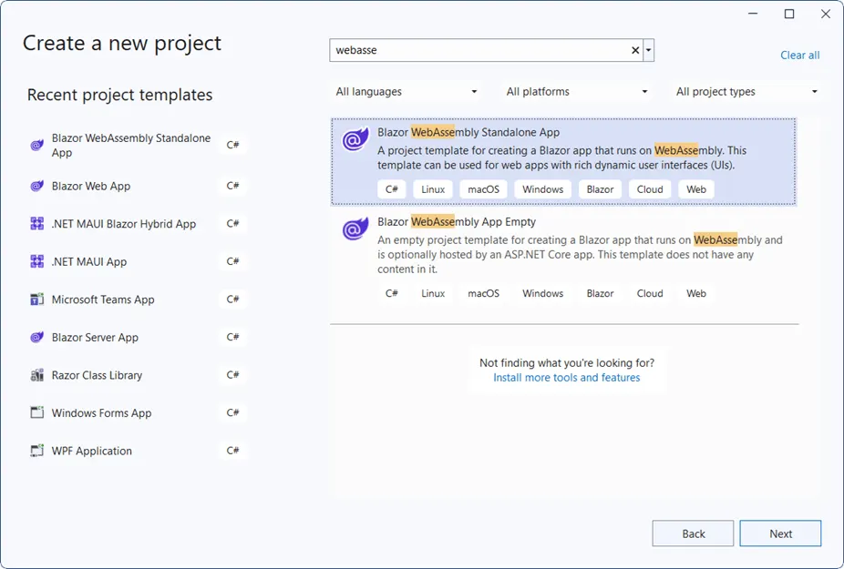

# Getting Started with Blazor Maps Component

This section briefly explains how to include [Blazor Maps](https://www.syncfusion.com/blazor-components/blazor-map) component in your Blazor WebAssembly App using [Visual Studio](https://visualstudio.microsoft.com/vs/), [Visual Studio Code](https://code.visualstudio.com/), and the [.NET CLI](https://learn.microsoft.com/en-us/dotnet/core/tools/).





## Prerequisites

* [System requirements for Blazor components](https://blazor.syncfusion.com/documentation/system-requirements)

## Create a new Blazor App in Visual Studio

Create a **Blazor WebAssembly App** using Visual Studio via [Microsoft Templates](https://learn.microsoft.com/en-us/aspnet/core/blazor/tooling?view=aspnetcore-10.0&pivots=vs) or the [Syncfusion<sup style="font-size:70%">&reg;</sup> Blazor Extension](https://blazor.syncfusion.com/documentation/visual-studio-integration/template-studio). For detailed instructions, refer to the [Blazor WASM App Getting Started](https://blazor.syncfusion.com/documentation/getting-started/blazor-webassembly-app) documentation.



## Install Syncfusion<sup style="font-size:70%">&reg;</sup> Blazor Maps NuGet in the App

To add the **Blazor Maps** component in the app, open the NuGet package manager in Visual Studio (*Tools → NuGet Package Manager → Manage NuGet Packages for Solution*), then search and install [Syncfusion.Blazor.Maps](https://www.nuget.org/packages/Syncfusion.Blazor.Maps). Alternatively, run the following commands in the Package Manager Console to achieve the same.




Install-Package Syncfusion.Blazor.Maps -Version {{ site.releaseversion }}




N> Syncfusion<sup style="font-size:70%">&reg;</sup> Blazor components are available in [nuget.org](https://www.nuget.org/packages?q=syncfusion.blazor). Refer to the [NuGet packages](https://blazor.syncfusion.com/documentation/nuget-packages) topic for the available NuGet packages list with component details.





## Prerequisites

* [System requirements for Blazor components](https://blazor.syncfusion.com/documentation/system-requirements)

## Create a new Blazor App in Visual Studio Code

Create a **Blazor WebAssembly App** using Visual Studio Code via [Microsoft Templates](https://learn.microsoft.com/en-us/aspnet/core/blazor/tooling?view=aspnetcore-10.0&pivots=vsc) or the [Syncfusion<sup style="font-size:70%">&reg;</sup> Blazor Extension](https://blazor.syncfusion.com/documentation/visual-studio-code-integration/create-project). For detailed instructions, refer to the [Blazor WASM App Getting Started](https://blazor.syncfusion.com/documentation/getting-started/blazor-webassembly-app?tabcontent=visual-studio-code) documentation.

Alternatively, create a WebAssembly application by using the following command in the integrated terminal(<kbd>Ctrl</kbd>+<kbd>`</kbd>).





dotnet new blazorwasm -o BlazorApp
cd BlazorApp





## Install Syncfusion<sup style="font-size:70%">&reg;</sup> Blazor Maps NuGet in the App

* Press <kbd>Ctrl</kbd>+<kbd>`</kbd> to open the integrated terminal in Visual Studio Code.
* Ensure in the project root directory where the `.csproj` file is located.
* Run the following command to install the [Syncfusion.Blazor.Maps](https://www.nuget.org/packages/Syncfusion.Blazor.Maps) NuGet packages and ensure all dependencies are installed.





dotnet add package Syncfusion.Blazor.Maps -v {{ site.releaseversion }}
dotnet restore





N> Syncfusion<sup style="font-size:70%">&reg;</sup> Blazor components are available in [nuget.org](https://www.nuget.org/packages?q=syncfusion.blazor). Refer to the [NuGet packages](https://blazor.syncfusion.com/documentation/nuget-packages) topic for the available NuGet packages list with component details.





## Prerequisites

Install the latest version of [.NET SDK](https://dotnet.microsoft.com/en-us/download). If the .NET SDK is already installed, determine the installed version by running the following command in a command prompt (Windows), terminal (macOS), or command shell (Linux).




dotnet --version




## Create a Blazor WebAssembly App using .NET CLI

Run the following command to create a new Blazor WebAssembly App in a command prompt (Windows) or terminal (macOS) or command shell (Linux). For detailed instructions, refer to [this Blazor WASM App Getting Started](https://blazor.syncfusion.com/documentation/getting-started/blazor-webassembly-app?tabcontent=.net-cli) documentation.




dotnet new blazorwasm -o BlazorApp
cd BlazorApp




## Install Syncfusion<sup style="font-size:70%">&reg;</sup> Blazor Maps NuGet in the App

Here's an example of how to add **Blazor Maps** component in the application using the following command in the command prompt (Windows) or terminal (Linux and macOS) to install the [Syncfusion.Blazor.Maps](https://www.nuget.org/packages/Syncfusion.Blazor.Maps/) NuGet packages. See [Install and manage packages using the dotnet CLI](https://learn.microsoft.com/en-us/nuget/consume-packages/install-use-packages-dotnet-cli) topics for more details.




dotnet add package Syncfusion.Blazor.Maps -Version {{ site.releaseversion }}
dotnet restore




N> Syncfusion<sup style="font-size:70%">&reg;</sup> Blazor components are available in [nuget.org](https://www.nuget.org/packages?q=syncfusion.blazor). Refer to the [NuGet packages](https://blazor.syncfusion.com/documentation/nuget-packages) topic for the available NuGet packages list with component details.





## Add Import Namespaces

Open the **~/_Imports.razor** file and import the `Syncfusion.Blazor` and `Syncfusion.Blazor.Maps` namespaces.




@using Syncfusion.Blazor
@using Syncfusion.Blazor.Maps




## Register Syncfusion<sup style="font-size:70%">&reg;</sup> Blazor Service

Register the Syncfusion<sup style="font-size:70%">&reg;</sup> Blazor Service in the **~/Program.cs** file of the Blazor WebAssembly App.




using Microsoft.AspNetCore.Components.Web;
using Microsoft.AspNetCore.Components.WebAssembly.Hosting;
using Syncfusion.Blazor;

var builder = WebAssemblyHostBuilder.CreateDefault(args);
builder.RootComponents.Add<App>("#app");
builder.RootComponents.Add<HeadOutlet>("head::after");

builder.Services.AddScoped(sp => new HttpClient { BaseAddress = new Uri(builder.HostEnvironment.BaseAddress) });

builder.Services.AddSyncfusionBlazor();
await builder.Build().RunAsync();
....




## Add script resources

The script can be accessed from NuGet through [Static Web Assets](https://blazor.syncfusion.com/documentation/appearance/themes#static-web-assets). Include the script reference in the `<head>` section of the **~/index.html** file.

```html
<head>
    ....
    <script src="_content/Syncfusion.Blazor.Core/scripts/syncfusion-blazor.min.js" type="text/javascript"></script>

    //Blazor Maps Component script reference.
    <!-- <script src="_content/Syncfusion.Blazor.Maps/scripts/sf-maps.min.js" type="text/javascript"></script> -->
</head>
```

N> Check out the [Adding Script Reference](https://blazor.syncfusion.com/documentation/common/adding-script-references) topic to learn different approaches for adding script references in your Blazor application.

## Add Blazor Maps component

Add the Syncfusion<sup style="font-size:70%">&reg;</sup> Blazor Maps component in the **~/Pages/Index.razor** file.




<SfMaps>
</SfMaps>




The Maps will not display any content on the web page while running the application because the properties related to the layer are not initialized in the above code.

## Adding GeoJSON data in Blazor Maps layer

Bind GeoJSON data to the Maps to render any geometric shape in SVG (Scalable Vector Graphics) for powerful data visualization of shapes. For example, you can render the World map and make desired customizations on it. You can also add any number of layers in the Maps.

You can use the [ShapeData](https://help.syncfusion.com/cr/blazor/Syncfusion.Blazor.Maps.MapsLayer-1.html#Syncfusion_Blazor_Maps_MapsLayer_1_ShapeData) property in [MapsLayer](https://help.syncfusion.com/cr/blazor/Syncfusion.Blazor.Maps.MapsLayer-1.html) to load the GeoJSON shape data into the Maps component.




<SfMaps>
    <MapsLayers>
        <MapsLayer ShapeData='new {dataOptions= "https://cdn.syncfusion.com/maps/map-data/world-map.json"}' TValue="string">
        </MapsLayer>
    </MapsLayers>
</SfMaps>






N> The "world-map.json" file contains the World map GeoJSON data.

## Bind data source

The [DataSource](https://help.syncfusion.com/cr/blazor/Syncfusion.Blazor.Maps.MapsLayer-1.html#Syncfusion_Blazor_Maps_MapsLayer_1_DataSource) property is used to represent statistical data in the Maps component. We can define a list of objects as a data source to the Maps component. This data source will be further used to color the map, display data labels, display tooltips, and more. Assign the below list **SecurityCouncilDetails** to the [DataSource](https://help.syncfusion.com/cr/blazor/Syncfusion.Blazor.Maps.MapsLayer-1.html#Syncfusion_Blazor_Maps_MapsLayer_1_DataSource) property in [MapsLayer](https://help.syncfusion.com/cr/blazor/Syncfusion.Blazor.Maps.MapsLayer-1.html).




@code {
    public List<UNCouncilCountry> SecurityCouncilDetails = new List<UNCouncilCountry>{
         new UNCouncilCountry { Name= "China", Membership= "Permanent"},
         new UNCouncilCountry { Name= "France", Membership= "Permanent" },
         new UNCouncilCountry { Name= "Russia", Membership= "Permanent"},
         new UNCouncilCountry { Name= "Kazakhstan", Membership= "Non-Permanent"},
         new UNCouncilCountry { Name= "Poland", Membership= "Non-Permanent"},
         new UNCouncilCountry { Name= "Sweden", Membership= "Non-Permanent"},
         new UNCouncilCountry { Name= "United Kingdom", Membership= "Permanent"},
         new UNCouncilCountry { Name= "United States", Membership= "Permanent"},
         new UNCouncilCountry { Name= "Bolivia", Membership= "Non-Permanent"},
         new UNCouncilCountry { Name= "Eq. Guinea", Membership= "Non-Permanent"},
         new UNCouncilCountry { Name= "Ethiopia", Membership= "Non-Permanent"},
         new UNCouncilCountry { Name= "Côte d Ivoire", Membership= "Permanent"},
         new UNCouncilCountry { Name= "Kuwait", Membership= "Non-Permanent"},
         new UNCouncilCountry { Name= "Netherlands", Membership= "Non-Permanent"},
         new UNCouncilCountry { Name= "Peru", Membership= "Non-Permanent"}
    };

    public class UNCouncilCountry
    {
        public string Name { get; set; }
        public string Membership { get; set; }
    };
}




N> The United Nations Security Council data is referred from [source](https://en.wikipedia.org/wiki/List_of_members_of_the_United_Nations_Security_Council).

You should also specify the field names in the shape data and data source to the [ShapePropertyPath](https://help.syncfusion.com/cr/blazor/Syncfusion.Blazor.Maps.MapsLayer-1.html#Syncfusion_Blazor_Maps_MapsLayer_1_ShapePropertyPath) and [ShapeDataPath](https://help.syncfusion.com/cr/blazor/Syncfusion.Blazor.Maps.MapsLayer-1.html#Syncfusion_Blazor_Maps_MapsLayer_1_ShapeDataPath) properties, respectively. These are used to identify the appropriate shapes and match the specific data source values to them.

N> Please [refer to the section](populate-data#data-binding) for more information on data binding.

N> [View Sample in GitHub](https://github.com/SyncfusionExamples/Blazor-Getting-Started-Examples/tree/main/Maps).

## See also

* [Getting Started with Syncfusion<sup style="font-size:70%">&reg;</sup> Blazor for WebAssembly application in .NET Core CLI](https://blazor.syncfusion.com/documentation/getting-started/blazor-webassembly-app)

* [Getting Started with Syncfusion<sup style="font-size:70%">&reg;</sup> Blazor for server-side application in Visual Studio](https://blazor.syncfusion.com/documentation/getting-started/blazor-server-side-visual-studio)

* [Getting Started with Syncfusion<sup style="font-size:70%">&reg;</sup> Blazor for server-side application in .NET Core CLI](https://blazor.syncfusion.com/documentation/getting-started/blazor-web-app)
