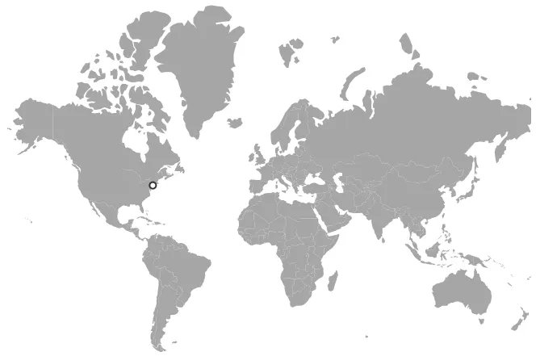
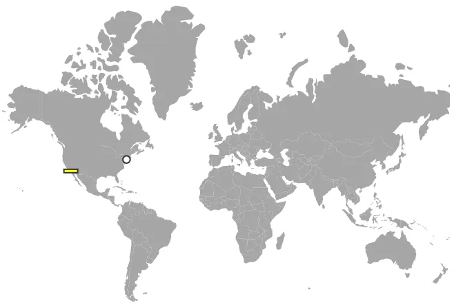
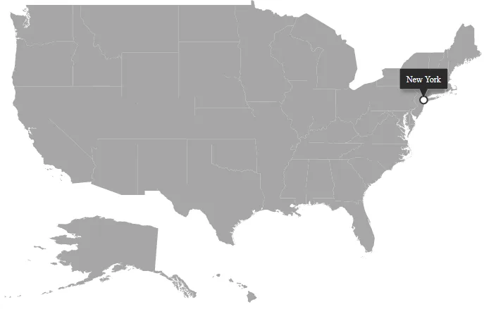

# How to Add Different Types of Markers in Blazor Maps

Markers can be added in the Maps component using the [MapsMarker](https://help.syncfusion.com/cr/blazor/Syncfusion.Blazor.Maps.MapsMarker-1.html) within [MapsMarkerSettings](https://help.syncfusion.com/cr/blazor/Syncfusion.Blazor.Maps.MapsMarkerSettings.html). The following steps describe how to add different types of markers.

<b>Step 1</b>

Initialize the Maps component with marker settings. A marker is added with the specified latitude and longitude of New York using the [DataSource](https://help.syncfusion.com/cr/blazor/Syncfusion.Blazor.Maps.MapsMarker-1.html#Syncfusion_Blazor_Maps_MapsMarker_1_DataSource) property. The shape of the marker can be customized using the [Shape](https://help.syncfusion.com/cr/blazor/Syncfusion.Blazor.Maps.MapsMarker-1.html#Syncfusion_Blazor_Maps_MapsMarker_1_Shape) property with the [MarkerType](https://help.syncfusion.com/cr/blazor/Syncfusion.Blazor.Maps.MarkerType.html) enum (when `Syncfusion.Blazor.Maps` is imported, the short form `MarkerType.Circle` can be used). The marker size and color are set using the [Width](https://help.syncfusion.com/cr/blazor/Syncfusion.Blazor.Maps.MapsMarker-1.html#Syncfusion_Blazor_Maps_MapsMarker_1_Width) and [Fill](https://help.syncfusion.com/cr/blazor/Syncfusion.Blazor.Maps.MapsMarker-1.html#Syncfusion_Blazor_Maps_MapsMarker_1_Fill) properties, and the border color and width can be changed using the [MapsMarkerBorder](https://help.syncfusion.com/cr/blazor/Syncfusion.Blazor.Maps.MapsMarkerBorder.html).

```cshtml

@using Syncfusion.Blazor.Maps

<SfMaps>
    <MapsLayers>
        <MapsLayer ShapeData='new {dataOptions= "https://cdn.syncfusion.com/maps/map-data/world-map.json"}' TValue="string">
            <MapsMarkerSettings>
                <MapsMarker Visible="true"
                            Shape="MarkerType.Circle"
                            Fill="white"
                            Width="15"
                            DataSource="Cities" TValue="City">
                    <MapsMarkerBorder Width="2" Color="#333"></MapsMarkerBorder>
                </MapsMarker>
            </MapsMarkerSettings>
        </MapsLayer>
    </MapsLayers>
</SfMaps>

@code {
    public class City
    {
        public double Latitude { get; set; }
        public double Longitude { get; set; }
        public string Name { get; set; }
    }

    private List<City> Cities = new List<City> {
        new City{ Latitude = 40.7424509, Longitude = -74.0081468, Name = "New York" }
    };
}
```



<b>Step 2</b>

Add multiple marker groups with different shapes as shown in the following example. The second group uses the [Height](https://help.syncfusion.com/cr/blazor/Syncfusion.Blazor.Maps.MapsMarker-1.html#Syncfusion_Blazor_Maps_MapsMarker_1_Height) property together with [Width](https://help.syncfusion.com/cr/blazor/Syncfusion.Blazor.Maps.MapsMarker-1.html#Syncfusion_Blazor_Maps_MapsMarker_1_Width) to render a rectangle marker.

```cshtml

@using Syncfusion.Blazor.Maps

<SfMaps>
    <MapsLayers>
        <MapsLayer ShapeData='new {dataOptions= "https://cdn.syncfusion.com/maps/map-data/world-map.json"}' TValue="string">
            <MapsMarkerSettings>
                <MapsMarker Visible="true" Shape="MarkerType.Circle"
                            Fill="white"
                            Width="20"
                            DataSource="HighestPopulation" TValue="City">
                    <MapsMarkerBorder Width="2" Color="#333"></MapsMarkerBorder>
                </MapsMarker>
                <MapsMarker Visible="true" Shape="MarkerType.Rectangle"
                            Fill="yellow"
                            Width="20"
                            Height="5"
                            DataSource="LowestPopulation" TValue="City">
                    <MapsMarkerBorder Width="2" Color="#333"></MapsMarkerBorder>
                </MapsMarker>
            </MapsMarkerSettings>
        </MapsLayer>
    </MapsLayers>
</SfMaps>

@code {
    public class City
    {
        public double Latitude { get; set; }
        public double Longitude { get; set; }
        public string Name { get; set; }
    }

    private List<City> HighestPopulation = new List<City> {
        new City { Latitude = 40.7424509, Longitude = -74.0081468, Name = "New York" }
    };

    private List<City> LowestPopulation = new List<City> {
        new City { Latitude = 33.5302186, Longitude = -117.7418381, Name = "Laguna Niguel" }
    };
}

```



## Tooltip for marker

A tooltip displays additional information about a marker on mouseover or touch end. It can be enabled separately for a layer or marker by setting the [Visible](https://help.syncfusion.com/cr/blazor/Syncfusion.Blazor.Maps.MapsTooltipSettings.html#Syncfusion_Blazor_Maps_MapsTooltipSettings_Visible) property to **true** in [MapsMarkerTooltipSettings](https://help.syncfusion.com/cr/blazor/Syncfusion.Blazor.Maps.MapsMarkerTooltipSettings.html). The [ValuePath](https://help.syncfusion.com/cr/blazor/Syncfusion.Blazor.Maps.MapsTooltipSettings.html#Syncfusion_Blazor_Maps_MapsTooltipSettings_ValuePath) property specifies the field in the data source and displays that value as tooltip text.

```cshtml

@using Syncfusion.Blazor.Maps

<SfMaps>
    <MapsLayers>
        <MapsLayer ShapeData='new {dataOptions ="https://cdn.syncfusion.com/maps/map-data/usa.json"}' TValue="string">
            <MapsMarkerSettings>
                <MapsMarker Visible="true" Shape="MarkerType.Circle"
                            Fill="white"
                            Width="20"
                            DataSource="HighestPopulation" TValue="City">
                    <MapsMarkerBorder Width="2" Color="#333"></MapsMarkerBorder>
                    <MapsMarkerTooltipSettings Visible="true" ValuePath="Name"></MapsMarkerTooltipSettings>
                </MapsMarker>
            </MapsMarkerSettings>
        </MapsLayer>
    </MapsLayers>
</SfMaps>

@code {
    public class City
    {
        public double Latitude { get; set; }
        public double Longitude { get; set; }
        public string Name { get; set; }
    }

    private List<City> HighestPopulation = new List<City> {
        new City { Latitude = 40.7424509, Longitude = -74.0081468, Name = "New York" }
    };
}

```



## See also

* [Markers in Blazor Maps](../markers)
* [MapsMarker API reference](https://help.syncfusion.com/cr/blazor/Syncfusion.Blazor.Maps.MapsMarker-1.html)
* [MapsMarkerBorder API reference](https://help.syncfusion.com/cr/blazor/Syncfusion.Blazor.Maps.MapsMarkerBorder.html)
* [MapsMarkerTooltipSettings API reference](https://help.syncfusion.com/cr/blazor/Syncfusion.Blazor.Maps.MapsMarkerTooltipSettings.html)
