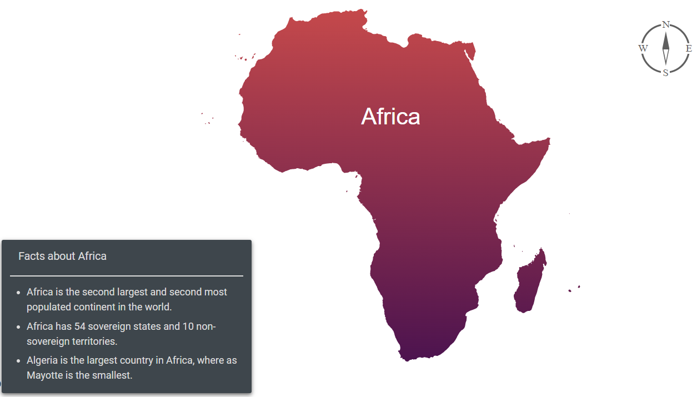

# Annotations

Annotations are used to mark the specific area of interest in the Maps with texts, shapes, or images. Any number of annotations can be added to the Maps component.

Initialize the Maps control with annotation option, text content or ID of an HTML element or an HTML string can be specified to render a new element that needs to be displayed in the Maps by using the [`ContentTemplate`](https://help.syncfusion.com/cr/blazor/Syncfusion.Blazor.Maps.MapsAnnotation.html#Syncfusion_Blazor_Maps_MapsAnnotation_ContentTemplate) property. To specify the content position with [`X`](https://help.syncfusion.com/cr/blazor/Syncfusion.Blazor.Maps.MapsAnnotation.html#Syncfusion_Blazor_Maps_MapsAnnotation_X) and [`Y`](https://help.syncfusion.com/cr/blazor/Syncfusion.Blazor.Maps.MapsAnnotation.html#Syncfusion_Blazor_Maps_MapsAnnotation_Y) properties as mentioned in the following example.

```cshtml
@using Syncfusion.Blazor.Maps

<SfMaps Background="transparent">
        <MapsAreaSettings Background="transparent"/>
        <MapsZoomSettings Enable="false" />
        <MapsAnnotations>
            <MapsAnnotation X="0%" Y="60%">
                <ContentTemplate>
                    <div class="annotationTemplate">
                        <div>
                            <p style="margin-left:10px;font-size:13px;font-weight:500">Facts about Africa</p>
                        </div>
                        <hr style="margin-top:-3px;margin-bottom:10px;border:0.5px solid #DDDDDD">
                        <div>
                            <ul style="list-style-type:disc; margin-left:-20px;margin-bottom:2px; font-weight:400">
                                <li>Africa is the second largest and second most populated continent in the world.</li>
                                <li style="padding-top:5px;">Africa has 54 sovereign states and 10 non-sovereign territories.</li>
                                <li style="padding-top:5px;">Algeria is the largest country in Africa, where as Mayotte is the smallest.</li>
                            </ul>
                        </div>
                    </div>
                </ContentTemplate>
            </MapsAnnotation>
            <MapsAnnotation X="80%" Y="5%">
                <ContentTemplate>
                    <div>
                        
                    </div>
                </ContentTemplate>
            </MapsAnnotation>
        </MapsAnnotations>
        <MapsLayers>
            <MapsLayer ShapeData='new {dataOptions = "../data/maps/africa.json"}' TValue="string">
                <MapsShapeSettings Fill="url(#grad1)" />
                <MapsMarkerSettings>
                    <MapsMarker Visible="true" DataSource="@MarkerDataSource" TValue="MarkerData">
                        <MarkerTemplate>
                            @{
                                var Data = context as MarkerData;
                                <div style="margin-left:-45px;margin-top:-20px"><h3 style="color:#FFFFFF">@Data.Name</h3></div>
                            }
                        </MarkerTemplate>
                    </MapsMarker>
                </MapsMarkerSettings>
            </MapsLayer>
        </MapsLayers>
    </SfMaps>

<svg height="30" width="400">
    <defs>
        <linearGradient id="grad1" x1="0%" y1="0%" x2="0%" y2="100%">
            <stop offset="0%" style="stop-color:#C5494B;stop-opacity:1" />
            <stop offset="100%" style="stop-color:#4C134F;stop-opacity:1" />
        </linearGradient>
    </defs>
</svg>
<style>
    .annotationTemplate {
        color: #DDDDDD;
        box-shadow: 0px 2px 5px #666;
        -webkit-box-shadow: 0px 2px 5px #666;
        -moz-box-shadow: 0px 2px 5px #666;
        font-size: 12px;
        width: 300px;
        width: 300px;
        border-radius: 2px;
        -moz-border-radius: 2px;
        -webkit-border-radius: 2px;
        font-family: Roboto;
        background: #3E464C;
        margin: 20px;
        padding: 10px;
    }
</style>
@code {
    public class MarkerData
    {
        public double Latitude { get; set; }
        public double Longitude { get; set; }
        public string Name { get; set; }
    };
    public List<MarkerData> MarkerDataSource = new List<MarkerData> {
        new MarkerData { Latitude=13.97274101999902, Longitude=20.390625, Name="Africa" }
    };
    
}

```

