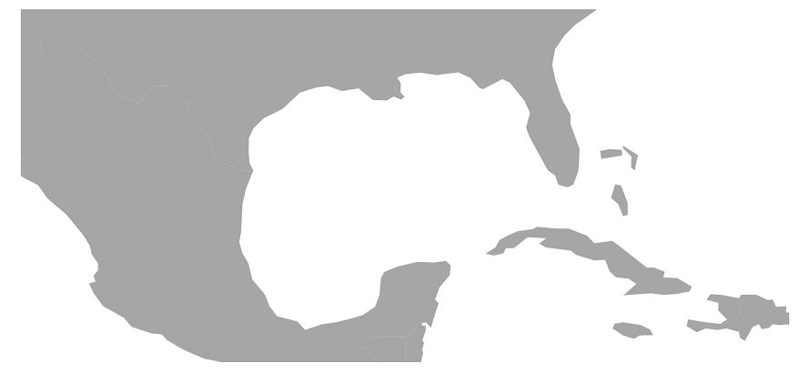

# Change center position on zooming in Blazor Maps Component

Blazor Maps component provides support to change the center position of the Maps. This can be achieved by setting the coordinates of the location in the [CenterPosition](https://help.syncfusion.com/cr/blazor/Syncfusion.Blazor.Maps.SfMaps.html#Syncfusion_Blazor_Maps_SfMaps_CenterPosition) class. The [ZoomFactor](https://help.syncfusion.com/cr/blazor/Syncfusion.Blazor.Maps.MapsZoomSettings.html#Syncfusion_Blazor_Maps_MapsZoomSettings_ZoomFactor) property in the [MapsZoomSettings](https://help.syncfusion.com/cr/blazor/Syncfusion.Blazor.Maps.MapsZoomSettings.html) class can be used to focus the provided center position in the Maps.

```cshtml
@using Syncfusion.Blazor.Maps

<SfMaps>
    @* To change center position *@
    <MapsCenterPosition Latitude="25.54244147012483" Longitude="-89.62646484375"></MapsCenterPosition>
    <MapsZoomSettings Enable="false" ZoomFactor="13"></MapsZoomSettings>
    <MapsLayers>
        <MapsLayer ShapeData='new {dataOptions= "https://cdn.syncfusion.com/maps/map-data/world-map.json"}' TValue="string"></MapsLayer>
    </MapsLayers>
</SfMaps>
```

