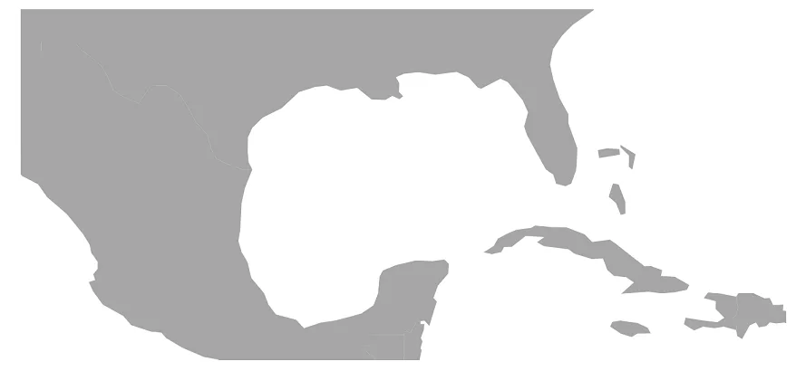

# Change center position on zooming in Blazor Maps Component

The Blazor Maps component supports changing the map's center position by specifying coordinates in the [MapsCenterPosition](https://help.syncfusion.com/cr/blazor/Syncfusion.Blazor.Maps.MapsCenterPosition.html). The [ZoomFactor](https://help.syncfusion.com/cr/blazor/Syncfusion.Blazor.Maps.MapsZoomSettings.html#Syncfusion_Blazor_Maps_MapsZoomSettings_ZoomFactor) property in the [MapsZoomSettings](https://help.syncfusion.com/cr/blazor/Syncfusion.Blazor.Maps.MapsZoomSettings.html) focuses on the specified center position.

```cshtml

@using Syncfusion.Blazor.Maps

<SfMaps>
    @* To change center position *@
    <MapsCenterPosition Latitude="25.54244147012483" Longitude="-89.62646484375"></MapsCenterPosition>
    <MapsZoomSettings Enable="false" ZoomFactor="13"></MapsZoomSettings>
    <MapsLayers>
        <MapsLayer ShapeData='new {dataOptions= "https://cdn.syncfusion.com/maps/map-data/world-map.json"}' TValue="string"></MapsLayer>
    </MapsLayers>
</SfMaps>

```




Blazor Maps is a powerful component that allows developers to visualize spatial data interactively within Blazor applications. One of its key features is the ability to control the map's center position and zoom level programmatically. This is particularly useful for focusing on specific regions, providing a better user experience, and guiding users to areas of interest.

## Understanding Center Position and Zooming

### MapsCenterPosition
The `MapsCenterPosition` property allows you to set the latitude and longitude that the map should focus on. By changing these values, you can programmatically move the center of the map to any location in the world. This is especially useful when you want to highlight a particular country, city, or region when the map loads or after a user action.

### MapsZoomSettings and ZoomFactor
The `MapsZoomSettings` property provides various options to control the zoom behavior of the map. The `ZoomFactor` property determines how closely the map is zoomed in on the specified center position. A higher zoom factor means a closer view, while a lower value shows a broader area. You can also enable or disable zooming interactions using the `Enable` property.

## Step-by-Step Guide to Changing Center Position on Zoom

1. **Import the Maps Namespace**: Ensure you have `@using Syncfusion.Blazor.Maps` at the top of your component or page.
2. **Add the SfMaps Component**: Place the `<SfMaps>` component in your markup.
3. **Set the Center Position**: Use the `<MapsCenterPosition>` tag to specify the latitude and longitude you want to focus on.
4. **Configure Zoom Settings**: Use `<MapsZoomSettings>` to set the desired zoom factor and enable or disable zooming.
5. **Add Map Layers**: Define one or more `<MapsLayer>` elements to display the map data.

### Example Explained
In the example above, the map is centered at latitude `25.54244147012483` and longitude `-89.62646484375`, with a zoom factor of `13`. This means the map will load focused on this specific location at a close zoom level, making it ideal for highlighting a particular area.

## Practical Scenarios

- **Focusing on a User's Location**: You can dynamically set the center position based on a user's geolocation, providing a personalized map view.
- **Highlighting Points of Interest**: For applications showing multiple locations, you can programmatically change the center and zoom to focus on a selected point of interest.
- **Guided Navigation**: In interactive dashboards, you can update the center position and zoom level in response to user actions, such as clicking a list item or searching for a location.

## Additional Resources

- [Blazor Maps Documentation](https://blazor.syncfusion.com/documentation/maps/getting-started)
- [API Reference: MapsCenterPosition](https://help.syncfusion.com/cr/blazor/Syncfusion.Blazor.Maps.MapsCenterPosition.html)
- [API Reference: MapsZoomSettings](https://help.syncfusion.com/cr/blazor/Syncfusion.Blazor.Maps.MapsZoomSettings.html)

By leveraging the center position and zooming features in the Blazor Maps component, you can create highly interactive and user-friendly mapping experiences tailored to your application's needs. Experiment with different settings to find the best configuration for your scenario.
