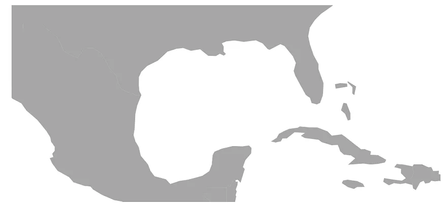

# How to Change Center Position on Zooming in Blazor Maps

The Blazor Maps component supports changing the map's center position by specifying the [Latitude](https://help.syncfusion.com/cr/blazor/Syncfusion.Blazor.Maps.MapsCenterPosition.html#Syncfusion_Blazor_Maps_MapsCenterPosition_Latitude) and [Longitude](https://help.syncfusion.com/cr/blazor/Syncfusion.Blazor.Maps.MapsCenterPosition.html#Syncfusion_Blazor_Maps_MapsCenterPosition_Longitude) coordinates in the [MapsCenterPosition](https://help.syncfusion.com/cr/blazor/Syncfusion.Blazor.Maps.MapsCenterPosition.html). The [ZoomFactor](https://help.syncfusion.com/cr/blazor/Syncfusion.Blazor.Maps.MapsZoomSettings.html#Syncfusion_Blazor_Maps_MapsZoomSettings_ZoomFactor) property in the [MapsZoomSettings](https://help.syncfusion.com/cr/blazor/Syncfusion.Blazor.Maps.MapsZoomSettings.html) focuses on the specified center position. In the following example, the [Enable](https://help.syncfusion.com/cr/blazor/Syncfusion.Blazor.Maps.MapsZoomSettings.html#Syncfusion_Blazor_Maps_MapsZoomSettings_Enable) property is set to **false** so that the map stays at the configured center and zoom factor.

```cshtml

@using Syncfusion.Blazor.Maps

<SfMaps>
    @* To change center position *@
    <MapsCenterPosition Latitude="25.54244147012483" Longitude="-89.62646484375"></MapsCenterPosition>
    <MapsZoomSettings Enable="false" ZoomFactor="13"></MapsZoomSettings>
    <MapsLayers>
        <MapsLayer ShapeData='new {dataOptions= "https://cdn.syncfusion.com/maps/map-data/world-map.json"}' TValue="string"></MapsLayer>
    </MapsLayers>
</SfMaps>

```



## See also

* [Zooming and panning in Blazor Maps](../user-interactions#zooming)
* [MapsCenterPosition API reference](https://help.syncfusion.com/cr/blazor/Syncfusion.Blazor.Maps.MapsCenterPosition.html)
* [MapsZoomSettings API reference](https://help.syncfusion.com/cr/blazor/Syncfusion.Blazor.Maps.MapsZoomSettings.html)
