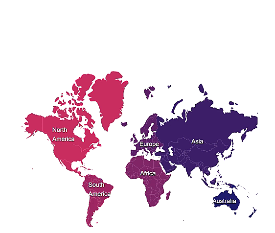

# Drill-down

By clicking a continent, all the countries available in that continent can be viewed using the drill-down feature. For example, the countries in the `Africa` continent have been showcased here. To showcase all the countries in `Africa` continent by clicking the [ShapeSelected](../../api/maps#shapeselected) event as mentioned in the following example.

```cshtml
@using Syncfusion.Blazor.Maps

<div id="button" style="font-size:14px;margin-left: 10px;margin-top: 20px;display:@Button;left:50px;top:50px;">
    <button id="category" style="visibility:@Category;color:#337ab7;display:inline-block" @onclick="WorldMapDisplay">
        World Map
    </button>
    <p style="visibility:@Symbol; display:inline-block" id="symbol"> >> </p>
    <p id="text" style="display:inline-block;">@Text</p>
</div>
<div class="control-section">
    <SfMaps @ref="@MapsRef" BaseLayerIndex="@LayerIndex" Background="transparent" Width="500px" Height="500px">
        <MapsAreaSettings Background="transparent" />
        <MapsEvents ShapeSelected="ShapeSelection" />
        <MapsZoomSettings Enable="false" />
        <MapsLayers>
            <MapsLayer ShapeData='new {dataOptions = "world-map.json"}' ShapePropertyPath="@ShapePropertyPath"
                       ShapeDataPath="Continent" DataSource="@MapLayerDataSource" TValue="MapDataSource">
                <MapsShapeSettings ColorValuePath="DrillColor" />
                <MapsMarkerSettings>
                    <MapsMarker Visible="true" DataSource="@AsiaMarker" TValue="MarkerDataSource">
                        <MarkerTemplate>
                            @{
                                var Data = context as MarkerDataSource;
                                <div class="markers">
                                    <p>@Data.Name</p>
                                </div>
                            }
                        </MarkerTemplate>
                    </MapsMarker>
                    <MapsMarker Visible="true" DataSource="@AustraliaMarker" TValue="MarkerDataSource">
                        <MarkerTemplate>
                            @{
                                var Data = context as MarkerDataSource;
                                <div class="markers">
                                    <p>@Data.Name</p>
                                </div>
                            }
                        </MarkerTemplate>
                    </MapsMarker>
                    <MapsMarker Visible="true" DataSource="@AfricaMarker" TValue="MarkerDataSource">
                        <MarkerTemplate>
                            @{
                                var Data = context as MarkerDataSource;
                                <div class="markers">
                                    <p>@Data.Name</p>
                                </div>
                            }
                        </MarkerTemplate>
                    </MapsMarker>
                    <MapsMarker Visible="true" DataSource="@AfricaMarker" TValue="MarkerDataSource">
                        <MarkerTemplate>
                            @{
                                var Data = context as MarkerDataSource;
                                <div class="markers">
                                    <p>@Data.Name</p>
                                </div>
                            }
                        </MarkerTemplate>
                    </MapsMarker>
                    <MapsMarker Visible="true" DataSource="@EuropeMarker" TValue="MarkerDataSource">
                        <MarkerTemplate>
                            @{
                                var Data = context as MarkerDataSource;
                                <div class="markers">
                                    <p>@Data.Name</p>
                                </div>
                            }
                        </MarkerTemplate>
                    </MapsMarker>
                    <MapsMarker Visible="true" DataSource="@NorthAmerica" TValue="MarkerDataSource">
                        <MarkerTemplate>
                            @{
                                <div class="markers">
                                    <div>North</div><div>America</div>
                                </div>
                            }
                        </MarkerTemplate>
                    </MapsMarker>
                    <MapsMarker Visible="true" DataSource="@SouthAmericaMarker" TValue="MarkerDataSource">
                        <MarkerTemplate>
                            @{
                                <div class="markers">
                                    <div>South</div><div>America</div>
                                </div>
                            }
                        </MarkerTemplate>
                    </MapsMarker>
                </MapsMarkerSettings>
               
            </MapsLayer>
            <MapsLayer ShapeData='new {dataOptions = "africa.json"}' TValue="string">
                <MapsShapeSettings Fill="#80306A" />   
            </MapsLayer>
            <MapsLayer ShapeData='new {dataOptions = "asia.json"}' TValue="string">
                <MapsShapeSettings Fill="#462A6D" />
            </MapsLayer>
            <MapsLayer ShapeData='new {dataOptions = "north-america.json"}' TValue="string">
                <MapsShapeSettings Fill="#C13664" />
            </MapsLayer>
            <MapsLayer ShapeData='new {dataOptions = "south-america.json"}' TValue="string">
                <MapsShapeSettings Fill="#9C3367" />
            </MapsLayer>
            <MapsLayer ShapeData='new {dataOptions = "europe.json"}' TValue="string">
                <MapsShapeSettings Fill="#2A2870" />
            </MapsLayer>
            <MapsLayer ShapeData='new {dataOptions = "australia.json"}' TValue="string">
                <MapsShapeSettings Fill="#2A2870" />
            </MapsLayer>
        </MapsLayers>
    </SfMaps>
</div>
<div align="center">
    <div align="center">
        <p style="font-size: 16px;color:grey">
            <i>@Drill</i>
        </p>
    </div>
</div>
<style>
    .markers {
        margin-left: 0px;
        margin-top: 10px;
        font-size: 12px;
        color: white;
        text-shadow: 0px 1px 1px black;
        font-weight: 500
    }
    #category {
        background-color: white; /* Green */
        border: none;
        color: black;
        padding: 1px 2px;
        text-align: center;
        text-decoration: none;
        display: inline-block;
        font-size: 16px;
    }
    .markerTemplate {
        height: 30px;
        width: 30px;
        display: block;
        margin: auto;
    }
    #category:hover {
        cursor: pointer;
    }
    .markerTemplate {
        font-size: 12px;
        color: white;
        text-shadow: 0px 1px 1px black;
        font-weight: 500
    }
</style>
@code {
    public string Category = "hidden";
    public string Symbol = "hidden";
    public string Button = "none";
    public string Text = "";
    public string[] ShapePropertyPath = { "continent" };
    public string Drill = "Click on a shape to drill";
    SfMaps MapsRef;
    public int LayerIndex = 0;
    public class MapDataSource
    {
        public string DrillColor { get; set; }
        public string Continent { get; set; }
    };
    public List<MapDataSource> MapLayerDataSource = new List<MapDataSource> {
        new MapDataSource { DrillColor="#C13664", Continent="North America" },
        new MapDataSource { DrillColor="#9C3367", Continent="South America" },
        new MapDataSource { DrillColor="#80306A", Continent="Africa" },
        new MapDataSource { DrillColor="#622D6C", Continent="Europe" },
        new MapDataSource { DrillColor="#462A6D", Continent="Asia" },
        new MapDataSource { DrillColor="#2A2870", Continent="Australia" }
    };
    public class MarkerDataSource
    {
        public double Latitude { get; set; }
        public double Longitude { get; set; }
        public string Name { get; set; }
    };
    public List<MarkerDataSource> AsiaMarker = new List<MarkerDataSource> {
        new MarkerDataSource { Latitude=50.32087157990324, Longitude=90.015625, Name="Asia" }
    };
    public List<MarkerDataSource> AustraliaMarker = new List<MarkerDataSource> {
        new MarkerDataSource { Latitude=-28.88583769986199, Longitude=130.296875, Name="Australia" }
    };
    public List<MarkerDataSource> AfricaMarker = new List<MarkerDataSource> {
        new MarkerDataSource { Latitude=10.97274101999902, Longitude=16.390625, Name="Africa" }
    };
    public List<MarkerDataSource> EuropeMarker = new List<MarkerDataSource> {
        new MarkerDataSource { Latitude=47.95121990866204, Longitude=18.468749999999998, Name="Europe" }
    };
    public List<MarkerDataSource> NorthAmerica = new List<MarkerDataSource> {
        new MarkerDataSource { Latitude=59.88893689676585, Longitude=-109.3359375, Name="North America" }
    };
    public List<MarkerDataSource> SouthAmericaMarker = new List<MarkerDataSource> {
        new MarkerDataSource { Latitude=-6.64607562172573, Longitude=-55.54687499999999, Name="South America" }
    };
    private void ShapeSelection(ShapeSelectedEventArgs args)
    {
        Dictionary<string, string> DrillData = args.Data;
        if (MapsRef.BaseLayerIndex == 0)
        {
            if (DrillData["continent"] == "Africa")
            {
                LayerIndex = 1;
                this.StateHasChanged();
            }
            else if (DrillData["continent"] == "Asia")
            {
                LayerIndex = 2;
                this.StateHasChanged();
            }
            else if (DrillData["continent"] == "North America")
            {
                LayerIndex = 3;
                this.StateHasChanged();
            }
            else if (DrillData["continent"] == "South America")
            {
                LayerIndex = 4;
                this.StateHasChanged();
            }
            else if (DrillData["continent"] == "Europe")
            {
                LayerIndex = 5;
                this.StateHasChanged();
            }
            else if (DrillData["continent"] == "Australia")
            {
                LayerIndex = 6;
                this.StateHasChanged();
            }
            Button = "block";
            Category = "visible";
            Text = DrillData["continent"];
            Symbol = "visible";
            Drill = "";
        }
    }
    public void WorldMapDisplay()
    {
        LayerIndex = 0;
        this.StateHasChanged();
        Category = "hidden";
        Symbol = "hidden";
        Text = "";
        Drill = "Click on a shape to drill";
    }
    
}


```

