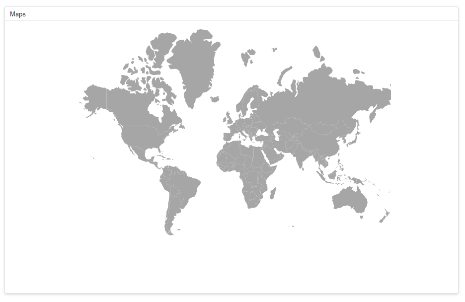
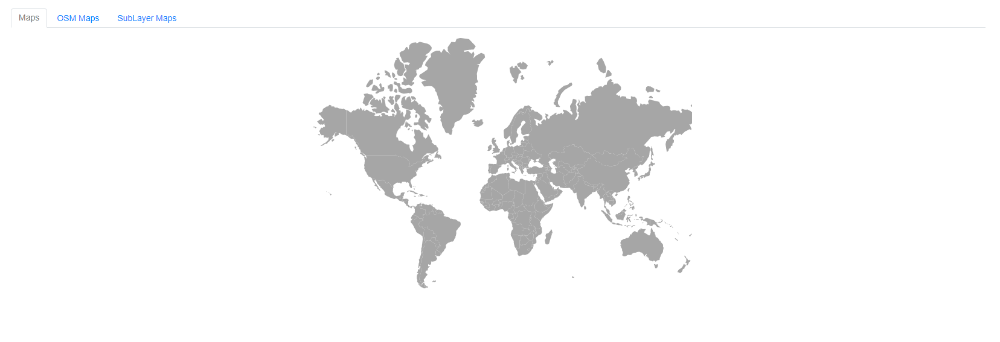
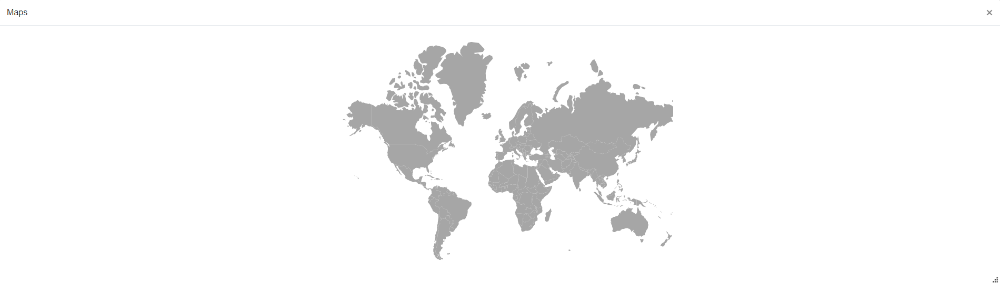
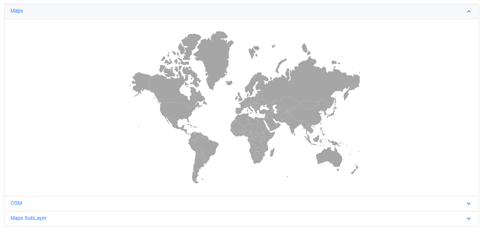

# Render Maps componnet inside the other components

The Maps can be rendered within components such as the dashboard layout, tabs, card, dialogue, and others. The rendering of the Maps component begins before the rendering of the other components. These scenarios can be overcome by a boolean value. The boolean value is used to decide the rendering of the Maps component.

## Maps component with Dashboard Layout

When the Maps component renders within the Dashboard Layout component. The "Created" event is triggered when the Layout component is rendered first. A boolean value must be set to "true" in this event. This boolean value will be used to determine the rendering of the component. When we drag or resize the panel, the Maps are not properly rendered within the panel, to overcome this scenario, we must call the "Refresh" method in the "OnResizeStop" and "OnWindowResize" events of the Dashboard layout. Since, the size of the Dashboard layout's panel is determined after a delay in the Maps component, a time delay of 1000 milliseconds must be provided before refreshing the Maps component.


```cshtml
@using Syncfusion.Blazor.Maps

<SfDashboardLayout ID="Treemap" @ref="dashboardObject" AllowResizing="@AllowResizing"  AllowFloating="@AllowFloating" CellSpacing="@CellSpacing" Columns="@Columns">
<DashboardLayoutEvents OnResizeStop="ResizingHandler" OnWindowResize="ResizingHandler" Created="Created"></DashboardLayoutEvents>
    <DashboardLayoutPanels>
        <DashboardLayoutPanel Id="24" Row="0" Col="1" SizeX="@SizeX" SizeY="@SizeY">
            <HeaderTemplate><div> Maps </div></HeaderTemplate>
            <ContentTemplate>
                @if (isInitialRender)
                {
                    <SfMaps ID="Maps" @ref="Maps" Width="100%">
                        <MapsLayers>
                            <MapsLayer ShapeData='new {dataOptions= "https://cdn.syncfusion.com/maps/map-data/world-map.json"}' TValue="string">
                            </MapsLayer>
                        </MapsLayers>
                    </SfMaps>  
                }   
            </ContentTemplate>
        </DashboardLayoutPanel>
    </DashboardLayoutPanels>
</SfDashboardLayout>

@code{
    SfDashboardLayout dashboardObject;
    public double[] CellSpacing = { 10, 10 };
    public int Columns = 20;
    public bool AllowFloating { get; set; } = true;
    public bool AllowResizing { get; set; } = true; 
    public int SizeX = 5;
    public int SizeY = 7;
    SfMaps Maps;

    public bool isInitialRender { get; set; }

    public async void ResizingHandler(ResizeArgs args)
    {
        await Task.Delay(1000);
        Maps.Refresh();
    }
   
    public async void Created(Object args)
    {
        isInitialRender = true;

    }
}

```


## Maps component with Tab

When the Maps component renders within the Tab component.The "Created" event is triggered when the Tab component is rendered first. A boolean value must be set to "true" in this event. This boolean value will be used to determine the rendering of the component.


```cshtml

@using Syncfusion.Blazor.Navigations
@using Syncfusion.Blazor.Maps


    <SfTab CssClass="default-tab">
        <TabEvents Created="Created"></TabEvents>
        <TabItems>
            <TabItem>
                <ChildContent>
                    <TabHeader Text="Maps"></TabHeader>
                </ChildContent>
                <ContentTemplate>
                 @if (isInitialRender)
                 {
                    <SfMaps Width="100%">
                        <MapsLayers>
                            <MapsLayer ShapeData='new {dataOptions= "https://cdn.syncfusion.com/maps/map-data/world-map.json"}' TValue="string">
                            </MapsLayer>
                        </MapsLayers>
                    </SfMaps>  
                 }   
                 </ContentTemplate>
            </TabItem>
            <TabItem>
                <ChildContent>
                    <TabHeader Text="OSM Maps"></TabHeader>
                </ChildContent>
                 <ContentTemplate>
                 @if (isInitialRender)
                 {
                    <SfMaps ID="OSM" @ref="MapsOne" Width="100%">
                        <MapsLayers>
                            <MapsLayer UrlTemplate="https://tile.openstreetmap.org/level/tileX/tileY.png" TValue="string"></MapsLayer>
                        </MapsLayers>
                    </SfMaps>  
                 }   
                 </ContentTemplate>
            </TabItem>
            <TabItem>
                <ChildContent>
                    <TabHeader Text="SubLayer Maps"></TabHeader>
                </ChildContent>
                 <ContentTemplate>
                 @if (isInitialRender)
                 {
                    <SfMaps ID="SubLayer">
                        <MapsLayers>
                            <MapsLayer ShapeData='new {dataOptions ="https://cdn.syncfusion.com/maps/map-data/world-map.json"}' TValue="string">
                                <MapsShapeSettings Fill="#E5E5E5">
                                    <MapsShapeBorder Color="black" Width="0.1"></MapsShapeBorder>
                                </MapsShapeSettings>
                            </MapsLayer>
                            <MapsLayer ShapeData='new {dataOptions = "https://cdn.syncfusion.com/maps/map-data/usa.json"}'
	                    	        Type="Syncfusion.Blazor.Maps.Type.SubLayer" TValue="string">
                                <MapsShapeSettings Fill="rgba(141, 206, 255, 0.6)">
                                    <MapsShapeBorder Color="#1a9cff" Width="0.25"></MapsShapeBorder>
                                </MapsShapeSettings>
                            </MapsLayer>
                            <MapsLayer ShapeData='new {dataOptions= "https://cdn.syncfusion.com/maps/map-data/california.json"}'
	                    	        Type="Syncfusion.Blazor.Maps.Type.SubLayer" TValue="string">
                                <MapsShapeSettings Fill="rgba(141, 206, 255, 0.6)">
                                    <MapsShapeBorder Color="#1a9cff" Width="0.25"></MapsShapeBorder>
                                </MapsShapeSettings>
                            </MapsLayer>
                        </MapsLayers>
                    </SfMaps> 
                 }   
                 </ContentTemplate>
            </TabItem>
        </TabItems>
    </SfTab>

@code{
    public bool isInitialRender { get; set; }
    public void Created()
    {
        isInitialRender = true;
    }
    }

```



## Maps component with Dialog

When the Maps component renders within the Dialog component.The "Opened" event is triggered when the Dialog component is rendered first. A boolean value must be set to "true" in this event. This boolean value will be used to determine the rendering of the component. When the Dialog is closed, the "Closed" event is triggered, and the boolean value must be set to "false" in this event.

```cshtml

@using Syncfusion.Blazor.Popups
@using Syncfusion.Blazor.Maps

<div class="col-lg-12 control-section" id="target">
    <div>
        @if (this.ShowButton)
        {
            <button class="e-btn" @onclick="@OnClicked">Open</button>
        }
    </div>
    <SfDialog ResizeHandles="@dialogResizeDirections" AllowDragging="true" EnableResize="true" ShowCloseIcon="true" @bind-Visible="Visibility">
        <DialogTemplates>
            <Header>Maps</Header>
            <Content> 
                @if(isInitialRender)
                {
                     <SfMaps ID="Maps" @ref="Maps" Width="100%">
                        <MapsLayers>
                            <MapsLayer ShapeData='new {dataOptions= "https://cdn.syncfusion.com/maps/map-data/world-map.json"}' TValue="string">
                            </MapsLayer>
                        </MapsLayers>
                    </SfMaps>  
                }
            </Content>
        </DialogTemplates>
        <DialogEvents OnOpen="@DialogOpen" Closed="@DialogClose"></DialogEvents>
    </SfDialog>
</div>
<style>

</style>
@code {
    SfMaps Maps;
    public bool isInitialRender { get; set; }
    private bool Visibility { get; set; } = true;
    private bool ShowButton { get; set; } = false;
    private ResizeDirection[] dialogResizeDirections { get; set; } = new ResizeDirection[] { ResizeDirection.All };
    private void DialogOpen(Object args)
    {
        this.ShowButton = false;
        isInitialRender = true;
    }
    private void DialogClose(Object args)
    {
        this.ShowButton = true;
        isInitialRender = false;
    }
    private void OnClicked()
    {
        this.Visibility = true;
    }
}

```



## Maps component with Accordion

When the Maps component renders within the Accordion component.The "Created" event is triggered when the Accordion component is rendered first. A boolean value must be set to "true" in this event. This boolean value will be used to determine the rendering of the component.

```cshtml
@using Syncfusion.Blazor.Maps

@using Syncfusion.Blazor.Navigations
@using Syncfusion.Blazor.Maps

<div class="control-section accordion-control-section">
    <SfAccordion>
        <AccordionEvents Created="Created"></AccordionEvents>
        <AccordionItems>
            <AccordionItem Expanded="true">
                <HeaderTemplate>Maps</HeaderTemplate>
                <ContentTemplate>
                 @if (isInitialRender)
                 {
                    <SfMaps ID="Maps" Width="100%">
                        <MapsLayers>
                            <MapsLayer ShapeData='new {dataOptions= "https://cdn.syncfusion.com/maps/map-data/world-map.json"}' TValue="string">
                            </MapsLayer>
                        </MapsLayers>
                    </SfMaps>  
                 }
                </ContentTemplate>
            </AccordionItem>
            <AccordionItem>
                <HeaderTemplate>OSM</HeaderTemplate>
                <ContentTemplate>
                    @if (isInitialRender)
                    {
                       <SfMaps ID="OSM" Width="100%">
                           <MapsLayers>
                               <MapsLayer UrlTemplate="https://tile.openstreetmap.org/level/tileX/tileY.png" TValue="string"></MapsLayer>
                           </MapsLayers>
                       </SfMaps>  
                    }      
                </ContentTemplate>
            </AccordionItem>
            <AccordionItem>
                <HeaderTemplate>Maps SubLayer</HeaderTemplate>
                <ContentTemplate>
                     @if (isInitialRender)
                     {
                        <SfMaps ID="SubLayer">
                            <MapsLayers>
                                <MapsLayer ShapeData='new {dataOptions ="https://cdn.syncfusion.com/maps/map-data/world-map.json"}' TValue="string">
                                    <MapsShapeSettings Fill="#E5E5E5">
                                        <MapsShapeBorder Color="black" Width="0.1"></MapsShapeBorder>
                                    </MapsShapeSettings>
                                </MapsLayer>
                                <MapsLayer ShapeData='new {dataOptions = "https://cdn.syncfusion.com/maps/map-data/usa.json"}'
	                        	        Type="Syncfusion.Blazor.Maps.Type.SubLayer" TValue="string">
                                    <MapsShapeSettings Fill="rgba(141, 206, 255, 0.6)">
                                        <MapsShapeBorder Color="#1a9cff" Width="0.25"></MapsShapeBorder>
                                    </MapsShapeSettings>
                                </MapsLayer>
                                <MapsLayer ShapeData='new {dataOptions= "https://cdn.syncfusion.com/maps/map-data/california.json"}'
	                        	        Type="Syncfusion.Blazor.Maps.Type.SubLayer" TValue="string">
                                    <MapsShapeSettings Fill="rgba(141, 206, 255, 0.6)">
                                        <MapsShapeBorder Color="#1a9cff" Width="0.25"></MapsShapeBorder>
                                    </MapsShapeSettings>
                                </MapsLayer>
                            </MapsLayers>
                        </SfMaps>   
                     }   
                </ContentTemplate>
            </AccordionItem>
        </AccordionItems>
    </SfAccordion>
</div>
<style>
    @@-moz-document url-prefix() {
        .e-accordion .e-content table {
            border-collapse: initial;
        }
    }
    .e-accordion table {
        width: 100%;
    }
    #nested-accordion.e-accordion {
        padding: 4px;
    }
    .e-accordion table th,
    .e-accordion table td {
        padding: 5px;
        border: 1px solid #ddd;
    }
    .accordion-control-section {
        margin: 0 10% 0 10%;
        padding-bottom: 25px;
    }
    .source-link {
        padding-bottom: 25px;
    }
</style>

@code{
    public bool isInitialRender { get; set; }

    public void Created()
    {
        isInitialRender = true;
    }

}

```
