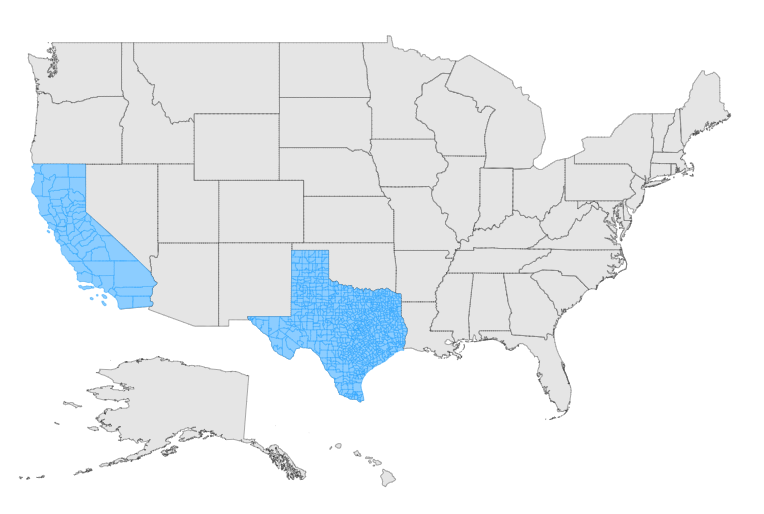

# Multilayer

The multilayer support allows loading multiple shape files in a single container and enables Maps to display more information. The shape layer is the main layer of the Maps. Multiple layers can be added in a shape layer as **SubLayer** using the [Type]() property.

```cshtml
@using Syncfusion.Blazor.Maps

<SfMaps Background="transparent" Width="500px" Height="500px">
        <MapsAreaSettings Background="transparent" />
        
        <MapsZoomSettings Enable="false" />
        <MapsLayers>
            <MapsLayer ShapeData='new {dataOptions = "usa.json"}' TValue="string">
                <MapsShapeSettings Fill="#E5E5E5">
                    <MapsShapeBorder Color="#000000" Width="0.2" />
                </MapsShapeSettings>
              
            </MapsLayer>
            <MapsLayer ShapeData='new {dataOptions = "texas.json"}' Type="Syncfusion.Blazor.Maps.Type.SubLayer" TValue="string">
                <MapsShapeSettings Fill="#8ccdff">
                    <MapsShapeBorder Color="#1a9cff" Width="0.25" />
                </MapsShapeSettings>
               
            </MapsLayer>
            <MapsLayer ShapeData='new {dataOptions = "california.json"}' Type="Syncfusion.Blazor.Maps.Type.SubLayer" TValue="string">
                <MapsShapeSettings Fill="#8ccdff">
                    <MapsShapeBorder Color="#1a9cff" Width="0.25" />
                </MapsShapeSettings>
                
            </MapsLayer>
        </MapsLayers>
    </SfMaps>
    
<style>
    .texasMarker {
        font-size: 12px;
        color: black;
        margin-left: -10px;
        margin-top: -10px;
    }
    .californiaMarker {
        font-size: 12px;
        color: black;
        margin-left: -15px;
        margin-top: -5px;
    }
</style>
@code {
    public class MapMarker
    {
        public double Latitude { get; set; }
        public double Longitude { get; set; }
        public string Name { get; set; }
    };
    public List<MapMarker> MarkerDataSource = new List<MapMarker> {
        new MapMarker {Latitude=30.267153, Longitude=-97.7430608, Name="Austin" }
    };
    public List<MapMarker> MarkerDataSources = new List<MapMarker> {
        new MapMarker {Latitude=31.80289258670676, Longitude=-98.96484375, Name="TX" }
    };
    public List<MapMarker> FirstMarker = new List<MapMarker> {
        new MapMarker {Latitude=37.3382082, Longitude=-121.8863286, Name="San Jose" }
    };
    public List<MapMarker> SecondMarker = new List<MapMarker> {
        new MapMarker {Latitude=37.09023980307208, Longitude=-119.35546875000001, Name="CA" }
    };
    
}


```

