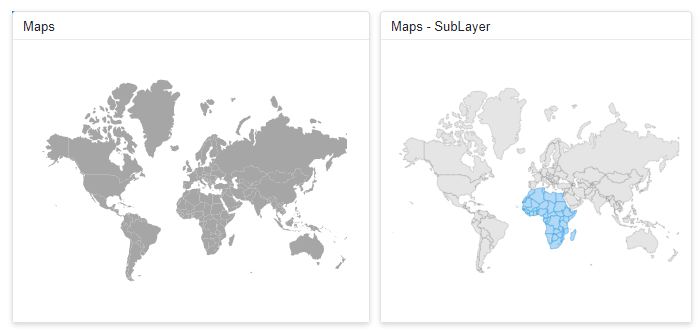
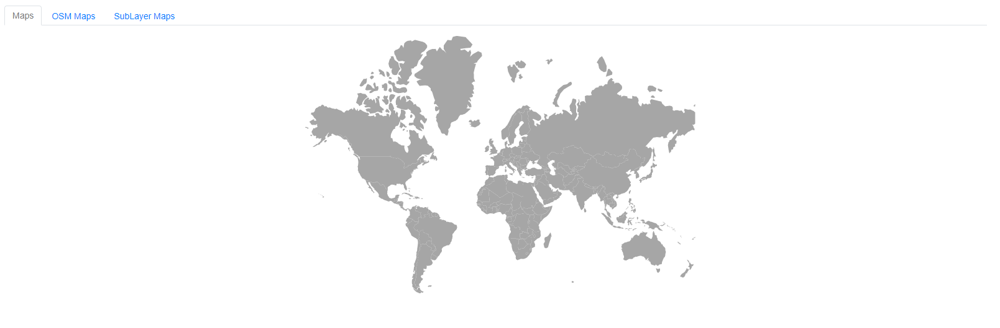
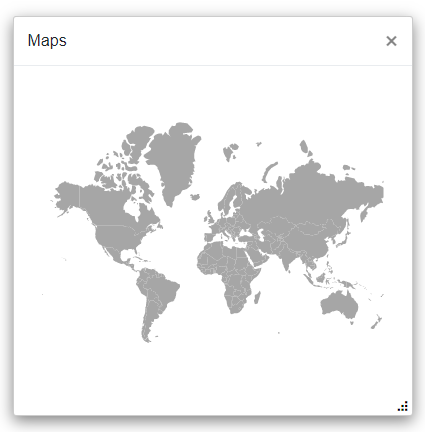
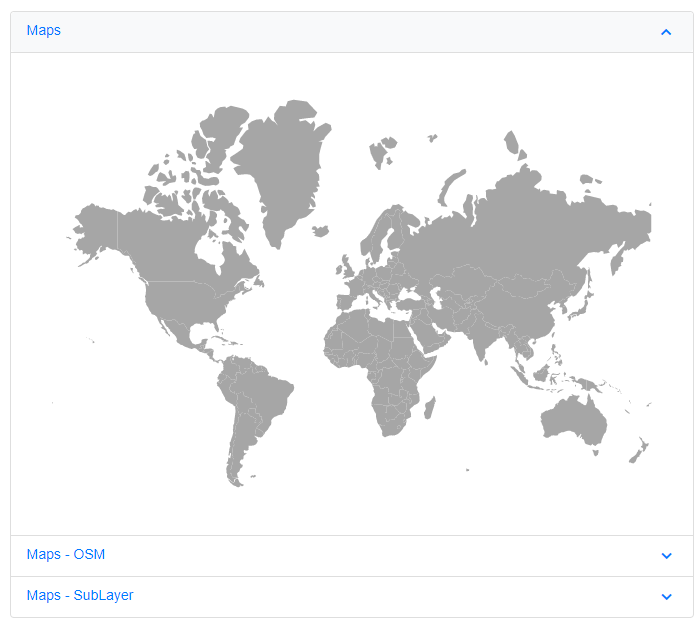

# Render Maps component inside other components

The Maps component can be rendered within other components such as Dashboard Layout, Tab, Dialog, and Accordion. Because Maps often initializes before its container finishes rendering, use a boolean flag to control when the Maps component starts rendering.

## Maps component inside Dashboard Layout

When the Maps component renders within a panel of the Dashboard Layout component, its rendering begins concurrently with the Dashboard Layout component's rendering. As a result, the size of the Maps component will not be proper. To properly render the Maps component, a boolean variable (i.e. **IsInitialRender**) must be created and it is used to determine the Maps component's rendering. The boolean variable is set to **false** by default, so the Maps component will not be rendered initially. When the Dashboard Layout component is rendered, its [Created](https://help.syncfusion.com/cr/blazor/Syncfusion.Blazor.Layouts.DashboardLayoutEvents.html#Syncfusion_Blazor_Layouts_DashboardLayoutEvents_Created) event is fired. Within this event, the `Task.Yield()` method should be called, and the boolean variable (i.e. **IsInitialRender**) should be set to **true** to initiate the rendering of the Maps component. This ensures that the Dashboard Layout component is fully rendered before the Maps component begins rendering.

When you drag and resize the Dashboard Layout panel or resize the window, the Maps component is not notified and thus may not render properly within the panel. To address this, call the Maps component's [Refresh](https://help.syncfusion.com/cr/blazor/Syncfusion.Blazor.Maps.SfMaps.html#Syncfusion_Blazor_Maps_SfMaps_Refresh) method within the Dashboard Layout's [Resizing](https://help.syncfusion.com/cr/blazor/Syncfusion.Blazor.Layouts.DashboardLayoutEvents.html#Syncfusion_Blazor_Layouts_DashboardLayoutEvents_Resizing) and [OnWindowResize](https://help.syncfusion.com/cr/blazor/Syncfusion.Blazor.Layouts.DashboardLayoutEvents.html#Syncfusion_Blazor_Layouts_DashboardLayoutEvents_OnWindowResize) events. Additionally, apply a 500-millisecond delay using a timer to refresh the Maps components after resizing is complete.

```cshtml

@using Syncfusion.Blazor.Maps
@using Syncfusion.Blazor.Layouts

<SfDashboardLayout ID="DashBoard" AllowResizing="true"  AllowFloating="true" CellSpacing="@CellSpacing" Columns="20">
<DashboardLayoutEvents Created="Created" OnWindowResize="@ResizingWindow" Resizing="@ResizingWindow"></DashboardLayoutEvents>
    <DashboardLayoutPanels>
        <DashboardLayoutPanel Id="LayoutOne" Row="0" Col="5" SizeX="5" SizeY="7">
            <HeaderTemplate><div>Maps</div></HeaderTemplate>
            <ContentTemplate>
                @if (IsInitialRender)
                {
                     <SfMaps ID="Maps" @ref="MapsOne" Height="100%">
                        <MapsLayers>
                            <MapsLayer ShapeData='new {dataOptions= "https://cdn.syncfusion.com/maps/map-data/world-map.json"}' TValue="string">
                            </MapsLayer>
                        </MapsLayers>
                      </SfMaps> 
                }
            </ContentTemplate>
        </DashboardLayoutPanel> 
        <DashboardLayoutPanel Id="LayoutTwo" Row="1" Col="5" SizeX="5" SizeY="7">
            <HeaderTemplate><div>Maps - OSM</div></HeaderTemplate>
            <ContentTemplate>
                @if (IsInitialRender)
                {
                    <SfMaps ID="OSM" @ref="MapsTwo" Height="100%">
                           <MapsLayers>
                               <MapsLayer UrlTemplate="https://tile.openstreetmap.org/level/tileX/tileY.png" TValue="string"></MapsLayer>
                           </MapsLayers>
                       </SfMaps>
                }
            </ContentTemplate>
        </DashboardLayoutPanel> 
        <DashboardLayoutPanel Id="LayoutThree" Row="2" Col="5" SizeX="5" SizeY="7">
            <HeaderTemplate><div>Maps - SubLayer</div></HeaderTemplate>
            <ContentTemplate>
                @if (IsInitialRender)
                {
                    <SfMaps ID="SubLayer" @ref="MapsThree" Height="100%">
                        <MapsLayers>
                            <MapsLayer ShapeData='new {dataOptions ="https://cdn.syncfusion.com/maps/map-data/world-map.json"}' TValue="string">
                                <MapsShapeSettings Fill="#E5E5E5">
                                    <MapsShapeBorder Color="black" Width="0.1"></MapsShapeBorder>
                                </MapsShapeSettings>
                            </MapsLayer>
                            <MapsLayer ShapeData='new {dataOptions = "https://cdn.syncfusion.com/maps/map-data/africa.json"}'
	                    	        Type="Syncfusion.Blazor.Maps.Type.SubLayer" TValue="string">
                                <MapsShapeSettings Fill="rgba(141, 206, 255, 0.6)">
                                    <MapsShapeBorder Color="#1a9cff" Width="0.25"></MapsShapeBorder>
                                </MapsShapeSettings>
                            </MapsLayer>
                        </MapsLayers>
                    </SfMaps> 
                }
            </ContentTemplate>
        </DashboardLayoutPanel> 
    </DashboardLayoutPanels>
</SfDashboardLayout>

@code {
    SfMaps MapsOne;
    SfMaps MapsTwo;
    SfMaps MapsThree;
    private Timer _resizeTimer;
    
    public double[] CellSpacing = { 10, 10 };
    public bool IsInitialRender { get; set; }

    public async void Created(Object args)
    {
        await Task.Yield();
        IsInitialRender = true;
    }

    public async Task ResizingWindow(ResizeArgs args)
    {
        if (_resizeTimer != null)
        {
            _resizeTimer.Dispose();
        }
        _resizeTimer = new Timer(async _ =>
        {
            await InvokeAsync(() =>
            {
               RefreshComponents();
            });
        }, null, 500, Timeout.Infinite);
    }

    private async Task RefreshComponents()
    {
        await Task.Yield();
        MapsOne.Refresh();
        MapsTwo.Refresh();
        MapsThree.Refresh();
    }
}

```


## Maps component inside Tab

When the Maps component renders within the Tab component, its rendering begins concurrently with the Tab component's rendering. As a result, the size of the Maps component will not be proper. To properly render the Maps component, a boolean variable (i.e. **IsInitialRender**) must be created and it is used to determine the Maps component's rendering. The boolean variable is set to **false** by default, so the Maps component will not be rendered initially. When the Tab component is rendered, its [Created](https://help.syncfusion.com/cr/blazor/Syncfusion.Blazor.Navigations.TabEvents.html#Syncfusion_Blazor_Navigations_TabEvents_Created) event is fired, and the boolean variable (i.e. **IsInitialRender**) in this event must be changed to **true** to initiate the render of the Maps component.

```cshtml

@using Syncfusion.Blazor.Navigations
@using Syncfusion.Blazor.Maps

<SfTab CssClass="default-tab">
    <TabEvents Created="Created"></TabEvents>
    <TabItems>
        <TabItem>
            <ChildContent>
                <TabHeader Text="Maps"></TabHeader>
            </ChildContent>
            <ContentTemplate>
                @if (IsInitialRender)
                {
                <SfMaps ID="Maps" Width="100%">
                    <MapsLayers>
                        <MapsLayer ShapeData='new {dataOptions= "https://cdn.syncfusion.com/maps/map-data/world-map.json"}' TValue="string">
                        </MapsLayer>
                    </MapsLayers>
                </SfMaps>                      
                }   
                </ContentTemplate>
        </TabItem>
        <TabItem>
            <ChildContent>
                <TabHeader Text="Maps - OSM"></TabHeader>
            </ChildContent>
                <ContentTemplate>
                @if (IsInitialRender)
                { 
                <SfMaps ID="OSM" Width="100%">
                    <MapsLayers>
                        <MapsLayer UrlTemplate="https://tile.openstreetmap.org/level/tileX/tileY.png" TValue="string"></MapsLayer>
                    </MapsLayers>
                </SfMaps> 
                }   
                </ContentTemplate>
        </TabItem>
        <TabItem>
            <ChildContent>
                <TabHeader Text="Maps - SubLayer"></TabHeader>
            </ChildContent>
                <ContentTemplate>
                @if (IsInitialRender)
                {
                <SfMaps ID="SubLayer" Width="100%">
                    <MapsLayers>
                        <MapsLayer ShapeData='new {dataOptions ="https://cdn.syncfusion.com/maps/map-data/world-map.json"}' TValue="string">
                            <MapsShapeSettings Fill="#E5E5E5">
                                <MapsShapeBorder Color="black" Width="0.1"></MapsShapeBorder>
                            </MapsShapeSettings>
                        </MapsLayer>
                        <MapsLayer ShapeData='new {dataOptions = "https://cdn.syncfusion.com/maps/map-data/africa.json"}'
                                Type="Syncfusion.Blazor.Maps.Type.SubLayer" TValue="string">
                            <MapsShapeSettings Fill="rgba(141, 206, 255, 0.6)">
                                <MapsShapeBorder Color="#1a9cff" Width="0.25"></MapsShapeBorder>
                            </MapsShapeSettings>
                        </MapsLayer>
                    </MapsLayers>
                </SfMaps> 
                }   
                </ContentTemplate>
        </TabItem>
    </TabItems>
</SfTab>

@code {
    public bool IsInitialRender { get; set; }

    public void Created()
    {
        IsInitialRender = true;
    }
}

```



## Maps component inside Dialog

When the Maps component renders within the Dialog component, its rendering begins concurrently with the Dialog component's rendering. As a result, the size of the Maps component will not be proper. To properly render the Maps component, a boolean variable (i.e. **IsInitialRender**) must be created and it is used to determine the Maps component's rendering. The boolean variable is set to **false** by default, so the Maps component will not be rendered initially. When the Dialog component is being opened, its [Opened](https://help.syncfusion.com/cr/blazor/Syncfusion.Blazor.Popups.DialogEvents.html#Syncfusion_Blazor_Popups_DialogEvents_Opened) event is fired, and the boolean variable (i.e. **IsInitialRender**) must be set to **true** to initiate the render of the Maps component. When the Dialog component is closed, its [Closed](https://help.syncfusion.com/cr/blazor/Syncfusion.Blazor.Popups.DialogEvents.html#Syncfusion_Blazor_Popups_DialogEvents_Closed) event is triggered, and the boolean variable (i.e. **IsInitialRender**) in this event must be changed to false.

When you drag and resize the Dialog component, the Maps component is not notified, so the Maps are not properly rendered within the Dialog. To avoid this scenario, the Maps component's `Refresh` method must be called in the Dialog's [Resizing](https://help.syncfusion.com/cr/blazor/Syncfusion.Blazor.Popups.DialogEvents.html#Syncfusion_Blazor_Popups_DialogEvents_Resizing) and [OnResizeStop](https://help.syncfusion.com/cr/blazor/Syncfusion.Blazor.Popups.DialogEvents.html#Syncfusion_Blazor_Popups_DialogEvents_OnResizeStop) events. Because the size of the Dialog is determined after a delay, a 500 millisecond delay must be provided before refreshing the Maps component.

```cshtml

@using Syncfusion.Blazor.Popups
@using Syncfusion.Blazor.Maps

<div class="col-lg-12 control-section" id="target">
    <div>
        @if (this.ShowButton)
        {
            <button class="e-btn" @onclick="@OnClicked">Open</button>
        }
    </div>
    <SfDialog ResizeHandles="@DialogResizeDirections" AllowDragging="true" Height="400px" Width="400px" EnableResize="true" ShowCloseIcon="true" @bind-Visible="Visibility">
        <DialogEvents OnResizeStop="@OnResizeStopHandler" Resizing="OnResizeStopHandler" Opened="@DialogOpen" Closed="@DialogClose"></DialogEvents>
        <DialogTemplates>
            <Header>Maps</Header>
            <Content> 
                @if(IsInitialRender)
                {
                    <SfMaps ID="Maps" @ref="Maps" Height="100%">
                        <MapsLayers>
                            <MapsLayer ShapeData='new {dataOptions= "https://cdn.syncfusion.com/maps/map-data/world-map.json"}' TValue="string">
                            </MapsLayer>
                        </MapsLayers>
                    </SfMaps> 
                }
            </Content>
        </DialogTemplates>
    </SfDialog>
</div>

<style>
    #target {
        min-height: 400px;
    }
   
</style>

@code {
    SfMaps Maps;
    public bool IsInitialRender { get; set; }
    public bool Visibility { get; set; } = true;
    public bool ShowButton { get; set; } = false;
    public ResizeDirection[] DialogResizeDirections { get; set; } = new ResizeDirection[] { ResizeDirection.All };

    public async Task OnResizeStopHandler(Microsoft.AspNetCore.Components.Web.MouseEventArgs args)
    {
        await Task.Delay(500);
        Maps.Refresh();
    }

    public void DialogOpen(Object args)
    {
       this.ShowButton = false;
       IsInitialRender = true;
    }

    private void DialogClose(Object args)
    {
        this.ShowButton = true;
        IsInitialRender = false;
    }

    private void OnClicked()
    {
        this.Visibility = true;
    }
}

```



## Maps component inside Accordion

When the Maps component renders within the Accordion component, its rendering begins concurrently with the Accordion component's rendering. As a result, the size of the Maps component will not be proper. To properly render the Maps component, a boolean variable (i.e. **IsInitialRender**) must be created and it is used to determine the Maps component's rendering. The boolean variable is set to **false** by default, so the Maps component will not be rendered initially. When the Accordion component is rendered, its [Created](https://help.syncfusion.com/cr/blazor/Syncfusion.Blazor.Navigations.AccordionEvents.html#Syncfusion_Blazor_Navigations_AccordionEvents_Created) event is fired, and the boolean variable (i.e. **IsInitialRender**) in this event must be changed to **true** to initiate the render of the Maps component.

When you expand the Accordion component, the Maps component is not notified, so the Maps are not properly rendered within the Accordion. To avoid this scenario, the Maps component's `Refresh` method must be called in the Accordion's [Expanded](https://help.syncfusion.com/cr/blazor/Syncfusion.Blazor.Navigations.AccordionEvents.html#Syncfusion_Blazor_Navigations_AccordionEvents_Expanded) event.

```cshtml

@using Syncfusion.Blazor.Maps
@using Syncfusion.Blazor.Navigations

<div class="control-section accordion-control-section">
    <SfAccordion>
        <AccordionEvents Created="Created" Expanded="Expand"></AccordionEvents>
        <AccordionItems>
            <AccordionItem Expanded="true">
                <HeaderTemplate>Maps</HeaderTemplate>
                <ContentTemplate>
                 @if (IsInitialRender)
                 {
                     <SfMaps ID="Maps" @ref="MapsOne">
                        <MapsLayers>
                            <MapsLayer ShapeData='new {dataOptions= "https://cdn.syncfusion.com/maps/map-data/world-map.json"}' TValue="string">
                            </MapsLayer>
                        </MapsLayers>
                     </SfMaps> 
                 }
                </ContentTemplate>
            </AccordionItem>
            <AccordionItem>
                <HeaderTemplate>Maps - OSM</HeaderTemplate>
                <ContentTemplate>
                    @if (IsInitialRender)
                    {
                        <SfMaps ID="OSM" @ref="MapsTwo">
                           <MapsLayers>
                               <MapsLayer UrlTemplate="https://tile.openstreetmap.org/level/tileX/tileY.png" TValue="string"></MapsLayer>
                           </MapsLayers>
                        </SfMaps>
                    }      
                </ContentTemplate>
            </AccordionItem>
            <AccordionItem>
                <HeaderTemplate>Maps - SubLayer</HeaderTemplate>
                <ContentTemplate>
                     @if (IsInitialRender)
                     {
                        <SfMaps ID="SubLayer" @ref="MapsThree">
                            <MapsLayers>
                                <MapsLayer ShapeData='new {dataOptions ="https://cdn.syncfusion.com/maps/map-data/world-map.json"}' TValue="string">
                                    <MapsShapeSettings Fill="#E5E5E5">
                                        <MapsShapeBorder Color="black" Width="0.1"></MapsShapeBorder>
                                    </MapsShapeSettings>
                                </MapsLayer>
                                <MapsLayer ShapeData='new {dataOptions = "https://cdn.syncfusion.com/maps/map-data/africa.json"}'
	                        	        Type="Syncfusion.Blazor.Maps.Type.SubLayer" TValue="string">
                                    <MapsShapeSettings Fill="rgba(141, 206, 255, 0.6)">
                                        <MapsShapeBorder Color="#1a9cff" Width="0.25"></MapsShapeBorder>
                                    </MapsShapeSettings>
                                </MapsLayer>
                            </MapsLayers>
                        </SfMaps>   
                     }   
                </ContentTemplate>
            </AccordionItem>
        </AccordionItems>
    </SfAccordion>
</div>

<style>
    @@-moz-document url-prefix() {
        .e-accordion .e-content table {
            border-collapse: initial;
        }
    }
    .e-accordion table {
        width: 100%;
    }
    #nested-accordion.e-accordion {
        padding: 4px;
    }
    .e-accordion table th,
    .e-accordion table td {
        padding: 5px;
        border: 1px solid #ddd;
    }
    .accordion-control-section {
        margin: 0 10% 0 10%;
        padding-bottom: 25px;
    }
    .source-link {
        padding-bottom: 25px;
    }
    .annotationText {
        font-size: 35px;
        width: 120px;
        text-align: center;
        margin-top: -30px;
        margin-left: -55px
    }
</style>

@code {
    SfMaps MapsOne;
    SfMaps MapsTwo;
    SfMaps MapsThree;
    public bool IsInitialRender { get; set; }
    
    public void Created()
    {
        IsInitialRender = true;
    }

    public void Expand(ExpandedEventArgs args)
    {
        if(args.Index == 0)
        {
            MapsOne.Refresh();

        } else if (args.Index == 1)
        {
            MapsTwo.Refresh();

        } else if(args.Index == 2)
        {
            MapsThree.Refresh();
        } 
    }
}

```

