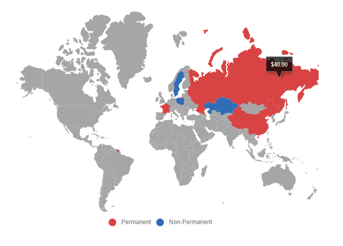

# Globalization in Blazor Maps Component

Maps provide support for internationalization for the following elements.

* Data label
* Tooltip

## Globalization

Globalization is the process of designing and developing a component that works in different cultures or locales. It can be provided to the Blazor server-side and client-side applications. Refer to [Blazor server-side](https://blazor.syncfusion.com/documentation/common/localization#enable-localization-in-blazor-server-application) and [Blazor client-side](https://blazor.syncfusion.com/documentation/common/localization#enable-localization-in-blazor-webassembly-application) sections for configuring the globalization for the Maps component. It is used to globalize number, date, time values in
Maps component using [Format](https://help.syncfusion.com/cr/blazor/Syncfusion.Blazor.Maps.SfMaps.html#Syncfusion_Blazor_Maps_SfMaps_Format) property in the Maps component.

```cshtml
@using Syncfusion.Blazor.Maps

<SfMaps Format="n0">
    <MapsLayers>
        <MapsLayer ShapeData='new {dataOptions= "https://cdn.syncfusion.com/maps/map-data/world-map.json"}' DataSource="CountryData"
                   ShapePropertyPath='new string[] {"name"}' ShapeDataPath="Country" TValue="MapDataSource" >
            <MapsShapeSettings Fill="#E5E5E5" ColorValuePath="Membership">
                <MapsShapeColorMappings>
                    <MapsShapeColorMapping Value="Permanent" Color='new string[] {"#D84444"}' />
                    <MapsShapeColorMapping Value="Non-Permanent" Color='new string[] {"#316DB5"}' />
                </MapsShapeColorMappings>
            </MapsShapeSettings>
            <MapsLayerTooltipSettings Visible="true" ValuePath="Population"></MapsLayerTooltipSettings>
        </MapsLayer>
    </MapsLayers>
</SfMaps>

@code {
    public class MapDataSource
    {
        public string Country { get; set; }
        public string Membership { get; set; }
        public double Population { get; set; }
    };
    public List<MapDataSource> CountryData = new List<MapDataSource>{
        new MapDataSource {  Country= "China", Membership= "Permanent", Population=20000 },
        new MapDataSource { Country= "France",Membership= "Permanent", Population=30000  },
        new MapDataSource { Country= "Russia",Membership= "Permanent", Population=40000 },
        new MapDataSource { Country= "Kazakhstan",Membership= "Non-Permanent", Population=50000 },
        new MapDataSource { Country= "Poland",Membership= "Non-Permanent", Population=60000 },
        new MapDataSource { Country= "Sweden",Membership= "Non-Permanent", Population=70000 }
    };
}
```


## Numeric Format

The numeric formats such as currency, percentage and so on can be displayed in the tooltip and data labels of the Maps using the [Format](https://help.syncfusion.com/cr/blazor/Syncfusion.Blazor.Maps.SfMaps.html#Syncfusion_Blazor_Maps_SfMaps_Format) property in the [SfMaps](https://help.syncfusion.com/cr/blazor/Syncfusion.Blazor.Maps.SfMaps.html) class. In the following example, the tooltip is globalized to **German** culture. When setting the [EnableGroupingSeparator](https://help.syncfusion.com/cr/blazor/Syncfusion.Blazor.Maps.SfMaps.html#Syncfusion_Blazor_Maps_SfMaps_EnableGroupingSeparator) property as **true**, the numeric text in the Maps separates with the comma separator.

```cshtml
@using Syncfusion.Blazor.Maps

<SfMaps Format="c" EnableGroupingSeparator="true">
    <MapsLayers>
        <MapsLayer ShapeData='new {dataOptions= "https://cdn.syncfusion.com/maps/map-data/world-map.json"}'
                   DataSource="CountryData" ShapePropertyPath='new string[] {"name"}' ShapeDataPath="Country" TValue="MapDataSource" >
            <MapsShapeSettings Fill="#E5E5E5" ColorValuePath="Membership">
                <MapsShapeColorMappings>
                    <MapsShapeColorMapping Value="Permanent" Color='new string[] {"#D84444"}' />
                    <MapsShapeColorMapping Value="Non-Permanent" Color='new string[] {"#316DB5"}' />
                </MapsShapeColorMappings>
            </MapsShapeSettings>
            <MapsLayerTooltipSettings Visible="true" ValuePath="Population"></MapsLayerTooltipSettings>
        </MapsLayer>
    </MapsLayers>
</SfMaps>

@code {
    public class MapDataSource
    {
        public string Country { get; set; }
        public string Membership { get; set; }
        public double Population { get; set; }
    };
    public List<MapDataSource> CountryData = new List<MapDataSource>{
        new MapDataSource { Country= "China", Membership= "Permanent", Population= 38332521},
        new MapDataSource { Country= "France", Membership= "Permanent", Population= 19651127 },
        new MapDataSource { Country= "Russia", Membership= "Permanent", Population= 3090416},
        new MapDataSource { Country= "Kazakhstan", Membership= "Non-Permanent", Population= 1232521},
        new MapDataSource { Country= "Poland", Membership= "Non-Permanent", Population= 90332521},
        new MapDataSource { Country= "Sweden", Membership= "Non-Permanent", Population= 383521}
    };
}
```



## See also

* [Localization in Blazor Maps component](https://blazor.syncfusion.com/documentation/maps/localization)