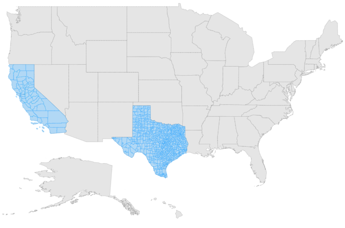
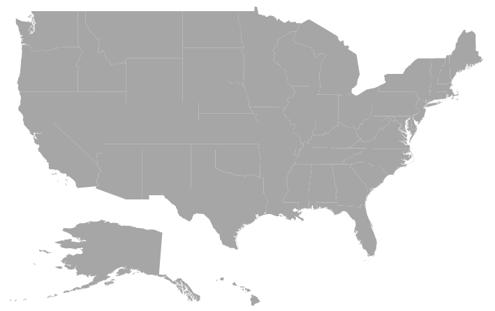

# Layers in Blazor Maps Component

The Maps component is rendered through [MapsLayers](https://help.syncfusion.com/cr/blazor/Syncfusion.Blazor.Maps.MapsLayers.html) and any number of layers can be added to the Maps.

## Multilayer

The Multilayer support allows loading multiple shape files and map providers in a single container, enabling Maps to display more information. The shape layer or map providers are the main layers of the Maps. Multiple layers can be added as **SubLayer** over the main layers using the [Type](https://help.syncfusion.com/cr/blazor/Syncfusion.Blazor.Maps.Type.html) property in [MapsLayer](https://help.syncfusion.com/cr/blazor/Syncfusion.Blazor.Maps.MapsLayer-1.html).

## Sublayer

Sublayer is a type of shape file layer. It allows loading multiple shape files in a single map view. For example, a sublayer can be added over the main layer to view the geographic features such as rivers, valleys and cities in a map of a country. Similar to the main layer, elements in the Maps such as markers, bubbles, color mapping and legends can be added to the sub-layer.

In this example, the United States map shape is used as shape data by utilizing **usa.ts** file, and **texas.ts** and **california.ts** files are used as sub-layers in the United States map.

```csharp
@using Syncfusion.Blazor.Maps

<SfMaps>
    <MapsLayers>
        <MapsLayer ShapeData='new {dataOptions ="https://cdn.syncfusion.com/maps/map-data/usa.json"}' TValue="string">
            <MapsShapeSettings Fill="#E5E5E5">
                <MapsShapeBorder Color="black" Width="0.1"></MapsShapeBorder>
            </MapsShapeSettings>
        </MapsLayer>
        <MapsLayer ShapeData='new {dataOptions = "https://cdn.syncfusion.com/maps/map-data/texas.json"}'
		        Type="Syncfusion.Blazor.Maps.Type.SubLayer" TValue="string">
            <MapsShapeSettings Fill="rgba(141, 206, 255, 0.6)">
                <MapsShapeBorder Color="#1a9cff" Width="0.25"></MapsShapeBorder>
            </MapsShapeSettings>
        </MapsLayer>
        <MapsLayer ShapeData='new {dataOptions= "https://cdn.syncfusion.com/maps/map-data/california.json"}'
		        Type="Syncfusion.Blazor.Maps.Type.SubLayer" TValue="string">
            <MapsShapeSettings Fill="rgba(141, 206, 255, 0.6)">
                <MapsShapeBorder Color="#1a9cff" Width="0.25"></MapsShapeBorder>
            </MapsShapeSettings>
        </MapsLayer>
    </MapsLayers>
</SfMaps>
```



## Displaying different layer in the view

Multiple shape files and map providers can be loaded simultaneously in Maps. The [BaseLayerIndex](https://help.syncfusion.com/cr/blazor/Syncfusion.Blazor.Maps.SfMaps.html#Syncfusion_Blazor_Maps_SfMaps_BaseLayerIndex) property is used to determine which layer on the user interface should be displayed. This property is used for the Maps drill-down feature, so when the [BaseLayerIndex](https://help.syncfusion.com/cr/blazor/Syncfusion.Blazor.Maps.SfMaps.html#Syncfusion_Blazor_Maps_SfMaps_BaseLayerIndex) value is changed, the corresponding shape is loaded. In this example, two layers can be loaded with the World map and the United States map. Based on the given [BaseLayerIndex](https://help.syncfusion.com/cr/blazor/Syncfusion.Blazor.Maps.SfMaps.html#Syncfusion_Blazor_Maps_SfMaps_BaseLayerIndex) value the corresponding shape will be loaded in the user interface. If the [BaseLayerIndex](https://help.syncfusion.com/cr/blazor/Syncfusion.Blazor.Maps.SfMaps.html#Syncfusion_Blazor_Maps_SfMaps_BaseLayerIndex) value is set to **0**, then the world map will be loaded.

```csharp
@using Syncfusion.Blazor.Maps

@*  To switch the layer, set `BaseLayerIndex`  *@
<SfMaps BaseLayerIndex="1">
    <MapsLayers>
        <MapsLayer ShapeData='new { dataOptions = "https://cdn.syncfusion.com/maps/map-data/world-map.json" }' TValue="string"/>
        <MapsLayer ShapeData='new { dataOptions = "https://cdn.syncfusion.com/maps/map-data/usa.json" }'TValue="string"/>
    </MapsLayers>
</SfMaps>
```



## Rendering custom shapes

Custom shapes (also known as custom maps) can be rendered in Maps to represent bus seat booking, cricket stadium, basic home plan/sketch, and so on. To accomplish this, a JSON file in GeoJSON format with proper geometries must be created manually or with the assistance of any online map vendor. The GeoJSON file created must be set to the [ShapeData](https://help.syncfusion.com/cr/blazor/Syncfusion.Blazor.Maps.MapsLayer-1.html#Syncfusion_Blazor_Maps_MapsLayer_1_ShapeData) in the Maps layer, and the [GeometryType](https://help.syncfusion.com/cr/blazor/Syncfusion.Blazor.Maps.MapsLayer-1.html#Syncfusion_Blazor_Maps_MapsLayer_1_GeometryType) must be set as **GeometryType.Normal**.

Please refer this [link](https://cdn.syncfusion.com/maps/map-data/seat.json) for an example GeoJSON file containing information about bus seat selection.

Please refer this [link](https://blazor.syncfusion.com/demos/maps/bus-seat-selection?theme=bootstrap5) for more information and a live demonstration.

## See also

* [Display geometry shapes in Bing maps](how-to/display-geometry-shapes-in-bing-maps)
