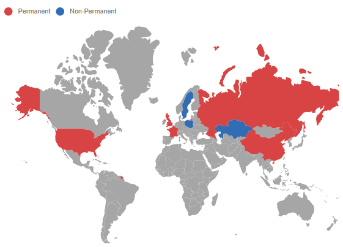
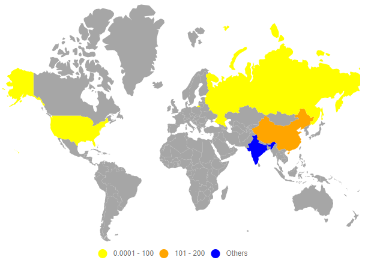
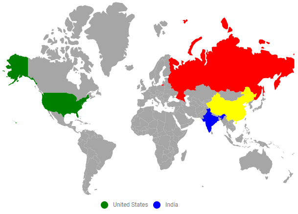

# Legend in Blazor Maps Component

A legend visually explains the symbols used on Maps. It uses colors, shapes, or other identifiers based on the data and helps interpret what the Maps display. Enable legends by setting the [Visible](https://help.syncfusion.com/cr/blazor/Syncfusion.Blazor.Maps.MapsLegendSettings.html#Syncfusion_Blazor_Maps_MapsLegendSettings_Visible) property of [MapsLegendSettings](https://help.syncfusion.com/cr/blazor/Syncfusion.Blazor.Maps.MapsLegendSettings.html) to **true**.

## Modes of legend

Legends support two modes.
1. [**Default**](https://help.syncfusion.com/cr/blazor/Syncfusion.Blazor.Maps.LegendMode.html#Syncfusion_Blazor_Maps_LegendMode_Default) mode
2. [**Interactive**](https://help.syncfusion.com/cr/blazor/Syncfusion.Blazor.Maps.LegendMode.html#Syncfusion_Blazor_Maps_LegendMode_Interactive) mode

### Default mode

Default mode shows symbols with legend labels that identify the color of a shape, bubble, or marker. Enable it by setting the [Mode](https://help.syncfusion.com/cr/blazor/Syncfusion.Blazor.Maps.MapsLegendSettings.html#Syncfusion_Blazor_Maps_MapsLegendSettings_Mode) property of [MapsLegendSettings](https://help.syncfusion.com/cr/blazor/Syncfusion.Blazor.Maps.MapsLegendSettings.html) to **Default**.

### Interactive mode

Interactive legends display an arrow pointer indicating the exact range color when hovering over corresponding shapes. Enable this by setting the [Mode](https://help.syncfusion.com/cr/blazor/Syncfusion.Blazor.Maps.MapsLegendSettings.html#Syncfusion_Blazor_Maps_MapsLegendSettings_Mode) property of [MapsLegendSettings](https://help.syncfusion.com/cr/blazor/Syncfusion.Blazor.Maps.MapsLegendSettings.html) to **Interactive**. Use the [InvertedPointer](https://help.syncfusion.com/cr/blazor/Syncfusion.Blazor.Maps.MapsLegendSettings.html#Syncfusion_Blazor_Maps_MapsLegendSettings_InvertedPointer) property to show or hide the inverted pointer in interactive legends.

```cshtml

@using Syncfusion.Blazor.Maps

<SfMaps>
    @*  To set legend mode as interactive  *@
    <MapsLegendSettings Visible="true" Mode="LegendMode.Interactive" InvertedPointer="true">
    </MapsLegendSettings>
    <MapsLayers>
        <MapsLayer ShapeData='new {dataOptions ="https://cdn.syncfusion.com/maps/map-data/world-map.json"}' TValue="UNCouncilCountry"
                   DataSource="SecurityCouncilDetails" ShapePropertyPath='new string[] {"name"}' ShapeDataPath="Name">
            <MapsShapeSettings ColorValuePath="Membership">
                <MapsShapeColorMappings>
                    <MapsShapeColorMapping Value="Permanent" Color='new string[] {"#D84444"}' />
                    <MapsShapeColorMapping Value="Non-Permanent" Color='new string[] {"#316DB5"}' />
                </MapsShapeColorMappings>
            </MapsShapeSettings>
        </MapsLayer>
    </MapsLayers>
</SfMaps>

@code {
    private List<UNCouncilCountry> SecurityCouncilDetails = new List<UNCouncilCountry>{
         new UNCouncilCountry { Name  "China", Membership = "Permanent" },
         new UNCouncilCountry { Name = "France", Membership = "Permanent" },
         new UNCouncilCountry { Name = "Russia", Membership = "Permanent" },
         new UNCouncilCountry { Name = "Kazakhstan", Membership = "Non-Permanent" },
         new UNCouncilCountry { Name = "Poland", Membership = "Non-Permanent" },
         new UNCouncilCountry { Name = "Sweden", Membership = "Non-Permanent" },
         new UNCouncilCountry { Name = "United Kingdom", Membership = "Permanent" },
         new UNCouncilCountry { Name = "United States", Membership = "Permanent" }
    };

    public class UNCouncilCountry
    {
        public string Name { get; set; }
        public string Membership { get; set; }
    }
}

```


## Positioning of the legend

The legend can be positioned in two ways:

* Absolute position
* Dock position

<b>Absolute position</b>

Position the legend using the [X](https://help.syncfusion.com/cr/blazor/Syncfusion.Blazor.Maps.MapsLegendSettings.html#Syncfusion_Blazor_Maps_MapsLegendSettings_X) and [Y](https://help.syncfusion.com/cr/blazor/Syncfusion.Blazor.Maps.MapsLegendSettings.html#Syncfusion_Blazor_Maps_MapsLegendSettings_Y) properties in [MapsLegendSettings](https://help.syncfusion.com/cr/blazor/Syncfusion.Blazor.Maps.MapsLegendSettings.html). To position the legend based on coordinates relative to Maps, set [Position](https://help.syncfusion.com/cr/blazor/Syncfusion.Blazor.Maps.MapsLegendSettings.html#Syncfusion_Blazor_Maps_MapsLegendSettings_Position) to **Float**.

<b>Dock position</b>

Legends can be docked within the container using the [Position](https://help.syncfusion.com/cr/blazor/Syncfusion.Blazor.Maps.MapsLegendSettings.html#Syncfusion_Blazor_Maps_MapsLegendSettings_Position) property in [MapsLegendSettings](https://help.syncfusion.com/cr/blazor/Syncfusion.Blazor.Maps.MapsLegendSettings.html) at the following locations:

* Top
* Left
* Bottom
* Right

These positions can be aligned using **Near**, **Center**, or **Far** with the [Alignment](https://help.syncfusion.com/cr/blazor/Syncfusion.Blazor.Maps.Alignment.html) property in [MapsLegendSettings](https://help.syncfusion.com/cr/blazor/Syncfusion.Blazor.Maps.MapsLegendSettings.html), providing 12 alignment combinations.

```cshtml

@using Syncfusion.Blazor.Maps

<SfMaps>
    @*  To position the legend  *@
    <MapsLegendSettings Visible="true" Position="LegendPosition.Top" Alignment="Alignment.Near">
    </MapsLegendSettings>
    <MapsLayers>
        <MapsLayer ShapeData='new {dataOptions ="https://cdn.syncfusion.com/maps/map-data/world-map.json"}' ShapeDataPath="Name"
                   DataSource="SecurityCouncilDetails" ShapePropertyPath='new string[] {"name"}' TValue="UNCouncilCountry">
            <MapsShapeSettings ColorValuePath="Membership">
                <MapsShapeColorMappings>
                    <MapsShapeColorMapping Value="Permanent" Color='new string[] {"#D84444"}' />
                    <MapsShapeColorMapping Value="Non-Permanent" Color='new string[] {"#316DB5"}' />
                </MapsShapeColorMappings>
            </MapsShapeSettings>
        </MapsLayer>
    </MapsLayers>
</SfMaps>

```

N> Refer [code block](#legend-mode) to know the property value of `securityCouncilDetails`.



## Legend for shapes

Legends for shapes can be generated from equal, range, and desaturation color mappings.

The following code demonstrates equal color mapping legends for shapes. To bind the **MembershipDetails** data to the [DataSource](https://help.syncfusion.com/cr/blazor/Syncfusion.Blazor.Maps.MapsLayer-1.html#Syncfusion_Blazor_Maps_MapsLayer_1_DataSource) property of [MapsLayer](https://help.syncfusion.com/cr/blazor/Syncfusion.Blazor.Maps.MapsLayer-1.html), set [ShapePropertyPath](https://help.syncfusion.com/cr/blazor/Syncfusion.Blazor.Maps.MapsLayer-1.html#Syncfusion_Blazor_Maps_MapsLayer_1_ShapePropertyPath) to **name** and [ShapeDataPath](https://help.syncfusion.com/cr/blazor/Syncfusion.Blazor.Maps.MapsLayer-1.html#Syncfusion_Blazor_Maps_MapsLayer_1_ShapeDataPath) to **Country**. To enable equal color mapping, configure [MapsShapeColorMapping](https://help.syncfusion.com/cr/blazor/Syncfusion.Blazor.Maps.MapsShapeColorMapping.html) in [MapsShapeSettings](https://help.syncfusion.com/cr/blazor/Syncfusion.Blazor.Maps.MapsShapeSettings.html). Finally, set the [Visible](https://help.syncfusion.com/cr/blazor/Syncfusion.Blazor.Maps.MapsLegendSettings.html#Syncfusion_Blazor_Maps_MapsLegendSettings_Visible) property of [MapsLegendSettings](https://help.syncfusion.com/cr/blazor/Syncfusion.Blazor.Maps.MapsLegendSettings.html) to **true**. Use the [Label](https://help.syncfusion.com/cr/blazor/Syncfusion.Blazor.Maps.MapsColorMapping.html#Syncfusion_Blazor_Maps_MapsColorMapping_Label) property in [MapsColorMapping](https://help.syncfusion.com/cr/blazor/Syncfusion.Blazor.Maps.MapsColorMapping.html#Syncfusion_Blazor_Maps_MapsColorMapping_Label) to set legend text.

```cshtml

@using Syncfusion.Blazor.Maps

<SfMaps>
    <MapsLegendSettings Visible="true">
    </MapsLegendSettings>
    <MapsLayers>
        <MapsLayer ShapeData='new {dataOptions ="https://cdn.syncfusion.com/maps/map-data/world-map.json"}' ShapeDataPath="Country"
                   DataSource="MembershipDetails" ShapePropertyPath='new string[] {"name"}' TValue="UNCouncil">
            <MapsShapeSettings ColorValuePath="Membership" >
                <MapsShapeColorMappings>
                    <MapsShapeColorMapping Value="Permanent" Color='new string[] {"#D84444"}' />
                    <MapsShapeColorMapping Value="Non-Permanent" Color='new string[] {"#316DB5"}' />
                </MapsShapeColorMappings>
            </MapsShapeSettings>
        </MapsLayer>
    </MapsLayers>
</SfMaps>

@code {
    public class UNCouncil
    {
        public string Country { get; set; }
        public string Membership { get; set; }
    }

    private List<UNCouncil> MembershipDetails = new List<UNCouncil> {
        new UNCouncil { Country = "China", Membership = "Permanent" },
        new UNCouncil { Country = "France", Membership = "Permanent" },
        new UNCouncil { Country = "Russia", Membership = "Permanent" },
        new UNCouncil { Country = "Kazakhstan", Membership = "Non-Permanent" },
        new UNCouncil { Country = "Poland", Membership = "Non-Permanent" },
        new UNCouncil { Country = "Sweden", Membership = "Non-Permanent" }
    };
}

```


### Legend shape

Maps supports the following legend shapes. Use the [Shape](https://help.syncfusion.com/cr/blazor/Syncfusion.Blazor.Maps.MapsLegendSettings.html#Syncfusion_Blazor_Maps_MapsLegendSettings_Shape) property in [MapsLegendSettings](https://help.syncfusion.com/cr/blazor/Syncfusion.Blazor.Maps.MapsLegendSettings.html) to change the legend shape.

* Circle
* Rectangle
* Triangle
* Diamond
* Cross
* Star
* HorizontalLine
* VerticalLine
* Pentagon
* InvertedTriangle

Customize legend shapes using [ShapeHeight](https://help.syncfusion.com/cr/blazor/Syncfusion.Blazor.Maps.MapsLegendSettings.html#Syncfusion_Blazor_Maps_MapsLegendSettings_ShapeHeight), [ShapeWidth](https://help.syncfusion.com/cr/blazor/Syncfusion.Blazor.Maps.MapsLegendSettings.html#Syncfusion_Blazor_Maps_MapsLegendSettings_ShapeWidth), [ShapePadding](https://help.syncfusion.com/cr/blazor/Syncfusion.Blazor.Maps.MapsLegendSettings.html#Syncfusion_Blazor_Maps_MapsLegendSettings_ShapePadding) properties and [MapsLegendShapeBorder](https://help.syncfusion.com/cr/blazor/Syncfusion.Blazor.Maps.MapsLegendShapeBorder.html).

### Customization

Use the following properties and classes to customize the legend and legend text in Maps.

* [Background](https://help.syncfusion.com/cr/blazor/Syncfusion.Blazor.Maps.MapsLegendSettings.html#Syncfusion_Blazor_Maps_MapsLegendSettings_Background) - Sets the legend background color.
* [MapsLegendBorder](https://help.syncfusion.com/cr/blazor/Syncfusion.Blazor.Maps.MapsLegendBorder.html) - Configures the legend border color and width.
* [Fill](https://help.syncfusion.com/cr/blazor/Syncfusion.Blazor.Maps.MapsLegendSettings.html#Syncfusion_Blazor_Maps_MapsLegendSettings_Fill) - Applies a color to the legend.
* [LabelDisplayMode](https://help.syncfusion.com/cr/blazor/Syncfusion.Blazor.Maps.MapsLegendSettings.html#Syncfusion_Blazor_Maps_MapsLegendSettings_LabelDisplayMode) - Controls how legend text is displayed.
* [LabelPosition](https://help.syncfusion.com/cr/blazor/Syncfusion.Blazor.Maps.MapsLegendSettings.html#Syncfusion_Blazor_Maps_MapsLegendSettings_LabelPosition) - Positions legend text.
* [Orientation](https://help.syncfusion.com/cr/blazor/Syncfusion.Blazor.Maps.MapsLegendSettings.html#Syncfusion_Blazor_Maps_MapsLegendSettings_Orientation) - Sets the legend orientation.
* [MapsLegendTextStyle](https://help.syncfusion.com/cr/blazor/Syncfusion.Blazor.Maps.MapsLegendTextStyle.html) - Customizes legend text style.
* [MapsLegendTitle](https://help.syncfusion.com/cr/blazor/Syncfusion.Blazor.Maps.MapsLegendTitle.html) - Adds a legend title.
* [MapsLegendTitleStyle](https://help.syncfusion.com/cr/blazor/Syncfusion.Blazor.Maps.MapsLegendTitleStyle.html) - Customizes the legend title style.
* [Height](https://help.syncfusion.com/cr/blazor/Syncfusion.Blazor.Maps.MapsLegendSettings.html#Syncfusion_Blazor_Maps_MapsLegendSettings_Height) - Sets the legend height.
* [Width](https://help.syncfusion.com/cr/blazor/Syncfusion.Blazor.Maps.MapsLegendSettings.html#Syncfusion_Blazor_Maps_MapsLegendSettings_Width) - Sets the legend width.
* [Opacity](https://help.syncfusion.com/cr/blazor/Syncfusion.Blazor.Maps.MapsLegendSettings.html#Syncfusion_Blazor_Maps_MapsLegendSettings_Opacity) - Applies opacity to the legend.

```cshtml

@using Syncfusion.Blazor.Maps

<SfMaps>
    @*  To customize the legend  *@
    <MapsLegendSettings Visible="true" Shape="Syncfusion.Blazor.Maps.LegendShape.Star" ShapeHeight="30" ShapeWidth="30" ShapePadding="10">
        <MapsLegendShapeBorder Color="blue" Width="0.5">
        </MapsLegendShapeBorder>
    </MapsLegendSettings>
    <MapsLayers>
        <MapsLayer ShapeData='new {dataOptions ="https://cdn.syncfusion.com/maps/map-data/world-map.json"}' ShapeDataPath="Country"
                   DataSource="MemberShipDetails" ShapePropertyPath='new string[] {"name"}' TValue="UNCouncil">
            <MapsShapeSettings ColorValuePath="Membership">
                <MapsShapeColorMappings>
                    <MapsShapeColorMapping Value="Permanent" Color='new string[] {"#D84444"}' />
                    <MapsShapeColorMapping Value="Non-Permanent" Color='new string[] {"#316DB5"}' />
                </MapsShapeColorMappings>
            </MapsShapeSettings>
        </MapsLayer>
    </MapsLayers>
</SfMaps>

@code {
    public class UNCouncil
    {
        public string Country { get; set; }
        public string Membership { get; set; }
    }

    private List<UNCouncil> MemberShipDetails = new List<UNCouncil>
    {
        new UNCouncil { Country = "China", Membership = "Permanent" },
        new UNCouncil { Country = "France", Membership = "Permanent" },
        new UNCouncil { Country = "Russia", Membership = "Permanent" },
        new UNCouncil { Country = "Kazakhstan", Membership = "Non-Permanent" },
        new UNCouncil { Country = "Poland", Membership = "Non-Permanent" },
        new UNCouncil { Country = "Sweden", Membership = "Non-Permanent" }
    };
}

```


### Legend for items excluded from color mapping

Enable legends for items excluded from color mapping using the [Color](https://help.syncfusion.com/cr/blazor/Syncfusion.Blazor.Maps.MapsColorMapping.html#Syncfusion_Blazor_Maps_MapsColorMapping_Color) property in [MapsShapeColorMapping](https://help.syncfusion.com/cr/blazor/Syncfusion.Blazor.Maps.MapsShapeColorMapping.html).

In the following example, color mapping is defined for ranges from **0** to **200**. Records outside this range do not receive color mapping. To color those excluded items, set only the [Color](https://help.syncfusion.com/cr/blazor/Syncfusion.Blazor.Maps.MapsColorMapping.html#Syncfusion_Blazor_Maps_MapsColorMapping_Color) property in [MapsShapeColorMapping](https://help.syncfusion.com/cr/blazor/Syncfusion.Blazor.Maps.MapsShapeColorMapping.html). To enable legends for these items, set the [Visible](https://help.syncfusion.com/cr/blazor/Syncfusion.Blazor.Maps.MapsLegendSettings.html#Syncfusion_Blazor_Maps_MapsLegendSettings_Visible) property of [MapsLegendSettings](https://help.syncfusion.com/cr/blazor/Syncfusion.Blazor.Maps.MapsLegendSettings.html) to **true**.

```cshtml

@using Syncfusion.Blazor.Maps

<SfMaps>
    <MapsLegendSettings Visible="true"></MapsLegendSettings>
    <MapsLayers>
        <MapsLayer ShapeData='new {dataOptions ="https://cdn.syncfusion.com/maps/map-data/world-map.json"}' ShapeDataPath="Name"
                   DataSource="populationDetails" ShapePropertyPath='new string[] {"name"}' TValue="PopulationDetail">
            <MapsShapeSettings ColorValuePath="Density">
                <MapsShapeColorMappings>
                    <MapsShapeColorMapping StartRange="0.0001" EndRange="100" Color='new string[] {"yellow"}' />
                    <MapsShapeColorMapping StartRange="101" EndRange="200" Color='new string[] {"orange"}' />
                    <MapsShapeColorMapping Color='new string[] {"blue"}' />
                </MapsShapeColorMappings>
            </MapsShapeSettings>
        </MapsLayer>
    </MapsLayers>
</SfMaps>

@code {
    public class PopulationDetail
    {
        public string Name { get; set; }
        public double Population { get; set; }
        public double Density { get; set; }
    }

    private List<PopulationDetail> populationDetails = new List<PopulationDetail> {
        new PopulationDetail
        {
            Name ="United States", Population = 325020000, Density = 33
        },
        new PopulationDetail
        {
            Name = "Russia", Population = 142905208, Density = 8.3
        },
        new PopulationDetail
        {
            Name="India", Population=1198003000, Density=364
        },
        new PopulationDetail
        {
            Name="China", Population=1389750000, Density=144
        }
    };
}

```



### Hiding desired legend items

Use the [ShowLegend](https://help.syncfusion.com/cr/blazor/Syncfusion.Blazor.Maps.MapsColorMapping.html#Syncfusion_Blazor_Maps_MapsColorMapping_ShowLegend) property in [MapsShapeColorMapping](https://help.syncfusion.com/cr/aspnetcore-blazor/Syncfusion.Blazor.Maps.MapsShapeColorMapping.html) to show or hide legend items. If [ShowLegend](https://help.syncfusion.com/cr/blazor/Syncfusion.Blazor.Maps.MapsColorMapping.html#Syncfusion_Blazor_Maps_MapsColorMapping_ShowLegend) is set to **false**, the legend item is hidden. Otherwise, it is visible.

```cshtml

@using Syncfusion.Blazor.Maps

<SfMaps>
    <MapsLegendSettings Visible="true"></MapsLegendSettings>
    <MapsLayers>
        <MapsLayer ShapeData='new {dataOptions ="https://cdn.syncfusion.com/maps/map-data/world-map.json"}' ShapeDataPath="Name"
                   DataSource="populationDetails" ShapePropertyPath='new string[] {"name"}' TValue="PopulationDetail">
            <MapsShapeSettings ColorValuePath="Density">
                <MapsShapeColorMappings>
                    <MapsShapeColorMapping StartRange="0.0001" EndRange="100" Color='new string[] {"yellow"}' ShowLegend="true" />
                    @*  hide legend for this range  *@
                    <MapsShapeColorMapping StartRange="101" EndRange="200" Color='new string[] {"orange"}' ShowLegend="false" />
                    <MapsShapeColorMapping Color='new string[] {"blue"}' ShowLegend="true" />
                </MapsShapeColorMappings>
            </MapsShapeSettings>
        </MapsLayer>
    </MapsLayers>
</SfMaps>

```

N> Refer [code block](#legend-for-items-excluded-from-color-mapping) to know the property value of `PopulationDetails`.


### Hide legend items based on data source value

Legend item visibility can be driven by boolean values in the data source. Bind the field that contains the visibility state to the [ShowLegendPath](https://help.syncfusion.com/cr/blazor/Syncfusion.Blazor.Maps.MapsLegendSettings.html#Syncfusion_Blazor_Maps_MapsLegendSettings_ShowLegendPath) property of [MapsLegendSettings](https://help.syncfusion.com/cr/blazor/Syncfusion.Blazor.Maps.MapsLegendSettings.html).

```cshtml

@using Syncfusion.Blazor.Maps

<SfMaps>
    @*  To hide legend based in data source fields  *@
    <MapsLegendSettings Visible="true" ShowLegendPath="LegendVisibility"/>
    <MapsLayers>
        <MapsLayer ShapeData='new {dataOptions ="https://cdn.syncfusion.com/maps/map-data/world-map.json"}' ShapeDataPath="Name"
                   DataSource="populationDetails" ShapePropertyPath='new string[] {"name"}' TValue="PopulationDetail">
            <MapsShapeSettings ColorValuePath="Color"> </MapsShapeSettings>
        </MapsLayer>
    </MapsLayers>
</SfMaps>

@code {
    public class PopulationDetail
    {
        public string Name { get; set; }
        public double Population { get; set; }
        public double Density { get; set; }
        public bool LegendVisibility { get; set; }
        public string Color { get; set; }
    }

    private List<PopulationDetail> populationDetails = new List<PopulationDetail> {
        new PopulationDetail
        {
            Name = "United States", Population = 325020000, Density = 33, LegendVisibility = true, Color = "green"
        },
        new PopulationDetail
        {
            Name = "Russia", Population = 142905208, Density = 8.3, LegendVisibility = false, Color = "red"
        },
        new PopulationDetail
        {
            Name = "India", Population = 1198003000, Density = 364, LegendVisibility = true, Color = "blue"
        },
        new PopulationDetail
        {
            Name = "China", Population = 1389750000, Density = 144, LegendVisibility = false, Color = "orange"
        }
    };
}

```



### Binding legend item text from data source

Display legend text based on values in the data source by using the [ValuePath](https://help.syncfusion.com/cr/blazor/Syncfusion.Blazor.Maps.MapsLegendSettings.html#Syncfusion_Blazor_Maps_MapsLegendSettings_ValuePath) property in [MapsLegendSettings](https://help.syncfusion.com/cr/blazor/Syncfusion.Blazor.Maps.MapsLegendSettings.html).

```cshtml

@using Syncfusion.Blazor.Maps

<SfMaps>
    <MapsLegendSettings Visible="true" ValuePath="Color"></MapsLegendSettings>
    <MapsLayers>
        <MapsLayer ShapeData='new {dataOptions ="https://cdn.syncfusion.com/maps/map-data/world-map.json"}' ShapeDataPath="Name"
                   DataSource="PopulationDetails" ShapePropertyPath='new string[] {"name"}' TValue="PopulationDetail">
            <MapsShapeSettings ColorValuePath="Color"> </MapsShapeSettings>
        </MapsLayer>
    </MapsLayers>
</SfMaps>

@code {
    public class PopulationDetail
    {
        public string Name { get; set; }
        public double Population { get; set; }
        public double Density { get; set; }
        public string Color { get; set; }
    }

    private List<PopulationDetail> PopulationDetails = new List<PopulationDetail> {
        new PopulationDetail
        {
            Name = "United States", Population = 325020000, Density = 33, Color = "yellow"
        },
        new PopulationDetail
        {
            Name = "Russia", Population = 142905208, Density = 8.3, Color = "red"
        },
        new PopulationDetail
        {
            Name = "India", Population = 1198003000, Density = 364, Color = "blue"
        },
        new PopulationDetail
        {
            Name = "China", Population = 1389750000, Density = 144, Color = "orange"
        }
    };
}

```


### Hiding duplicate legend items

To hide duplicate legend items, set [RemoveDuplicateLegend](https://help.syncfusion.com/cr/blazor/Syncfusion.Blazor.Maps.MapsLegendSettings.html#Syncfusion_Blazor_Maps_MapsLegendSettings_RemoveDuplicateLegend) property to **true** in [MapsLegendSettings](https://help.syncfusion.com/cr/blazor/Syncfusion.Blazor.Maps.MapsLegendSettings.html).

```cshtml

@using Syncfusion.Blazor.Maps

<SfMaps>
    <MapsLegendSettings Visible="true" RemoveDuplicateLegend="true"></MapsLegendSettings>
    <MapsLayers>
        <MapsLayer ShapeData='new {dataOptions ="https://cdn.syncfusion.com/maps/map-data/world-map.json"}' ShapeDataPath="Name"
                   DataSource="populationDetails" TValue="PopulationDetail" ShapePropertyPath='new string[] {"name"}'>
            <MapsShapeSettings ColorValuePath="Color"> </MapsShapeSettings>
        </MapsLayer>
    </MapsLayers>
</SfMaps>

@code {
    public class PopulationDetail
    {
        public string Name { get; set; }
        public double Population { get; set; }
        public double Density { get; set; }
        public string Color { get; set; }
    }

    private List<PopulationDetail> populationDetails = new List<PopulationDetail> {
        new PopulationDetail
        {
            Name = "United States", Population = 325020000, Density = 33, Color = "yellow"
        },
        new PopulationDetail
        {
            Name = "United States", Population = 325020000, Density = 33, Color = "yellow"
        },
        new PopulationDetail
        {
            Name = "India", Population = 1198003000, Density = 364, Color = "blue"
        },
        new PopulationDetail
        {
            Name = "China", Population = 1389750000, Density = 144, Color = "orange"
        }
    };
}

```


### Toggle option in legend

A toggle option is available for legends. When toggled, the specified color is applied to the corresponding Maps shape item. To enable toggle behavior, set the [Enable](https://help.syncfusion.com/cr/blazor/Syncfusion.Blazor.Maps.MapsToggleLegendSettings.html#Syncfusion_Blazor_Maps_MapsToggleLegendSettings_Enable) property of [MapsToggleLegendSettings](https://help.syncfusion.com/cr/blazor/Syncfusion.Blazor.Maps.MapsToggleLegendSettings.html) to **true**.

The following properties and components customize the toggle option:

* [ApplyShapeSettings](https://help.syncfusion.com/cr/blazor/Syncfusion.Blazor.Maps.MapsToggleLegendSettings.html#Syncfusion_Blazor_Maps_MapsToggleLegendSettings_ApplyShapeSettings) – Applies the [Fill](https://help.syncfusion.com/cr/blazor/Syncfusion.Blazor.Maps.MapsShapeSettings.html#Syncfusion_Blazor_Maps_MapsShapeSettings_Fill) value of the Maps shape when toggling legend items.
* [Fill](https://help.syncfusion.com/cr/blazor/Syncfusion.Blazor.Maps.MapsToggleLegendSettings.html#Syncfusion_Blazor_Maps_MapsToggleLegendSettings_Fill) - Sets the color for shapes whose legend item is toggled.
* [Opacity](https://help.syncfusion.com/cr/blazor/Syncfusion.Blazor.Maps.MapsToggleLegendSettings.html#Syncfusion_Blazor_Maps_MapsToggleLegendSettings_Opacity) – Controls the transparency of toggled shapes.
* [MapsToggleLegendBorder](https://help.syncfusion.com/cr/blazor/Syncfusion.Blazor.Maps.MapsToggleLegendBorder.html) – Customizes the color and width of the shapes' borders.

```cshtml

@using Syncfusion.Blazor.Maps

<SfMaps>
    @*  To hide legend based in data source fields  *@
    <MapsLegendSettings Visible="true">
    <MapsToggleLegendSettings Enable="true" ApplyShapeSettings="false">
    <MapsLegendBorder Width="2" Color="green"></MapsLegendBorder></MapsToggleLegendSettings>
    </MapsLegendSettings>
    <MapsLayers>
        <MapsLayer ShapeData='new {dataOptions ="https://cdn.syncfusion.com/maps/map-data/world-map.json"}' ShapeDataPath="Name"
                   DataSource="populationDetails" TValue="PopulationDetail" ShapePropertyPath='new string[] {"name"}'>
            <MapsShapeSettings ColorValuePath="Color"> </MapsShapeSettings>
        </MapsLayer>
    </MapsLayers>
</SfMaps>

@code {
    public class PopulationDetail
    {
        public string Name { get; set; }
        public double Population { get; set; }
        public double Density { get; set; }
        public bool LegendVisibility { get; set; }
        public string Color { get; set; }
    };

    private List<PopulationDetail> populationDetails = new List<PopulationDetail> {
        new PopulationDetail
        {
            Name = "United States", Population = 325020000, Density = 33, LegendVisibility = true, Color = "green"
        },
        new PopulationDetail
        {
            Name = "Russia", Population = 142905208, Density = 8.3, LegendVisibility = false, Color = "red"
        },
        new PopulationDetail
        {
            Name = "India", Population = 1198003000, Density = 364, LegendVisibility = true, Color = "blue"
        },
        new PopulationDetail
        {
            Name = "China", Population = 1389750000, Density = 144, LegendVisibility = false, Color = "orange"
        }
    };
}

```


## Enable legend for bubbles

Enable legends for bubbles by setting the [Visible](https://help.syncfusion.com/cr/blazor/Syncfusion.Blazor.Maps.MapsLegendSettings.html#Syncfusion_Blazor_Maps_MapsLegendSettings_Visible) property of [MapsLegendSettings](https://help.syncfusion.com/cr/blazor/Syncfusion.Blazor.Maps.MapsLegendSettings.html) to **true** and the [Type](https://help.syncfusion.com/cr/blazor/Syncfusion.Blazor.Maps.MapsLegendSettings.html#Syncfusion_Blazor_Maps_MapsLegendSettings_Type) property to **Bubbles**.

```cshtml

@using Syncfusion.Blazor.Maps

<SfMaps>
    @* To enable legend for bubbles *@
    <MapsLegendSettings Visible="true" Type="LegendType.Bubbles"></MapsLegendSettings>
    <MapsLayers>
        <MapsLayer ShapeData='new {dataOptions ="https://cdn.syncfusion.com/maps/map-data/world-map.json"}' ShapeDataPath="Name"
                   DataSource="PopulationDetails" ShapePropertyPath='new string[] {"name"}' TValue="PopulationDetail">
            <MapsBubbleSettings>
                <MapsBubble Visible="true" ValuePath="Population" ColorValuePath="Color"
                            DataSource="PopulationDetails" TValue="PopulationDetail">
                </MapsBubble>
            </MapsBubbleSettings>
        </MapsLayer>
    </MapsLayers>
</SfMaps>

@code {
    public class PopulationDetail
    {
        public string Name { get; set; }
        public double Population { get; set; }
        public double Density { get; set; }
        public string Color { get; set; }
    }

    private List<PopulationDetail> PopulationDetails = new List<PopulationDetail> {
        new PopulationDetail
        { 
            Name = "United States", Population = 325020000, Density = 33, Color = "yellow"
        },
        new PopulationDetail
        {
            Name = "Russia", Population = 142905208, Density = 8.3, Color = "red"
        },
        new PopulationDetail
        {
            Name = "India", Population = 1198003000, Density = 364, Color = "blue"
        }
    };
}

```


## Enable legend for markers

Enable legends for markers by setting the [Visible](https://help.syncfusion.com/cr/blazor/Syncfusion.Blazor.Maps.MapsLegendSettings.html#Syncfusion_Blazor_Maps_MapsLegendSettings_Visible) property of [MapsLegendSettings](https://help.syncfusion.com/cr/blazor/Syncfusion.Blazor.Maps.MapsLegendSettings.html) to **true** and the [Type](https://help.syncfusion.com/cr/blazor/Syncfusion.Blazor.Maps.MapsLegendSettings.html#Syncfusion_Blazor_Maps_MapsLegendSettings_Type) property to **Markers**. Use the [LegendText](https://help.syncfusion.com/cr/blazor/Syncfusion.Blazor.Maps.MapsMarker-1.html#Syncfusion_Blazor_Maps_MapsMarker_1_LegendText) property in [MapsMarker](https://help.syncfusion.com/cr/blazor/Syncfusion.Blazor.Maps.MapsMarker-1.html) to display legend text based on values in the data source.

```cshtml

@using Syncfusion.Blazor.Maps

<SfMaps>
    @*  To enable legend for marker *@
    <MapsLegendSettings Visible="true" Type="LegendType.Markers"></MapsLegendSettings>
    <MapsLayers>
        <MapsLayer ShapeData='new {dataOptions= "https://cdn.syncfusion.com/maps/map-data/world-map.json"}' TValue="string">
            <MapsMarkerSettings>
                <MapsMarker Visible="true" DataSource="Cities" Height="25" Width="15" LegendText="Name" TValue="City">
                </MapsMarker>
            </MapsMarkerSettings>
            <MapsShapeSettings Fill="lightgray"></MapsShapeSettings>
        </MapsLayer>
    </MapsLayers>
</SfMaps>

@code {
    public class City
    {
        public double Latitude { get; set; }
        public double Longitude { get; set; }
        public string Name { get; set; }
    }

    private List<City> Cities = new List<City> {
        new City { Latitude = 35.145083, Longitude = -117.960260, Name = "Californiya" },
        new City { Latitude = 40.724546, Longitude = -73.850344, Name = "New York" },
        new City { Latitude = 41.657782, Longitude = -91.533857, Name = "Iowa" }
    };
}

```


### Imitate/Map marker shape to the legend shape

To map the marker shape to the legend item shape, set [UseMarkerShape](https://help.syncfusion.com/cr/blazor/Syncfusion.Blazor.Maps.MapsLegendSettings.html#Syncfusion_Blazor_Maps_MapsLegendSettings_UseMarkerShape) property to **true** in [MapsLegendSettings](https://help.syncfusion.com/cr/blazor/Syncfusion.Blazor.Maps.MapsLegendSettings.html).

```cshtml

@using Syncfusion.Blazor.Maps

<SfMaps>
    <MapsTitleSettings Text="Top 25 Populated Cities in the World">
        <MapsTitleTextStyle Size="16px" FontFamily="Segoe UI" />
    </MapsTitleSettings>
    <MapsZoomSettings Enable="false" />
    <MapsLegendSettings Visible="true" Type="LegendType.Markers" UseMarkerShape="true">
        <MapsToggleLegendSettings Enable="true" ApplyShapeSettings="false" >
            <MapsToggleLegendBorder Width="2" Color="green" />
        </MapsToggleLegendSettings>
    </MapsLegendSettings>
    <MapsLayers>
        <MapsLayer ShapeData='new {dataOptions= "https://cdn.syncfusion.com/maps/map-data/world-map.json"}' TValue="string">
            <MapsShapeSettings Fill="#E5E5E5" />
            <MapsMarkerSettings>
                <MapsMarker Visible="true" TValue="PopulationCityDetails" DataSource="@PopulatedCities" Shape="MarkerType.Circle" ColorValuePath="Color" ShapeValuePath="Shape" LegendText="Color">
                </MapsMarker>
            </MapsMarkerSettings>
        </MapsLayer>
    </MapsLayers>
</SfMaps>

@code {
    public class PopulationCityDetails
    {
        public double Latitude { get; set; }
        public double Longitude { get; set; }
        public string Name { get; set; }
        public double Population { get; set; }
        public string Country { get; set; }
        public string Continent { get; set; }
        public string Color { get; set; }
        public string Shape { get; set; }
    }

    public List<PopulationCityDetails> PopulatedCities = new List<PopulationCityDetails> {
        new PopulationCityDetails { Name = "Tokyo", Latitude = 35.6894875, Longitude = 139.6917064, Population = 33200000, Country = "Japan", Continent = "Asia", Color = "red", Shape = "Pentagon" },
        new PopulationCityDetails { Name = "New York", Latitude = 40.7127753, Longitude = -74.0059728, Population = 17800000, Country = "United States", Continent = "North America", Color = "green", Shape = "Diamond" },
        new PopulationCityDetails { Name = "Sao Paulo", Latitude = -23.5505199, Longitude = -46.6333094, Population = 17700000, Country = "Brazil", Continent = "South America", Color = "orange", Shape = "InvertedTriangle" },
        new PopulationCityDetails { Name = "Seoul/Incheon", Latitude = 37.566535, Longitude = 126.9779692, Population = 17500000, Country = "South Korea", Continent = "Asia", Color = "red", Shape = "Pentagon" },
        new PopulationCityDetails { Name = "Mexico City", Latitude = 19.2464696, Longitude = -99.1013498, Population = 17400000, Country = "Mexico", Continent = "North America", Color = "green", Shape = "Diamond" },
        new PopulationCityDetails { Name = "Osaka/Kobe/Kyoto", Latitude = 35.0212466, Longitude = 135.7555968, Population = 16425000, Country = "Japan", Continent = "Asia", Color = "red", Shape = "Pentagon" },
        new PopulationCityDetails { Name = "Manila", Latitude = 14.5995124, Longitude = 120.9842195, Population = 14750000, Country = "Philippines", Continent = "Asia", Color = "red", Shape = "Pentagon" },
        new PopulationCityDetails { Name = "Mumbai", Latitude = 19.0759837, Longitude = 72.8776559, Population = 14350000, Country = "India", Continent = "Asia", Color = "red", Shape = "Pentagon" },
        new PopulationCityDetails { Name = "Delhi", Latitude = 28.6139391, Longitude = 77.2090212, Population = 14300000, Country = "India", Continent = "Asia", Color = "red", Shape = "Pentagon" },
        new PopulationCityDetails { Name = "Jakarta", Latitude = -6.17511, Longitude = 106.8650395, Population = 14250000, Country = "Indonesia", Continent = "Asia", Color = "red", Shape = "Pentagon" },
        new PopulationCityDetails { Name = "Lagos", Latitude = 6.5243793, Longitude = 3.3792057, Population = 13400000, Country = "Nigeria", Continent = "Africa", Color = "blue", Shape = "Rectangle" },
        new PopulationCityDetails { Name = "Kolkata", Latitude = 22.572646, Longitude = 88.363895, Population = 12700000, Country = "India", Continent = "Asia", Color = "red", Shape = "Pentagon" },
        new PopulationCityDetails { Name = "Cairo", Latitude = 30.0444196, Longitude = 31.2357116, Population = 12200000, Country = "Egypt", Continent = "Africa", Color = "blue", Shape = "Rectangle" },
        new PopulationCityDetails { Name = "Los Angeles", Latitude = 34.0522265, Longitude = -118.2436596, Population = 11789000, Country = "United States", Continent = "North America", Color = "green", Shape = "Diamond" },
        new PopulationCityDetails { Name = "Buenos Aires", Latitude = -34.6036844, Longitude = -58.3815591, Population = 11200000, Country = "Argentina", Continent = "South America", Color = "orange", Shape = "InvertedTriangle" },
        new PopulationCityDetails { Name = "Rio de Janeiro", Latitude = -22.9068467, Longitude = -43.1728965, Population = 10800000, Country = "Brazil", Continent = "South America", Color = "orange", Shape = "InvertedTriangle" },
        new PopulationCityDetails { Name = "Moscow", Latitude = 55.755826, Longitude = 37.6173, Population = 10500000, Country = "Russia", Continent = "Europe", Color = "yellow", Shape = "Triangle" },
        new PopulationCityDetails { Name = "Shanghai", Latitude = 31.2303904, Longitude = 121.4737021, Population = 10000000, Country = "China", Continent = "Asia", Color = "red", Shape = "Pentagon" },
        new PopulationCityDetails { Name = "Karachi", Latitude = 25.0700428, Longitude = 67.2847875, Population = 9800000, Country = "Pakistan", Continent = "Asia", Color = "red", Shape = "Pentagon" },
        new PopulationCityDetails { Name = "Paris", Latitude = 48.856614, Longitude = 2.3522219, Population = 9645000, Country = "France", Continent = "Europe", Color = "yellow", Shape = "Triangle" },
        new PopulationCityDetails { Name = "Istanbul", Latitude = 41.0082376, Longitude = 28.9783589, Population = 9000000, Country = "Istanbul", Continent = "Europe", Color = "yellow", Shape = "Triangle" },
        new PopulationCityDetails { Name = "Nagoya", Latitude = 35.1814464, Longitude = 136.906398, Population = 9000000, Country = "Japan", Continent = "Asia", Color = "red", Shape = "Pentagon" },
        new PopulationCityDetails { Name = "Beijing", Latitude = 39.9041999, Longitude = 116.4073963, Population = 8614000, Country = "China", Continent = "Asia", Color = "red", Shape = "Pentagon" },
        new PopulationCityDetails { Name = "Chicago", Latitude = 41.8781136, Longitude = -87.6297982, Population = 8308000, Country = "United States", Continent = "North America", Color = "green", Shape = "Diamond" },
        new PopulationCityDetails { Name = "London", Latitude = 51.5073509, Longitude = -0.1277583, Population = 8278000, Country = "United Kingdom", Continent = "Europe", Color = "yellow", Shape = "Triangle" }
    };
}

```


