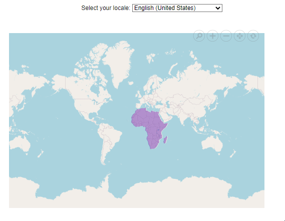

# Localization in Blazor Maps Component

The Blazor Maps component supports localization to display content in any language by integrating localized text resources. Static text elements, such as zoom toolbar tooltips and placeholder text for tile images that fail to load, can be translated into various languages (for example, Arabic, German, and French) by defining the appropriate locale value. To manage language-specific content efficiently, the localization process can use **.resx** files, enabling consistent maintenance of translations. This feature enhances accessibility by allowing interaction with the Maps component in the preferred language and supports integration in globally targeted applications.

Culture-specific resource files can be added using **.resx** files in the application. For implementation details, refer to the Blazor Localization topic: [Blazor Localization](https://blazor.syncfusion.com/documentation/common/localization).

The table below lists the locale keywords and the corresponding text used in the Blazor Maps component. These keywords represent various UI elements, such as tooltips for the zoom toolbar including zoom, zoom in/out, pan, and reset actions. By defining these locale keys, the text displayed in different languages can be customized.

<table>
<tr>
<td><b>Locale keywords</b></td>
<td><b>Text to display</b></td>
</tr>
<tr>
<td>Maps_Zoom</td>
<td>Zoom</td>
</tr>
<tr>
<td>Maps_ZoomIn</td>
<td>Zoom in</td>
</tr>
<tr>
<td>Maps_ZoomOut</td>
<td>Zoom out</td>
</tr>
<tr>
<td>Maps_Reset</td>
<td>Reset</td>
</tr>
<tr>
<td>Maps_Pan</td>
<td>Pan</td>
</tr>
<tr>
<td>Maps_ImageNotFound</td>
<td>Image Not Found</td>
</tr>
</table>

These translations enable the Maps component to adapt to the preferred language, improving accessibility and usability.

The image below illustrates tooltip text for the zoom toolbar in different cultures.

