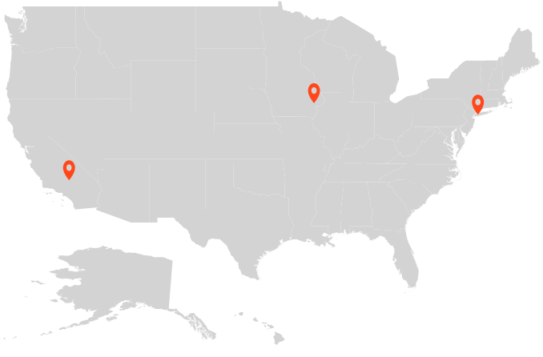
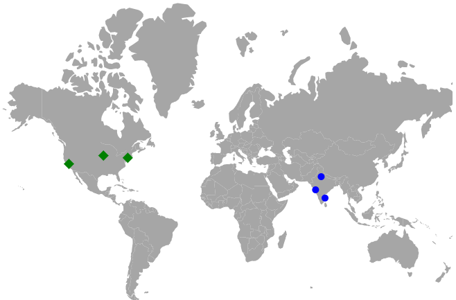
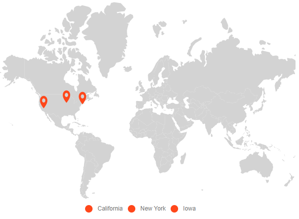
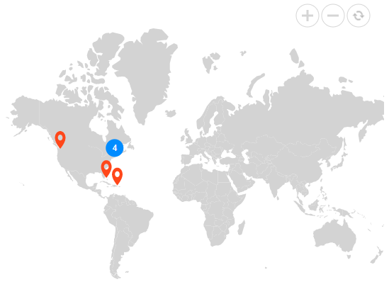
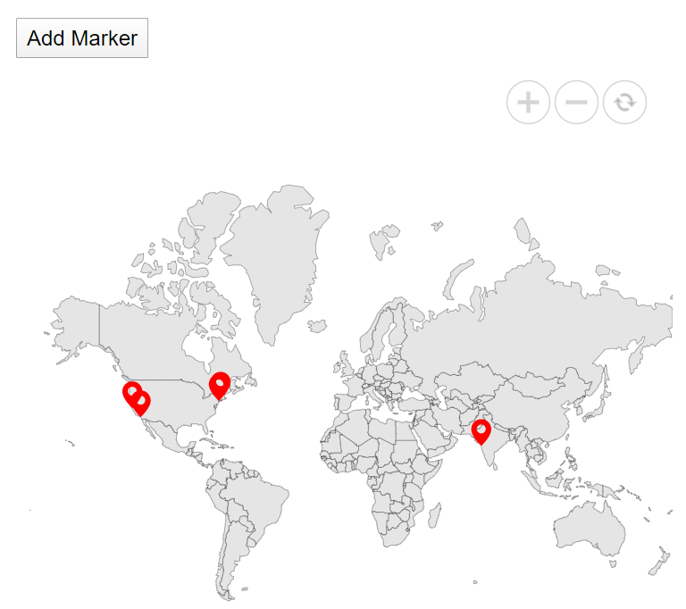

# Markers in Blazor Maps Component

Markers are notes that are used to leave a message on the Maps component. It indicates or marks a specific location with desired symbols on the maps.

The [DataSource](https://help.syncfusion.com/cr/blazor/Syncfusion.Blazor.Maps.MapsMarker.html#Syncfusion_Blazor_Maps_MapsMarker_DataSource) property has a list of objects that contains data for markers. By default, it displays the bound data at the specified latitude and longitude. Using the [Visible](https://help.syncfusion.com/cr/blazor/Syncfusion.Blazor.Maps.MapsMarker.html#Syncfusion_Blazor_Maps_MapsMarker_Visible) API, you can enable or disable the markers.

```cshtml
@using Syncfusion.Blazor.Maps

<SfMaps>
    <MapsLayers>
        <MapsLayer ShapeData='new {dataOptions= "https://cdn.syncfusion.com/maps/map-data/usa.json"}' TValue="string">
            <MapsMarkerSettings>
                <MapsMarker Visible="true" DataSource="California" Height="25" Width="15" TValue="City"></MapsMarker>
                <MapsMarker Visible="true" DataSource="NewYork" Height="25" Width="15" TValue="City"></MapsMarker>
                <MapsMarker Visible="true" DataSource="Iowa" Height="25" Width="15" TValue="City"></MapsMarker>
            </MapsMarkerSettings>
            <MapsShapeSettings Fill="lightgray"></MapsShapeSettings>
        </MapsLayer>
    </MapsLayers>
</SfMaps>
@code {
    public class City
    {
        public double Latitude { get; set; }
        public double Longitude { get; set; }
    };
    public List<City> California = new List<City> {
        new City {Latitude=35.145083,Longitude=-117.960260}
    };
    public List<City> NewYork = new List<City> {
          new City { Latitude=40.724546, Longitude=-73.850344 }
    };
    public List<City> Iowa = new List<City> {
        new City {Latitude= 41.657782, Longitude=-91.533857}
    };
}
```



<b>Adding marker objects to map</b>

The n number of markers can be added to shape layers using the [DataSource](https://help.syncfusion.com/cr/blazor/Syncfusion.Blazor.Maps.MapsMarker.html#Syncfusion_Blazor_Maps_MapsMarker_DataSource) property. Each dataSource object contains the following list of properties:

* city - Displays some information about the annotation in text format.
* Latitude - Determines the y-axis position of annotation.
* Longitude - Determines the x-axis position of annotation.

```cshtml
@using Syncfusion.Blazor.Maps

<SfMaps>
    <MapsLayers>
        <MapsLayer ShapeData='new {dataOptions= "https://cdn.syncfusion.com/maps/map-data/usa.json"}' TValue="string">
            <MapsMarkerSettings>
                <MapsMarker Visible="true" DataSource="Cities" Height="25" Width="15" TValue="City">
                    <MapsMarkerTooltipSettings ValuePath="Name" Visible="true">
                    </MapsMarkerTooltipSettings>
                </MapsMarker>
            </MapsMarkerSettings>
            <MapsShapeSettings Fill="lightgray"></MapsShapeSettings>
        </MapsLayer>
    </MapsLayers>
</SfMaps>

@code {
    public class City
    {
        public double Latitude { get; set; }
        public double Longitude { get; set; }
        public string Name { get; set; }
    };
    private List<City> Cities = new List<City> {
        new City {Latitude=35.145083,Longitude=-117.960260, Name= "Californiya"},
        new City { Latitude=40.724546, Longitude=-73.850344, Name="New York"},
        new City {Latitude= 41.657782, Longitude=-91.533857, Name="Iowa"}
    };
}
```


## Marker shapes

The Maps component contains the following marker shapes. You can select any shape using the [Shape](https://help.syncfusion.com/cr/blazor/Syncfusion.Blazor.Maps.MapsMarker.html#Syncfusion_Blazor_Maps_MapsMarker_Shape) property in [MapsMarker](https://help.syncfusion.com/cr/aspnetcore-blazor/Syncfusion.Blazor.Maps.MapsMarker.html).

* Ballon
* Circle
* Cross
* Diamond
* Image
* Rectangle
* Start
* Triangle
* VerticalLine
* HorizontalLine

## Multiple marker groups

You can specify multiple marker groups and customize each group of markers separately as demonstrated in the following example.

```cshtml
@using Syncfusion.Blazor.Maps

<SfMaps>
    <MapsLayers>
        <MapsLayer ShapeData='new {dataOptions= "https://cdn.syncfusion.com/maps/map-data/world-map.json"}' TValue="string">
            <MapsMarkerSettings>
                <MapsMarker Visible="true" DataSource="CitiesInUS" Shape="MarkerType.Diamond" Height="15" Fill="green" Width="15" TValue="City">
                    <MapsMarkerTooltipSettings ValuePath="Name" Visible="true"></MapsMarkerTooltipSettings>
                </MapsMarker>
                <MapsMarker Visible="true" DataSource="CitiesInIndia" Shape="MarkerType.Circle" Fill="blue" Height="10" Width="10" TValue="City">
                    <MapsMarkerTooltipSettings ValuePath="Name" Visible="true"></MapsMarkerTooltipSettings>
                </MapsMarker>
            </MapsMarkerSettings>
        </MapsLayer>
    </MapsLayers>
</SfMaps>

@code {
    public class City
    {
        public double Latitude { get; set; }
        public double Longitude { get; set; }
        public string Name { get; set; }
    };
    private List<City> CitiesInUS = new List<City> {
        new City { Latitude = 37.0000, Longitude = -120.0000, Name = "California"},
        new City { Latitude= 40.7127, Longitude = -74.0059, Name = "New York" },
        new City { Latitude = 42, Longitude = -93, Name = "Iowa"}
    };
    private List<City> CitiesInIndia = new List<City> {
        new City {Latitude = 19.228825, Longitude = 72.854118, Name= "Mumbai"},
        new City {Latitude = 28.610001, Longitude = 77.230003, Name= "Delhi"},
        new City {Latitude = 13.067439, Longitude = 80.237617, Name= "Chennai"}
    };
}
```



## Customize marker shapes from data source

### Bind different colors and shapes to the marker from data source

The location on the map is marked by different marker shapes using `shapeValuePath` property in `markerSettings`. Based on the field name in the data source bind the value to the `shapeValuePath` property. Also, you can customize the marker shape color by binding the color value field name in the data source to the `colorValuePath` property in `markerSettings`.

A default marker object is represented by `balloon` shape. You can set various shapes to the marker object by using `shape` property in `markerSettings`. Also, you can change the shapes of the marker from the datasource.

The following shapes are used for the marker object.
* Circle
* Rectangle
* Balloon
* Cross
* Polyline
* Diamond
* Star
* Triangle
* HorizontalLine
* VerticalLine
* pentagon

```cshtml
@using Syncfusion.Blazor.Maps

<SfMaps>
    <MapsLayers>
        <MapsLayer ShapeData='new {dataOptions= "https://cdn.syncfusion.com/maps/map-data/world-map.json"}' TValue="string">
            <MapsMarkerSettings>
                <MapsMarker Visible='true' DataSource='MarkerDataSource' ShapeValuePath="shape" ColorValuePath="color" TValue="MapMarkerDataSource">
                </MapsMarker>
            </MapsMarkerSettings>
        </MapsLayer>
    </MapsLayers>
</SfMaps>
@code {
    public class MapMarkerDataSource
    {
        public double latitude { get; set; }
        public double longitude { get; set; }
        public string name { get; set; }
        public string color { get; set; }
        public string shape { get; set; }
    };
    public List<MapMarkerDataSource> MarkerDataSource = new List<MapMarkerDataSource> {
        new MapMarkerDataSource{ latitude= 49.95121990866204, longitude= 18.468749999999998, name= "Europe", color="red", shape="Triangle" },
        new MapMarkerDataSource{ latitude= 59.88893689676585, longitude= -109.3359375, name= "North America", color="blue", shape="Pentagon" },
        new MapMarkerDataSource{ latitude= -6.64607562172573, longitude= -55.54687499999999, name= "South America", color="green", shape="InvertedTriangle" }
    };
}
```


## Marker Zooming

The map is initially scaled to the center value based on the marker distance. This can be achieved by setting `shouldZoomInitially` property in `zoomSettings` as `true`.

```cshtml
@using Syncfusion.Blazor.Maps

<SfMaps>
    <MapsLayers>
        <MapsLayer ShapeData='new {dataOptions= "https://cdn.syncfusion.com/maps/map-data/world-map.json"}' TValue="string">
            <MapsMarkerSettings>
                <MapsMarker Visible='true' DataSource='MarkerDataSource' TValue="MapMarkerDataSource">
                </MapsMarker>
            </MapsMarkerSettings>
        </MapsLayer>
    </MapsLayers>
    <MapsZoomSettings Enable='true' HorizontalAlignment="Syncfusion.Blazor.Maps.Alignment.Near" ShouldZoomInitially="true"></MapsZoomSettings>
</SfMaps>
@code {
    public class MapMarkerDataSource
    {
        public double latitude { get; set; }
        public double longitude { get; set; }
        public string name { get; set; }
    };
    public List<MapMarkerDataSource> MarkerDataSource = new List<MapMarkerDataSource> {
        new MapMarkerDataSource{ latitude= 49.95121990866204, longitude= 18.468749999999998, name= "Europe" },
        new MapMarkerDataSource{ latitude= 59.88893689676585, longitude= -109.3359375, name= "North America" },
        new MapMarkerDataSource{ latitude= -6.64607562172573, longitude= -55.54687499999999, name= "South America" }
    };
}
```


## Marker Cluster Expand

The cluster is formed by grouping an identical and non-identical marker from the surrounding area. By clicking on the cluster and setting `allowClusterExpand` property in `markerClusterSettings` as `true` to expand the identical markers. If you zoom in any of the locations of the cluster, the number on the cluster will decrease and the overlapping marker will be split into an individual marker on the map. When you zoom out, it will increase the marker count and then cluster it again.

```cshtml
@using Syncfusion.Blazor.Maps

<SfMaps>
    <MapsLayers>
        <MapsLayer ShapeData='new {dataOptions= "https://cdn.syncfusion.com/maps/map-data/world-map.json"}' TValue="string">
            <MapsMarkerSettings>
                <MapsMarker Visible="true" DataSource='MarkerDataSource' TValue="MapMarkerDataSource"/>
            </MapsMarkerSettings>
            <MapsMarkerClusterSettings AllowClustering="true" AllowClusterExpand="true" Shape="MarkerType.Circle" Height="40" Width="40">
                <MapsLayerMarkerClusterLabelStyle Color="white"></MapsLayerMarkerClusterLabelStyle>
            </MapsMarkerClusterSettings>
        </MapsLayer>
    </MapsLayers>
    <MapsZoomSettings Enable='true' MouseWheelZoom="true"></MapsZoomSettings>
</SfMaps>
@code {
    public class MapMarkerDataSource
    {
        public double latitude { get; set; }
        public double longitude { get; set; }
        public string name { get; set; }
    };
    public List<MapMarkerDataSource> MarkerDataSource = new List<MapMarkerDataSource> {
        new MapMarkerDataSource{ latitude= 49.95121990866204, longitude= 18.468749999999998, name= "Europe" },
        new MapMarkerDataSource{ latitude= 49.95121990866204, longitude= 18.468749999999998, name= "Europe" },
        new MapMarkerDataSource{ latitude= 49.95121990866204, longitude= 18.468749999999998, name= "Europe" },
        new MapMarkerDataSource{ latitude= 49.95121990866204, longitude= 18.468749999999998, name= "Europe" },
        new MapMarkerDataSource{ latitude= 49.95121990866204, longitude= 18.468749999999998, name= "Europe" },
        new MapMarkerDataSource{ latitude= 49.95121990866204, longitude= 18.468749999999998, name= "Europe" },
        new MapMarkerDataSource{ latitude= 49.95121990866204, longitude= 18.468749999999998, name= "Europe" },
        new MapMarkerDataSource{ latitude= 59.88893689676585, longitude= -109.3359375, name= "North America" },
        new MapMarkerDataSource{ latitude= -6.64607562172573, longitude= -55.54687499999999, name= "South America" }
    };
}

```


## Enabling legend for markers

The legend can be enabled for markers using [Type](https://help.syncfusion.com/cr/blazor/Syncfusion.Blazor.Charts.SfRangeNavigator.html#Syncfusion_Blazor_Charts_SfRangeNavigator_Minimum) as **Markers** and setting [Visible](https://help.syncfusion.com/cr/blazor/Syncfusion.Blazor.Maps.MapsLegendSettings.html#Syncfusion_Blazor_Maps_MapsLegendSettings_Visible) to true in [MapsLegendSettings](https://help.syncfusion.com/cr/aspnetcore-blazor/Syncfusion.Blazor.Maps.MapsLegendSettings.html).

The following code snippet demonstrates how to enable legend for markers.

```cshtml
@using Syncfusion.Blazor.Maps

<SfMaps>
    @*  To enable legend for marker *@
    <MapsLegendSettings Visible="true" Type="LegendType.Markers"></MapsLegendSettings>
    <MapsLayers>
        <MapsLayer ShapeData='new {dataOptions= "https://cdn.syncfusion.com/maps/map-data/world-map.json"}' TValue="string">
            <MapsMarkerSettings>
                <MapsMarker Visible="true"
                            DataSource="Cities"
                            Height="25"
                            Width="15"
                            LegendText="Name" TValue="City">
                </MapsMarker>
            </MapsMarkerSettings>
            <MapsShapeSettings Fill="lightgray"></MapsShapeSettings>
        </MapsLayer>
    </MapsLayers>
</SfMaps>

@code {
    public class City
    {
        public double Latitude { get; set; }
        public double Longitude { get; set; }
        public string Name { get; set; }
    };
    private List<City> Cities = new List<City> {
        new City {Latitude=35.145083, Longitude=-117.960260, Name= "Californiya"},
        new City { Latitude=40.724546, Longitude=-73.850344, Name="New York"},
        new City {Latitude= 41.657782, Longitude=-91.533857, Name="Iowa"}
    };
}
```



> Please refer to [legend section](legend) for more information on legend settings.

## Marker clustering

The Maps component provides support to hide and cluster markers when they overlap each other.

The number on a cluster indicates how many overlapped markers it contains. If you zoom any cluster location, the number on the cluster is decreased, and you can see the individual marker on the maps. When zooming out, the overlapping marker is increased, so that you can cluster it again and increase the count over the cluster.

Using the [AllowClustering](https://help.syncfusion.com/cr/blazor/Syncfusion.Blazor.Maps.MapsMarkerClusterSettings.html#Syncfusion_Blazor_Maps_MapsMarkerClusterSettings_AllowClustering) API in [MapsMarkerClusterSettings](https://help.syncfusion.com/cr/aspnetcore-blazor/Syncfusion.Blazor.Maps.MapsMarkerClusterSettings.html) option, you can enable or disable the cluster support. The [MapsMarkerClusterSettings](https://help.syncfusion.com/cr/aspnetcore-blazor/Syncfusion.Blazor.Maps.MapsMarkerClusterSettings.html) also helps to customize clusters.

```cshtml
@using Syncfusion.Blazor.Maps

<SfMaps>
    <MapsZoomSettings Enable="true"></MapsZoomSettings>
    <MapsLayers>
        <MapsLayer ShapeData='new {dataOptions= "https://cdn.syncfusion.com/maps/map-data/world-map.json"}' TValue="string">
            <MapsMarkerSettings>
                <MapsMarker Visible="true"
                            DataSource="LargestCities"
                            Height="25"
                            Width="15" TValue="City">
                </MapsMarker>
            </MapsMarkerSettings>
            <MapsMarkerClusterSettings AllowClustering="true"
                                       Shape="MarkerType.Circle"
                                       Fill="#008CFF"
                                       Height="25"
                                       Width="25">
                <MapsLayerMarkerClusterLabelStyle Color="white"></MapsLayerMarkerClusterLabelStyle>
            </MapsMarkerClusterSettings>
            <MapsShapeSettings Fill="lightgray">
            </MapsShapeSettings>
        </MapsLayer>
    </MapsLayers>
</SfMaps>

@code {
    public class City
    {
        public double Latitude { get; set; }
        public double Longitude { get; set; }
        public string Name { get; set; }
        public double Area { get; set; }
    };
    private List<City> LargestCities = new List<City> {
        new City { Latitude=40.6971494, Longitude= -74.2598747, Name="New York", Area=8683 },
        new City { Latitude=40.0024137, Longitude= -75.2581194, Name="Philadelphia", Area=4661 },
        new City { Latitude=42.3142647, Longitude= -71.11037, Name="Boston", Area=4497 },
        new City { Latitude=42.3526257, Longitude= -83.239291, Name="Detroit", Area=3267 },
        new City { Latitude=47.2510905, Longitude= -123.1255834, Name="Washington", Area=2996 },
        new City { Latitude=25.7823907, Longitude= -80.2994995, Name="Miami", Area=2891 },
        new City { Latitude=19.3892246, Longitude= -70.1305136, Name="San Juan", Area=2309 }
    };
}
```



## Dynamically adding markers

Allows the user to dynamically add a marker to the Maps component dynamically. This can be achieved by using the `ObservableCollection` option.

In the code below, click the user-defined button and the marker is added to the location that is specified in the `Add` method.

```cshtml
@using Syncfusion.Blazor.Maps;
@using System.Collections.ObjectModel;
@inject IJSRuntime JSRuntime;

<button @onclick="Add">Add Marker</button>

<div>
    <SfMaps>
        <MapsZoomSettings Enable="true" ZoomFactor="1"></MapsZoomSettings>
        <MapsLayers>
            <MapsLayer ShapeData='new { dataOptions = "https://cdn.syncfusion.com/maps/map-data/world-map.json" }' TValue="string">
                <MapsShapeSettings Fill="#E5E5E5">
                    <MapsShapeBorder Width="0.2" Color="black"></MapsShapeBorder>
                </MapsShapeSettings>
                <MapsMarkerSettings>
                    <MapsMarker DataSource="MarkerDataSource" Visible="true" Height="20" Width="20" Fill="red" AnimationDuration="0" Shape="MarkerType.Balloon" TValue="MarkerData">
                        <MapsMarkerTooltipSettings Visible="true" ValuePath="name"></MapsMarkerTooltipSettings>
                    </MapsMarker>
                </MapsMarkerSettings>
            </MapsLayer>
        </MapsLayers>
    </SfMaps>
</div>

@code {
    public ObservableCollection<MarkerData> MarkerDataSource { get; set; }
    public class MarkerData
    {
        public double latitude { get; set; }
        public double longitude { get; set; }
        public string name { get; set; }
        public static ObservableCollection<MarkerData> GetData()
        {
            ObservableCollection<MarkerData> MarkerDataSource = new ObservableCollection<MarkerData>() {
                new MarkerData { latitude = 37.6276571, longitude = -122.4276688, name = "San Bruno" },
                new MarkerData { latitude = 33.5302186, longitude = -117.7418381, name = "Laguna Niguel" },
                new MarkerData { latitude = 40.7424509, longitude = -74.0081468, name = "New York" },
                new MarkerData { latitude = 41.7424509, longitude = -73.0081468, name = "New York" }
            };
            return MarkerDataSource;
        }
    }
    protected override void OnInitialized()
    {
       this.MarkerDataSource = MarkerData.GetData();
    }
    public void Add()
    {
        this.MarkerDataSource.Add(new MarkerData { latitude = 19.1555762, longitude = 72.8849595, name = "Mumbai" });
    }
}
```



## See also

* [Add different types of markers](how-to/add-different-types-of-markers)