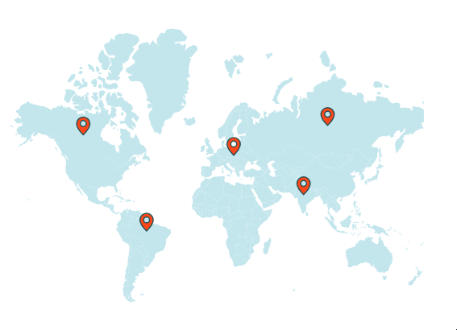
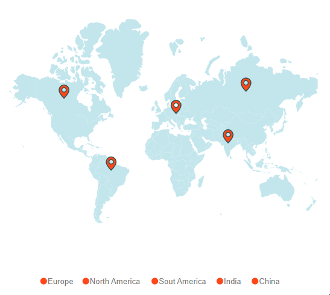

# Markers in Blazor Maps Component

Markers are notes that are used to leave a message on the Maps. It indicates or marks a specific location with desired symbols on the Maps. It can be enabled by setting the [Visible](https://help.syncfusion.com/cr/blazor/Syncfusion.Blazor.Maps.MapsMarker-1.html#Syncfusion_Blazor_Maps_MapsMarker_1_Visible) property of the [MapsMarker](https://help.syncfusion.com/cr/blazor/Syncfusion.Blazor.Maps.MapsMarker-1.html) to **true**.

## Adding marker

To add the markers, the [DataSource](https://help.syncfusion.com/cr/blazor/Syncfusion.Blazor.Maps.MapsMarker-1.html#Syncfusion_Blazor_Maps_MapsMarker_1_DataSource) property of the [MapsMarker](https://help.syncfusion.com/cr/blazor/Syncfusion.Blazor.Maps.MapsMarker-1.html) has a list of objects that contains the data for markers. Using this property, any number of markers can be added to the layers of the Maps. By default, it displays the markers based on the specified latitude and longitude in the given data source. Each data source object should contain the following list of properties.

* Latitude - Specifies the position of the marker in latitude co-ordinate.
* Longitude - Specifies the position of the marker in longitude co-ordinate.

```cshtml
@using Syncfusion.Blazor.Maps

<SfMaps>
    <MapsLayers>
        <MapsLayer ShapeData='new {dataOptions= "https://cdn.syncfusion.com/maps/map-data/usa.json"}' TValue="string">
            <MapsMarkerSettings>
                <MapsMarker Visible="true" DataSource="California" Height="25" Width="15" TValue="City"></MapsMarker>
                <MapsMarker Visible="true" DataSource="NewYork" Height="25" Width="15" TValue="City"></MapsMarker>
                <MapsMarker Visible="true" DataSource="Iowa" Height="25" Width="15" TValue="City"></MapsMarker>
            </MapsMarkerSettings>
            <MapsShapeSettings Fill="lightgray"></MapsShapeSettings>
        </MapsLayer>
    </MapsLayers>
</SfMaps>
@code {
    public class City
    {
        public double Latitude { get; set; }
        public double Longitude { get; set; }
    };
    public List<City> California = new List<City> {
        new City {Latitude=35.145083,Longitude=-117.960260}
    };
    public List<City> NewYork = new List<City> {
        new City { Latitude=40.724546, Longitude=-73.850344 }
    };
    public List<City> Iowa = new List<City> {
        new City {Latitude= 41.657782, Longitude=-91.533857}
    };
}
```


## Adding marker template

The marker can be added as a template in the Maps component. The [MarkerTemplate](https://help.syncfusion.com/cr/blazor/Syncfusion.Blazor.Maps.MapsMarker-1.html#Syncfusion_Blazor_Maps_MapsMarker_1_MarkerTemplate) property of the [MapsMarker](https://help.syncfusion.com/cr/blazor/Syncfusion.Blazor.Maps.MapsMarker-1.html) is used to set HTML element as a template for the marker.

```cshtml
@using Syncfusion.Blazor.Maps

<SfMaps Height="600" Width="700">
    <MapsLayers>
        <MapsLayer ShapeData='new {dataOptions= "https://cdn.syncfusion.com/maps/map-data/world-map.json"}' TValue="string">
            <MapsMarkerSettings>
                <MapsMarker Visible="true" DataSource="Europe" TValue="City">
                    <MarkerTemplate>
                        @{
                            <div id="marker4" class="markerTemplate">Europe</div>
                        }
                    </MarkerTemplate>
                </MapsMarker>
                <MapsMarker Visible="true" DataSource="NorthAmerica" TValue="City">
                    <MarkerTemplate>
                        @{
                            <div id="marker5" class="markerTemplate" style="width:50px">North America</div>
                        }
                    </MarkerTemplate>
                </MapsMarker>
                <MapsMarker Visible="true" DataSource="SouthAmerica" TValue="City">
                    <MarkerTemplate>
                        @{
                            <div id="marker6" class="markerTemplate" style="width:50px">South America</div>
                        }
                    </MarkerTemplate>
                </MapsMarker>
            </MapsMarkerSettings>
            <MapsShapeSettings Fill="lightgray"></MapsShapeSettings>
        </MapsLayer>
    </MapsLayers>
</SfMaps>
@code {
    public class City
    {
        public double Latitude { get; set; }
        public double Longitude { get; set; }
    };
    public List<City> Europe = new List<City> {
        new City { Latitude=49.95121990866204, Longitude=18.468749999999998 }
    };
    public List<City> NorthAmerica = new List<City> {
        new City { Latitude= 59.88893689676585, Longitude= -109.3359375 }
    };
    public List<City> SouthAmerica = new List<City> {
        new City { Latitude= -6.64607562172573, Longitude=-55.54687499999999 }
    };
}
```


## Customization

The following properties and class are available in [MapsMarker](https://help.syncfusion.com/cr/blazor/Syncfusion.Blazor.Maps.MapsMarker-1.html) to customize the markers of the Maps component.

* [MapsMarkerBorder](https://help.syncfusion.com/cr/blazor/Syncfusion.Blazor.Maps.MapsMarkerBorder.html) - To customize the color and width of the border for the markers in Maps.
* [Fill](https://help.syncfusion.com/cr/blazor/Syncfusion.Blazor.Maps.MapsMarker-1.html#Syncfusion_Blazor_Maps_MapsMarker_1_Fill) - To apply the color for markers in Maps.
* [DashArray](https://help.syncfusion.com/cr/blazor/Syncfusion.Blazor.Maps.MapsMarker-1.html#Syncfusion_Blazor_Maps_MapsMarker_1_DashArray) - To define the pattern of dashes and gaps that is applied to the outline of the markers in Maps.
* [Height](https://help.syncfusion.com/cr/blazor/Syncfusion.Blazor.Maps.MapsMarker-1.html#Syncfusion_Blazor_Maps_MapsMarker_1_Height) - To customize the height of the markers in Maps.
* [Width](https://help.syncfusion.com/cr/blazor/Syncfusion.Blazor.Maps.MapsMarker-1.html#Syncfusion_Blazor_Maps_MapsMarker_1_Width) - To customize the width of the markers in Maps.
* [Opacity](https://help.syncfusion.com/cr/blazor/Syncfusion.Blazor.Maps.MapsMarker-1.html#Syncfusion_Blazor_Maps_MapsMarker_1_Opacity) - To customize the transparency of the markers in Maps.
* [AnimationDelay](https://help.syncfusion.com/cr/blazor/Syncfusion.Blazor.Maps.MapsMarker-1.html#Syncfusion_Blazor_Maps_MapsMarker_1_AnimationDelay) - To change the time delay in the transition for markers.
* [AnimationDuration](https://help.syncfusion.com/cr/blazor/Syncfusion.Blazor.Maps.MapsMarker-1.html#Syncfusion_Blazor_Maps_MapsMarker_1_AnimationDuration) - To change the time duration of animation for markers.

```cshtml
@using Syncfusion.Blazor.Maps

<SfMaps>
    <MapsLayers>
        <MapsLayer ShapeData='new { dataOptions = "https://cdn.syncfusion.com/maps/map-data/world-map.json" }' TValue="string">
            <MapsMarkerSettings>
                <MapsMarker Visible="true" DataSource="MarkerData" Height="25" Width="15" Fill="red" DashArray="1" Opacity="0.9"
                            Shape="Syncfusion.Blazor.Maps.MarkerType.Balloon" TValue="City">
                    <MapsMarkerBorder Color="green" Width="2"></MapsMarkerBorder>
                </MapsMarker>
            </MapsMarkerSettings>
            <MapsShapeSettings Fill="lightgray"></MapsShapeSettings>
        </MapsLayer>
    </MapsLayers>
</SfMaps>
@code {
    public class City
    {
        public double Latitude { get; set; }
        public double Longitude { get; set; }
    };
    public List<City> MarkerData = new List<City> {
        new City { Latitude=35.145083, Longitude=-117.960260 },
        new City { Latitude=40.724546, Longitude=-73.850344 },
        new City { Latitude= 41.657782, Longitude=-91.533857 }
    };
}
```


## Marker shapes

The Maps component supports the following marker shapes. To set the shape of the marker, the [Shape](https://help.syncfusion.com/cr/blazor/Syncfusion.Blazor.Maps.MapsMarker-1.html#Syncfusion_Blazor_Maps_MapsMarker_1_Shape) property in [MapsMarker](https://help.syncfusion.com/cr/blazor/Syncfusion.Blazor.Maps.MapsMarker-1.html) is used.

* Balloon
* Circle
* Cross
* Diamond
* Image
* Rectangle
* Start
* Triangle
* VerticalLine
* HorizontalLine

### Rendering marker shape as image

To render a marker as an image in Maps, set the [Shape](https://help.syncfusion.com/cr/blazor/Syncfusion.Blazor.Maps.MapsMarker-1.html#Syncfusion_Blazor_Maps_MapsMarker_1_Shape) property of [MapsMarker](https://help.syncfusion.com/cr/blazor/Syncfusion.Blazor.Maps.MapsMarker-1.html) as **Image** and specify the path of the image to [ImageUrl](https://help.syncfusion.com/cr/blazor/Syncfusion.Blazor.Maps.MapsMarker-1.html#Syncfusion_Blazor_Maps_MapsMarker_1_ImageUrl) property. There is another way to render a marker as an image using the [ImageUrlValuePath](https://help.syncfusion.com/cr/blazor/Syncfusion.Blazor.Maps.MapsMarker-1.html#Syncfusion_Blazor_Maps_MapsMarker_1_ImageUrlValuePath) property of the [MapsMarker](https://help.syncfusion.com/cr/blazor/Syncfusion.Blazor.Maps.MapsMarker-1.html). Bind the field name that contains the path of the image in the data source to the [ImageUrlValuePath](https://help.syncfusion.com/cr/blazor/Syncfusion.Blazor.Maps.MapsMarker-1.html#Syncfusion_Blazor_Maps_MapsMarker_1_ImageUrlValuePath) property.

```cshtml
@using Syncfusion.Blazor.Maps

<SfMaps>
    <MapsLayers>
        <MapsLayer ShapeData='new { dataOptions = "https://cdn.syncfusion.com/maps/map-data/world-map.json" }' TValue="string">
            <MapsMarkerSettings>
                <MapsMarker Visible="true" DataSource="MarkerData" Height="25" Width="15" TValue="City"
                            Shape="Syncfusion.Blazor.Maps.MarkerType.Image" ImageUrl="https://blazor.syncfusion.com/demos/_content/blazor_server_common_net8/images/maps/ballon.png">
                </MapsMarker>
            </MapsMarkerSettings>
            <MapsShapeSettings Fill="lightgray"></MapsShapeSettings>
        </MapsLayer>
    </MapsLayers>
</SfMaps>
@code {
    public class City
    {
        public double Latitude { get; set; }
        public double Longitude { get; set; }
    };
    public List<City> MarkerData = new List<City> {
        new City { Latitude=35.145083,Longitude=-117.960260 },
        new City { Latitude=40.724546, Longitude=-73.850344 },
        new City { Latitude= 41.657782, Longitude=-91.533857 }
    };
}
```


## Multiple marker groups

Multiple groups of markers can be added in the Maps by adding multiple [MapsMarker](https://help.syncfusion.com/cr/blazor/Syncfusion.Blazor.Maps.MapsMarker-1.html) in the [MapsMarkerSettings](https://help.syncfusion.com/cr/blazor/Syncfusion.Blazor.Maps.MapsMarkerSettings.html) and customization for the markers can be done with the [MapsMarker](https://help.syncfusion.com/cr/blazor/Syncfusion.Blazor.Maps.MapsMarker-1.html).

```cshtml
@using Syncfusion.Blazor.Maps

<SfMaps>
    <MapsLayers>
        <MapsLayer ShapeData='new {dataOptions= "https://cdn.syncfusion.com/maps/map-data/world-map.json"}' TValue="string">
            <MapsMarkerSettings>
                <MapsMarker Visible="true" DataSource="CitiesInUS" Shape="MarkerType.Diamond" Height="15" Fill="green" Width="15" TValue="City">
                    <MapsMarkerTooltipSettings ValuePath="Name" Visible="true"></MapsMarkerTooltipSettings>
                </MapsMarker>
                <MapsMarker Visible="true" DataSource="CitiesInIndia" Shape="MarkerType.Circle" Fill="blue" Height="10" Width="10" TValue="City">
                    <MapsMarkerTooltipSettings ValuePath="Name" Visible="true"></MapsMarkerTooltipSettings>
                </MapsMarker>
            </MapsMarkerSettings>
        </MapsLayer>
    </MapsLayers>
</SfMaps>

@code {
    public class City
    {
        public double Latitude { get; set; }
        public double Longitude { get; set; }
        public string Name { get; set; }
    };
    private List<City> CitiesInUS = new List<City> {
        new City { Latitude = 37.0000, Longitude = -120.0000, Name = "California" },
        new City { Latitude= 40.7127, Longitude = -74.0059, Name = "New York" },
        new City { Latitude = 42, Longitude = -93, Name = "Iowa" }
    };
    private List<City> CitiesInIndia = new List<City> {
        new City { Latitude = 19.228825, Longitude = 72.854118, Name= "Mumbai" },
        new City { Latitude = 28.610001, Longitude = 77.230003, Name= "Delhi" },
        new City { Latitude = 13.067439, Longitude = 80.237617, Name= "Chennai" }
    };
}
```


## Customize marker shapes from data source

### Bind different colors and shapes to the marker from data source

Using the [ShapeValuePath](https://help.syncfusion.com/cr/blazor/Syncfusion.Blazor.Maps.MapsMarker-1.html#Syncfusion_Blazor_Maps_MapsMarker_1_ShapeValuePath) and [ColorValuePath](https://help.syncfusion.com/cr/blazor/Syncfusion.Blazor.Maps.MapsMarker-1.html#Syncfusion_Blazor_Maps_MapsMarker_1_ColorValuePath) properties, the color and shape of the marker can be applied from the given data source. Bind the data source to the [DataSource](https://help.syncfusion.com/cr/blazor/Syncfusion.Blazor.Maps.MapsMarker-1.html#Syncfusion_Blazor_Maps_MapsMarker_1_DataSource) property of the [MapsMarker](https://help.syncfusion.com/cr/blazor/Syncfusion.Blazor.Maps.MapsMarker-1.html) and set the field names that contains the shape and color values in the data source to the [ShapeValuePath](https://help.syncfusion.com/cr/blazor/Syncfusion.Blazor.Maps.MapsMarker-1.html#Syncfusion_Blazor_Maps_MapsMarker_1_ShapeValuePath) and [ColorValuePath](https://help.syncfusion.com/cr/blazor/Syncfusion.Blazor.Maps.MapsMarker-1.html#Syncfusion_Blazor_Maps_MapsMarker_1_ColorValuePath) properties.

```cshtml
@using Syncfusion.Blazor.Maps

<SfMaps>
    <MapsLayers>
        <MapsLayer ShapeData='new {dataOptions= "https://cdn.syncfusion.com/maps/map-data/world-map.json"}' TValue="string">
            <MapsMarkerSettings>
                <MapsMarker Visible='true' DataSource='MarkerDataSource' ShapeValuePath="shape" ColorValuePath="color" TValue="MapMarkerDataSource">
                </MapsMarker>
            </MapsMarkerSettings>
        </MapsLayer>
    </MapsLayers>
</SfMaps>
@code {
    public class MapMarkerDataSource
    {
        public double latitude { get; set; }
        public double longitude { get; set; }
        public string name { get; set; }
        public string color { get; set; }
        public string shape { get; set; }
    };
    public List<MapMarkerDataSource> MarkerDataSource = new List<MapMarkerDataSource> {
        new MapMarkerDataSource{ latitude= 49.95121990866204, longitude= 18.468749999999998, name= "Europe", color="red", shape="Triangle" },
        new MapMarkerDataSource{ latitude= 59.88893689676585, longitude= -109.3359375, name= "North America", color="blue", shape="Pentagon" },
        new MapMarkerDataSource{ latitude= -6.64607562172573, longitude= -55.54687499999999, name= "South America", color="green", shape="InvertedTriangle" }
    };
}
```


### Setting value path from the data source

The latitude and longitude values are used to determine the location of each marker in the Maps. The [LatitudeValuePath](https://help.syncfusion.com/cr/blazor/Syncfusion.Blazor.Maps.MapsMarker-1.html#Syncfusion_Blazor_Maps_MapsMarker_1_LatitudeValuePath) and [LongitudeValuePath](https://help.syncfusion.com/cr/blazor/Syncfusion.Blazor.Maps.MapsMarker-1.html#Syncfusion_Blazor_Maps_MapsMarker_1_LongitudeValuePath) properties are used to specify the value path that presents in the data source of the marker. In the following example, the field name from the data source is set to the [LatitudeValuePath](https://help.syncfusion.com/cr/blazor/Syncfusion.Blazor.Maps.MapsMarker-1.html#Syncfusion_Blazor_Maps_MapsMarker_1_LatitudeValuePath) and [LongitudeValuePath](https://help.syncfusion.com/cr/blazor/Syncfusion.Blazor.Maps.MapsMarker-1.html#Syncfusion_Blazor_Maps_MapsMarker_1_LongitudeValuePath) properties.

```cshtml
@using Syncfusion.Blazor.Maps

<SfMaps>
    <MapsLayers>
        <MapsLayer ShapeData='new { dataOptions = "https://cdn.syncfusion.com/maps/map-data/world-map.json" }' TValue="string">
            <MapsMarkerSettings>
                <MapsMarker Visible="true" DataSource="MarkerData" LatitudeValuePath="Latitude" LongitudeValuePath="Longitude" TValue="City">
                </MapsMarker>
            </MapsMarkerSettings>
        <MapsShapeSettings Fill="lightgray"></MapsShapeSettings>
        </MapsLayer>
    </MapsLayers>
</SfMaps>
@code {
    public class City
    {
        public double Latitude { get; set; }
        public double Longitude { get; set; }
    };
    public List<City> MarkerData = new List<City> {
        new City { Latitude=35.145083, Longitude=-117.960260 },
        new City { Latitude=40.724546, Longitude=-73.850344 },
        new City { Latitude= 41.657782, Longitude=-91.533857 }
    };
}
```


### Setting different sizes for markers individually

The size of the markers in a marker group can be customized using the [WidthValuePath](https://help.syncfusion.com/cr/blazor/Syncfusion.Blazor.Maps.MapsMarker-1.html#Syncfusion_Blazor_Maps_MapsMarker_1_WidthValuePath) and [HeightValuePath](https://help.syncfusion.com/cr/blazor/Syncfusion.Blazor.Maps.MapsMarker-1.html#Syncfusion_Blazor_Maps_MapsMarker_1_HeightValuePath) properties, which allow the user to change the width and height of the markers based on values from the given data source. Bind the data source to the [DataSource](https://help.syncfusion.com/cr/blazor/Syncfusion.Blazor.Maps.MapsMarker-1.html#Syncfusion_Blazor_Maps_MapsMarker_1_DataSource) property of the [MapsMarker](https://help.syncfusion.com/cr/blazor/Syncfusion.Blazor.Maps.MapsMarker-1.html) tag, and specify the field names containing the width and height values in the data source for the `WidthValuePath` and `HeightValuePath` properties.

```cshtml
@using Syncfusion.Blazor.Maps

<SfMaps>
    <MapsLayers>
        <MapsLayer ShapeData='new { dataOptions = "https://cdn.syncfusion.com/maps/map-data/world-map.json" }' TValue="string">
            <MapsMarkerSettings>
                <MapsMarker Visible="true" Shape="MarkerType.Circle" DataSource="MarkerData" WidthValuePath="Width" HeightValuePath="Height" TValue="City">
                </MapsMarker>
            </MapsMarkerSettings>
        <MapsShapeSettings Fill="lightgray"></MapsShapeSettings>
        </MapsLayer>
    </MapsLayers>
</SfMaps>
@code {
    public class City
    {
        public double Latitude { get; set; }
        public double Longitude { get; set; }
        public double Width {get; set; }
        public double Height {get; set; }
    };
    public List<City> MarkerData = new List<City> {
        new City { Latitude=49.95121990866204, Longitude=18.468749999999998, Width=30, Height=30  },
        new City { Latitude=59.88893689676585, Longitude=-109.3359375 , Width=20, Height=20 },
        new City { Latitude=-6.64607562172573, Longitude=-55.54687499999999 , Width=10, Height=10}
    };
}
```


## Repositioning the marker using drag and drop

The markers on the map can be dragged and dropped to change their position. To enable marker drag and drop, set the [EnableDrag](https://help.syncfusion.com/cr/blazor/Syncfusion.Blazor.Maps.MapsMarker-1.html#Syncfusion_Blazor_Maps_MapsMarker_1_EnableDrag) property to **true** in the `MapsMarker` setting.

```cshtml

@using Syncfusion.Blazor.Maps

<SfMaps>
    <MapsLayers>
        <MapsLayer ShapeData='new {dataOptions= "https://cdn.syncfusion.com/maps/map-data/world-map.json"}' TValue="string">
            <MapsMarkerSettings>
                <MapsMarker EnableDrag="true" Visible="true" DataSource="MarkerDataSource" Height="20" Width="20" TValue="City">
                    <MapsMarkerBorder Width="2" Color="#285255"></MapsMarkerBorder>
                    <MapsMarkerTooltipSettings Visible="true" ValuePath="Name"></MapsMarkerTooltipSettings>
                </MapsMarker>
            </MapsMarkerSettings>
            <MapsShapeSettings Fill="#C3E6ED"></MapsShapeSettings>
        </MapsLayer>
    </MapsLayers>
</SfMaps>

@code {
    public class City
    {
        public double Latitude { get; set; }
        public double Longitude { get; set; }
        public string Name { get; set; }
    };
    public List<City> MarkerDataSource = new List<City> {
        new City {Latitude=49.95121990866204,Longitude=18.468749999999998, Name = "Marker 1"},
        new City {Latitude=59.88893689676585,Longitude= -109.3359375, Name = "Marker 2"},
        new City {Latitude=-6.64607562172573,Longitude=-55.54687499999999, Name = "Marker 3"},
        new City {Latitude=23.644385824912135,Longitude=77.83189239539234, Name = "Marker 4"},
        new City {Latitude=63.66569332894224,Longitude= 98.2225173953924, Name = "Marker 5"}
    };
}
```



The data of the drag and dropped marker in the marker data source can be customized using the [OnMarkerDragStart](https://help.syncfusion.com/cr/blazor/Syncfusion.Blazor.Maps.MapsEvents.html#Syncfusion_Blazor_Maps_MapsEvents_OnMarkerDragStart) and [OnMarkerDragEnd](https://help.syncfusion.com/cr/blazor/Syncfusion.Blazor.Maps.MapsEvents.html#Syncfusion_Blazor_Maps_MapsEvents_OnMarkerDragEnd) events. When you change the appropriate marker data, the tooltip and legend item text of that marker are automatically updated. The following properties are available in the event argument of the marker drag events.

|   Argument Name      |   Description                               |
|----------------------| --------------------------------------------|
|   DataIndex          |   It represents the index of the data of the dragged marker in the marker data source.                          |
|   Latitude           |   It represents the latitude coordinate point of the dragged marker.                                            |
|   Longitude          |   It represents the longitude coordinate point for the dragged marker.                                          |
|   MarkerIndex        |   It represents the index of the marker setting.                                                                |
|   LayerIndex         |   It represents the index of the layer in which the marker belongs.                                             |
|   EventName          |   It represents the name of the event.                                                                     |
|   X                  |   It represents the horizontal location of the mouse pointer on the map when the drag action is performed.      |
|   Y                  |   It represents the vertical location of the mouse pointer on the map when the drag action is performed.        |

The following example shows how to use marker drag events to customize the data of the drag and dropped marker in the marker data source.

```cshtml

@using Syncfusion.Blazor.Maps

<SfMaps @ref="maps">
    <MapsEvents OnMarkerDragStart="MarkerDragStartEvent" OnMarkerDragEnd="MarkerDragEndEvent"></MapsEvents>
    <MapsLegendSettings Visible="true" Type="LegendType.Markers" Shape="LegendShape.Circle" ShapeWidth="10" ShapeHeight="10" Fill="#FF471A">
    </MapsLegendSettings>
    <MapsLayers>
        <MapsLayer ShapeData='new {dataOptions= "https://cdn.syncfusion.com/maps/map-data/world-map.json"}' TValue="string">
            <MapsMarkerSettings>
                <MapsMarker LegendText="Name" EnableDrag="true" Visible="true" DataSource="MarkerDataSource" AnimationDuration="0" Height="20" Width="20" TValue="City">
                    <MapsMarkerBorder Width="2" Color="#285255"></MapsMarkerBorder>
                    <MapsMarkerTooltipSettings Visible="true" ValuePath="Name"></MapsMarkerTooltipSettings>
                </MapsMarker>
            </MapsMarkerSettings>
            <MapsShapeSettings Fill="#C3E6ED"></MapsShapeSettings>
        </MapsLayer>
    </MapsLayers>
</SfMaps>
@code {
    public SfMaps maps;
    public class City
    {
        public double Latitude { get; set; }
        public double Longitude { get; set; }
        public string Name { get; set; }
    };
    public List<City> MarkerDataSource = new List<City> {
        new City {Latitude=49.95121990866204,Longitude=18.468749999999998, Name = "Europe"},
        new City {Latitude=59.88893689676585,Longitude= -109.3359375, Name = "North America"},
        new City {Latitude=-6.64607562172573,Longitude=-55.54687499999999, Name = "Sout America"},
        new City {Latitude=23.644385824912135,Longitude=77.83189239539234, Name = "India"},
        new City {Latitude=63.66569332894224,Longitude= 98.2225173953924, Name = "China"}
    };
    public void MarkerDragStartEvent(MarkerDragStartEventArgs args)
    {
        // When the marker begins to move on the map, the event is triggered.
    }
    public void MarkerDragEndEvent(MarkerDragEndEventArgs args)
    {
        // When the marker on the map stops dragging, the event is triggered.
        MarkerDataSource[args.DataIndex].Name = "Australia";
        maps.Refresh();
    }
}
```



## Marker zooming

The Maps can be initially scaled to the center value based on the marker distance. This can be achieved by setting the [ShouldZoomInitially](https://help.syncfusion.com/cr/blazor/Syncfusion.Blazor.Maps.MapsZoomSettings.html#Syncfusion_Blazor_Maps_MapsZoomSettings_ShouldZoomInitially) property in [MapsZoomSettings](https://help.syncfusion.com/cr/blazor/Syncfusion.Blazor.Maps.MapsZoomSettings.html) as **true**.

```cshtml
@using Syncfusion.Blazor.Maps

<SfMaps>
    <MapsLayers>
        <MapsLayer ShapeData='new {dataOptions= "https://cdn.syncfusion.com/maps/map-data/world-map.json"}' TValue="string">
            <MapsMarkerSettings>
                <MapsMarker Visible='true' DataSource='MarkerDataSource' TValue="MapMarkerDataSource">
                </MapsMarker>
            </MapsMarkerSettings>
        </MapsLayer>
    </MapsLayers>
    <MapsZoomSettings Enable='true' ShouldZoomInitially="true">
        <MapsZoomToolbarSettings HorizontalAlignment="Alignment.Near">
        </MapsZoomToolbarSettings>
    </MapsZoomSettings>
</SfMaps>
@code {
    public class MapMarkerDataSource
    {
        public double latitude { get; set; }
        public double longitude { get; set; }
        public string name { get; set; }
    };
    public List<MapMarkerDataSource> MarkerDataSource = new List<MapMarkerDataSource> {
        new MapMarkerDataSource{ latitude= 49.95121990866204, longitude= 18.468749999999998, name= "Europe" },
        new MapMarkerDataSource{ latitude= 59.88893689676585, longitude= -109.3359375, name= "North America" },
        new MapMarkerDataSource{ latitude= -6.64607562172573, longitude= -55.54687499999999, name= "South America" }
    };
}
```


## Disabling Zoom on Marker Click

Maps typically zoom in when you click or double-click on them. This zooming also occurs when you click on a marker. To prevent zooming when clicking on a marker, you can set [ZoomOnMarkerClick](https://help.syncfusion.com/cr/blazor/Syncfusion.Blazor.Maps.MapsZoomSettings.html#Syncfusion_Blazor_Maps_MapsZoomSettings_ZoomOnMarkerClick) to **false** in the [MapsZoomSettings](https://help.syncfusion.com/cr/blazor/Syncfusion.Blazor.Maps.MapsZoomSettings.html). This setting disables zooming specifically for marker clicks. By default, `ZoomOnMarkerClick` is set to **true**.

```cshtml
@using Syncfusion.Blazor.Maps

<SfMaps>
    <MapsLayers>
        <MapsLayer ShapeData='new {dataOptions= "https://cdn.syncfusion.com/maps/map-data/world-map.json"}' TValue="string">
            <MapsMarkerSettings>
                <MapsMarker Visible='true' Width="20" Height="20" AnimationDuration="0" DataSource='MarkerDataSource' TValue="MapMarkerDataSource">
                </MapsMarker>
            </MapsMarkerSettings>
        </MapsLayer>
    </MapsLayers>
    <MapsZoomSettings Enable='true' ZoomOnClick="true" ZoomOnMarkerClick="false">
        <MapsZoomToolbarSettings HorizontalAlignment="Alignment.Far">
        </MapsZoomToolbarSettings>
    </MapsZoomSettings>
</SfMaps>
@code {
    public class MapMarkerDataSource
    {
        public double latitude { get; set; }
        public double longitude { get; set; }
        public string name { get; set; }
    };
    public List<MapMarkerDataSource> MarkerDataSource = new List<MapMarkerDataSource> {
        new MapMarkerDataSource{ latitude= 49.95121990866204, longitude= 18.468749999999998, name= "Europe" },
        new MapMarkerDataSource{ latitude= 59.88893689676585, longitude= -109.3359375, name= "North America" },
        new MapMarkerDataSource{ latitude= -6.64607562172573, longitude= -55.54687499999999, name= "South America" }
    };
}
```


## Marker clustering

Maps support hiding and clustering markers when they overlap. The number on a cluster indicates how many overlapping markers it contains. When zooming into any cluster location on the map, the number on the cluster decreases, and individual markers become visible. When zooming out, the overlapping markers increase, causing them to cluster again, which increases the count on the cluster.

To enable clustering for markers within a layer, set the [AllowClustering](https://help.syncfusion.com/cr/blazor/Syncfusion.Blazor.Maps.MapsMarkerClusterSettings.html#Syncfusion_Blazor_Maps_MapsMarkerClusterSettings_AllowClustering) property of [MapsMarkerClusterSettings](https://help.syncfusion.com/cr/blazor/Syncfusion.Blazor.Maps.MapsMarkerClusterSettings.html) in the [MapsLayer](https://help.syncfusion.com/cr/blazor/Syncfusion.Blazor.Maps.MapsLayer-1.html) to **true**. Customization of clustering can be done using the `MapsMarkerClusterSettings` property. 

```cshtml
@using Syncfusion.Blazor.Maps

<SfMaps>
    <MapsZoomSettings Enable="true"></MapsZoomSettings>
    <MapsLayers>
        <MapsLayer ShapeData='new {dataOptions= "https://cdn.syncfusion.com/maps/map-data/world-map.json"}' TValue="string">
            <MapsMarkerSettings>
                <MapsMarker Visible="true" DataSource="LargestCities" Height="25" Width="15" TValue="City">
                </MapsMarker>
            </MapsMarkerSettings>
            <MapsMarkerClusterSettings AllowClustering="true" Shape="MarkerType.Circle" Fill="#008CFF" Height="25" Width="25">
                <MapsLayerMarkerClusterLabelStyle Color="white"></MapsLayerMarkerClusterLabelStyle>
            </MapsMarkerClusterSettings>
            <MapsShapeSettings Fill="lightgray">
            </MapsShapeSettings>
        </MapsLayer>
    </MapsLayers>
</SfMaps>

@code {
    public class City
    {
        public double Latitude { get; set; }
        public double Longitude { get; set; }
        public string Name { get; set; }
        public double Area { get; set; }
    };
    private List<City> LargestCities = new List<City> {
        new City { Latitude=40.6971494, Longitude= -74.2598747, Name="New York", Area=8683 },
        new City { Latitude=40.0024137, Longitude= -75.2581194, Name="Philadelphia", Area=4661 },
        new City { Latitude=42.3142647, Longitude= -71.11037, Name="Boston", Area=4497 },
        new City { Latitude=42.3526257, Longitude= -83.239291, Name="Detroit", Area=3267 },
        new City { Latitude=47.2510905, Longitude= -123.1255834, Name="Washington", Area=2996 },
        new City { Latitude=25.7823907, Longitude= -80.2994995, Name="Miami", Area=2891 },
        new City { Latitude=19.3892246, Longitude= -70.1305136, Name="San Juan", Area=2309 }
    };
}
```


### Customization of marker cluster

The following properties and classes are available to customize the marker clustering in the Maps component.

* [MapsLayerMarkerClusterBorder](https://help.syncfusion.com/cr/blazor/Syncfusion.Blazor.Maps.MapsLayerMarkerClusterBorder.html) - To customize the color and width of the border of cluster in Maps.
* [MapsLayerMarkerClusterConnectorLineSettings](https://help.syncfusion.com/cr/blazor/Syncfusion.Blazor.Maps.MapsLayerMarkerClusterConnectorLineSettings.html) - To customize the connector line in cluster separating the markers.
* [DashArray](https://help.syncfusion.com/cr/blazor/Syncfusion.Blazor.Maps.MapsMarkerClusterSettings.html#Syncfusion_Blazor_Maps_MapsMarkerClusterSettings_DashArray) - To customize the dash array for the marker cluster in Maps.
* [Fill](https://help.syncfusion.com/cr/blazor/Syncfusion.Blazor.Maps.MapsMarkerClusterSettings.html#Syncfusion_Blazor_Maps_MapsMarkerClusterSettings_Fill) - Applies the color of the cluster in Maps.
* [Height](https://help.syncfusion.com/cr/blazor/Syncfusion.Blazor.Maps.MapsMarkerClusterSettings.html#Syncfusion_Blazor_Maps_MapsMarkerClusterSettings_Height) - To customize the height of the marker cluster in Maps.
* [ImageUrl](https://help.syncfusion.com/cr/blazor/Syncfusion.Blazor.Maps.MapsMarkerClusterSettings.html#Syncfusion_Blazor_Maps_MapsMarkerClusterSettings_ImageUrl) - To customize the URL path for the marker cluster when the cluster shape is set as image in Maps.
* [MapsLayerMarkerClusterLabelStyle](https://help.syncfusion.com/cr/blazor/Syncfusion.Blazor.Maps.MapsLayerMarkerClusterLabelStyle.html) - To customize the text in marker cluster.
* [Offset](https://help.syncfusion.com/cr/blazor/Syncfusion.Blazor.Maps.MapsMarkerClusterSettings.html#Syncfusion_Blazor_Maps_MapsMarkerClusterSettings_Offset) - To customize the offset position for the marker cluster in Maps.
* [Opacity](https://help.syncfusion.com/cr/blazor/Syncfusion.Blazor.Maps.MapsMarkerClusterSettings.html#Syncfusion_Blazor_Maps_MapsMarkerClusterSettings_Opacity) - To customize the opacity of the marker cluster.
* [Shape](https://help.syncfusion.com/cr/blazor/Syncfusion.Blazor.Maps.MapsMarkerClusterSettings.html#Syncfusion_Blazor_Maps_MapsMarkerClusterSettings_Shape) - To customize the shape for the cluster of markers.
* [Width](https://help.syncfusion.com/cr/blazor/Syncfusion.Blazor.Maps.MapsMarkerClusterSettings.html#Syncfusion_Blazor_Maps_MapsMarkerClusterSettings_Width) - To customize the width of the marker cluster in Maps.

```cshtml
@using Syncfusion.Blazor.Maps

<SfMaps>
    <MapsZoomSettings Enable="true"></MapsZoomSettings>
    <MapsLayers>
        <MapsLayer ShapeData='new {dataOptions= "https://cdn.syncfusion.com/maps/map-data/world-map.json"}' TValue="string">
            <MapsMarkerSettings>
                <MapsMarker Visible="true" DataSource="LargestCities" Height="25" Width="15" TValue="City">
                </MapsMarker>
            </MapsMarkerSettings>
            <MapsMarkerClusterSettings AllowClustering="true" AllowClusterExpand="true" Shape="MarkerType.Circle"
                                       Fill="#008CFF" Height="25" Width="25" Offset="10" Opacity="0.9">
                <MapsLayerMarkerClusterConnectorLineSettings Color="Orange" Opacity="0.8" Width="2"></MapsLayerMarkerClusterConnectorLineSettings>
                <MapsLayerMarkerClusterLabelStyle Color="green"></MapsLayerMarkerClusterLabelStyle>
            </MapsMarkerClusterSettings>
            <MapsShapeSettings Fill="lightgray">
            </MapsShapeSettings>
        </MapsLayer>
    </MapsLayers>
</SfMaps>

@code {
    public class City
    {
        public double Latitude { get; set; }
        public double Longitude { get; set; }
        public string Name { get; set; }
        public double Area { get; set; }
    };
    private List<City> LargestCities = new List<City> {
        new City { Latitude=40.6971494, Longitude= -74.2598747, Name="New York", Area=8683 },
        new City { Latitude=40.0024137, Longitude= -75.2581194, Name="Philadelphia", Area=4661 },
        new City { Latitude=42.3142647, Longitude= -71.11037, Name="Boston", Area=4497 },
        new City { Latitude=42.3526257, Longitude= -83.239291, Name="Detroit", Area=3267 },
        new City { Latitude=47.2510905, Longitude= -123.1255834, Name="Washington", Area=2996 },
        new City { Latitude=25.7823907, Longitude= -80.2994995, Name="Miami", Area=2891 },
        new City { Latitude=19.3892246, Longitude= -70.1305136, Name="San Juan", Area=2309 }
    };
}
```


### Expanding the marker cluster

The cluster is formed by grouping an identical and non-identical marker from the surrounding area. By clicking on the cluster and setting the [AllowClusterExpand](https://help.syncfusion.com/cr/blazor/Syncfusion.Blazor.Maps.MapsMarkerClusterSettings.html#Syncfusion_Blazor_Maps_MapsMarkerClusterSettings_AllowClusterExpand) property in [MapsMarkerClusterSettings](https://help.syncfusion.com/cr/blazor/Syncfusion.Blazor.Maps.MapsMarkerClusterSettings.html) as **true** to expand the identical markers. If zooming is performed in any of the locations of the cluster, the number on the cluster will decrease and the overlapping marker will be split into an individual marker on the map. When performing zoom out, it will increase the marker count and then cluster it again.

```cshtml
@using Syncfusion.Blazor.Maps

<SfMaps>
    <MapsLayers>
        <MapsLayer ShapeData='new {dataOptions= "https://cdn.syncfusion.com/maps/map-data/world-map.json"}' TValue="string">
            <MapsMarkerSettings>
                <MapsMarker Visible="true" DataSource='MarkerDataSource' TValue="MapMarkerDataSource"/>
            </MapsMarkerSettings>
            <MapsMarkerClusterSettings AllowClustering="true" AllowClusterExpand="true" Shape="MarkerType.Circle" Height="40" Width="40">
                <MapsLayerMarkerClusterLabelStyle Color="white"></MapsLayerMarkerClusterLabelStyle>
            </MapsMarkerClusterSettings>
        </MapsLayer>
    </MapsLayers>
    <MapsZoomSettings Enable='true' MouseWheelZoom="true"></MapsZoomSettings>
</SfMaps>
@code {
    public class MapMarkerDataSource
    {
        public double latitude { get; set; }
        public double longitude { get; set; }
        public string name { get; set; }
    };
    public List<MapMarkerDataSource> MarkerDataSource = new List<MapMarkerDataSource> {
        new MapMarkerDataSource{ latitude= 49.95121990866204, longitude= 18.468749999999998, name= "Europe" },
        new MapMarkerDataSource{ latitude= 49.95121990866204, longitude= 18.468749999999998, name= "Europe" },
        new MapMarkerDataSource{ latitude= 49.95121990866204, longitude= 18.468749999999998, name= "Europe" },
        new MapMarkerDataSource{ latitude= 49.95121990866204, longitude= 18.468749999999998, name= "Europe" },
        new MapMarkerDataSource{ latitude= 49.95121990866204, longitude= 18.468749999999998, name= "Europe" },
        new MapMarkerDataSource{ latitude= 49.95121990866204, longitude= 18.468749999999998, name= "Europe" },
        new MapMarkerDataSource{ latitude= 49.95121990866204, longitude= 18.468749999999998, name= "Europe" },
        new MapMarkerDataSource{ latitude= 59.88893689676585, longitude= -109.3359375, name= "North America" },
        new MapMarkerDataSource{ latitude= -6.64607562172573, longitude= -55.54687499999999, name= "South America" }
    };
}
```


### Clustering markers within each marker group

Marker clustering can be enabled for each marker group in the map by using the [MapsMarkerClusterSettings](https://help.syncfusion.com/cr/blazor/Syncfusion.Blazor.Maps.MapsMarkerClusterSettings.html) tag within the [MapsMarker](https://help.syncfusion.com/cr/blazor/Syncfusion.Blazor.Maps.MapsMarker-1.html) of the [MapsLayer](https://help.syncfusion.com/cr/blazor/Syncfusion.Blazor.Maps.MapsLayer-1.html) tag. This allows for individual customization of clusters for each marker group which group markers that are located near each other to reduce clutter and improve readability. When the [AllowClustering](https://help.syncfusion.com/cr/blazor/Syncfusion.Blazor.Maps.MapsMarkerClusterSettings.html#Syncfusion_Blazor_Maps_MapsMarkerClusterSettings_AllowClustering) property is set to **true**, the markers within each group are clustered and visually represented as separate clusters. As users zoom in, the clusters expand to reveal individual markers, enabling more detailed exploration. Clusters can also be expanded manually by setting the [AllowClusterExpand](https://help.syncfusion.com/cr/blazor/Syncfusion.Blazor.Maps.MapsMarkerClusterSettings.html#Syncfusion_Blazor_Maps_MapsMarkerClusterSettings_AllowClusterExpand) property to **true**. The appearance of the clusters and their expansion behavior can be customized using the `MapsMarkerClusterSettings` property, similar to the `MapsMarkerClusterSettings` property, as explained in the sections above.

N> When the `MapsMarkerClusterSettings` tag is enabled for a specific marker group, the `MapsMarkerClusterSettings` tag within the layers becomes ineffective.

**Detailed Use Case scenario:**

* **Context**: In the below example, have three marker groups—France, India, and the USA. Each country contains many locations spread across different states. Displaying every location marker at the world level makes the map cluttered and hard to read.

* **What clustering does**:
At a world zoom level, all nearby markers within each country’s group are clustered into a single symbol per group (e.g., one cluster for France, one for India, one for the USA). The cluster icon can display the count of locations it represents.
As the user zooms in on a country, the single country‑level cluster splits into smaller clusters (or individual markers) based on proximity. For example, France’s cluster breaks into clusters around Paris and Normandy, and further zooming reveals the Eiffel Tower, Louvre, and Notre‑Dame markers individually.
The same behavior applies to India (e.g., clusters for Rajasthan, Uttar Pradesh, etc.) and the USA (e.g., clusters for Arizona, Nevada, Tennessee, and so on).
* **Manual expansion**:
If [AllowClusterExpand](https://help.syncfusion.com/cr/blazor/Syncfusion.Blazor.Maps.MapsMarkerClusterSettings.html#Syncfusion_Blazor_Maps_MapsMarkerClusterSettings_AllowClusterExpand) property is set to **true**, a user can click a cluster to expand it immediately and view its child markers without additional zooming. This is useful on touch devices or when you want quick access to the underlying points.
* **Per‑group customization**:
Each marker group (France/India/USA) can have its own `MapsMarkerClusterSettings`—different cluster icons, colors, sizes, and label styles—so clusters are visually distinct by group.

```cshtml
@using Syncfusion.Blazor.Maps

<SfMaps>
        <MapsZoomSettings Enable="true">
            <MapsZoomToolbarSettings>
                <MapsZoomToolbarButton ToolbarItems="new List<ToolbarItem>() { ToolbarItem.Zoom,
                                   ToolbarItem.ZoomIn, ToolbarItem.ZoomOut, ToolbarItem.Pan, ToolbarItem.Reset }"></MapsZoomToolbarButton>
            </MapsZoomToolbarSettings>
        </MapsZoomSettings>
        <MapsTitleSettings Text="Attractive places around the world">
            <MapsTitleTextStyle Size="16px"/>
        </MapsTitleSettings>
        <MapsLayers>
            <MapsLayer  ShapeData='new { dataOptions = "https://cdn.syncfusion.com/maps/map-data/world-map.json" }' TValue="string">
                <MapsMarkerSettings>
                    <MapsMarker Visible="true" TValue="City" DataSource="@MarkerDataFrance" Shape="MarkerType.Circle" Fill="#b38600" Height="15" Width="15">
                        <MapsMarkerBorder Color="#e6f2ff" Width="2"></MapsMarkerBorder>
                        <MapsMarkerClusterSettings AllowClustering="true" AllowClusterExpand="true" Shape="MarkerType.Image" ImageUrl="https://blazor.syncfusion.com/demos/_content/Blazor_Server_Common_NET9/images/maps/cluster-france.svg" Height="40" Width="40">
                            <MapsLayerMarkerClusterLabelStyle Color="White" Size="10px"></MapsLayerMarkerClusterLabelStyle>
                        </MapsMarkerClusterSettings>
                        <MapsMarkerTooltipSettings Visible="true" ValuePath="Name" Format="<b>Name:<b> ${Name} <br/> <b>State:<b> ${State} <br/> <b>Country:<b> ${Country}">
                            <MapsMarkerTooltipTextStyle FontFamily="inherit"></MapsMarkerTooltipTextStyle>
                        </MapsMarkerTooltipSettings>
                    </MapsMarker>
                    <MapsMarker Visible="true" TValue="City" DataSource="@MarkerDataUSA" Shape="MarkerType.Circle" Fill="#bf4040" Height="15" Width="15">
                        <MapsMarkerBorder Color="#e6f2ff" Width="2"></MapsMarkerBorder>
                        <MapsMarkerClusterSettings AllowClustering="true" AllowClusterExpand="true" Shape="MarkerType.Image" ImageUrl="https://blazor.syncfusion.com/demos/_content/Blazor_Server_Common_NET9/images/maps/cluster-usa.svg" Height="40" Width="40">
                            <MapsLayerMarkerClusterLabelStyle Color="White" Size="10px"></MapsLayerMarkerClusterLabelStyle>
                        </MapsMarkerClusterSettings>
                        <MapsMarkerTooltipSettings Visible="true" ValuePath="Name" Format="<b>Name:<b> ${Name} <br/> <b>State:<b> ${State} <br/> <b>Country:<b> ${Country}">
                            <MapsMarkerTooltipTextStyle FontFamily="inherit"></MapsMarkerTooltipTextStyle>
                        </MapsMarkerTooltipSettings>
                    </MapsMarker>
                    <MapsMarker Visible="true" TValue="City" DataSource="@MarkerDataIndia" Shape="MarkerType.Circle" Fill="#00b3b3" Height="15" Width="15">
                        <MapsMarkerBorder Color="#e6f2ff" Width="2"></MapsMarkerBorder>
                        <MapsMarkerClusterSettings AllowClustering="true" AllowClusterExpand="true" Shape="MarkerType.Image" ImageUrl="https://blazor.syncfusion.com/demos/_content/Blazor_Server_Common_NET9/images/maps/cluster-india.svg" Height="40" Width="40">
                            <MapsLayerMarkerClusterLabelStyle Color="White" Size="10px"></MapsLayerMarkerClusterLabelStyle>
                        </MapsMarkerClusterSettings>
                        <MapsMarkerTooltipSettings Visible="true" ValuePath="Name" Format="<b>Name:<b> ${Name} <br/> <b>State:<b> ${State} <br/> <b>Country:<b> ${Country}">
                            <MapsMarkerTooltipTextStyle FontFamily="inherit"></MapsMarkerTooltipTextStyle>
                        </MapsMarkerTooltipSettings>
                    </MapsMarker>
                </MapsMarkerSettings>
            </MapsLayer>
        </MapsLayers>
    </SfMaps>
@code {
    public class City
    {
        public double Latitude { get; set; }
        public double Longitude { get; set; }
        public string Name { get; set; }
        public string State { get; set; }
        public string Country { get; set; }
    }
    private List<City> MarkerDataFrance = new List<City> {
          new City { Latitude= 48.8584, Longitude= 2.2945, Name= "Eiffel Tower", State= "Paris", Country= "France" },
          new City { Latitude= 48.8606, Longitude= 2.3376, Name= "Louvre Museum", State= "Paris", Country= "France" },
          new City { Latitude= 48.8529, Longitude= 2.3500, Name= "Notre-Dame Cathedral", State= "Paris", Country= "France" },
          new City { Latitude= 48.6360, Longitude= 1.5115, Name= "Mont Saint-Michel", State= "Normandy", Country= "France" }
    };
    private List<City> MarkerDataUSA = new List<City> {
          new City { Latitude= 35.019028, Longitude= -85.339439,  Name= "Ruby Falls", State= "Tennessee", Country= "United States of America" },
          new City { Latitude= 35.654613, Longitude= -105.996979, Name= "Meow Wolf Santa Fe", State= "New Mexico", Country= "United States of America" },
          new City { Latitude= 36.107216, Longitude= -115.175804, Name= "City Center of Las Vegas", State= "Nevada", Country= "United States of America" },
          new City { Latitude= 36.879047, Longitude= -111.510498, Name= "Horseshoe Bend", State= "Arizona", Country= "United States of America" },
          new City { Latitude= 36.011955, Longitude= -113.810951, Name= "Grand Canyon West Skywalk", State= "Arizona", Country= "United States of America" }
    };
    private List<City> MarkerDataIndia = new List<City> {
          new City { Latitude= 26.985901, Longitude= 75.850700, Name= "Amber Fort, Amer", State= "Rajastan", Country= "India" },
          new City { Latitude= 22.957390, Longitude= 77.625275, Name= "Bhimbetka, Raisen District", State= "Madhya Pradesh", Country= "India" },
          new City { Latitude= 26.809330, Longitude= 75.540527, Name= "Bagru Fort, Bagru", State= "Rajasthan", Country= "India" },
          new City { Latitude= 25.489504, Longitude= 80.330116, Name= "Kalinjar Fort, Banda", State= "Uttar Pradesh", Country= "India" },
          new City { Latitude= 27.988890, Longitude= 76.388336, Name= "Neemrana", State= "Rajasthan", Country= "India" }
    };
}
```


## Tooltip for marker

Tooltip is used to display more information about a marker on mouse over or touch end event. This can be enabled separately for marker by setting the [Visible](https://help.syncfusion.com/cr/blazor/Syncfusion.Blazor.Maps.MapsTooltipSettings.html#Syncfusion_Blazor_Maps_MapsTooltipSettings_Visible) property of [MapsMarkerTooltipSettings](https://help.syncfusion.com/cr/blazor/Syncfusion.Blazor.Maps.MapsMarkerTooltipSettings.html) to **true**. The [ValuePath](https://help.syncfusion.com/cr/blazor/Syncfusion.Blazor.Maps.MapsTooltipSettings.html#Syncfusion_Blazor_Maps_MapsTooltipSettings_ValuePath) property in the [MapsMarkerTooltipSettings](https://help.syncfusion.com/cr/blazor/Syncfusion.Blazor.Maps.MapsMarkerTooltipSettings.html) takes the field name that presents in data source and displays that value as tooltip text.

```cshtml
@using Syncfusion.Blazor.Maps

<SfMaps>
    <MapsLayers>
        <MapsLayer ShapeData='new {dataOptions ="https://cdn.syncfusion.com/maps/map-data/usa.json"}' TValue="string">
            <MapsMarkerSettings>
                <MapsMarker Visible="true" Shape="MarkerType.Circle" Fill="white" Width="20"
                            DataSource="HighestPopulation" TValue="City">
                    <MapsMarkerBorder Width="2" Color="#333"></MapsMarkerBorder>
                    <MapsMarkerTooltipSettings Visible="true" ValuePath="Name"></MapsMarkerTooltipSettings>
                </MapsMarker>
            </MapsMarkerSettings>
        </MapsLayer>
    </MapsLayers>
</SfMaps>

@code {
    public class City
    {
        public double Latitude { get; set; }
        public double Longitude { get; set; }
        public string Name { get; set; }
    };
    public List<City> HighestPopulation = new List<City> {
        new City { Latitude = 40.7424509, Longitude = -74.0081468, Name = "New York" }
    };
}
```


## See also

* [Add different types of markers](how-to/add-different-types-of-markers)
* [Use ObservableCollection for Marker Updates](https://support.syncfusion.com/kb/article/21355/how-to-use-observablecollection-for-marker-updates-in-blazor-maps)