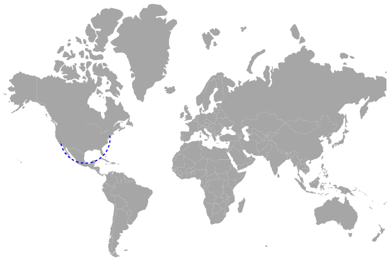
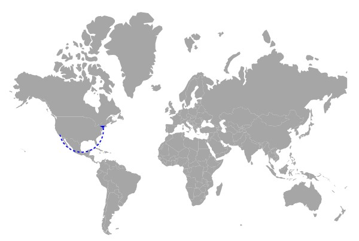

# Navigation Lines in Blazor Maps Component

Navigation lines denote the path between two locations and can represent flight or sea routes. Enable navigation lines by setting the [Visible](https://help.syncfusion.com/cr/blazor/Syncfusion.Blazor.Maps.MapsNavigationLine.html#Syncfusion_Blazor_Maps_MapsNavigationLine_Visible) property of [MapsNavigationLine](https://help.syncfusion.com/cr/blazor/Syncfusion.Blazor.Maps.MapsNavigationLine.html) to **true**.

## Customization

The following properties and classes in [MapsNavigationLine](https://help.syncfusion.com/cr/blazor/Syncfusion.Blazor.Maps.MapsNavigationLine.html) customize navigation lines in Maps:

* [Color](https://help.syncfusion.com/cr/blazor/Syncfusion.Blazor.Maps.MapsNavigationLine.html#Syncfusion_Blazor_Maps_MapsNavigationLine_Color) – Applies the line color.
* [DashArray](https://help.syncfusion.com/cr/blazor/Syncfusion.Blazor.Maps.MapsNavigationLine.html#Syncfusion_Blazor_Maps_MapsNavigationLine_DashArray) – Defines dash and gap patterns for the line stroke.
* [Width](https://help.syncfusion.com/cr/blazor/Syncfusion.Blazor.Maps.MapsNavigationLine.html#Syncfusion_Blazor_Maps_MapsNavigationLine_Width) – Sets the line width.
* [Angle](https://help.syncfusion.com/cr/blazor/Syncfusion.Blazor.Maps.MapsNavigationLine.html#Syncfusion_Blazor_Maps_MapsNavigationLine_Angle) – Adjusts the curvature angle of the line.
* [MapsNavigationLineHighlightSettings](https://help.syncfusion.com/cr/blazor/Syncfusion.Blazor.Maps.MapsNavigationLineHighlightSettings.html) – Configures highlight settings.
* [MapsNavigationLineSelectionSettings](https://help.syncfusion.com/cr/blazor/Syncfusion.Blazor.Maps.MapsNavigationLineSelectionSettings.html) – Configures selection settings.

To draw a line between two cities on the world map, use [Latitude](https://help.syncfusion.com/cr/blazor/Syncfusion.Blazor.Maps.MapsNavigationLine.html#Syncfusion_Blazor_Maps_MapsNavigationLine_Latitude) and [Longitude](https://help.syncfusion.com/cr/blazor/Syncfusion.Blazor.Maps.MapsNavigationLine.html#Syncfusion_Blazor_Maps_MapsNavigationLine_Longitude) values to specify start and end points.

```cshtml

@using Syncfusion.Blazor.Maps

<SfMaps>
    <MapsLayers>
        <MapsLayer ShapeData='new {dataOptions ="https://cdn.syncfusion.com/maps/map-data/world-map.json"}' TValue="string">
            <MapsNavigationLines>
                <MapsNavigationLine Visible="true" Color="blue" Angle="90" Width="2" DashArray="4"
                                    Latitude="new double[]{ 40.7128, 36.7783 }" Longitude="new double[]{ -74.0060, -119.4179 }">
                </MapsNavigationLine>
            </MapsNavigationLines>
        </MapsLayer>
    </MapsLayers>
</SfMaps>

```



## Enabling the arrows

Enable an arrow on the navigation line by setting the [ShowArrow](https://help.syncfusion.com/cr/blazor/Syncfusion.Blazor.Maps.MapsArrow.html#Syncfusion_Blazor_Maps_MapsArrow_ShowArrow) property of [MapsArrow](https://help.syncfusion.com/cr/blazor/Syncfusion.Blazor.Maps.MapsArrow.html) to true. Customize arrow appearance with the following properties:

* [Color](https://help.syncfusion.com/cr/blazor/Syncfusion.Blazor.Maps.MapsArrow.html#Syncfusion_Blazor_Maps_MapsArrow_Color) – Applies the arrow color.
* [Offset](https://help.syncfusion.com/cr/blazor/Syncfusion.Blazor.Maps.MapsArrow.html#Syncfusion_Blazor_Maps_MapsArrow_OffSet) – Sets the arrow offset along the line.
* [Position](https://help.syncfusion.com/cr/blazor/Syncfusion.Blazor.Maps.ArrowPosition.html#Syncfusion_Blazor_Maps_ArrowPosition_Start) – Positions the arrow on the line. Possible values: [Start](https://help.syncfusion.com/cr/blazor/Syncfusion.Blazor.Maps.ArrowPosition.html#Syncfusion_Blazor_Maps_ArrowPosition_Start) and [End](https://help.syncfusion.com/cr/blazor/Syncfusion.Blazor.Maps.ArrowPosition.html#Syncfusion_Blazor_Maps_ArrowPosition_End).
* [Size](https://help.syncfusion.com/cr/blazor/Syncfusion.Blazor.Maps.MapsArrow.html#Syncfusion_Blazor_Maps_MapsArrow_Size) – Sets the arrow size in pixels.

```cshtml

@using Syncfusion.Blazor.Maps

<SfMaps>
    <MapsLayers>
        <MapsLayer ShapeData='new {dataOptions ="https://cdn.syncfusion.com/maps/map-data/world-map.json"}' TValue="string">
            <MapsNavigationLines>
                <MapsNavigationLine Visible="true" Color="blue" Angle="90" Width="2" DashArray="4"
                                    Latitude="new double[]{ 40.7128, 36.7783 }" Longitude="new double[]{ -74.0060, -119.4179 }">
                    @*  To set arrow for navigation line  *@
                    <MapsArrow ShowArrow="true" Color="blue"></MapsArrow>
                </MapsNavigationLine>
            </MapsNavigationLines>
        </MapsLayer>
    </MapsLayers>
</SfMaps>

```


