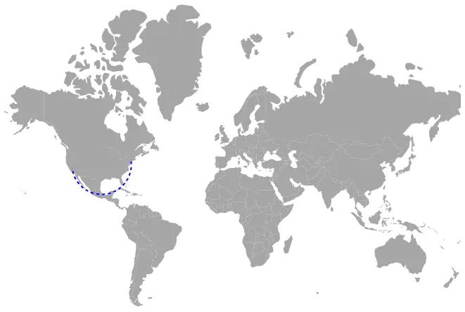
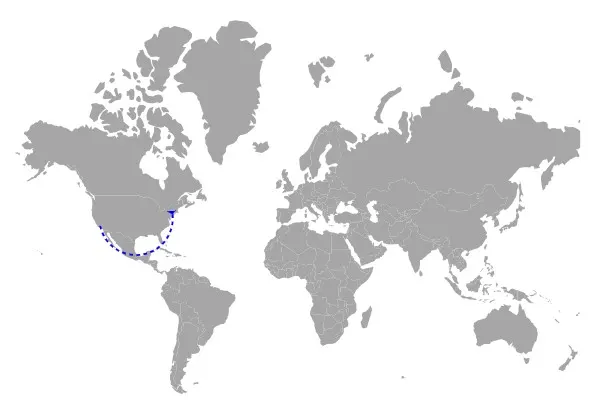

# Blazor Maps Navigation Lines

Navigation lines denote the path between two locations and can represent flight or sea routes. Enable navigation lines by adding a [MapsNavigationLine](https://help.syncfusion.com/cr/blazor/Syncfusion.Blazor.Maps.MapsNavigationLine.html) within [MapsNavigationLines](https://help.syncfusion.com/cr/blazor/Syncfusion.Blazor.Maps.MapsNavigationLines.html) and setting the [Visible](https://help.syncfusion.com/cr/blazor/Syncfusion.Blazor.Maps.MapsNavigationLine.html#Syncfusion_Blazor_Maps_MapsNavigationLine_Visible) property of [MapsNavigationLine](https://help.syncfusion.com/cr/blazor/Syncfusion.Blazor.Maps.MapsNavigationLine.html) to **true**.

## Customization

The following properties and classes in [MapsNavigationLine](https://help.syncfusion.com/cr/blazor/Syncfusion.Blazor.Maps.MapsNavigationLine.html) customize navigation lines in Maps:

* [Color](https://help.syncfusion.com/cr/blazor/Syncfusion.Blazor.Maps.MapsNavigationLine.html#Syncfusion_Blazor_Maps_MapsNavigationLine_Color) – Applies the line color.
* [DashArray](https://help.syncfusion.com/cr/blazor/Syncfusion.Blazor.Maps.MapsNavigationLine.html#Syncfusion_Blazor_Maps_MapsNavigationLine_DashArray) – Defines dash and gap patterns for the line stroke.
* [Width](https://help.syncfusion.com/cr/blazor/Syncfusion.Blazor.Maps.MapsNavigationLine.html#Syncfusion_Blazor_Maps_MapsNavigationLine_Width) – Sets the line width.
* [Angle](https://help.syncfusion.com/cr/blazor/Syncfusion.Blazor.Maps.MapsNavigationLine.html#Syncfusion_Blazor_Maps_MapsNavigationLine_Angle) – Adjusts the curvature angle of the line.
* [MapsNavigationLineHighlightSettings](https://help.syncfusion.com/cr/blazor/Syncfusion.Blazor.Maps.MapsNavigationLineHighlightSettings.html) – Configures highlight settings.
* [MapsNavigationLineSelectionSettings](https://help.syncfusion.com/cr/blazor/Syncfusion.Blazor.Maps.MapsNavigationLineSelectionSettings.html) – Configures selection settings.

To draw a line between two locations on the world map, assign two-element arrays to the [Latitude](https://help.syncfusion.com/cr/blazor/Syncfusion.Blazor.Maps.MapsNavigationLine.html#Syncfusion_Blazor_Maps_MapsNavigationLine_Latitude) and [Longitude](https://help.syncfusion.com/cr/blazor/Syncfusion.Blazor.Maps.MapsNavigationLine.html#Syncfusion_Blazor_Maps_MapsNavigationLine_Longitude) properties — the first value is the start point and the second is the end point. The [Angle](https://help.syncfusion.com/cr/blazor/Syncfusion.Blazor.Maps.MapsNavigationLine.html#Syncfusion_Blazor_Maps_MapsNavigationLine_Angle) property curves the line: **0** draws a straight line and larger values increase the curvature.

```cshtml

@using Syncfusion.Blazor.Maps

<SfMaps>
    <MapsLayers>
        <MapsLayer ShapeData='new {dataOptions ="https://cdn.syncfusion.com/maps/map-data/world-map.json"}' TValue="string">
            <MapsNavigationLines>
                <MapsNavigationLine Visible="true" Color="blue" Angle="90" Width="2" DashArray="4"
                                    Latitude="new double[]{ 40.7128, 36.7783 }" Longitude="new double[]{ -74.0060, -119.4179 }">
                </MapsNavigationLine>
            </MapsNavigationLines>
        </MapsLayer>
    </MapsLayers>
</SfMaps>

```



## Enabling the arrows

Enable an arrow on the navigation line by adding a [MapsArrow](https://help.syncfusion.com/cr/blazor/Syncfusion.Blazor.Maps.MapsArrow.html) inside [MapsNavigationLine](https://help.syncfusion.com/cr/blazor/Syncfusion.Blazor.Maps.MapsNavigationLine.html) and setting its [ShowArrow](https://help.syncfusion.com/cr/blazor/Syncfusion.Blazor.Maps.MapsArrow.html#Syncfusion_Blazor_Maps_MapsArrow_ShowArrow) property to **true**. Customize the arrow appearance with the following properties:

* [Color](https://help.syncfusion.com/cr/blazor/Syncfusion.Blazor.Maps.MapsArrow.html#Syncfusion_Blazor_Maps_MapsArrow_Color) – Applies the arrow color.
* [Offset](https://help.syncfusion.com/cr/blazor/Syncfusion.Blazor.Maps.MapsArrow.html#Syncfusion_Blazor_Maps_MapsArrow_OffSet) – Sets the arrow offset along the line.
* [Position](https://help.syncfusion.com/cr/blazor/Syncfusion.Blazor.Maps.MapsArrow.html#Syncfusion_Blazor_Maps_MapsArrow_Position) – Positions the arrow on the line, using the [ArrowPosition](https://help.syncfusion.com/cr/blazor/Syncfusion.Blazor.Maps.ArrowPosition.html) enum. Possible values: `Start` and `End`.
* [Size](https://help.syncfusion.com/cr/blazor/Syncfusion.Blazor.Maps.MapsArrow.html#Syncfusion_Blazor_Maps_MapsArrow_Size) – Sets the arrow size in pixels.

```cshtml

@using Syncfusion.Blazor.Maps

<SfMaps>
    <MapsLayers>
        <MapsLayer ShapeData='new {dataOptions ="https://cdn.syncfusion.com/maps/map-data/world-map.json"}' TValue="string">
            <MapsNavigationLines>
                <MapsNavigationLine Visible="true" Color="blue" Angle="90" Width="2" DashArray="4"
                                    Latitude="new double[]{ 40.7128, 36.7783 }" Longitude="new double[]{ -74.0060, -119.4179 }">
                    @* To set an arrow for the navigation line *@
                    <MapsArrow ShowArrow="true" Color="blue"></MapsArrow>
                </MapsNavigationLine>
            </MapsNavigationLines>
        </MapsLayer>
    </MapsLayers>
</SfMaps>

```



## See also

* [Create routes between markers in Blazor Maps](how-to/creating-routes-between-the-markers)
* [Markers in Blazor Maps](markers)
