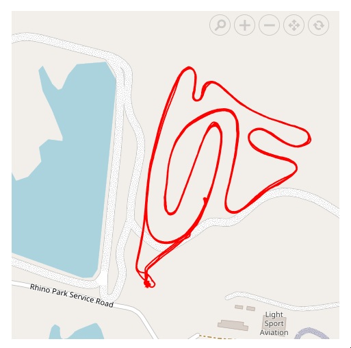

# Polygon shape in Blazor Maps Component

The Maps component allows you to add polygon shape to a geometry map or an online map by using the properties in the [MapsPolygon](https://help.syncfusion.com/cr/blazor/Syncfusion.Blazor.Maps.MapsPolygon.html) tag. This section describes how to add polygon shape to the map and customize them.

## Adding polygon shape

The polygon shape can be rendered over the map layer by defining the [Points](https://help.syncfusion.com/cr/blazor/Syncfusion.Blazor.Maps.MapsPolygon.html#Syncfusion_Blazor_Maps_MapsPolygon_Points) property in the [MapsPolygon](https://help.syncfusion.com/cr/blazor/Syncfusion.Blazor.Maps.MapsPolygon.html) tag in the Maps component. The `Points` property uses a collection of latitude and longitude values to define the polygon shape.

The `MapsPolygon` tag provides the following properties for customizing the polygon shape of the Maps component.

* [Fill](https://help.syncfusion.com/cr/blazor/Syncfusion.Blazor.Maps.MapsPolygon.html#Syncfusion_Blazor_Maps_MapsPolygon_Fill) - It is used to change the color of the polygon shape.
* [Opacity](https://help.syncfusion.com/cr/blazor/Syncfusion.Blazor.Maps.MapsPolygon.html#Syncfusion_Blazor_Maps_MapsPolygon_Opacity) - It is used to change the opacity of the polygon shape.
* [BorderColor](https://help.syncfusion.com/cr/blazor/Syncfusion.Blazor.Maps.MapsPolygon.html#Syncfusion_Blazor_Maps_MapsPolygon_BorderColor) - It is used to change the color of the border in the polygon shape.
* [BorderWidth](https://help.syncfusion.com/cr/blazor/Syncfusion.Blazor.Maps.MapsPolygon.html#Syncfusion_Blazor_Maps_MapsPolygon_BorderWidth) - It is used to change the width of the border in the polygon shape.
* [BorderOpacity](https://help.syncfusion.com/cr/blazor/Syncfusion.Blazor.Maps.MapsPolygon.html#Syncfusion_Blazor_Maps_MapsPolygon_BorderOpacity) - It is used to change the opacity of the border in the polygon shape.

> You can also include **"n"** polygon shapes inside the [MapsPolygons](https://help.syncfusion.com/cr/blazor/Syncfusion.Blazor.Maps.MapsPolygons.html) tag.

The following example shows how to customize the polygon shape over the geometry map.

```cshtml
@using Syncfusion.Blazor.Maps

<SfMaps>
    <MapsLayers>
        <MapsLayer ShapeData='new {dataOptions= "https://cdn.syncfusion.com/maps/map-data/world-map.json"}' TValue="string">
            <MapsPolygons>
                <MapsPolygon Points="Points" Fill="red" Opacity="0.7" BorderColor="green" BorderWidth="2" BorderOpacity="0.7"></MapsPolygon>
            </MapsPolygons>
        </MapsLayer>
    </MapsLayers>
</SfMaps>

@code {
    List<Coordinate> Points = new List<Coordinate>();
    protected override async Task OnInitializedAsync()
    {
        await base.OnInitializedAsync();
        Points.Add(new Coordinate() { Longitude = 34.88539587371454, Latitude = 28.181421087099537 });
        Points.Add(new Coordinate() { Longitude = 37.50029619722466, Latitude = 24.299419888989462 });
        Points.Add(new Coordinate() { Longitude = 39.22241423764024, Latitude = 22.638529461838658 });
        Points.Add(new Coordinate() { Longitude = 38.95650769309776, Latitude = 21.424998160017495 });
        Points.Add(new Coordinate() { Longitude = 40.19963938650778, Latitude = 20.271205391339606 });
        Points.Add(new Coordinate() { Longitude = 41.76547269134551, Latitude = 18.315451049867193 });
        Points.Add(new Coordinate() { Longitude = 42.78452077838921, Latitude = 16.097235052947966 });
        Points.Add(new Coordinate() { Longitude = 43.36984949591576, Latitude = 17.188572054533054 });
        Points.Add(new Coordinate() { Longitude = 44.12558191797012, Latitude = 17.407258102232234 });
        Points.Add(new Coordinate() { Longitude = 46.69027032797584, Latitude = 17.33342243475734 });
        Points.Add(new Coordinate() { Longitude = 47.09312386141585, Latitude = 16.97087769526452 });
        Points.Add(new Coordinate() { Longitude = 48.3417299826302, Latitude = 18.152700711188004 });
        Points.Add(new Coordinate() { Longitude = 49.74762591400318, Latitude = 18.81544363931681 });
        Points.Add(new Coordinate() { Longitude = 52.41428026336621, Latitude = 18.9035706497573 });
        Points.Add(new Coordinate() { Longitude = 55.272683129240335, Latitude = 20.133861012918544 });
        Points.Add(new Coordinate() { Longitude = 55.60121336079203, Latitude = 21.92042703112351 });
        Points.Add(new Coordinate() { Longitude = 55.08204399107967, Latitude = 22.823302662258882 });
        Points.Add(new Coordinate() { Longitude = 52.743894337844154, Latitude = 22.954463486477437 });
        Points.Add(new Coordinate() { Longitude = 51.47035908651375, Latitude = 24.35818837668566 });
        Points.Add(new Coordinate() { Longitude = 51.122553219055874, Latitude = 24.666679732426346 });
        Points.Add(new Coordinate() { Longitude = 51.58731671256831, Latitude = 25.173806925822717 });
        Points.Add(new Coordinate() { Longitude = 51.35950585992913, Latitude = 25.84556484481108 });
        Points.Add(new Coordinate() { Longitude = 51.088770529661275, Latitude = 26.168494193631147 });
        Points.Add(new Coordinate() { Longitude = 50.78527056538036, Latitude = 25.349051242147596 });
        Points.Add(new Coordinate() { Longitude = 50.88330288802666, Latitude = 24.779242606720743 });
        Points.Add(new Coordinate() { Longitude = 50.19702490702369, Latitude = 25.66825106363693 });
        Points.Add(new Coordinate() { Longitude = 50.066461167339924, Latitude = 26.268905608606616 });
        Points.Add(new Coordinate() { Longitude = 49.645896067213215, Latitude = 27.15116474192905 });
        Points.Add(new Coordinate() { Longitude = 48.917371072320805, Latitude = 27.55738830340198 });
        Points.Add(new Coordinate() { Longitude = 48.3984720209192, Latitude = 28.566207269716173 });
        Points.Add(new Coordinate() { Longitude = 47.68851714518985, Latitude = 28.5938991332588 });
        Points.Add(new Coordinate() { Longitude = 47.45059089191449, Latitude = 29.009321449856984 });
        Points.Add(new Coordinate() { Longitude = 44.73549453609391, Latitude = 29.157358362696385 });
        Points.Add(new Coordinate() { Longitude = 41.79487372890989, Latitude = 31.23489959729713 });
        Points.Add(new Coordinate() { Longitude = 40.36977176033773, Latitude = 31.9642352513131 });
        Points.Add(new Coordinate() { Longitude = 39.168270913149826, Latitude = 32.18348471414393 });
        Points.Add(new Coordinate() { Longitude = 37.019253492546454, Latitude = 31.47710220862595 });
        Points.Add(new Coordinate() { Longitude = 37.99644645508337, Latitude = 30.4851028633376 });
        Points.Add(new Coordinate() { Longitude = 37.67756530485232, Latitude = 30.3636358598429 });
        Points.Add(new Coordinate() { Longitude = 37.50181466030105, Latitude = 29.960155516804974 });
        Points.Add(new Coordinate() { Longitude = 36.700288181129594, Latitude = 29.882136586478993 });
        Points.Add(new Coordinate() { Longitude = 36.100009274845206, Latitude = 29.15308642012721 });
        Points.Add(new Coordinate() { Longitude = 34.85774476486728, Latitude = 29.3103032832622 });
        Points.Add(new Coordinate() { Longitude = 34.64498583263142, Latitude = 28.135787235699823 });
        Points.Add(new Coordinate() { Longitude = 34.88539587371454, Latitude = 28.181421087099537 });
    }
}
```


## Tooltip

Tooltip is used to display more information about a polygon shape during a mouse or touch interaction. Tooltip and tooltip template can be enabled by setting the [Visible](https://help.syncfusion.com/cr/blazor/Syncfusion.Blazor.Maps.MapsPolygonTooltipSettings.html#Syncfusion_Blazor_Maps_MapsPolygonTooltipSettings_Visible) property to **true** in the [MapsPolygonTooltipSettings](https://help.syncfusion.com/cr/blazor/Syncfusion.Blazor.Maps.MapsPolygonTooltipSettings.html). Additionally, you need to set the desired content as a value to the [TooltipText](https://help.syncfusion.com/cr/blazor/Syncfusion.Blazor.Maps.MapsPolygon.html#Syncfusion_Blazor_Maps_MapsPolygon_TooltipText) property in the [MapsPolygon](https://help.syncfusion.com/cr/blazor/Syncfusion.Blazor.Maps.MapsPolygon.html) tag to show the tooltip. If you add 'n' numbers of polygon shapes, you can add the `TooltipText` property to each polygon, which will display the tooltip for the associated polygon shape.

### Tooltip customization

The following properties are available in the [MapsPolygonTooltipSettings](https://help.syncfusion.com/cr/blazor/Syncfusion.Blazor.Maps.MapsPolygonTooltipSettings.html) to customize the appearance of the tooltip.

* [Fill](https://help.syncfusion.com/cr/blazor/Syncfusion.Blazor.Maps.MapsPolygonTooltipSettings.html#Syncfusion_Blazor_Maps_MapsPolygonTooltipSettings_Fill) - Applies the color of the tooltip in the polygon shape.
* [BorderColor](https://help.syncfusion.com/cr/blazor/Syncfusion.Blazor.Maps.MapsPolygonTooltipSettings.html#Syncfusion_Blazor_Maps_MapsPolygonTooltipSettings_BorderColor) - To change the color of the border of the tooltip in the polygon shape.
* [BorderWidth](https://help.syncfusion.com/cr/blazor/Syncfusion.Blazor.Maps.MapsPolygonTooltipSettings.html#Syncfusion_Blazor_Maps_MapsPolygonTooltipSettings_BorderWidth) - To change the width of the border of the tooltip in the polygon shape.
* [BorderOpacity](https://help.syncfusion.com/cr/blazor/Syncfusion.Blazor.Maps.MapsPolygonTooltipSettings.html#Syncfusion_Blazor_Maps_MapsPolygonTooltipSettings_BorderOpacity) - To change the opacity of the border of the tooltip in the polygon shape.
* [FontFamily](https://help.syncfusion.com/cr/blazor/Syncfusion.Blazor.Maps.MapsPolygonTooltipSettings.html#Syncfusion_Blazor_Maps_MapsPolygonTooltipSettings_FontFamily) - To change the font family of the text in the tooltip of the polygon shape.
* [FontWeight](https://help.syncfusion.com/cr/blazor/Syncfusion.Blazor.Maps.MapsPolygonTooltipSettings.html#Syncfusion_Blazor_Maps_MapsPolygonTooltipSettings_FontWeight) - To change the font weight of the text in the tooltip of the polygon shape.
* [FontStyle](https://help.syncfusion.com/cr/blazor/Syncfusion.Blazor.Maps.MapsPolygonTooltipSettings.html#Syncfusion_Blazor_Maps_MapsPolygonTooltipSettings_FontStyle) - To change the font style of the text in the tooltip of the polygon shape.
* [FontColor](https://help.syncfusion.com/cr/blazor/Syncfusion.Blazor.Maps.MapsPolygonTooltipSettings.html#Syncfusion_Blazor_Maps_MapsPolygonTooltipSettings_FontColor) - To change the font color of the text in the tooltip of the polygon shape.
* [FontSize](https://help.syncfusion.com/cr/blazor/Syncfusion.Blazor.Maps.MapsPolygonTooltipSettings.html#Syncfusion_Blazor_Maps_MapsPolygonTooltipSettings_FontSize) - To change the font size of the text in the tooltip of the polygon shape.
* [FontOpacity](https://help.syncfusion.com/cr/blazor/Syncfusion.Blazor.Maps.MapsPolygonTooltipSettings.html#Syncfusion_Blazor_Maps_MapsPolygonTooltipSettings_FontOpacity) - To change the opacity of the text in the tooltip of the polygon shape.


```cshtml
@using Syncfusion.Blazor.Maps

<SfMaps>
    <MapsLayers>
        <MapsLayer ShapeData='new {dataOptions= "https://cdn.syncfusion.com/maps/map-data/world-map.json"}' TValue="string">
            <MapsPolygons>
                <MapsPolygon Points="Points" Fill="red" TooltipText="Saudi Arabia" Opacity="0.7" BorderColor="green" BorderWidth="2" BorderOpacity="0.7">
                </MapsPolygon>
                <MapsPolygonTooltipSettings Visible="true" BorderColor="Red" BorderWidth="2">
                </MapsPolygonTooltipSettings>
            </MapsPolygons>
        </MapsLayer>
    </MapsLayers>
</SfMaps>

@code {
    List<Coordinate> Points = new List<Coordinate>();
    protected override async Task OnInitializedAsync()
    {
        await base.OnInitializedAsync();
        Points.Add(new Coordinate() { Longitude = 34.88539587371454, Latitude = 28.181421087099537 });
        Points.Add(new Coordinate() { Longitude = 37.50029619722466, Latitude = 24.299419888989462 });
        Points.Add(new Coordinate() { Longitude = 39.22241423764024, Latitude = 22.638529461838658 });
        Points.Add(new Coordinate() { Longitude = 38.95650769309776, Latitude = 21.424998160017495 });
        Points.Add(new Coordinate() { Longitude = 40.19963938650778, Latitude = 20.271205391339606 });
        Points.Add(new Coordinate() { Longitude = 41.76547269134551, Latitude = 18.315451049867193 });
        Points.Add(new Coordinate() { Longitude = 42.78452077838921, Latitude = 16.097235052947966 });
        Points.Add(new Coordinate() { Longitude = 43.36984949591576, Latitude = 17.188572054533054 });
        Points.Add(new Coordinate() { Longitude = 44.12558191797012, Latitude = 17.407258102232234 });
        Points.Add(new Coordinate() { Longitude = 46.69027032797584, Latitude = 17.33342243475734 });
        Points.Add(new Coordinate() { Longitude = 47.09312386141585, Latitude = 16.97087769526452 });
        Points.Add(new Coordinate() { Longitude = 48.3417299826302, Latitude = 18.152700711188004 });
        Points.Add(new Coordinate() { Longitude = 49.74762591400318, Latitude = 18.81544363931681 });
        Points.Add(new Coordinate() { Longitude = 52.41428026336621, Latitude = 18.9035706497573 });
        Points.Add(new Coordinate() { Longitude = 55.272683129240335, Latitude = 20.133861012918544 });
        Points.Add(new Coordinate() { Longitude = 55.60121336079203, Latitude = 21.92042703112351 });
        Points.Add(new Coordinate() { Longitude = 55.08204399107967, Latitude = 22.823302662258882 });
        Points.Add(new Coordinate() { Longitude = 52.743894337844154, Latitude = 22.954463486477437 });
        Points.Add(new Coordinate() { Longitude = 51.47035908651375, Latitude = 24.35818837668566 });
        Points.Add(new Coordinate() { Longitude = 51.122553219055874, Latitude = 24.666679732426346 });
        Points.Add(new Coordinate() { Longitude = 51.58731671256831, Latitude = 25.173806925822717 });
        Points.Add(new Coordinate() { Longitude = 51.35950585992913, Latitude = 25.84556484481108 });
        Points.Add(new Coordinate() { Longitude = 51.088770529661275, Latitude = 26.168494193631147 });
        Points.Add(new Coordinate() { Longitude = 50.78527056538036, Latitude = 25.349051242147596 });
        Points.Add(new Coordinate() { Longitude = 50.88330288802666, Latitude = 24.779242606720743 });
        Points.Add(new Coordinate() { Longitude = 50.19702490702369, Latitude = 25.66825106363693 });
        Points.Add(new Coordinate() { Longitude = 50.066461167339924, Latitude = 26.268905608606616 });
        Points.Add(new Coordinate() { Longitude = 49.645896067213215, Latitude = 27.15116474192905 });
        Points.Add(new Coordinate() { Longitude = 48.917371072320805, Latitude = 27.55738830340198 });
        Points.Add(new Coordinate() { Longitude = 48.3984720209192, Latitude = 28.566207269716173 });
        Points.Add(new Coordinate() { Longitude = 47.68851714518985, Latitude = 28.5938991332588 });
        Points.Add(new Coordinate() { Longitude = 47.45059089191449, Latitude = 29.009321449856984 });
        Points.Add(new Coordinate() { Longitude = 44.73549453609391, Latitude = 29.157358362696385 });
        Points.Add(new Coordinate() { Longitude = 41.79487372890989, Latitude = 31.23489959729713 });
        Points.Add(new Coordinate() { Longitude = 40.36977176033773, Latitude = 31.9642352513131 });
        Points.Add(new Coordinate() { Longitude = 39.168270913149826, Latitude = 32.18348471414393 });
        Points.Add(new Coordinate() { Longitude = 37.019253492546454, Latitude = 31.47710220862595 });
        Points.Add(new Coordinate() { Longitude = 37.99644645508337, Latitude = 30.4851028633376 });
        Points.Add(new Coordinate() { Longitude = 37.67756530485232, Latitude = 30.3636358598429 });
        Points.Add(new Coordinate() { Longitude = 37.50181466030105, Latitude = 29.960155516804974 });
        Points.Add(new Coordinate() { Longitude = 36.700288181129594, Latitude = 29.882136586478993 });
        Points.Add(new Coordinate() { Longitude = 36.100009274845206, Latitude = 29.15308642012721 });
        Points.Add(new Coordinate() { Longitude = 34.85774476486728, Latitude = 29.3103032832622 });
        Points.Add(new Coordinate() { Longitude = 34.64498583263142, Latitude = 28.135787235699823 });
        Points.Add(new Coordinate() { Longitude = 34.88539587371454, Latitude = 28.181421087099537 });
    }
}

```


### Tooltip template

Any HTML element can be rendered in the tooltip of the polygon shapes using the [TooltipTemplate](https://help.syncfusion.com/cr/blazor/Syncfusion.Blazor.Maps.MapsPolygon.html#Syncfusion_Blazor_Maps_MapsPolygon_TooltipTemplate) property of the [MapsPolygon](https://help.syncfusion.com/cr/blazor/Syncfusion.Blazor.Maps.MapsPolygon.html). If you add 'n' numbers of polygon shapes, you can add the `TooltipTemplate` property to each polygon, which will display the tooltip for the associated polygon shape.

```cshtml
@using Syncfusion.Blazor.Maps

<SfMaps>
    <MapsLayers>
        <MapsLayer ShapeData='new {dataOptions= "https://cdn.syncfusion.com/maps/map-data/world-map.json"}' TValue="string">
            <MapsPolygons>
                <MapsPolygon Points="Points" Fill="red" Opacity="0.7" BorderColor="green" BorderWidth="2" BorderOpacity="0.7">
                    <TooltipTemplate> <div style="width:240px;border: 2px solid #000;padding: 10px;background-color:white;color:black;font-weight:bold;font-size:15px;"> Country Name : Saudi Arabia</div> </TooltipTemplate>
                </MapsPolygon>
                <MapsPolygonTooltipSettings Visible="true"></MapsPolygonTooltipSettings>
            </MapsPolygons>
        </MapsLayer>
    </MapsLayers>
</SfMaps>

@code {
    List<Coordinate> Points = new List<Coordinate>();
    protected override async Task OnInitializedAsync()
    {
        await base.OnInitializedAsync();
        Points.Add(new Coordinate() { Longitude = 34.88539587371454, Latitude = 28.181421087099537 });
        Points.Add(new Coordinate() { Longitude = 37.50029619722466, Latitude = 24.299419888989462 });
        Points.Add(new Coordinate() { Longitude = 39.22241423764024, Latitude = 22.638529461838658 });
        Points.Add(new Coordinate() { Longitude = 38.95650769309776, Latitude = 21.424998160017495 });
        Points.Add(new Coordinate() { Longitude = 40.19963938650778, Latitude = 20.271205391339606 });
        Points.Add(new Coordinate() { Longitude = 41.76547269134551, Latitude = 18.315451049867193 });
        Points.Add(new Coordinate() { Longitude = 42.78452077838921, Latitude = 16.097235052947966 });
        Points.Add(new Coordinate() { Longitude = 43.36984949591576, Latitude = 17.188572054533054 });
        Points.Add(new Coordinate() { Longitude = 44.12558191797012, Latitude = 17.407258102232234 });
        Points.Add(new Coordinate() { Longitude = 46.69027032797584, Latitude = 17.33342243475734 });
        Points.Add(new Coordinate() { Longitude = 47.09312386141585, Latitude = 16.97087769526452 });
        Points.Add(new Coordinate() { Longitude = 48.3417299826302, Latitude = 18.152700711188004 });
        Points.Add(new Coordinate() { Longitude = 49.74762591400318, Latitude = 18.81544363931681 });
        Points.Add(new Coordinate() { Longitude = 52.41428026336621, Latitude = 18.9035706497573 });
        Points.Add(new Coordinate() { Longitude = 55.272683129240335, Latitude = 20.133861012918544 });
        Points.Add(new Coordinate() { Longitude = 55.60121336079203, Latitude = 21.92042703112351 });
        Points.Add(new Coordinate() { Longitude = 55.08204399107967, Latitude = 22.823302662258882 });
        Points.Add(new Coordinate() { Longitude = 52.743894337844154, Latitude = 22.954463486477437 });
        Points.Add(new Coordinate() { Longitude = 51.47035908651375, Latitude = 24.35818837668566 });
        Points.Add(new Coordinate() { Longitude = 51.122553219055874, Latitude = 24.666679732426346 });
        Points.Add(new Coordinate() { Longitude = 51.58731671256831, Latitude = 25.173806925822717 });
        Points.Add(new Coordinate() { Longitude = 51.35950585992913, Latitude = 25.84556484481108 });
        Points.Add(new Coordinate() { Longitude = 51.088770529661275, Latitude = 26.168494193631147 });
        Points.Add(new Coordinate() { Longitude = 50.78527056538036, Latitude = 25.349051242147596 });
        Points.Add(new Coordinate() { Longitude = 50.88330288802666, Latitude = 24.779242606720743 });
        Points.Add(new Coordinate() { Longitude = 50.19702490702369, Latitude = 25.66825106363693 });
        Points.Add(new Coordinate() { Longitude = 50.066461167339924, Latitude = 26.268905608606616 });
        Points.Add(new Coordinate() { Longitude = 49.645896067213215, Latitude = 27.15116474192905 });
        Points.Add(new Coordinate() { Longitude = 48.917371072320805, Latitude = 27.55738830340198 });
        Points.Add(new Coordinate() { Longitude = 48.3984720209192, Latitude = 28.566207269716173 });
        Points.Add(new Coordinate() { Longitude = 47.68851714518985, Latitude = 28.5938991332588 });
        Points.Add(new Coordinate() { Longitude = 47.45059089191449, Latitude = 29.009321449856984 });
        Points.Add(new Coordinate() { Longitude = 44.73549453609391, Latitude = 29.157358362696385 });
        Points.Add(new Coordinate() { Longitude = 41.79487372890989, Latitude = 31.23489959729713 });
        Points.Add(new Coordinate() { Longitude = 40.36977176033773, Latitude = 31.9642352513131 });
        Points.Add(new Coordinate() { Longitude = 39.168270913149826, Latitude = 32.18348471414393 });
        Points.Add(new Coordinate() { Longitude = 37.019253492546454, Latitude = 31.47710220862595 });
        Points.Add(new Coordinate() { Longitude = 37.99644645508337, Latitude = 30.4851028633376 });
        Points.Add(new Coordinate() { Longitude = 37.67756530485232, Latitude = 30.3636358598429 });
        Points.Add(new Coordinate() { Longitude = 37.50181466030105, Latitude = 29.960155516804974 });
        Points.Add(new Coordinate() { Longitude = 36.700288181129594, Latitude = 29.882136586478993 });
        Points.Add(new Coordinate() { Longitude = 36.100009274845206, Latitude = 29.15308642012721 });
        Points.Add(new Coordinate() { Longitude = 34.85774476486728, Latitude = 29.3103032832622 });
        Points.Add(new Coordinate() { Longitude = 34.64498583263142, Latitude = 28.135787235699823 });
        Points.Add(new Coordinate() { Longitude = 34.88539587371454, Latitude = 28.181421087099537 });
    }
}

```


## Changing a Polygon Shape to a Line

The rendered polygon shape can be changed to a line shape by setting the [ShapeType](https://help.syncfusion.com/cr/blazor/Syncfusion.Blazor.Maps.MapsPolygon.html#Syncfusion_Blazor_Maps_MapsPolygon_ShapeType) property to [LineString](https://help.syncfusion.com/cr/blazor/Syncfusion.Blazor.Maps.PolygonShapeType.html#Syncfusion_Blazor_Maps_PolygonShapeType_LineString).

The following example demonstrates how to customize a line shape on an online map, display a tooltip for the line shape, highlight the line shape, and select the line shape on the map. In this example, latitude and longitude values are extracted from coordinates in a JSON file and assigned to the [Points](https://help.syncfusion.com/cr/blazor/Syncfusion.Blazor.Maps.MapsPolygon.html#Syncfusion_Blazor_Maps_MapsPolygon_Points) property within the [MapsPolygon](https://help.syncfusion.com/cr/blazor/Syncfusion.Blazor.Maps.MapsPolygon.html) tag.

```cshtml
@using Syncfusion.Blazor.Maps
@inject NavigationManager NavigationManager
@inject HttpClient Http;
@using Newtonsoft.Json;

@if(Coordinates != null)
{
    <SfMaps>
        <MapsCenterPosition Latitude="-25.829397669018562" Longitude="28.539912753179671"></MapsCenterPosition>
        <MapsZoomSettings Enable="true" MinZoom="1" MaxZoom="19" ZoomFactor="17">
            <MapsZoomToolbarSettings>
                <MapsZoomToolbarButton ToolbarItems="new List<ToolbarItem>() { ToolbarItem.Zoom, ToolbarItem.ZoomIn, ToolbarItem.ZoomOut,
            ToolbarItem.Pan, ToolbarItem.Reset }"></MapsZoomToolbarButton>
            </MapsZoomToolbarSettings>
        </MapsZoomSettings>
        <MapsLayers>
            <MapsLayer UrlTemplate="https://tile.openstreetmap.org/level/tileX/tileY.png" TValue="string">
                <MapsPolygons>
                    <MapsPolygon Fill="transparent" BorderColor="red" Points="@Coordinates" TooltipText="Line String" BorderWidth="2" ShapeType="PolygonShapeType.LineString">
                    </MapsPolygon>
                    <MapsPolygonTooltipSettings Visible="true" BorderColor="Red" BorderWidth="1">
                    </MapsPolygonTooltipSettings>
                    <MapsPolygonHighlightSettings Enable=true Fill="yellow" Opacity="0.4">
                        <MapsPolygonHighlightBorder Color="blue" Opacity="1" Width="1"></MapsPolygonHighlightBorder>
                    </MapsPolygonHighlightSettings>
                    <MapsPolygonSelectionSettings Enable=true EnableMultiSelect=false Fill="violet" Opacity="0.8">
                        <MapsPolygonSelectionBorder Color="cyan" Opacity="1" Width="1"></MapsPolygonSelectionBorder>
                    </MapsPolygonSelectionSettings>
                </MapsPolygons>
            </MapsLayer>
        </MapsLayers>
    </SfMaps>

}

@code {
    public List<Coordinate> Coordinates = new List<Coordinate>();
    protected override async Task OnInitializedAsync()
    {
        string path = NavigationManager.BaseUri + "line.json";
        HttpClient httpClient = new HttpClient();
        string response = await Http.GetStringAsync(path);
        GeoJson shapeData = JsonConvert.DeserializeObject<GeoJson>(response);
        for (int i = 0; i < shapeData.Features[0].Geometry.Coordinates.Count; i++)
        {
            List<double> coordinate = shapeData.Features[0].Geometry.Coordinates[i];
            Coordinates.Add(new Coordinate() { Longitude = coordinate[0], Latitude = coordinate[1] });
        }
    }

    public class GeoJson
    {
        public string Type { get; set; }
        public List<Feature> Features { get; set; }
    }

    public class Feature
    {
        public string Type { get; set; }
        public Geometry Geometry { get; set; }
        public object Properties { get; set; }
    }

    public class Geometry
    {
        public string Type { get; set; }
        public List<List<double>> Coordinates { get; set; }
    }
}
```
> Note: Refer the content of the JSON file [line.json](https://www.syncfusion.com/downloads/support/directtrac/general/ze/line140125043) here.


