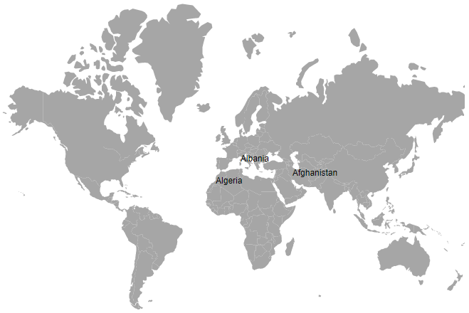

# Populate Data in Blazor Maps Component

This section explains how to supply data inputs and provide them to the Maps component.

## Geometry types

GeoJSON data contains geometry objects with properties such as geometry types and coordinates. Geometry types specify the shape to render, and coordinates define the shape's boundary. The supported geometry types are:

| **Shapes** | **Supported** |
| --- | --- |
|Polygon| Yes |
|MultiPolygon| Yes |
|LineString| Yes |
|MultiLineString| Yes |
|Point| Yes |
|MultiPoint| Yes |
|GeometryCollection| Yes |

## Shape data

The shape data collection describes geographic shape information in GeoJSON format. Map shapes are rendered from this data. Custom shapes, such as seat selections in a bus or a cricket stadium, can also be added as [ShapeData](https://help.syncfusion.com/cr/blazor/Syncfusion.Blazor.Maps.MapsLayer-1.html#Syncfusion_Blazor_Maps_MapsLayer_1_ShapeData) in the [MapsLayer](https://help.syncfusion.com/cr/blazor/Syncfusion.Blazor.Maps.MapsLayer-1.html).

## Data source

The [DataSource](https://help.syncfusion.com/cr/blazor/Syncfusion.Blazor.Maps.MapsLayer-1.html#Syncfusion_Blazor_Maps_MapsLayer_1_DataSource) property represents statistical data for the Maps component and accepts a collection of values. For example, a list of objects can be provided. This data source is used to color shapes, display data labels, show tooltips, and more.

The data source is populated with a list of objects related to the shape data. In the following example, **PopulationDetails** is used as the data source for Maps.

```cshtml

@code{
    public class PopulationDetail
    {
        public string Code { get; set; }
        public double Value { get; set; }
        public string Name { get; set; }
        public double Population { get; set; }
        public double Density { get; set; }
    };
    private List<PopulationDetail> PopulationDetails = new List<PopulationDetail> {
        new PopulationDetail {
            Code = "AF",
            Value= 53,
            Name= "Afghanistan",
            Population= 29863010,
            Density= 119
        },
        new PopulationDetail {
            Code= "AL",
            Value= 117,
            Name= "Albania",
            Population= 3195000,
            Density= 111
        },
        new PopulationDetail {
            Code= "DZ",
            Value= 15,
            Name= "Algeria",
            Population= 34895000,
            Density= 15
        }
    };
}

```

## Data binding

The following properties in the [MapsLayer](https://help.syncfusion.com/cr/blazor/Syncfusion.Blazor.Maps.MapsLayer-1.html) are used to bind data in the Maps component. These properties work together.

* ShapePropertyPath
* ShapeDataPath

### ShapePropertyPath

The [ShapePropertyPath](https://help.syncfusion.com/cr/blazor/Syncfusion.Blazor.Maps.MapsLayer-1.html#Syncfusion_Blazor_Maps_MapsLayer_1_ShapePropertyPath) property refers to the field name in the [ShapeData](https://help.syncfusion.com/cr/blazor/Syncfusion.Blazor.Maps.MapsLayer-1.html#Syncfusion_Blazor_Maps_MapsLayer_1_ShapeData) of shape layers used to identify a shape. When the values of [ShapeDataPath](https://help.syncfusion.com/cr/blazor/Syncfusion.Blazor.Maps.MapsLayer-1.html#Syncfusion_Blazor_Maps_MapsLayer_1_ShapeDataPath) from the [DataSource](https://help.syncfusion.com/cr/blazor/Syncfusion.Blazor.Maps.MapsLayer-1.html#Syncfusion_Blazor_Maps_MapsLayer_1_DataSource) and [ShapePropertyPath](https://help.syncfusion.com/cr/blazor/Syncfusion.Blazor.Maps.MapsLayer-1.html#Syncfusion_Blazor_Maps_MapsLayer_1_ShapePropertyPath) from the [ShapeData](https://help.syncfusion.com/cr/blazor/Syncfusion.Blazor.Maps.MapsLayer-1.html#Syncfusion_Blazor_Maps_MapsLayer_1_ShapeData) match, the associated object from the data source is bound to the corresponding shape.

```cshtml

@using Syncfusion.Blazor.Maps

<SfMaps>
    <MapsLayers>
        <MapsLayer ShapeData='new {dataOptions= "https://cdn.syncfusion.com/maps/map-data/world-map.json"}'
            ShapePropertyPath='new string[] {"name"}' TValue="string">
        </MapsLayer>
    </MapsLayers>
</SfMaps>

```

N> The `world-map.json` file contains the following data, and the **name** field value is used to map the corresponding shape with the provided data source.

```json

[
    {
        "type": "Feature",
        "properties": {
            "admin": "Afghanistan",
            "name": "Afghanistan",
            "continent": "Asia"
        },
        "geometry": { "type": "Polygon", "coordinates": [[[61.21081709172573, ...
    },
...
]

```

### ShapeDataPath

The [ShapeDataPath](https://help.syncfusion.com/cr/blazor/Syncfusion.Blazor.Maps.MapsLayer-1.html#Syncfusion_Blazor_Maps_MapsLayer_1_ShapeDataPath) property is similar to [ShapePropertyPath](https://help.syncfusion.com/cr/blazor/Syncfusion.Blazor.Maps.MapsLayer-1.html#Syncfusion_Blazor_Maps_MapsLayer_1_ShapePropertyPath), but it refers to the field name in the [DataSource](https://help.syncfusion.com/cr/blazor/Syncfusion.Blazor.Maps.MapsLayer-1.html#Syncfusion_Blazor_Maps_MapsLayer_1_DataSource). In the following population data, the fields are **Name**, **Population**, and **Density**. The **Name** field is set to [ShapeDataPath](https://help.syncfusion.com/cr/blazor/Syncfusion.Blazor.Maps.MapsLayer-1.html#Syncfusion_Blazor_Maps_MapsLayer_1_ShapeDataPath) to map the corresponding value of the field name in shape data.

```cshtml

@using Syncfusion.Blazor.Maps

<SfMaps>
    <MapsLayers>
        <MapsLayer ShapeData='new {dataOptions= "https://cdn.syncfusion.com/maps/map-data/world-map.json"}'
            DataSource="PopulationDetails" ShapePropertyPath='new string[] {"name"}'
            ShapeDataPath="Name" TValue="PopulationDetail">
        </MapsLayer>
    </MapsLayers>
</SfMaps>

@code{
    public class PopulationDetail
    {
        public string Name { get; set; }
        public double Population { get; set; }
        public double Density { get; set; }
    };

    private List<PopulationDetail> PopulationDetails = new List<PopulationDetail> {
        new PopulationDetail {
            Name= "Afghanistan",
            Population= 29863010,
            Density= 119
        },
        ...
    };
}

```

In the above example, both **name** fields contain the value **Afghanistan**. This value is matched in both shape data and the data source, so the details associated with **Afghanistan** are mapped to the corresponding shape and used to color the shape, display data labels, and display tooltips.

```cshtml

@using Syncfusion.Blazor.Maps

<SfMaps>
    <MapsLayers>
        <MapsLayer ShapeData='new {dataOptions= "https://cdn.syncfusion.com/maps/map-data/world-map.json"}'
            DataSource="PopulationDetails"
            ShapeDataPath="Name"
            ShapePropertyPath='new string[] {"name"}' TValue="PopulationDetail">
            @*  It display data label for bounded items  *@
            <MapsDataLabelSettings Visible="true" LabelPath="Name"></MapsDataLabelSettings>
        </MapsLayer>
    </MapsLayers>
</SfMaps>

@code {
    public class PopulationDetail
    {
        public string Code { get; set; }
        public double Value { get; set; }
        public string Name { get; set; }
        public double Population { get; set; }
        public double Density { get; set; }
    };

    private List<PopulationDetail> PopulationDetails = new List<PopulationDetail> {
        new PopulationDetail {
            Code = "AF",
            Value= 53,
            Name= "Afghanistan",
            Population= 29863010,
            Density= 119
        },
        new PopulationDetail {
            Code= "AL",
            Value= 117,
            Name= "Albania",
            Population= 3195000,
            Density= 111
        },
        new PopulationDetail {
            Code= "DZ",
            Value= 15,
            Name= "Algeria",
            Population= 34895000,
            Density= 15
        }
    };
}

```



## Fetching data from JSON file

To retrieve data from a JSON file, create a Blazor WebAssembly app or a Blazor Server app. Read the data from the JSON file, convert it to a C# object, and assign it to the [DataSource](https://help.syncfusion.com/cr/blazor/Syncfusion.Blazor.Maps.MapsLayer-1.html#Syncfusion_Blazor_Maps_MapsLayer_1_DataSource) property.

### Fetching data from JSON file using Blazor WebAssembly App

The **Http.GetFromJsonAsync** method is used in the **OnInitializedAsync** lifecycle method to load JSON data. Because this executes asynchronously, check whether **PopulationDensity** is available; then render the Maps component or display a loading message.

```cshtml

@inject HttpClient Http;
@using Syncfusion.Blazor.Maps
@inject NavigationManager NavigationManager

@if (PopulationDensity == null)
{
    <p><em>Loading Maps component...</em></p>
}
else
{
    <SfMaps>
        <MapsLayers>
            <MapsLayer ShapeData='new {dataOptions ="https://cdn.syncfusion.com/maps/map-data/world-map.json"}'
                       DataSource="PopulationDensity"
                       ShapeDataPath="Name"
                       ShapePropertyPath='new string[] {"name"}' TValue="PopulationData">
                <MapsDataLabelSettings Visible="true" LabelPath="Name"></MapsDataLabelSettings>
            </MapsLayer>
        </MapsLayers>
    </SfMaps>
}

@code {
    PopulationData[] PopulationDensity;

    protected override async Task OnInitializedAsync()
    {
        PopulationDensity = await Http.GetFromJsonAsync<PopulationData[]>(NavigationManager.Uri + "sample-data/PopulationDensity.json");
    }

    public class PopulationData
    {
        public string Code { get; set; }
        public double Value { get; set; }
        public string Name { get; set; }
        public double Population { get; set; }
        public float Density { get; set; }
    }
}

```

Here, the `PopulationDensity.json` file contains the following data.

```json

[
    {
        "code": "AF",
        "value": 53,
        "name": "Afghanistan",
        "population": 29863010,
        "density": 119
    },
    {
        "code": "AL",
        "value": 117,
        "name": "Albania",
        "population": 3195000,
        "density": 111
    },
    {
        "code": "DZ",
        "value": 15,
        "name": "Algeria",
        "population": 34895000,
        "density": 15
    }
]

```


### Fetching data from JSON file using  Blazor Server App

The **Http.GetAsync** method is used in the **OnInitializedAsync** lifecycle method to get the JSON file as a response and read it as a string. Then, the JSON data is deserialized to a list of objects and assigned to the **DataSource** property of the Maps component. Because this executes asynchronously, check whether **PopulationDensity** is available; then render the Maps component or display a loading message.


```cshtml

@inject HttpClient Http;
@using Syncfusion.Blazor.Maps
@using System.Net.Http.Json
@using System.Text.Json;
@using Newtonsoft.Json;
@inject NavigationManager NavigationManager

@if (PopulationDensity == null)
{
    <p><em>Loading Maps component...</em></p>
}
else
{
    <SfMaps>
        <MapsLayers>
            <MapsLayer ShapeData='new {dataOptions ="https://cdn.syncfusion.com/maps/map-data/world-map.json"}'
                       DataSource="PopulationDensity"
                       ShapeDataPath="Name"
                       ShapePropertyPath='new string[] {"name"}' TValue="PopulationData">
                <MapsDataLabelSettings Visible="true" LabelPath="Name"></MapsDataLabelSettings>
            </MapsLayer>
        </MapsLayers>
    </SfMaps>
}

@code {
    public List<PopulationData> PopulationDensity;
    public string result;

    protected override async Task OnInitializedAsync()
    {
        string path = NavigationManager.Uri + "sample-data/PopulationDensity.json";
        HttpClient httpClient = new HttpClient();
        HttpResponseMessage response = await Http.GetAsync(path);
        result = response.Content.ReadAsStringAsync().Result;
        PopulationDensity = JsonConvert.DeserializeObject<List<PopulationData>>(result);
    }

    public class PopulationData
    {
        public string Code { get; set; }
        public double Value { get; set; }
        public string Name { get; set; }
        public double Population { get; set; }
        public float Density { get; set; }
    }
}

```


