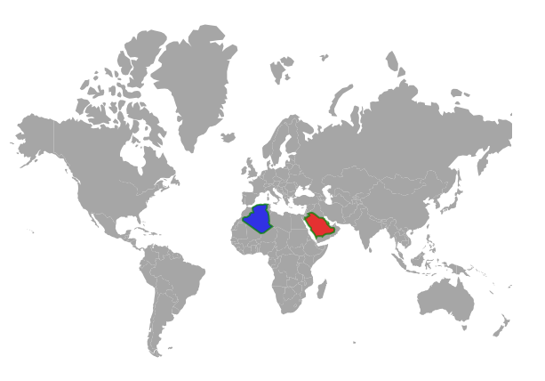

# Populate Data in Blazor Maps Component

This section explains how to populate data inputs and provide it to the Maps component.

## Geometry types

GeoJSON data contains geometry objects with properties such as geometry types and coordinates. The geometry types are the values present in the geometry objects of the GeoJSON data that specify the type of shape to be rendered, as well as the coordinates that help to draw the shape's boundary line. The supportive geometry types are:

| **Shapes** | **Supported** |
| --- | --- |
|Polygon| Yes |
|MultiPolygon| Yes |
|LineString| Yes |
|MultiLineString| Yes |
|Point| Yes |
|MultiPoint| Yes |
|GeometryCollection| Yes |

## Shape data

The shape data collection describes geographical shape information that is available in GeoJSON format. The Map shapes are rendered with this data. The custom shapes such as seat selection in bus, seat selection in a cricket stadium and more useful information can be also added as [ShapeData](https://help.syncfusion.com/cr/blazor/Syncfusion.Blazor.Maps.MapsLayer-1.html#Syncfusion_Blazor_Maps_MapsLayer_1_ShapeData) in the [MapsLayer](https://help.syncfusion.com/cr/blazor/Syncfusion.Blazor.Maps.
MapsLayer-1.html).

## Rendering Polygon Shapes on Map Layers

The Polygon shapes can be rendered over the geometry map or an online map using the [Points](https://help.syncfusion.com/cr/blazor/Syncfusion.Blazor.Maps.MapsPolygon.html#Syncfusion_Blazor_Maps_MapsPolygon_Points) property in the [MapsPolygon](https://help.syncfusion.com/cr/blazor/Syncfusion.Blazor.Maps.MapsPolygon.html) tag of the Maps component. The following properties are available in MapsPolygon to customize the polygon shape of the Maps component.

[Points](https://help.syncfusion.com/cr/blazor/Syncfusion.Blazor.Maps.MapsPolygon.html#Syncfusion_Blazor_Maps_MapsPolygon_Points) - It defines the coordinates of the polygon shape. 
[Fill](https://help.syncfusion.com/cr/blazor/Syncfusion.Blazor.Maps.MapsPolygon.html#Syncfusion_Blazor_Maps_MapsPolygon_Fill) - It is used to customize the color of the polygon shape.
[Opacity](https://help.syncfusion.com/cr/blazor/Syncfusion.Blazor.Maps.MapsPolygon.html#Syncfusion_Blazor_Maps_MapsPolygon_Opacity) - It is used to customize the opacity of the polygon shape.
[BorderColor](https://help.syncfusion.com/cr/blazor/Syncfusion.Blazor.Maps.MapsPolygon.html#Syncfusion_Blazor_Maps_MapsPolygon_BorderColor) - It is used to customize the color of the border in the polygon shape.
[BorderWidth](https://help.syncfusion.com/cr/blazor/Syncfusion.Blazor.Maps.MapsPolygon.html#Syncfusion_Blazor_Maps_MapsPolygon_BorderWidth) - It is used to customize the width of the border in the polygon shape.
[BorderOpacity](https://help.syncfusion.com/cr/blazor/Syncfusion.Blazor.Maps.MapsPolygon.html#Syncfusion_Blazor_Maps_MapsPolygon_BorderOpacity) - It is used to customize the opacity of the border in the polygon shape.

### Highlight and Selection support for the Polygon shape

The highlight of polygon shape's can be customized by using the [MapsPolygonHighlightSettings](https://help.syncfusion.com/cr/blazor/Syncfusion.Blazor.Maps.MapsPolygonHighlightSettings.html) tag. The following properties and a class variables are available in MapsPolygonHighlightSettings to customize the polygon shape when it is highlighted.

[Enable] - It is used to enable highlight for polygon shapes.
[Fill] -  It is used to customize the highlight color for polygon shapes.
[Opacity] - It is used to customize the highlight opacity for polygon shapes.
[MapsPolygonHighlightBorder](https://help.syncfusion.com/cr/blazor/Syncfusion.Blazor.Maps.MapsPolygonHighlightBorder.html) - The properties of [Color](https://help.syncfusion.com/cr/blazor/Syncfusion.Blazor.Maps.MapsPolygonHighlightBorder.html#Syncfusion_Blazor_Maps_MapsPolygonHighlightBorder_Color), [Width](https://help.syncfusion.com/cr/blazor/Syncfusion.Blazor.Maps.MapsPolygonHighlightBorder.html#Syncfusion_Blazor_Maps_MapsPolygonHighlightBorder_Width), and [Opacity](https://help.syncfusion.com/cr/blazor/Syncfusion.Blazor.Maps.MapsPolygonHighlightBorder.html#Syncfusion_Blazor_Maps_MapsPolygonHighlightBorder_Opacity) are used to modify the border of the polygon shape when it is highlighted.

The selection of polygon shape's can be customized by using the [MapsPolygonSelectionSettings](https://help.syncfusion.com/cr/blazor/Syncfusion.Blazor.Maps.MapsPolygonSelectionSettings.html) tag. The following properties are available in  MapsPolygonSelectionSettings to customize the polygon shape when it is selected.

[Enable] - It is used to enable selection for polygon shapes.
[EnableMultiSelect] - It is used to select multiple polygon shapes.
[Fill] -  It is used to customize the selection color for polygon shapes.
[Opacity] - It is used to customize the selection opacity for polygon shapes.
[MapsPolygonSelectionBorder](https://help.syncfusion.com/cr/blazor/Syncfusion.Blazor.Maps.MapsPolygonSelectionBorder.html) - The properties of [Color](https://help.syncfusion.com/cr/blazor/Syncfusion.Blazor.Maps.MapsPolygonSelectionBorder.html#Syncfusion_Blazor_Maps_MapsPolygonSelectionBorder_Color), [Width](https://help.syncfusion.com/cr/blazor/Syncfusion.Blazor.Maps.MapsPolygonSelectionBorder.html#Syncfusion_Blazor_Maps_MapsPolygonSelectionBorder_Width), and [Opacity](https://help.syncfusion.com/cr/blazor/Syncfusion.Blazor.Maps.MapsPolygonSelectionBorder.html#Syncfusion_Blazor_Maps_MapsPolygonSelectionBorder_Opacity) are used to modify the border of the polygon shape when it is selected.

The following example shows how to render the polygon shape over the geometry map.

```cshtml
@using Syncfusion.Blazor.Maps

<SfMaps>
    <MapsLayers>
        <MapsLayer ShapeData='new {dataOptions= "https://cdn.syncfusion.com/maps/map-data/world-map.json"}' TValue="string">
            <MapsPolygons>
                <MapsPolygonHighlightSettings Enable=true Fill="yellow" Opacity="0.4" >
                    <MapsPolygonHighlightBorder Color="blue" Opacity="0.6" Width="4"></MapsPolygonHighlightBorder>
                </MapsPolygonHighlightSettings>
                <MapsPolygonSelectionSettings Enable=true EnableMultiSelect=false Fill="violet" Opacity="0.8">
                    <MapsPolygonSelectionBorder Color="cyan" Opacity="1" Width="7"></MapsPolygonSelectionBorder>
                </MapsPolygonSelectionSettings>
                <MapsPolygon Points="Points" Fill="red" Opacity="0.7" BorderColor="green" BorderWidth="2" BorderOpacity="0.7"></MapsPolygon>
                <MapsPolygon Points="@Brazil" Fill="blue" Opacity="0.7" BorderColor="green" BorderWidth="2" BorderOpacity="0.7"></MapsPolygon>
            </MapsPolygons>
        </MapsLayer>
    </MapsLayers>
</SfMaps>

@code {
    List<Coordinate> Points = new List<Coordinate>();
    List<Coordinate> Brazil = new List<Coordinate>();
    protected override async Task OnInitializedAsync()
    {
        await base.OnInitializedAsync();
        Points.Add(new Coordinate() { Longitude = 34.88539587371454, Latitude = 28.181421087099537 });
        Points.Add(new Coordinate() { Longitude = 37.50029619722466, Latitude = 24.299419888989462 });
        Points.Add(new Coordinate() { Longitude = 39.22241423764024, Latitude = 22.638529461838658 });
        Points.Add(new Coordinate() { Longitude = 38.95650769309776, Latitude = 21.424998160017495 });
        Points.Add(new Coordinate() { Longitude = 40.19963938650778, Latitude = 20.271205391339606 });
        Points.Add(new Coordinate() { Longitude = 41.76547269134551, Latitude = 18.315451049867193 });
        Points.Add(new Coordinate() { Longitude = 42.78452077838921, Latitude = 16.097235052947966 });
        Points.Add(new Coordinate() { Longitude = 43.36984949591576, Latitude = 17.188572054533054 });
        Points.Add(new Coordinate() { Longitude = 44.12558191797012, Latitude = 17.407258102232234 });
        Points.Add(new Coordinate() { Longitude = 46.69027032797584, Latitude = 17.33342243475734 });
        Points.Add(new Coordinate() { Longitude = 47.09312386141585, Latitude = 16.97087769526452 });
        Points.Add(new Coordinate() { Longitude = 48.3417299826302, Latitude = 18.152700711188004 });
        Points.Add(new Coordinate() { Longitude = 49.74762591400318, Latitude = 18.81544363931681 });
        Points.Add(new Coordinate() { Longitude = 52.41428026336621, Latitude = 18.9035706497573 });
        Points.Add(new Coordinate() { Longitude = 55.272683129240335, Latitude = 20.133861012918544 });
        Points.Add(new Coordinate() { Longitude = 55.60121336079203, Latitude = 21.92042703112351 });
        Points.Add(new Coordinate() { Longitude = 55.08204399107967, Latitude = 22.823302662258882 });
        Points.Add(new Coordinate() { Longitude = 52.743894337844154, Latitude = 22.954463486477437 });
        Points.Add(new Coordinate() { Longitude = 51.47035908651375, Latitude = 24.35818837668566 });
        Points.Add(new Coordinate() { Longitude = 51.122553219055874, Latitude = 24.666679732426346 });
        Points.Add(new Coordinate() { Longitude = 51.58731671256831, Latitude = 25.173806925822717 });
        Points.Add(new Coordinate() { Longitude = 51.35950585992913, Latitude = 25.84556484481108 });
        Points.Add(new Coordinate() { Longitude = 51.088770529661275, Latitude = 26.168494193631147 });
        Points.Add(new Coordinate() { Longitude = 50.78527056538036, Latitude = 25.349051242147596 });
        Points.Add(new Coordinate() { Longitude = 50.88330288802666, Latitude = 24.779242606720743 });
        Points.Add(new Coordinate() { Longitude = 50.19702490702369, Latitude = 25.66825106363693 });
        Points.Add(new Coordinate() { Longitude = 50.066461167339924, Latitude = 26.268905608606616 });
        Points.Add(new Coordinate() { Longitude = 49.645896067213215, Latitude = 27.15116474192905 });
        Points.Add(new Coordinate() { Longitude = 48.917371072320805, Latitude = 27.55738830340198 });
        Points.Add(new Coordinate() { Longitude = 48.3984720209192, Latitude = 28.566207269716173 });
        Points.Add(new Coordinate() { Longitude = 47.68851714518985, Latitude = 28.5938991332588 });
        Points.Add(new Coordinate() { Longitude = 47.45059089191449, Latitude = 29.009321449856984 });
        Points.Add(new Coordinate() { Longitude = 44.73549453609391, Latitude = 29.157358362696385 });
        Points.Add(new Coordinate() { Longitude = 41.79487372890989, Latitude = 31.23489959729713 });
        Points.Add(new Coordinate() { Longitude = 40.36977176033773, Latitude = 31.9642352513131 });
        Points.Add(new Coordinate() { Longitude = 39.168270913149826, Latitude = 32.18348471414393 });
        Points.Add(new Coordinate() { Longitude = 37.019253492546454, Latitude = 31.47710220862595 });
        Points.Add(new Coordinate() { Longitude = 37.99644645508337, Latitude = 30.4851028633376 });
        Points.Add(new Coordinate() { Longitude = 37.67756530485232, Latitude = 30.3636358598429 });
        Points.Add(new Coordinate() { Longitude = 37.50181466030105, Latitude = 29.960155516804974 });
        Points.Add(new Coordinate() { Longitude = 36.700288181129594, Latitude = 29.882136586478993 });
        Points.Add(new Coordinate() { Longitude = 36.100009274845206, Latitude = 29.15308642012721 });
        Points.Add(new Coordinate() { Longitude = 34.85774476486728, Latitude = 29.3103032832622 });
        Points.Add(new Coordinate() { Longitude = 34.64498583263142, Latitude = 28.135787235699823 });
        Points.Add(new Coordinate() { Longitude = 34.88539587371454, Latitude = 28.181421087099537 });


        Brazil.Add(new Coordinate() { Longitude = -1.8920678947185365, Latitude = 35.06195799239681 });
        Brazil.Add(new Coordinate() { Longitude = -1.6479633699113947, Latitude = 33.58989612266137 });
        Brazil.Add(new Coordinate() { Longitude = -1.4201220366858252, Latitude = 32.819439646045254 });
        Brazil.Add(new Coordinate() { Longitude = -1.197974596225663, Latitude = 32.26940895444655 });
        Brazil.Add(new Coordinate() { Longitude = -2.891112397949655, Latitude = 32.10303058820031 });
        Brazil.Add(new Coordinate() { Longitude = -3.8246984550501963, Latitude = 31.34551662687602 });
        Brazil.Add(new Coordinate() { Longitude = -3.720166273688733, Latitude = 30.758086682848685 });
        Brazil.Add(new Coordinate() { Longitude = -5.6571886081189575, Latitude = 29.613582597203006 });
        Brazil.Add(new Coordinate() { Longitude = -7.423353242214745, Latitude = 29.44328441403087 });
        Brazil.Add(new Coordinate() { Longitude = -8.6048931685323, Latitude = 28.761444633616776 });
        Brazil.Add(new Coordinate() { Longitude = -8.695726975465703, Latitude = 27.353491085576195 });
        Brazil.Add(new Coordinate() { Longitude = 3.837867279970908, Latitude = 19.15916564839422 });
        Brazil.Add(new Coordinate() { Longitude = 6.0705408799045415, Latitude = 19.48749097192868 });
        Brazil.Add(new Coordinate() { Longitude = 12.055736352807713, Latitude = 23.694596786078293 });
        Brazil.Add(new Coordinate() { Longitude = 11.272522332402986, Latitude = 24.289329186946034 });
        Brazil.Add(new Coordinate() { Longitude = 10.30872578261932, Latitude = 24.65419958524693 });
        Brazil.Add(new Coordinate() { Longitude = 9.910236690050027, Latitude = 25.48943950947175 });
        Brazil.Add(new Coordinate() { Longitude = 9.432639882414293, Latitude = 26.398372489836902 });
        Brazil.Add(new Coordinate() { Longitude = 9.898266456582292, Latitude = 26.73489453809293 });
        Brazil.Add(new Coordinate() { Longitude = 9.560243026853641, Latitude = 30.31040379467153 });
        Brazil.Add(new Coordinate() { Longitude = 8.943853847283322, Latitude = 32.350324876652195 });
        Brazil.Add(new Coordinate() { Longitude = 7.57004059025715, Latitude = 33.75071049019398 });
        Brazil.Add(new Coordinate() { Longitude = 8.0906322609153, Latitude = 34.69043151009983 });
        Brazil.Add(new Coordinate() { Longitude = 8.363285449347273, Latitude = 35.38654406371319 });
        Brazil.Add(new Coordinate() { Longitude = 8.26139549449448, Latitude = 36.44751078733985 });
        Brazil.Add(new Coordinate() { Longitude = 8.61100824823302, Latitude = 36.881913362940196 });
        Brazil.Add(new Coordinate() { Longitude = 7.4216488925819135, Latitude = 37.021408008916254 });
        Brazil.Add(new Coordinate() { Longitude = 6.461182254165351, Latitude = 36.99092409199429 });
        Brazil.Add(new Coordinate() { Longitude = 5.297178918070159, Latitude = 36.69985479014656 });
        Brazil.Add(new Coordinate() { Longitude = 3.6718056161224695, Latitude = 36.86470546831693 });
        Brazil.Add(new Coordinate() { Longitude = 1.2050052555659931, Latitude = 36.57658056301722 });
        Brazil.Add(new Coordinate() { Longitude = -0.26968570003779746, Latitude = 35.806903541813625 });
        Brazil.Add(new Coordinate() { Longitude = -0.995191786435754, Latitude = 35.58466127904214 });
        Brazil.Add(new Coordinate() { Longitude = -1.8920678947185365, Latitude = 35.06195799239681 });
    }
}
```


## Data source

The [DataSource](https://help.syncfusion.com/cr/blazor/Syncfusion.Blazor.Maps.MapsLayer-1.html#Syncfusion_Blazor_Maps_MapsLayer_1_DataSource) property is used to represent statistical data in the Maps component, and it accepts a collection of values as input. For example, a list of objects as input can be provided to the data source. This data source will be used to color the map, display data labels, and display tooltip, among other things.

The data source is populated with list of objects relative to shape data. In the following example, **PopulationDetails** can be used as data source in Maps.

```cshtml
@code{
    public class PopulationDetail
    {
        public string Code { get; set; }
        public double Value { get; set; }
        public string Name { get; set; }
        public double Population { get; set; }
        public double Density { get; set; }
    };
    private List<PopulationDetail> PopulationDetails = new List<PopulationDetail> {
        new PopulationDetail {
            Code = "AF",
            Value= 53,
            Name= "Afghanistan",
            Population= 29863010,
            Density= 119
        },
        new PopulationDetail {
            Code= "AL",
            Value= 117,
            Name= "Albania",
            Population= 3195000,
            Density= 111
        },
        new PopulationDetail {
            Code= "DZ",
            Value= 15,
            Name= "Algeria",
            Population= 34895000,
            Density= 15
        }
    };
}
```

## Data binding

The following properties in the [MapsLayer](https://help.syncfusion.com/cr/blazor/Syncfusion.Blazor.Maps.MapsLayer-1.html) are used for binding data in the Maps component. Both the properties are related to each other.

* ShapePropertyPath
* ShapeDataPath

### ShapePropertyPath

The [ShapePropertyPath](https://help.syncfusion.com/cr/blazor/Syncfusion.Blazor.Maps.MapsLayer-1.html#Syncfusion_Blazor_Maps_MapsLayer_1_ShapePropertyPath) property is used to refer the field name in the [ShapeData](https://help.syncfusion.com/cr/blazor/Syncfusion.Blazor.Maps.MapsLayer-1.html#Syncfusion_Blazor_Maps_MapsLayer_1_ShapeData) property of shape layers to identify the shape. When the values of [ShapeDataPath](https://help.syncfusion.com/cr/blazor/Syncfusion.Blazor.Maps.MapsLayer-1.html#Syncfusion_Blazor_Maps_MapsLayer_1_ShapeDataPath) property from the [DataSource](https://help.syncfusion.com/cr/blazor/Syncfusion.Blazor.Maps.MapsLayer-1.html#Syncfusion_Blazor_Maps_MapsLayer_1_DataSource) property and [ShapePropertyPath](https://help.syncfusion.com/cr/blazor/Syncfusion.Blazor.Maps.MapsLayer-1.html#Syncfusion_Blazor_Maps_MapsLayer_1_ShapePropertyPath) property from the [ShapeData](https://help.syncfusion.com/cr/blazor/Syncfusion.Blazor.Maps.MapsLayer-1.html#Syncfusion_Blazor_Maps_MapsLayer_1_ShapeData) property match, then the associated object from the data source is bound to the corresponding shape.

```cshtml
@using Syncfusion.Blazor.Maps

<SfMaps>
    <MapsLayers>
        <MapsLayer ShapeData='new {dataOptions= "https://cdn.syncfusion.com/maps/map-data/world-map.json"}'
            ShapePropertyPath='new string[] {"name"}' TValue="string">
        </MapsLayer>
    </MapsLayers>
</SfMaps>
```

N>`world-map.json` file contains following data and its field **name** value is used to map the corresponding shape with the provided data source.

```json
[
    {
        "type": "Feature",
        "properties": {
            "admin": "Afghanistan",
            "name": "Afghanistan",
            "continent": "Asia"
        },
        "geometry": { "type": "Polygon", "coordinates": [[[61.21081709172573, ...
    },
...
]
```

### ShapeDataPath

The [ShapeDataPath](https://help.syncfusion.com/cr/blazor/Syncfusion.Blazor.Maps.MapsLayer-1.html#Syncfusion_Blazor_Maps_MapsLayer_1_ShapeDataPath) property is similar to the [ShapePropertyPath](https://help.syncfusion.com/cr/blazor/Syncfusion.Blazor.Maps.MapsLayer-1.html#Syncfusion_Blazor_Maps_MapsLayer_1_ShapePropertyPath) property, but it refers to the field name in the [DataSource](https://help.syncfusion.com/cr/blazor/Syncfusion.Blazor.Maps.MapsLayer-1.html#Syncfusion_Blazor_Maps_MapsLayer_1_DataSource) property. For example, following population data contains field **Name**, **Population** and **Density**. Here the **Name** field is set to the [ShapeDataPath](https://help.syncfusion.com/cr/blazor/Syncfusion.Blazor.Maps.MapsLayer-1.html#Syncfusion_Blazor_Maps_MapsLayer_1_ShapeDataPath) to map the corresponding value of field name in shape data.

```cshtml
@using Syncfusion.Blazor.Maps

<SfMaps>
    <MapsLayers>
        <MapsLayer ShapeData='new {dataOptions= "https://cdn.syncfusion.com/maps/map-data/world-map.json"}'
            DataSource="PopulationDetails" ShapePropertyPath='new string[] {"name"}'
            ShapeDataPath="Name" TValue="PopulationDetail">
        </MapsLayer>
    </MapsLayers>
</SfMaps>

@code{
    public class PopulationDetail
    {
        public string Name { get; set; }
        public double Population { get; set; }
        public double Density { get; set; }
    };
    private List<PopulationDetail> PopulationDetails = new List<PopulationDetail> {
        new PopulationDetail {
            Name= "Afghanistan",
            Population= 29863010,
            Density= 119
        },
        ...
    };
}
```

In the above example, both **name** fields contain the same value as **Afghanistan**, this value is matched in both shape data and data source, so that the details associated with **Afghanistan** will be mapped to the corresponding shape and used to color the corresponding shape, display data labels, display tooltips, and more.

```cshtml
@using Syncfusion.Blazor.Maps

<SfMaps>
    <MapsLayers>
        <MapsLayer ShapeData='new {dataOptions= "https://cdn.syncfusion.com/maps/map-data/world-map.json"}'
            DataSource="PopulationDetails"
            ShapeDataPath="Name"
            ShapePropertyPath='new string[] {"name"}' TValue="PopulationDetail">
            @*  It display data label for bounded items  *@
            <MapsDataLabelSettings Visible="true" LabelPath="Name"></MapsDataLabelSettings>
        </MapsLayer>
    </MapsLayers>
</SfMaps>

@code{
    public class PopulationDetail
    {
        public string Code { get; set; }
        public double Value { get; set; }
        public string Name { get; set; }
        public double Population { get; set; }
        public double Density { get; set; }
    };
    private List<PopulationDetail> PopulationDetails = new List<PopulationDetail> {
        new PopulationDetail {
            Code = "AF",
            Value= 53,
            Name= "Afghanistan",
            Population= 29863010,
            Density= 119
        },
        new PopulationDetail {
            Code= "AL",
            Value= 117,
            Name= "Albania",
            Population= 3195000,
            Density= 111
        },
        new PopulationDetail {
            Code= "DZ",
            Value= 15,
            Name= "Algeria",
            Population= 34895000,
            Density= 15
        }
    };
}
```


## Fetching data from JSON file

To retrieve data from a JSON file, you can create a Blazor WebAssembly App or a Blazor Server App. The data from the JSON file is then read, convert it to a C# object, and assign it to the [DataSource](https://help.syncfusion.com/cr/blazor/Syncfusion.Blazor.Maps.MapsLayer-1.html#Syncfusion_Blazor_Maps_MapsLayer_1_DataSource) property.

### Fetching data from JSON file using Blazor WebAssembly App

The **Http.GetFromJsonAsync** is used in the **OnInitializedAsync** lifecycle method to load JSON file data. As this will be executed asynchronously, check whether **populationDensity** is available, render the Maps component, or display the loading statement.

```cshtml
@inject HttpClient Http;
@using Syncfusion.Blazor.Maps

@if (PopulationDensity == null)
{
    <p><em>Loading Maps component...</em></p>
}
else
{
    <SfMaps>
        <MapsLayers>
            <MapsLayer ShapeData='new {dataOptions ="https://cdn.syncfusion.com/maps/map-data/world-map.json"}'
                       DataSource="PopulationDensity"
                       ShapeDataPath="Name"
                       ShapePropertyPath='new string[] {"name"}' TValue="PopulationData">
                <MapsDataLabelSettings Visible="true" LabelPath="Name"></MapsDataLabelSettings>
            </MapsLayer>
        </MapsLayers>
    </SfMaps>
}
@code{
    PopulationData[] PopulationDensity;
    protected override async Task OnInitializedAsync()
    {
        PopulationDensity = await Http.GetFromJsonAsync<PopulationData[]>("sample-data/PopulationDensity.json");
    }

    public class PopulationData
    {
        public string Code { get; set; }
        public double Value { get; set; }
        public string Name { get; set; }
        public double Population { get; set; }
        public float Density { get; set; }
    }
}
```

Here, the `PopulationDensity.json` file contains following data.

```json
[
    {
        "code": "AF",
        "value": 53,
        "name": "Afghanistan",
        "population": 29863010,
        "density": 119
    },
    {
        "code": "AL",
        "value": 117,
        "name": "Albania",
        "population": 3195000,
        "density": 111
    },
    {
        "code": "DZ",
        "value": 15,
        "name": "Algeria",
        "population": 34895000,
        "density": 15
    }
]
```


### Fetching data from JSON file using  Blazor Server App

The **Http.GetAsync** is used in the **OnInitializedAsync** lifecycle method to get the JSON file data and read the JSON file as a string. Then, the GeoJSON data in the string can be converted as a deserialized object list and set in the **DataSource** property of the Maps component. As this will be executed asynchronously, check whether **populationDensity** is available, render the Maps component, or display the loading statement.


```cshtml
@inject HttpClient Http;
@using Syncfusion.Blazor.Maps
@using System.Net.Http.Json
@using System.Text.Json;
@using Newtonsoft.Json;
@inject NavigationManager NavigationManager


@if (PopulationDensity == null)
{
    <p><em>Loading Maps component...</em></p>
}
else
{
    <SfMaps>
        <MapsLayers>
            <MapsLayer ShapeData='new {dataOptions ="https://cdn.syncfusion.com/maps/map-data/world-map.json"}'
                       DataSource="PopulationDensity"
                       ShapeDataPath="Name"
                       ShapePropertyPath='new string[] {"name"}' TValue="PopulationData">
                <MapsDataLabelSettings Visible="true" LabelPath="Name"></MapsDataLabelSettings>
            </MapsLayer>
        </MapsLayers>
    </SfMaps>
}
@code{
    public List<PopulationData> PopulationDensity;
    public string result;

    protected override async Task OnInitializedAsync()
    {
        string path = NavigationManager.Uri + "sample-data/PopulationDensity.json";
        HttpClient httpClient = new HttpClient();
        HttpResponseMessage response = await Http.GetAsync(path);
        result = response.Content.ReadAsStringAsync().Result;
        PopulationDensity = JsonConvert.DeserializeObject<List<PopulationData>>(result);
    }

    public class PopulationData
    {
        public string Code { get; set; }
        public double Value { get; set; }
        public string Name { get; set; }
        public double Population { get; set; }
        public float Density { get; set; }
    }
}
```

