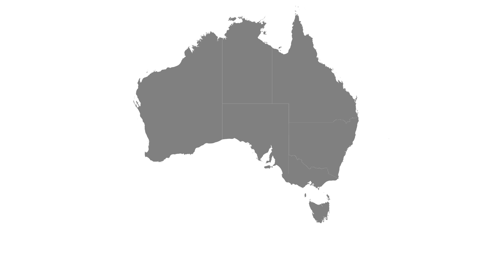

# Populate Data in Blazor Maps Component

This section explains how to populate data inputs and provide it to the Maps component.

## Geometry types

GeoJSON data contains geometry objects with properties such as geometry types and coordinates. The geometry types are the values present in the geometry objects of the GeoJSON data that specify the type of shape to be rendered, as well as the coordinates that help to draw the shape's boundary line. The supportive geometry types are:

| **Shapes** | **Supported** |
| --- | --- |
|Polygon| Yes |
|MultiPolygon| Yes |
|LineString| Yes |
|MultiLineString| Yes |
|Point| Yes |
|MultiPoint| Yes |
|GeometryCollection| Yes |

## Shape data

The shape data collection describes geographical shape information that is available in GeoJSON format. The Map shapes are rendered with this data. The custom shapes such as seat selection in bus, seat selection in a cricket stadium and more useful information can be also added as [ShapeData](https://help.syncfusion.com/cr/blazor/Syncfusion.Blazor.Maps.MapsLayer-1.html#Syncfusion_Blazor_Maps_MapsLayer_1_ShapeData) in the [MapsLayer](https://help.syncfusion.com/cr/blazor/Syncfusion.Blazor.Maps.MapsLayer-1.html).

## Data source

The [DataSource](https://help.syncfusion.com/cr/blazor/Syncfusion.Blazor.Maps.MapsLayer-1.html#Syncfusion_Blazor_Maps_MapsLayer_1_DataSource) property is used to represent statistical data in the Maps component, and it accepts a collection of values as input. For example, a list of objects as input can be provided to the data source. This data source will be used to color the map, display data labels, and display tooltip, among other things.

The data source is populated with list of objects relative to shape data. In the following example, **PopulationDetails** can be used as data source in Maps.

```cshtml
@code{
    public class PopulationDetail
    {
        public string Code { get; set; }
        public double Value { get; set; }
        public string Name { get; set; }
        public double Population { get; set; }
        public double Density { get; set; }
    };
    private List<PopulationDetail> PopulationDetails = new List<PopulationDetail> {
        new PopulationDetail {
            Code = "AF",
            Value= 53,
            Name= "Afghanistan",
            Population= 29863010,
            Density= 119
        },
        new PopulationDetail {
            Code= "AL",
            Value= 117,
            Name= "Albania",
            Population= 3195000,
            Density= 111
        },
        new PopulationDetail {
            Code= "DZ",
            Value= 15,
            Name= "Algeria",
            Population= 34895000,
            Density= 15
        }
    };
}
```

## Data binding

The following properties in the [MapsLayer](https://help.syncfusion.com/cr/blazor/Syncfusion.Blazor.Maps.MapsLayer-1.html) are used for binding data in the Maps component. Both the properties are related to each other.

* ShapePropertyPath
* ShapeDataPath

### ShapePropertyPath

The [ShapePropertyPath](https://help.syncfusion.com/cr/blazor/Syncfusion.Blazor.Maps.MapsLayer-1.html#Syncfusion_Blazor_Maps_MapsLayer_1_ShapePropertyPath) property is used to refer the field name in the [ShapeData](https://help.syncfusion.com/cr/blazor/Syncfusion.Blazor.Maps.MapsLayer-1.html#Syncfusion_Blazor_Maps_MapsLayer_1_ShapeData) property of shape layers to identify the shape. When the values of [ShapeDataPath](https://help.syncfusion.com/cr/blazor/Syncfusion.Blazor.Maps.MapsLayer-1.html#Syncfusion_Blazor_Maps_MapsLayer_1_ShapeDataPath) property from the [DataSource](https://help.syncfusion.com/cr/blazor/Syncfusion.Blazor.Maps.MapsLayer-1.html#Syncfusion_Blazor_Maps_MapsLayer_1_DataSource) property and [ShapePropertyPath](https://help.syncfusion.com/cr/blazor/Syncfusion.Blazor.Maps.MapsLayer-1.html#Syncfusion_Blazor_Maps_MapsLayer_1_ShapePropertyPath) property from the [ShapeData](https://help.syncfusion.com/cr/blazor/Syncfusion.Blazor.Maps.MapsLayer-1.html#Syncfusion_Blazor_Maps_MapsLayer_1_ShapeData) property match, then the associated object from the data source is bound to the corresponding shape.

```cshtml
@using Syncfusion.Blazor.Maps

<SfMaps>
    <MapsLayers>
        <MapsLayer ShapeData='new {dataOptions= "https://cdn.syncfusion.com/maps/map-data/world-map.json"}'
            ShapePropertyPath='new string[] {"name"}' TValue="string">
        </MapsLayer>
    </MapsLayers>
</SfMaps>
```

N>`world-map.json` file contains following data and its field **name** value is used to map the corresponding shape with the provided data source.

```json
[
    {
        "type": "Feature",
        "properties": {
            "admin": "Afghanistan",
            "name": "Afghanistan",
            "continent": "Asia"
        },
        "geometry": { "type": "Polygon", "coordinates": [[[61.21081709172573, ...
    },
...
]
```

### ShapeDataPath

The [ShapeDataPath](https://help.syncfusion.com/cr/blazor/Syncfusion.Blazor.Maps.MapsLayer-1.html#Syncfusion_Blazor_Maps_MapsLayer_1_ShapeDataPath) property is similar to the [ShapePropertyPath](https://help.syncfusion.com/cr/blazor/Syncfusion.Blazor.Maps.MapsLayer-1.html#Syncfusion_Blazor_Maps_MapsLayer_1_ShapePropertyPath) property, but it refers to the field name in the [DataSource](https://help.syncfusion.com/cr/blazor/Syncfusion.Blazor.Maps.MapsLayer-1.html#Syncfusion_Blazor_Maps_MapsLayer_1_DataSource) property. For example, following population data contains field **Name**, **Population** and **Density**. Here the **Name** field is set to the [ShapeDataPath](https://help.syncfusion.com/cr/blazor/Syncfusion.Blazor.Maps.MapsLayer-1.html#Syncfusion_Blazor_Maps_MapsLayer_1_ShapeDataPath) to map the corresponding value of field name in shape data.

```cshtml
@using Syncfusion.Blazor.Maps

<SfMaps>
    <MapsLayers>
        <MapsLayer ShapeData='new {dataOptions= "https://cdn.syncfusion.com/maps/map-data/world-map.json"}'
            DataSource="PopulationDetails" ShapePropertyPath='new string[] {"name"}'
            ShapeDataPath="Name" TValue="PopulationDetail">
        </MapsLayer>
    </MapsLayers>
</SfMaps>

@code{
    public class PopulationDetail
    {
        public string Name { get; set; }
        public double Population { get; set; }
        public double Density { get; set; }
    };
    private List<PopulationDetail> PopulationDetails = new List<PopulationDetail> {
        new PopulationDetail {
            Name= "Afghanistan",
            Population= 29863010,
            Density= 119
        },
        ...
    };
}
```

In the above example, both **name** fields contain the same value as **Afghanistan**, this value is matched in both shape data and data source, so that the details associated with **Afghanistan** will be mapped to the corresponding shape and used to color the corresponding shape, display data labels, display tooltips, and more.

```cshtml
@using Syncfusion.Blazor.Maps

<SfMaps>
    <MapsLayers>
        <MapsLayer ShapeData='new {dataOptions= "https://cdn.syncfusion.com/maps/map-data/world-map.json"}'
            DataSource="PopulationDetails"
            ShapeDataPath="Name"
            ShapePropertyPath='new string[] {"name"}' TValue="PopulationDetail">
            @*  It display data label for bounded items  *@
            <MapsDataLabelSettings Visible="true" LabelPath="Name"></MapsDataLabelSettings>
        </MapsLayer>
    </MapsLayers>
</SfMaps>

@code{
    public class PopulationDetail
    {
        public string Code { get; set; }
        public double Value { get; set; }
        public string Name { get; set; }
        public double Population { get; set; }
        public double Density { get; set; }
    };
    private List<PopulationDetail> PopulationDetails = new List<PopulationDetail> {
        new PopulationDetail {
            Code = "AF",
            Value= 53,
            Name= "Afghanistan",
            Population= 29863010,
            Density= 119
        },
        new PopulationDetail {
            Code= "AL",
            Value= 117,
            Name= "Albania",
            Population= 3195000,
            Density= 111
        },
        new PopulationDetail {
            Code= "DZ",
            Value= 15,
            Name= "Algeria",
            Population= 34895000,
            Density= 15
        }
    };
}
```


## Fetching data from JSON file

To retrieve data from a JSON file, you can create a Blazor WebAssembly App or a Blazor Server App. The data from the JSON file is then read, convert it to a C# object, and assign it to the [DataSource](https://help.syncfusion.com/cr/blazor/Syncfusion.Blazor.Maps.MapsLayer-1.html#Syncfusion_Blazor_Maps_MapsLayer_1_DataSource) property.

### Fetching data from JSON file using Blazor WebAssembly App

The **Http.GetFromJsonAsync** is used in the **OnInitializedAsync** lifecycle method to load JSON file data. As this will be executed asynchronously, check whether **populationDensity** is available, render the Maps component, or display the loading statement.

```cshtml
@inject HttpClient Http;
@using Syncfusion.Blazor.Maps
@inject NavigationManager NavigationManager

@if (PopulationDensity == null)
{
    <p><em>Loading Maps component...</em></p>
}
else
{
    <SfMaps>
        <MapsLayers>
            <MapsLayer ShapeData='new {dataOptions ="https://cdn.syncfusion.com/maps/map-data/world-map.json"}'
                       DataSource="PopulationDensity"
                       ShapeDataPath="Name"
                       ShapePropertyPath='new string[] {"name"}' TValue="PopulationData">
                <MapsDataLabelSettings Visible="true" LabelPath="Name"></MapsDataLabelSettings>
            </MapsLayer>
        </MapsLayers>
    </SfMaps>
}
@code{
    PopulationData[] PopulationDensity;
    protected override async Task OnInitializedAsync()
    {
        PopulationDensity = await Http.GetFromJsonAsync<PopulationData[]>(NavigationManager.Uri + "sample-data/PopulationDensity.json");
    }

    public class PopulationData
    {
        public string Code { get; set; }
        public double Value { get; set; }
        public string Name { get; set; }
        public double Population { get; set; }
        public float Density { get; set; }
    }
}
```

Here, the `PopulationDensity.json` file contains following data.

```json
[
    {
        "code": "AF",
        "value": 53,
        "name": "Afghanistan",
        "population": 29863010,
        "density": 119
    },
    {
        "code": "AL",
        "value": 117,
        "name": "Albania",
        "population": 3195000,
        "density": 111
    },
    {
        "code": "DZ",
        "value": 15,
        "name": "Algeria",
        "population": 34895000,
        "density": 15
    }
]
```


### Fetching data from JSON file using  Blazor Server App

The **Http.GetAsync** is used in the **OnInitializedAsync** lifecycle method to get the JSON file data and read the JSON file as a string. Then, the GeoJSON data in the string can be converted as a deserialized object list and set in the **DataSource** property of the Maps component. As this will be executed asynchronously, check whether **populationDensity** is available, render the Maps component, or display the loading statement.


```cshtml
@inject HttpClient Http;
@using Syncfusion.Blazor.Maps
@using System.Net.Http.Json
@using System.Text.Json;
@using Newtonsoft.Json;
@inject NavigationManager NavigationManager


@if (PopulationDensity == null)
{
    <p><em>Loading Maps component...</em></p>
}
else
{
    <SfMaps>
        <MapsLayers>
            <MapsLayer ShapeData='new {dataOptions ="https://cdn.syncfusion.com/maps/map-data/world-map.json"}'
                       DataSource="PopulationDensity"
                       ShapeDataPath="Name"
                       ShapePropertyPath='new string[] {"name"}' TValue="PopulationData">
                <MapsDataLabelSettings Visible="true" LabelPath="Name"></MapsDataLabelSettings>
            </MapsLayer>
        </MapsLayers>
    </SfMaps>
}
@code{
    public List<PopulationData> PopulationDensity;
    public string result;

    protected override async Task OnInitializedAsync()
    {
        string path = NavigationManager.Uri + "sample-data/PopulationDensity.json";
        HttpClient httpClient = new HttpClient();
        HttpResponseMessage response = await Http.GetAsync(path);
        result = response.Content.ReadAsStringAsync().Result;
        PopulationDensity = JsonConvert.DeserializeObject<List<PopulationData>>(result);
    }

    public class PopulationData
    {
        public string Code { get; set; }
        public double Value { get; set; }
        public string Name { get; set; }
        public double Population { get; set; }
        public float Density { get; set; }
    }
}
```


## Improving Performance with Local GeoJSON Processing

When working with large GeoJSON files, fetching data fromremote URLs can slow down yourapplication. By processing GeoJSON locally, you can significantly improve the rendering performance of your Maps component.

### Loading GeoJSON Files Locally

Instead of using remote URLs for [ShapeData](https://help.syncfusion.com/cr/blazor/Syncfusion.Blazor.Maps.MapsLayer-1.html?_gl=1*1r9l0no*_ga*MTEwNjczMjY0NC4xNzQxMTc0NzIw*_ga_41J4HFMX1J*MTc0MzE1MzI3Mi4zMC4xLjE3NDMxNTQwMjAuMC4wLjA.#Syncfusion_Blazor_Maps_MapsLayer_1_ShapeData), you can include the GeoJSON file in your project and process it locally.

```cshtml
@using System.Text.Json
@using System.Text.Json.Serialization
@using System.Net.Http
@using Syncfusion.Blazor.Maps

@if (geoJson != null)
{
    <SfMaps>
        <MapsLayers>
            <MapsLayer ShapeData="@geoJson" TValue="string" ShapePropertyPath='new string[] {"name"}'>
                <MapsShapeSettings Fill="Grey"></MapsShapeSettings>
                <MapsLayerTooltipSettings Visible="true" ValuePath="name"
                                          Format="<b>${iso_3166_2}</b><br>Finalist: <b>${name}</b>">
                </MapsLayerTooltipSettings>
            </MapsLayer>
        </MapsLayers>
    </SfMaps>
}
else
{
    <p>Loading map data...</p>
}

@code {
    private GeoJson geoJson { get; set; }

    [Inject]
    private HttpClient Http { get; set; }

    public class Geometry
    {
        [JsonPropertyName("type")]
        public string Type { get; set; }

        [JsonPropertyName("coordinates")]
        [JsonConverter(typeof(CoordinatesConverter))]
        public object Coordinates { get; set; }

        // Accessor properties based on type
        public List<List<List<double>>> PolygonCoordinates { get; private set; }
        public List<List<List<List<double>>>> MultiPolygonCoordinates { get; private set; }
        public List<double> PointCoordinates { get; private set; }
        public List<List<double>> MultiPointCoordinates { get; private set; }
        public List<List<double>> LineStringCoordinates { get; private set; }
        public List<List<List<double>>> MultiLineStringCoordinates { get; private set; }

        // Method to set appropriate coordinate type upon deserialization
        public void SetCoordinates(object coords)
        {
            switch (Type)
            {
                case "Polygon":
                    PolygonCoordinates = coords as List<List<List<double>>>;
                    break;
                case "MultiPolygon":
                    MultiPolygonCoordinates = coords as List<List<List<List<double>>>>;
                    break;
                case "Point":
                    PointCoordinates = coords as List<double>;
                    break;
                case "MultiPoint":
                    MultiPointCoordinates = coords as List<List<double>>;
                    break;
                case "LineString":
                    LineStringCoordinates = coords as List<List<double>>;
                    break;
                case "MultiLineString":
                    MultiLineStringCoordinates = coords as List<List<List<double>>>;
                    break;
            }
        }
    }

    public class CoordinatesConverter : JsonConverter<object>
    {
        public override object Read(ref Utf8JsonReader reader, System.Type typeToConvert, JsonSerializerOptions options)
        {
            using (JsonDocument document = JsonDocument.ParseValue(ref reader))
            {
                var element = document.RootElement;
                if (element.ValueKind != JsonValueKind.Array)
                    throw new JsonException("Invalid JSON format for coordinates. Expected an array.");

                if (element[0].ValueKind == JsonValueKind.Number)
                    return element.Deserialize<List<double>>(options); // Point
                else if (element[0][0].ValueKind == JsonValueKind.Number)
                    return element.Deserialize<List<List<double>>>(options); // LineString, MultiPoint
                else if (element[0][0][0].ValueKind == JsonValueKind.Number)
                    return element.Deserialize<List<List<List<double>>>>(options); // Polygon, MultiLineString
                else if (element[0][0][0][0].ValueKind == JsonValueKind.Number)
                    return element.Deserialize<List<List<List<List<double>>>>>(options); // MultiPolygon

                throw new JsonException("Unsupported JSON format for geometry coordinates.");
            }
        }

        public override void Write(Utf8JsonWriter writer, object value, JsonSerializerOptions options)
        {
            JsonSerializer.Serialize(writer, value, options);
        }
    }

    public class GeoJson
    {
        [JsonPropertyName("type")]
        public string Type { get; set; }

        [JsonPropertyName("features")]
        public List<GeoJsonFeature> Features { get; set; }

        [JsonPropertyName("bbox")]
        public JsonElement BoundingBox { get; set; }
    }

    public class GeoJsonFeature
    {
        [JsonPropertyName("type")]
        public string Type { get; set; }

        // Change properties type to a dictionary
        [JsonPropertyName("properties")]
        public Dictionary<string, string> Properties { get; set; }

        private Geometry _geometry;

        [JsonPropertyName("geometry")]
        public Geometry Geometry
        {
            get => _geometry;
            set
            {
                _geometry = value;
                _geometry.SetCoordinates(_geometry.Coordinates);
            }
        }
    }

    protected override async Task OnInitializedAsync()
    {
        try
        {
            // Assuming usa.json is in the wwwroot directory.
            geoJson = await Http.GetFromJsonAsync<GeoJson>("australia.json", new JsonSerializerOptions
                {
                    Converters = { new CoordinatesConverter() },
                    PropertyNamingPolicy = JsonNamingPolicy.CamelCase
                });
        }
        catch (Exception ex)
        {
            Console.Error.WriteLine($"Error loading JSON: {ex.Message}");
        }
    }
}
```

### Implementation Steps

1. **Add GeoJSON Files**: Place youe GeoJson files in the wwwroot directory of your Blazor project.
2. **Create Data Models**: Implement classes to deserialize the GeoJSON format.
3. **Implement Custom Converters**: Handle different geometry types and coordinate structures.
4. **Load Data**: Use HttpClient to load the files from your local project.
5. **Bind to Maps**: Pass the processing, you can significantly reduce the initial load time of your maps, especially for complex or large geoJSON files.

### Benefits of Local GeoJSON Processing

1. **Improved Performance**: Reduces network overhead by loading GeoJSON files locally.
2. **Reduced Latency**: Elimates external dependency on CDN or remote servers.
3. **Offline Support**: Maps can be rendered without internet connectivity.
4. **Full Control**: Custom processing of GeoJSON data based on application needs.

