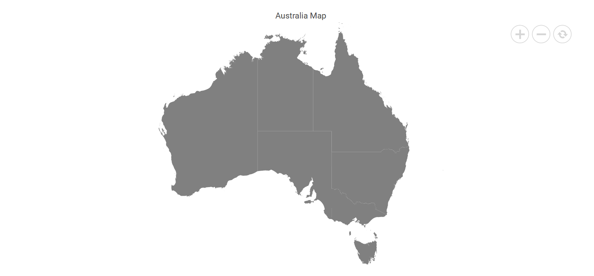
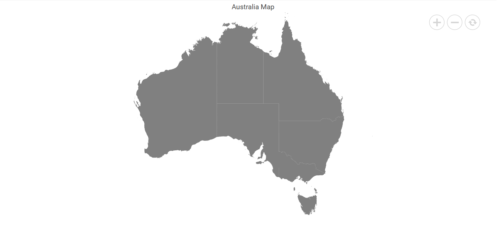
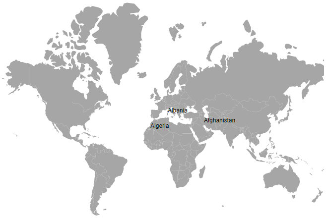

# Populate Data in Blazor Maps Component

This section describes how to provide data inputs and pass them to the Maps component.

## Geometry types

GeoJSON data contains geometry objects with properties such as geometry types and coordinates. Geometry types specify the shape to render, and coordinates define the shape's boundary. The supported geometry types are:

| **Shapes** | **Supported** |
| --- | --- |
|Polygon| Yes |
|MultiPolygon| Yes |
|LineString| Yes |
|MultiLineString| Yes |
|Point| Yes |
|MultiPoint| Yes |
|GeometryCollection| Yes |

## Shape data

The shape data collection describes geographic shape information in GeoJSON format. Map shapes are rendered from this data. Custom shapes, such as seat selections in a bus or a cricket stadium, can also be added as [ShapeData](https://help.syncfusion.com/cr/blazor/Syncfusion.Blazor.Maps.MapsLayer-1.html#Syncfusion_Blazor_Maps_MapsLayer_1_ShapeData) in the [MapsLayer](https://help.syncfusion.com/cr/blazor/Syncfusion.Blazor.Maps.MapsLayer-1.html).

### Fetching Shape data from JSON file

Fetching
[ShapeData](https://help.syncfusion.com/cr/blazor/Syncfusion.Blazor.Maps.MapsLayer-1.html?_gl=1*1r9l0no*_ga*MTEwNjczMjY0NC4xNzQxMTc0NzIw*_ga_41J4HFMX1J*MTc0MzE1MzI3Mi4zMC4xLjE3NDMxNTQwMjAuMC4wLjA.#Syncfusion_Blazor_Maps_MapsLayer_1_ShapeData) from remote URLs can significantly impact your application's performance. By processing JSON locally instead of relying on remote endpoints, you can substantially reduce load times and improve the overall responsiveness of your Maps component.

#### Fetching Shape data from JSON file using Blazor WebAssembly App

In Blazor WebAssembly applications, you can efficiently load GeoJSON data using the HttpClient service. The example demonstrates a clean approach to deserializing complex GeoJSON structures with a custom JsonConverter that properly handles different geometry types. This approach allows the Maps component to display geographical data while maintaining the application's responsiveness.

```cshtml
@using System.Text.Json
@using System.Text.Json.Serialization
@using System.Net.Http
@using Syncfusion.Blazor.Maps

@if (geoJson != null)
{
    <SfMaps>
        <MapsTitleSettings Text="Australia Map"></MapsTitleSettings>
        <MapsZoomSettings Enable="true"></MapsZoomSettings>
        <MapsLayers>
            <MapsLayer ShapeData="@geoJson" TValue="string" ShapePropertyPath='new string[] {"name"}'>
                <MapsShapeSettings Fill="Grey"></MapsShapeSettings>
                <MapsLayerTooltipSettings Visible="true" ValuePath="name"
                                          Format="State Name: <b>${STATE_NAME}</b>">
                </MapsLayerTooltipSettings>
            </MapsLayer>
        </MapsLayers>
    </SfMaps>
}
else
{
    <p>Loading map data...</p>
}

@code {
    private GeoJson geoJson { get; set; }

    [Inject]
    private HttpClient Http { get; set; }

    public class Geometry
    {
        [JsonPropertyName("type")]
        public string Type { get; set; }

        [JsonPropertyName("coordinates")]
        [JsonConverter(typeof(CoordinatesConverter))]
        public object Coordinates { get; set; }

        // Accessor properties based on type
        public List<List<List<double>>> PolygonCoordinates { get; private set; }
        public List<List<List<List<double>>>> MultiPolygonCoordinates { get; private set; }
        public List<double> PointCoordinates { get; private set; }
        public List<List<double>> MultiPointCoordinates { get; private set; }
        public List<List<double>> LineStringCoordinates { get; private set; }
        public List<List<List<double>>> MultiLineStringCoordinates { get; private set; }

        // Method to set appropriate coordinate type upon deserialization
        public void SetCoordinates(object coords)
        {
            switch (Type)
            {
                case "Polygon":
                    PolygonCoordinates = coords as List<List<List<double>>>;
                    break;
                case "MultiPolygon":
                    MultiPolygonCoordinates = coords as List<List<List<List<double>>>>;
                    break;
                case "Point":
                    PointCoordinates = coords as List<double>;
                    break;
                case "MultiPoint":
                    MultiPointCoordinates = coords as List<List<double>>;
                    break;
                case "LineString":
                    LineStringCoordinates = coords as List<List<double>>;
                    break;
                case "MultiLineString":
                    MultiLineStringCoordinates = coords as List<List<List<double>>>;
                    break;
            }
        }
    }

    public class CoordinatesConverter : JsonConverter<object>
    {
        public override object Read(ref Utf8JsonReader reader, System.Type typeToConvert, JsonSerializerOptions options)
        {
            using (JsonDocument document = JsonDocument.ParseValue(ref reader))
            {
                var element = document.RootElement;
                if (element.ValueKind != JsonValueKind.Array)
                    throw new JsonException("Invalid JSON format for coordinates. Expected an array.");

                if (element[0].ValueKind == JsonValueKind.Number)
                    return element.Deserialize<List<double>>(options); // Point
                else if (element[0][0].ValueKind == JsonValueKind.Number)
                    return element.Deserialize<List<List<double>>>(options); // LineString, MultiPoint
                else if (element[0][0][0].ValueKind == JsonValueKind.Number)
                    return element.Deserialize<List<List<List<double>>>>(options); // Polygon, MultiLineString
                else if (element[0][0][0][0].ValueKind == JsonValueKind.Number)
                    return element.Deserialize<List<List<List<List<double>>>>>(options); // MultiPolygon

                throw new JsonException("Unsupported JSON format for geometry coordinates.");
            }
        }

        public override void Write(Utf8JsonWriter writer, object value, JsonSerializerOptions options)
        {
            JsonSerializer.Serialize(writer, value, options);
        }
    }

    public class GeoJson
    {
        [JsonPropertyName("type")]
        public string Type { get; set; }

        [JsonPropertyName("features")]
        public List<GeoJsonFeature> Features { get; set; }

        [JsonPropertyName("bbox")]
        public JsonElement BoundingBox { get; set; }
    }

    public class GeoJsonFeature
    {
        [JsonPropertyName("type")]
        public string Type { get; set; }

        // Change properties type to a dictionary
        [JsonPropertyName("properties")]
        public Dictionary<string, string> Properties { get; set; }

        private Geometry _geometry;

        [JsonPropertyName("geometry")]
        public Geometry Geometry
        {
            get => _geometry;
            set
            {
                _geometry = value;
                _geometry.SetCoordinates(_geometry.Coordinates);
            }
        }
    }

    protected override async Task OnInitializedAsync()
    {
        try
        {
            // Assuming australia.json is in the wwwroot directory.
            geoJson = await Http.GetFromJsonAsync<GeoJson>("australia.json", new JsonSerializerOptions
                {
                    Converters = { new CoordinatesConverter() },
                    PropertyNamingPolicy = JsonNamingPolicy.CamelCase
                });
        }
        catch (Exception ex)
        {
            Console.Error.WriteLine($"Error loading JSON: {ex.Message}");
        }
    }
}
```



#### Fetching Shape data from JSON file using Blazor Server App

The example shows how to read a GeoJSON file from the wwwroot directory using System.IO.File methods and deserialize it using a custom JsonConverter. The custom converter ensures that different geometry types (Polygon, MultiPolygon, etc.) are properly handled during deserialization.

```cshtml
@using Syncfusion.Blazor.Maps
@using System.Text.Json
@using System.Text.Json.Serialization

@if (geoJson != null)
{
    <SfMaps>
        <MapsTitleSettings Text="Australia Map"></MapsTitleSettings>
        <MapsZoomSettings Enable="true" ></MapsZoomSettings>
        <MapsLayers>
            <MapsLayer ShapeData="@geoJson" TValue="string" ShapePropertyPath='new string[] {"name"}'>
                <MapsShapeSettings Fill="Grey"></MapsShapeSettings>
                <MapsLayerTooltipSettings Visible="true" ValuePath="name"
                                  Format="State Name: <b>${STATE_NAME}</b>">
                </MapsLayerTooltipSettings>
            </MapsLayer>
        </MapsLayers>
    </SfMaps>
}

@code {
    public GeoJson geoJson { get; set; }

    public class Geometry
    {
        [JsonPropertyName("type")]
        public string Type { get; set; }

        [JsonPropertyName("coordinates")]
        [JsonConverter(typeof(CoordinatesConverter))]
        public object Coordinates { get; set; }

        // Accessor properties based on type to make it easy to use in code
        public List<List<List<double>>> PolygonCoordinates =>
            Type == "Polygon" ? Coordinates as List<List<List<double>>> : null;

        public List<List<List<List<double>>>> MultiPolygonCoordinates =>
            Type == "MultiPolygon" ? Coordinates as List<List<List<List<double>>>> : null;

        public List<double> PointCoordinates =>
            Type == "Point" ? Coordinates as List<double> : null;

        public List<List<double>> MultiPointCoordinates =>
            Type == "MultiPoint" ? Coordinates as List<List<double>> : null;

        public List<List<double>> LineStringCoordinates =>
            Type == "LineString" ? Coordinates as List<List<double>> : null;

        public List<List<List<double>>> MultiLineStringCoordinates =>
            Type == "MultiLineString" ? Coordinates as List<List<List<double>>> : null;
    }

    public class CoordinatesConverter : JsonConverter<object>
    {
        public override object Read(ref Utf8JsonReader reader, System.Type typeToConvert, JsonSerializerOptions options)
        {
            using (JsonDocument document = JsonDocument.ParseValue(ref reader))
            {
                var element = document.RootElement;
                if (element.ValueKind != JsonValueKind.Array)
                {
                    throw new JsonException("Invalid JSON format for coordinates. Expected an array.");
                }

                if (element[0].ValueKind == JsonValueKind.Number)
                {
                    return element.Deserialize<List<double>>(options); // Point
                }
                else if (element[0][0].ValueKind == JsonValueKind.Number)
                {
                    return element.Deserialize<List<List<double>>>(options); // LineString, MultiPoint
                }
                else if (element[0][0][0].ValueKind == JsonValueKind.Number)
                {
                    return element.Deserialize<List<List<List<double>>>>(options); // Polygon, MultiLineString
                }
                else if (element[0][0][0][0].ValueKind == JsonValueKind.Number)
                {
                    return element.Deserialize<List<List<List<List<double>>>>>(options); // MultiPolygon
                }

                throw new JsonException("Unsupported JSON format for geometry coordinates.");
            }
        }

        public override void Write(Utf8JsonWriter writer, object value, JsonSerializerOptions options)
        {
            JsonSerializer.Serialize(writer, value, options);
        }
    }

    public class GeoJson
    {
        [JsonPropertyName("type")]
        public string Type { get; set; }

        [JsonPropertyName("features")]
        public List<GeoJsonFeature> Features { get; set; }

        [JsonPropertyName("bbox")]
        public JsonElement BoundingBox { get; set; }
    }

    public class GeoJsonFeature
    {
        [JsonPropertyName("type")]
        public string Type { get; set; }

        // Change properties type to a dictionary
        [JsonPropertyName("properties")]
        public Dictionary<string, string> Properties { get; set; }

        [JsonPropertyName("geometry")]
        public Geometry Geometry { get; set; }
    }

    protected override async Task OnInitializedAsync()
    {
        try
        {
            string fileText = System.IO.File.ReadAllText("wwwroot/australia.json");
            geoJson = JsonSerializer.Deserialize<GeoJson>(fileText, new JsonSerializerOptions
            {
                Converters = { new CoordinatesConverter() },
                PropertyNamingPolicy = JsonNamingPolicy.CamelCase
            });
        }
        catch (Exception ex)
        {
            Console.Error.WriteLine($"Error loading JSON: {ex.Message}");
        }
    }
}

```


## Data source

The [DataSource](https://help.syncfusion.com/cr/blazor/Syncfusion.Blazor.Maps.MapsLayer-1.html#Syncfusion_Blazor_Maps_MapsLayer_1_DataSource) property represents statistical data for the Maps component and accepts a collection of values. For example, a list of objects can be provided. This data source is used to color shapes, display data labels, show tooltips, and more.

The data source is populated with a list of objects related to the shape data. In the following example, **PopulationDetails** is used as the data source for Maps.

```cshtml

@code{
    public class PopulationDetail
    {
        public string Code { get; set; }
        public double Value { get; set; }
        public string Name { get; set; }
        public double Population { get; set; }
        public double Density { get; set; }
    };
    private List<PopulationDetail> PopulationDetails = new List<PopulationDetail> {
        new PopulationDetail {
            Code = "AF",
            Value= 53,
            Name= "Afghanistan",
            Population= 29863010,
            Density= 119
        },
        new PopulationDetail {
            Code= "AL",
            Value= 117,
            Name= "Albania",
            Population= 3195000,
            Density= 111
        },
        new PopulationDetail {
            Code= "DZ",
            Value= 15,
            Name= "Algeria",
            Population= 34895000,
            Density= 15
        }
    };
}

```

## Data binding

The following properties in the [MapsLayer](https://help.syncfusion.com/cr/blazor/Syncfusion.Blazor.Maps.MapsLayer-1.html) are used to bind data in the Maps component. These properties work together.

* ShapePropertyPath
* ShapeDataPath

### ShapePropertyPath

The [ShapePropertyPath](https://help.syncfusion.com/cr/blazor/Syncfusion.Blazor.Maps.MapsLayer-1.html#Syncfusion_Blazor_Maps_MapsLayer_1_ShapePropertyPath) property refers to the field name in the [ShapeData](https://help.syncfusion.com/cr/blazor/Syncfusion.Blazor.Maps.MapsLayer-1.html#Syncfusion_Blazor_Maps_MapsLayer_1_ShapeData) of shape layers used to identify a shape. When the values of [ShapeDataPath](https://help.syncfusion.com/cr/blazor/Syncfusion.Blazor.Maps.MapsLayer-1.html#Syncfusion_Blazor_Maps_MapsLayer_1_ShapeDataPath) property from the [DataSource](https://help.syncfusion.com/cr/blazor/Syncfusion.Blazor.Maps.MapsLayer-1.html#Syncfusion_Blazor_Maps_MapsLayer_1_DataSource) and [ShapePropertyPath](https://help.syncfusion.com/cr/blazor/Syncfusion.Blazor.Maps.MapsLayer-1.html#Syncfusion_Blazor_Maps_MapsLayer_1_ShapePropertyPath) property from the [ShapeData](https://help.syncfusion.com/cr/blazor/Syncfusion.Blazor.Maps.MapsLayer-1.html#Syncfusion_Blazor_Maps_MapsLayer_1_ShapeData) match, the associated object from the data source is bound to the corresponding shape.

```cshtml

@using Syncfusion.Blazor.Maps

<SfMaps>
    <MapsLayers>
        <MapsLayer ShapeData='new {dataOptions= "https://cdn.syncfusion.com/maps/map-data/world-map.json"}'
            ShapePropertyPath='new string[] {"name"}' TValue="string">
        </MapsLayer>
    </MapsLayers>
</SfMaps>

```

N> The `world-map.json` file contains the following data, and the **name** field value is used to map the corresponding shape with the provided data source.

```json

[
    {
        "type": "Feature",
        "properties": {
            "admin": "Afghanistan",
            "name": "Afghanistan",
            "continent": "Asia"
        },
        "geometry": { "type": "Polygon", "coordinates": [[[61.21081709172573, ...
    },
...
]

```

### ShapeDataPath

The [ShapeDataPath](https://help.syncfusion.com/cr/blazor/Syncfusion.Blazor.Maps.MapsLayer-1.html#Syncfusion_Blazor_Maps_MapsLayer_1_ShapeDataPath) property is similar to [ShapePropertyPath](https://help.syncfusion.com/cr/blazor/Syncfusion.Blazor.Maps.MapsLayer-1.html#Syncfusion_Blazor_Maps_MapsLayer_1_ShapePropertyPath), but it refers to the field name in the [DataSource](https://help.syncfusion.com/cr/blazor/Syncfusion.Blazor.Maps.MapsLayer-1.html#Syncfusion_Blazor_Maps_MapsLayer_1_DataSource). In the following population data, the fields are **Name**, **Population**, and **Density**. The **Name** field is set to [ShapeDataPath](https://help.syncfusion.com/cr/blazor/Syncfusion.Blazor.Maps.MapsLayer-1.html#Syncfusion_Blazor_Maps_MapsLayer_1_ShapeDataPath) property to map the corresponding value of the field name in shape data.

```cshtml

@using Syncfusion.Blazor.Maps

<SfMaps>
    <MapsLayers>
        <MapsLayer ShapeData='new {dataOptions= "https://cdn.syncfusion.com/maps/map-data/world-map.json"}'
            DataSource="PopulationDetails" ShapePropertyPath='new string[] {"name"}'
            ShapeDataPath="Name" TValue="PopulationDetail">
        </MapsLayer>
    </MapsLayers>
</SfMaps>

@code{
    public class PopulationDetail
    {
        public string Name { get; set; }
        public double Population { get; set; }
        public double Density { get; set; }
    };

    private List<PopulationDetail> PopulationDetails = new List<PopulationDetail> {
        new PopulationDetail {
            Name= "Afghanistan",
            Population= 29863010,
            Density= 119
        },
        ...
    };
}

```

In the above example, both **name** fields contain the value **Afghanistan**. This value is matched in both shape data and the data source, so the details associated with **Afghanistan** are mapped to the corresponding shape and used to color the shape, display data labels, and display tooltips.

```cshtml

@using Syncfusion.Blazor.Maps

<SfMaps>
    <MapsLayers>
        <MapsLayer ShapeData='new {dataOptions= "https://cdn.syncfusion.com/maps/map-data/world-map.json"}'
            DataSource="PopulationDetails"
            ShapeDataPath="Name"
            ShapePropertyPath='new string[] {"name"}' TValue="PopulationDetail">
            @*  It display data label for bounded items  *@
            <MapsDataLabelSettings Visible="true" LabelPath="Name"></MapsDataLabelSettings>
        </MapsLayer>
    </MapsLayers>
</SfMaps>

@code {
    public class PopulationDetail
    {
        public string Code { get; set; }
        public double Value { get; set; }
        public string Name { get; set; }
        public double Population { get; set; }
        public double Density { get; set; }
    };

    private List<PopulationDetail> PopulationDetails = new List<PopulationDetail> {
        new PopulationDetail {
            Code = "AF",
            Value= 53,
            Name= "Afghanistan",
            Population= 29863010,
            Density= 119
        },
        new PopulationDetail {
            Code= "AL",
            Value= 117,
            Name= "Albania",
            Population= 3195000,
            Density= 111
        },
        new PopulationDetail {
            Code= "DZ",
            Value= 15,
            Name= "Algeria",
            Population= 34895000,
            Density= 15
        }
    };
}

```



## Fetching data for DataSource from JSON file

To retrieve data from a JSON file, create a Blazor WebAssembly app or a Blazor Server app. Read the data from the JSON file, convert it to a C# object, and assign it to the [DataSource](https://help.syncfusion.com/cr/blazor/Syncfusion.Blazor.Maps.MapsLayer-1.html#Syncfusion_Blazor_Maps_MapsLayer_1_DataSource) property.

### Fetching data from JSON file using Blazor WebAssembly App

The **Http.GetFromJsonAsync** method is used in the **OnInitializedAsync** lifecycle method to load JSON data. Because this executes asynchronously, check whether **PopulationDensity** is available; then render the Maps component or display a loading message.

```cshtml

@inject HttpClient Http;
@using Syncfusion.Blazor.Maps
@inject NavigationManager NavigationManager

@if (PopulationDensity == null)
{
    <p><em>Loading Maps component...</em></p>
}
else
{
    <SfMaps>
        <MapsLayers>
            <MapsLayer ShapeData='new {dataOptions ="https://cdn.syncfusion.com/maps/map-data/world-map.json"}'
                       DataSource="PopulationDensity"
                       ShapeDataPath="Name"
                       ShapePropertyPath='new string[] {"name"}' TValue="PopulationData">
                <MapsDataLabelSettings Visible="true" LabelPath="Name"></MapsDataLabelSettings>
            </MapsLayer>
        </MapsLayers>
    </SfMaps>
}

@code {
    PopulationData[] PopulationDensity;

    protected override async Task OnInitializedAsync()
    {
        PopulationDensity = await Http.GetFromJsonAsync<PopulationData[]>(NavigationManager.Uri + "sample-data/PopulationDensity.json");
    }

    public class PopulationData
    {
        public string Code { get; set; }
        public double Value { get; set; }
        public string Name { get; set; }
        public double Population { get; set; }
        public float Density { get; set; }
    }
}

```

Here, the `PopulationDensity.json` file contains the following data.

```json

[
    {
        "code": "AF",
        "value": 53,
        "name": "Afghanistan",
        "population": 29863010,
        "density": 119
    },
    {
        "code": "AL",
        "value": 117,
        "name": "Albania",
        "population": 3195000,
        "density": 111
    },
    {
        "code": "DZ",
        "value": 15,
        "name": "Algeria",
        "population": 34895000,
        "density": 15
    }
]

```


### Fetching data from JSON file using  Blazor Server App

The **Http.GetAsync** method is used in the **OnInitializedAsync** lifecycle method to get the JSON file as a response and read it as a string. Then, the JSON data is deserialized to a list of objects and assigned to the **DataSource** property of the Maps component. Because this executes asynchronously, check whether **PopulationDensity** is available; then render the Maps component or display a loading message.


```cshtml

@inject HttpClient Http;
@using Syncfusion.Blazor.Maps
@using System.Net.Http.Json
@using System.Text.Json;
@using Newtonsoft.Json;
@inject NavigationManager NavigationManager

@if (PopulationDensity == null)
{
    <p><em>Loading Maps component...</em></p>
}
else
{
    <SfMaps>
        <MapsLayers>
            <MapsLayer ShapeData='new {dataOptions ="https://cdn.syncfusion.com/maps/map-data/world-map.json"}'
                       DataSource="PopulationDensity"
                       ShapeDataPath="Name"
                       ShapePropertyPath='new string[] {"name"}' TValue="PopulationData">
                <MapsDataLabelSettings Visible="true" LabelPath="Name"></MapsDataLabelSettings>
            </MapsLayer>
        </MapsLayers>
    </SfMaps>
}

@code {
    public List<PopulationData> PopulationDensity;
    public string result;

    protected override async Task OnInitializedAsync()
    {
        string path = NavigationManager.Uri + "sample-data/PopulationDensity.json";
        HttpClient httpClient = new HttpClient();
        HttpResponseMessage response = await Http.GetAsync(path);
        result = response.Content.ReadAsStringAsync().Result;
        PopulationDensity = JsonConvert.DeserializeObject<List<PopulationData>>(result);
    }

    public class PopulationData
    {
        public string Code { get; set; }
        public double Value { get; set; }
        public string Name { get; set; }
        public double Population { get; set; }
        public float Density { get; set; }
    }
}

```


