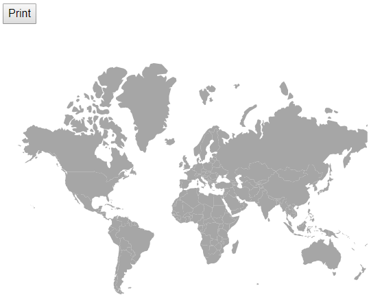

# Print and export in Blazor Maps Component

## Print

The rendered Maps can be printed directly from the browser by calling the [PrintAsync](https://help.syncfusion.com/cr/blazor/Syncfusion.Blazor.Maps.SfMaps.html#Syncfusion_Blazor_Maps_SfMaps_PrintAsync) method. To use the print functionality, set the [AllowPrint](https://help.syncfusion.com/cr/blazor/Syncfusion.Blazor.Maps.SfMaps.html#Syncfusion_Blazor_Maps_SfMaps_AllowPrint) property to **true**.

```cshtml
@using Syncfusion.Blazor.Maps

<button @onclick="PrintMap">Print</button>
<SfMaps @ref="maps" AllowPrint="true">
    <MapsLayers>
        <MapsLayer ShapeData='new {dataOptions= "https://cdn.syncfusion.com/maps/map-data/world-map.json"}' TValue="string">
            <MapsLayerTooltipSettings Visible="true" ValuePath="name">
            </MapsLayerTooltipSettings>
        </MapsLayer>
    </MapsLayers>
</SfMaps>

@code {
    SfMaps maps;
    public async Task PrintMap()
    {
        // using Maps component reference call 'Print' method
        await this.maps.PrintAsync();
    }
}
```



## Export

### Image Export

To use the image export functionality, set the [AllowImageExport](https://help.syncfusion.com/cr/blazor/Syncfusion.Blazor.Maps.SfMaps.html#Syncfusion_Blazor_Maps_SfMaps_AllowImageExport) property as **true**. The rendered Maps can be exported as an image using the [ExportAsync](https://help.syncfusion.com/cr/blazor/Syncfusion.Blazor.Maps.SfMaps.html#Syncfusion_Blazor_Maps_SfMaps_ExportAsync_Syncfusion_Blazor_Maps_ExportType_System_String_System_Nullable_Syncfusion_PdfExport_PdfPageOrientation__System_Boolean_) method. The method requires two parameters: image type and file name. The Maps can be exported as an image in the following formats.

* JPEG
* PNG
* SVG

```cshtml
@using Syncfusion.Blazor.Maps

<button @onclick="ExportMap">Export</button>
<SfMaps @ref="Maps" AllowImageExport="true">
    <MapsLayers>
        <MapsLayer ShapeData='new {dataOptions= "https://cdn.syncfusion.com/maps/map-data/world-map.json"}' TValue="string">
        </MapsLayer>
    </MapsLayers>
</SfMaps>

@code {
    SfMaps Maps;
    public async Task ExportMap()
    {
        await this.Maps.ExportAsync(ExportType.PNG, "Maps");
    }
}
```


### PDF Export

To use the PDF export functionality, set the [AllowPdfExport](https://help.syncfusion.com/cr/blazor/Syncfusion.Blazor.Maps.SfMaps.html#Syncfusion_Blazor_Maps_SfMaps_AllowPdfExport) property as **true**. The rendered Maps can be exported as PDF using the [ExportAsync](https://help.syncfusion.com/cr/blazor/Syncfusion.Blazor.Maps.SfMaps.html#Syncfusion_Blazor_Maps_SfMaps_ExportAsync_Syncfusion_Blazor_Maps_ExportType_System_String_System_Nullable_Syncfusion_PdfExport_PdfPageOrientation__System_Boolean_) method. The [ExportAsync](https://help.syncfusion.com/cr/blazor/Syncfusion.Blazor.Maps.SfMaps.html#Syncfusion_Blazor_Maps_SfMaps_ExportAsync_Syncfusion_Blazor_Maps_ExportType_System_String_System_Nullable_Syncfusion_PdfExport_PdfPageOrientation__System_Boolean_) method requires three parameters: file type, file name and orientation of the PDF document. The orientation of the PDF document can be set as **0** or **1**. **0** indicates the **portrait** and **1** indicates **landscape**.

```cshtml
@using Syncfusion.Blazor.Maps

<button @onclick="ExportMap">Export</button>
<SfMaps @ref="Maps" AllowPdfExport="true">
    <MapsLayers>
        <MapsLayer ShapeData='new {dataOptions= "https://cdn.syncfusion.com/maps/map-data/world-map.json"}' TValue="string">
        </MapsLayer>
    </MapsLayers>
</SfMaps>

@code {
    SfMaps Maps;
    public async Task ExportMap()
    {
        await this.Maps.ExportAsync(ExportType.PDF, "Maps", 0);
    }
}
```


### Exporting Maps as base64 string of the file

The image can be exported as base64 string for the JPEG, PNG and PDF formats. The rendered Maps can be exported to image as base64 string using the [ExportAsync](https://help.syncfusion.com/cr/blazor/Syncfusion.Blazor.Maps.SfMaps.html#Syncfusion_Blazor_Maps_SfMaps_ExportAsync_Syncfusion_Blazor_Maps_ExportType_System_String_System_Nullable_Syncfusion_PdfExport_PdfPageOrientation__System_Boolean_) method. The arguments that are required for this method is image type, file name, orientation of the exported PDF document which must be set as **null** for image export and **0** or **1** for the PDF export and finally **allowDownload** which should be set as **false** to return base64 string.

```cshtml
@using Syncfusion.Blazor.Maps

<button @onclick="export">Export</button>
<SfMaps @ref="Maps" AllowPdfExport="true">
    <MapsLayers>
        <MapsLayer ShapeData='new {dataOptions= "https://cdn.syncfusion.com/maps/map-data/world-map.json"}' TValue="string">
        </MapsLayer>
    </MapsLayers>
</SfMaps>

@code {
    SfMaps Maps;
    string exportString;
    public async Task export()
    {
        exportString = await this.Maps.ExportAsync(ExportType.PDF, "Maps", 0, false);
        Console.WriteLine(exportString);
    }
}
```

N>Add the below service in Program.cs file if the size of the Maps is too large.
builder.Services.AddServerSideBlazor().AddHubOptions(o => { o.MaximumReceiveMessageSize = 102400000; });

### Export the tile Maps

The rendered Maps with providers such as OSM, Bing and other map providers can be exported using the [ExportAsync](https://help.syncfusion.com/cr/blazor/Syncfusion.Blazor.Maps.SfMaps.html#Syncfusion_Blazor_Maps_SfMaps_ExportAsync_Syncfusion_Blazor_Maps_ExportType_System_String_System_Nullable_Syncfusion_PdfExport_PdfPageOrientation__System_Boolean_) method. It supports the following export formats.

* JPEG
* PNG
* PDF

```cshtml
@using Syncfusion.Blazor.Maps

<button @onclick="ExportMap">Export</button>
<SfMaps @ref="Maps" AllowPdfExport="true" AllowImageExport="true">
    <MapsLayers>
        <MapsLayer UrlTemplate="https://tile.openstreetmap.org/level/tileX/tileY.png" TValue="string">
        </MapsLayer>
    </MapsLayers>
</SfMaps>

@code {
    SfMaps Maps;
    public async Task ExportMap()
    {
        await this.Maps.ExportAsync(ExportType.PNG, "OSM Map");
    }
}
```

