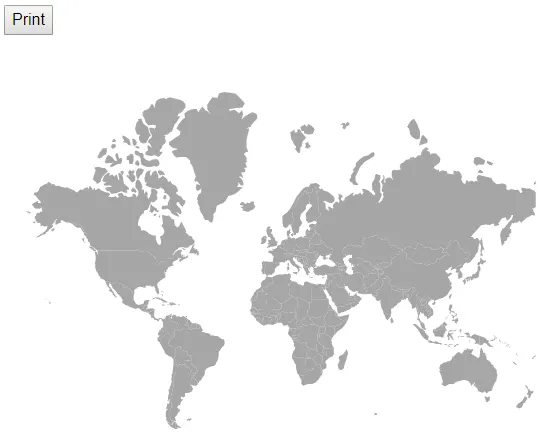
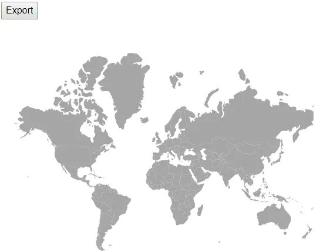
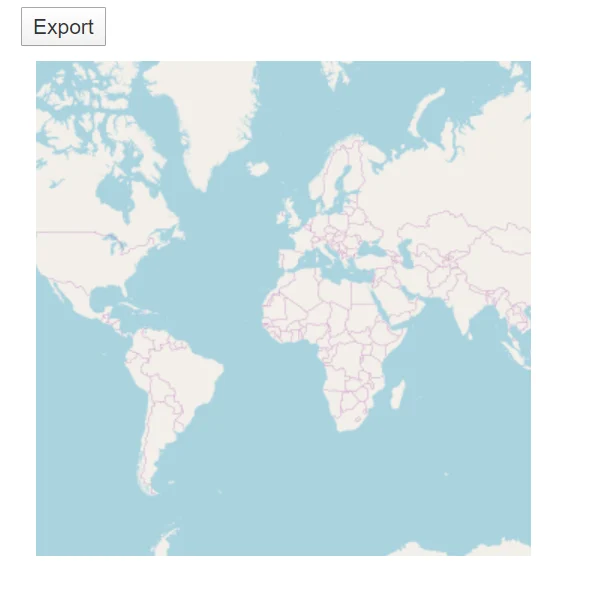

# Blazor Maps Print and Export

## Print

The rendered Maps component can be printed directly from the browser by calling the [PrintAsync](https://help.syncfusion.com/cr/blazor/Syncfusion.Blazor.Maps.SfMaps.html#Syncfusion_Blazor_Maps_SfMaps_PrintAsync) method. Enable printing by setting the [AllowPrint](https://help.syncfusion.com/cr/blazor/Syncfusion.Blazor.Maps.SfMaps.html#Syncfusion_Blazor_Maps_SfMaps_AllowPrint) property to **true**.

```cshtml

@using Syncfusion.Blazor.Maps

<button @onclick="PrintMap">Print</button>
<SfMaps @ref="Maps" AllowPrint="true">
    <MapsLayers>
        <MapsLayer ShapeData='new {dataOptions= "https://cdn.syncfusion.com/maps/map-data/world-map.json"}' TValue="string">
        </MapsLayer>
    </MapsLayers>
</SfMaps>

@code {
    SfMaps Maps;

    public async Task PrintMap()
    {
        // Call PrintAsync using the Maps component reference.
        await Maps.PrintAsync();
    }
}

```



## Export

### Image export

Enable image export by setting the [AllowImageExport](https://help.syncfusion.com/cr/blazor/Syncfusion.Blazor.Maps.SfMaps.html#Syncfusion_Blazor_Maps_SfMaps_AllowImageExport) property to **true**. Export the rendered Maps as an image using the [ExportAsync](https://help.syncfusion.com/cr/blazor/Syncfusion.Blazor.Maps.SfMaps.html#Syncfusion_Blazor_Maps_SfMaps_ExportAsync_Syncfusion_Blazor_Maps_ExportType_System_String_System_Nullable_Syncfusion_PdfExport_PdfPageOrientation__System_Boolean_) method. The method accepts the [ExportType](https://help.syncfusion.com/cr/blazor/Syncfusion.Blazor.Maps.ExportType.html) and a file name. Supported formats:

* JPEG
* PNG
* SVG

```cshtml

@using Syncfusion.Blazor.Maps

<button @onclick="ExportMap">Export</button>
<SfMaps @ref="Maps" AllowImageExport="true">
    <MapsLayers>
        <MapsLayer ShapeData='new {dataOptions= "https://cdn.syncfusion.com/maps/map-data/world-map.json"}' TValue="string">
        </MapsLayer>
    </MapsLayers>
</SfMaps>

@code {
    SfMaps Maps;

    public async Task ExportMap()
    {
        await Maps.ExportAsync(ExportType.PNG, "Maps");
    }
}

```



### PDF Export

Enable PDF export by setting the [AllowPdfExport](https://help.syncfusion.com/cr/blazor/Syncfusion.Blazor.Maps.SfMaps.html#Syncfusion_Blazor_Maps_SfMaps_AllowPdfExport) property to **true**. Export the rendered Maps to PDF using the [ExportAsync](https://help.syncfusion.com/cr/blazor/Syncfusion.Blazor.Maps.SfMaps.html#Syncfusion_Blazor_Maps_SfMaps_ExportAsync_Syncfusion_Blazor_Maps_ExportType_System_String_System_Nullable_Syncfusion_PdfExport_PdfPageOrientation__System_Boolean_) method. This overload takes the export type, file name, and the page orientation as a `PdfExport.PdfPageOrientation` value (`Portrait` or `Landscape`).

```cshtml

@using Syncfusion.Blazor.Maps

<button @onclick="ExportMap">Export</button>
<SfMaps @ref="Maps" AllowPdfExport="true">
    <MapsLayers>
        <MapsLayer ShapeData='new {dataOptions= "https://cdn.syncfusion.com/maps/map-data/world-map.json"}' TValue="string">
        </MapsLayer>
    </MapsLayers>
</SfMaps>

@code {
    SfMaps Maps;

    public async Task ExportMap()
    {
        await Maps.ExportAsync(Syncfusion.Blazor.Maps.ExportType.PDF, "Maps", Syncfusion.PdfExport.PdfPageOrientation.Portrait);
    }
}

```


### Exporting Maps as a base64 string

An image or PDF can be exported as a base64 string for JPEG, PNG, and PDF formats. Export the rendered Maps to a base64 string using the [ExportAsync](https://help.syncfusion.com/cr/blazor/Syncfusion.Blazor.Maps.SfMaps.html#Syncfusion_Blazor_Maps_SfMaps_ExportAsync_Syncfusion_Blazor_Maps_ExportType_System_String_System_Nullable_Syncfusion_PdfExport_PdfPageOrientation__System_Boolean_) method. Provide the export type, file name, orientation (`null` for an image, `PdfPageOrientation.Portrait`/`Landscape` for PDF), and set `allowDownload` to **false** to return the string instead of triggering a download.

```cshtml

@using Syncfusion.Blazor.Maps

<button @onclick="ExportMap">Export</button>
<SfMaps @ref="Maps" AllowPdfExport="true">
    <MapsLayers>
        <MapsLayer ShapeData='new {dataOptions= "https://cdn.syncfusion.com/maps/map-data/world-map.json"}' TValue="string">
        </MapsLayer>
    </MapsLayers>
</SfMaps>

@code {
    SfMaps Maps;
    string exportString;

    public async Task ExportMap()
    {
        exportString = await Maps.ExportAsync(Syncfusion.Blazor.Maps.ExportType.PDF, "Maps", Syncfusion.PdfExport.PdfPageOrientation.Portrait, false);
        // exportString holds the base64 content, e.g. "data:application/pdf;base64,...".
    }
}

```

N> Add the following service configuration in the **Program.cs** file if the size of the Maps is too large.

```csharp

builder.Services.AddServerSideBlazor().AddHubOptions(o => { o.MaximumReceiveMessageSize = 102400000; });

```

### Export a tile map

Maps that use tile providers such as OSM, Bing, and others can be exported using the [ExportAsync](https://help.syncfusion.com/cr/blazor/Syncfusion.Blazor.Maps.SfMaps.html#Syncfusion_Blazor_Maps_SfMaps_ExportAsync_Syncfusion_Blazor_Maps_ExportType_System_String_System_Nullable_Syncfusion_PdfExport_PdfPageOrientation__System_Boolean_) method. Supported export formats:

* JPEG
* PNG
* PDF

```cshtml

@using Syncfusion.Blazor.Maps

<button @onclick="ExportMap">Export</button>
<SfMaps @ref="Maps" AllowPdfExport="true" AllowImageExport="true">
    <MapsLayers>
        <MapsLayer UrlTemplate="https://tile.openstreetmap.org/level/tileX/tileY.png" TValue="string">
        </MapsLayer>
    </MapsLayers>
</SfMaps>

@code {
    SfMaps Maps;

    public async Task ExportMap()
    {
        await Maps.ExportAsync(ExportType.PNG, "OSM Map");
    }
}

```


