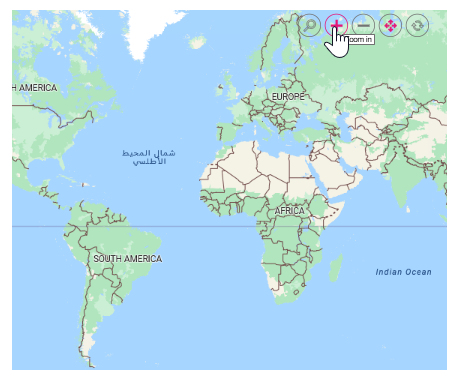
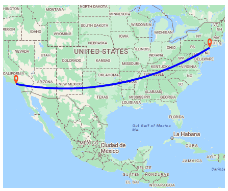
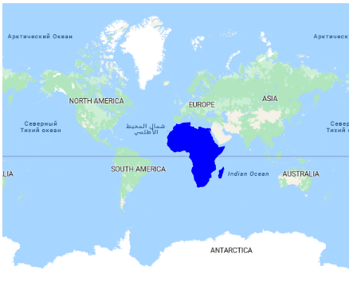
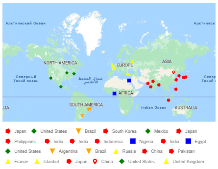

# Azure Maps in Blazor Maps Component

Azure Maps, an online map service owned by Microsoft, provides map tile images based on user requests. The Syncfusion Blazor Maps component combines these images into a single view to display the map. You can display Azure Maps by specifying their tile service URL in the [UrlTemplate](https://help.syncfusion.com/cr/blazor/Syncfusion.Blazor.Maps.MapsLayer-1.html#Syncfusion_Blazor_Maps_MapsLayer_1_UrlTemplate) property.

## Displaying Azure Maps

The Azure map tile service can be accessed via the following URL:
https://atlas.microsoft.com/map/tile?api-version=2024-04-01&tilesetId=microsoft.base.road&zoom={zoom}&x={x}&y={y}&subscription-key=Your_Key

In the above URL template,

* {zoom} - It represents the zoom level of the map.
* {x} - It represents the horizontal position of the tile.
* {y} - It represents the vertical position of the tile. 

These placeholders are replaced by **level**, **tileX**, and **tileY**, respectively, to retrieve the correct map tile. 

>You can refer this documentation [link](https://learn.microsoft.com/en-us/rest/api/maps/render/get-map-tile?view=rest-maps-2024-04-01&tabs=HTTP) for the latest tile service URL for Azure Maps.

The **subscription_key** is required and must be included in the URL to authenticate and access the map tiles. Follow the steps in this [link](https://docs.microsoft.com/en-us/azure/search/search-security-api-keys) to generate an API key, and then add this key to the URL.

N>Refer to [Azure Maps Licensing](https://azure.microsoft.com/en-in/support/legal/).

You can customize various tile types in Azure Maps by modifying the **tilesetId** value in the URL. In the example below, the **microsoft.base.road** tile type is specified in the URL, allowing these tile images to be displayed in the Syncfusion Maps component. To explore the available tile types in Azure Maps, follow the link below.

https://learn.microsoft.com/en-us/rest/api/maps/render/get-map-tile?view=rest-maps-2023-06-01&tabs=HTTP#tilesetid
 
N>Syncfusion Maps only support displaying maps with raster images in **PNG** or **JPG** formats.

In the following example, Azure Maps can be rendered using the `UrlTemplate` property with its tile server URL.

```cshtml
@using Syncfusion.Blazor.Maps

<SfMaps>
    <MapsLayers>
        <MapsLayer UrlTemplate="https://atlas.microsoft.com/map/tile?api-version=2022-08-01&tilesetId=microsoft.base.road&zoom=level&x=tileX&y=tileY&subscription-key=Your_Key" TValue="string">
        </MapsLayer>
    </MapsLayers>
</SfMaps>
```


## Enabling zooming and panning

The Azure Maps layer supports both zooming and panning. Zooming allows you to take a closer look at a particular area on the map for in-depth analysis, while panning enables you to move the map around to focus on the target area.

```cshtml
@using Syncfusion.Blazor.Maps

<SfMaps>
    @* To zoom and pan *@
    <MapsZoomSettings Enable="true">
        <MapsZoomToolbarSettings>
            <MapsZoomToolbarButton ToolbarItems="new List<ToolbarItem>() { ToolbarItem.Zoom, ToolbarItem.ZoomIn, ToolbarItem.ZoomOut,
            ToolbarItem.Pan, ToolbarItem.Reset }"></MapsZoomToolbarButton>
        </MapsZoomToolbarSettings>
    </MapsZoomSettings>
    <MapsLayers>
        <MapsLayer UrlTemplate="https://atlas.microsoft.com/map/tile?api-version=2022-08-01&tilesetId=microsoft.base.road&zoom=level&x=tileX&y=tileY&subscription-key=Your_Key" TValue="string">
        </MapsLayer>
    </MapsLayers>
</SfMaps>
```



## Adding markers and navigation line

Markers can be added to the Azure Maps layer by setting the latitude and longitude coordinates of the desired location using [MapsMarker](https://help.syncfusion.com/cr/blazor/Syncfusion.Blazor.Maps.MapsMarker-1.html). Additionally, navigation lines can be added on top of the Azure Maps layer to highlight paths between various places by specifying the corresponding latitude and longitude coordinates in the [MapsNavigationLine](https://help.syncfusion.com/cr/blazor/Syncfusion.Blazor.Maps.MapsNavigationLine.html).

```csharp
@using Syncfusion.Blazor.Maps

<SfMaps>
    <MapsZoomSettings ZoomFactor="4"></MapsZoomSettings>
    <MapsCenterPosition Latitude="29.394708" Longitude="-94.954653"></MapsCenterPosition>
    <MapsLayers>
        <MapsLayer UrlTemplate="https://atlas.microsoft.com/map/tile?api-version=2022-08-01&tilesetId=microsoft.base.road&zoom=level&x=tileX&y=tileY&subscription-key=Your_Key" TValue="string">
            @* Add markers *@
            <MapsMarkerSettings>
                <MapsMarker Visible="true" Height="25" Width="15" DataSource="Cities" TValue="City">
                </MapsMarker>
            </MapsMarkerSettings>
            @* Add navigation line *@
            <MapsNavigationLines>
                <MapsNavigationLine Visible="true" Color="blue" Angle="0.1" Latitude="new double[]{34.060620, 40.724546}"
                                    Longitude="new double[]{-118.330491,-73.850344}">
                </MapsNavigationLine>
            </MapsNavigationLines>
        </MapsLayer>
    </MapsLayers>
</SfMaps>

@code{
    public class City
    {
        public double Latitude { get; set; }
        public double Longitude { get; set; }
        public string Name { get; set; }
    }
    private List<City> Cities = new List<City> {
        new City { Latitude = 34.060620, Longitude = -118.330491,  Name="California" },
        new City{ Latitude = 40.724546, Longitude = -73.850344,  Name="New York"}
    };
}
```



## Adding sublayer

Any GeoJSON shape can be rendered as a sublayer on top of the Azure Maps layer to highlight a particular continent or country. This is achieved by adding another layer and setting the [Type](https://help.syncfusion.com/cr/blazor/Syncfusion.Blazor.Maps.MapsLayer-1.html#Syncfusion_Blazor_Maps_MapsLayer_1_Type) property of [MapsLayer](https://help.syncfusion.com/cr/blazor/Syncfusion.Blazor.Maps.MapsLayer-1.html) to **SubLayer**.

```cshtml
@using Syncfusion.Blazor.Maps

<SfMaps>
    <MapsLayers>
        <MapsLayer UrlTemplate="https://atlas.microsoft.com/map/tile?api-version=2022-08-01&tilesetId=microsoft.base.road&zoom=level&x=tileX&y=tileY&subscription-key=Your_Key" TValue="string">
        </MapsLayer>
        @* To add geometry shape as sublayer *@
        <MapsLayer ShapeData='new {dataOptions = "https://cdn.syncfusion.com/maps/map-data/africa.json"}'
                   Type="Syncfusion.Blazor.Maps.Type.SubLayer" TValue="string">
            <MapsShapeSettings Fill="blue"></MapsShapeSettings>
        </MapsLayer>
    </MapsLayers>
</SfMaps>
```



## Enabling legend

The legend can be added to the Azure Maps by setting the [Visible](https://help.syncfusion.com/cr/blazor/Syncfusion.Blazor.Maps.MapsLegendSettings.html#Syncfusion_Blazor_Maps_MapsLegendSettings_Visible) property of [MapsLegendSettings](https://help.syncfusion.com/cr/blazor/Syncfusion.Blazor.Maps.MapsLegendSettings.html) to **true**.

In the example below, the legend is added to the markers on the Azure Maps layer.

```cshtml
@using Syncfusion.Blazor.Maps

<SfMaps Format="N0" EnableGroupingSeparator="true">
    <MapsZoomSettings Enable="true">
        <MapsZoomToolbarSettings>
            <MapsZoomToolbarTooltipSettings FontFamily="inherit"></MapsZoomToolbarTooltipSettings>
        </MapsZoomToolbarSettings>
    </MapsZoomSettings>
    <MapsLegendSettings Visible="true" Position="LegendPosition.Float" Height="123px" Width="200px" Type="LegendType.Markers" X="10" Y="247" Background="#E6E6E6" ShapePadding="10">
        <MapsLegendTextStyle FontFamily="inherit" Color="#000000" />
    </MapsLegendSettings>
    <MapsTitleSettings Text="Top 10 populated cities in the World">
        <MapsTitleTextStyle Size="16px" FontFamily="inherit" />
    </MapsTitleSettings>
    <MapsLayers>
        <MapsLayer UrlTemplate="https://atlas.microsoft.com/map/tile?api-version=2022-08-01&tilesetId=microsoft.base.road&zoom=level&x=tileX&y=tileY&subscription-key=Your_Key" TValue="string">
        <MapsMarkerSettings>
                <MapsMarker Visible="true" TValue="PopulationCityDetails" DataSource="@PopulatedCities" Shape="MarkerType.Circle" Fill="#FFFFFF" ColorValuePath="Color" LegendText="Name" Height="15" Width="15">
                    <MapsMarkerTooltipSettings Visible="true" ValuePath="Population" Format="City Name: ${Name}</br>Population: ${Population} million">
                        <MapsMarkerTooltipTextStyle FontFamily="inherit"></MapsMarkerTooltipTextStyle>
                    </MapsMarkerTooltipSettings>
                </MapsMarker>
            </MapsMarkerSettings>
        </MapsLayer>
    </MapsLayers>
</SfMaps>

@code{
    public class PopulationCityDetails
    {        
        public string Name { get; set; }
        public double Latitude { get; set; }
        public double Longitude { get; set; }
        public double Population { get; set; }
        public string Color { get; set; }
    };
    public List<PopulationCityDetails> PopulatedCities = new List<PopulationCityDetails> {
        new PopulationCityDetails { Name ="Tokyo", Latitude= 35.6805245924747, Longitude= 139.76770396213337, Population= 37435191, Color="#2EB6C8"},
        new PopulationCityDetails { Name ="Delhi", Latitude= 28.644800, Longitude= 77.216721, Population= 29399141, Color="#4A97F4"},
        new PopulationCityDetails { Name ="Shanghai", Latitude= 31.224361, Longitude= 121.469170, Population= 26317104, Color="#498082"},
        new PopulationCityDetails { Name ="Sao Paulo", Latitude= -23.550424484747914, Longitude= -46.646471636488315, Population= 21846507, Color="#FB9E67"},
        new PopulationCityDetails { Name ="Mexico City", Latitude= 19.427402397418774, Longitude= -99.131123716666, Population= 21671908, Color="#8F9DE3"},
        new PopulationCityDetails { Name ="Cairo ", Latitude= 30.033333, Longitude= 31.233334, Population= 20484965, Color="#7B9FB0"},
        new PopulationCityDetails { Name ="Dhaka", Latitude= 23.777176, Longitude= 90.399452, Population= 20283552, Color="#4DB647"},
        new PopulationCityDetails { Name ="Mumbai", Latitude= 19.08492049646163, Longitude= 72.87449446319248, Population= 20185064, Color="#30BEFF"},
        new PopulationCityDetails { Name ="Beijing", Latitude= 39.90395970055848, Longitude= 116.38831272088059, Population= 20035455, Color="#Ac72AD"},
        new PopulationCityDetails { Name ="Osaka", Latitude= 34.69024500601642, Longitude= 135.50746225677142, Population= 19222665, Color="#EFE23E"}
    };
}

```

