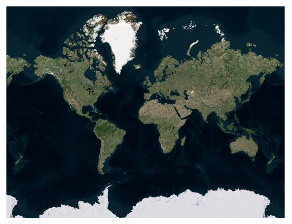
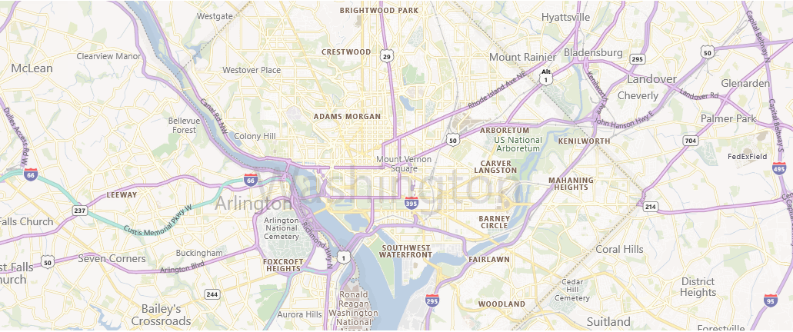
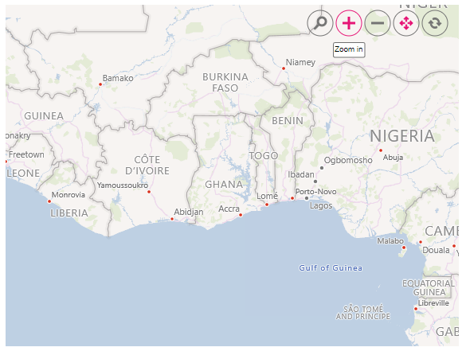

# Bing Maps in Blazor Maps Component

Bing Maps is a online Maps provider, owned by Microsoft, for accessing the external geospatial imagery services for deep-zoom satellite view which is supported in the Blazor Maps component. This provides the ability to visualize satellite, aerial, and street Maps without using any external shape files. As like OSM, it provide Maps tile images based on our requests and combines those images into a single one to display Maps area.

## Adding Bing Maps

The Bing Maps can be rendered by setting the [UrlTemplate](https://help.syncfusion.com/cr/blazor/Syncfusion.Blazor.Maps.MapsLayer-1.html#Syncfusion_Blazor_Maps_MapsLayer_1_UrlTemplate) property with the value from the `GetBingUrlTemplate` method in the Maps component. The format of the required URL of Bing Maps varies from the other tile services. Hence, we have added a top-level `GetBingUrlTemplate` method which returns the URL in the required format. The subscription key is needed for bing maps. An API key can be created by following the steps mentioned in this [link](https://www.microsoft.com/en-us/maps/create-a-bing-maps-key) and append this key to the Bing map URL before pass it to the `GetBingUrlTemplate` method. The URL returned from this method must be passed to the `UrlTemplate` property.

```cshtml
@using Syncfusion.Blazor.Maps

<SfMaps>
    <MapsLayers>
        <MapsLayer UrlTemplate="@UrlTemplate" TValue="string"></MapsLayer>
    </MapsLayers>
</SfMaps>

@code {
    public string UrlTemplate;
    protected override async Task OnInitializedAsync()
    {
        UrlTemplate = await SfMaps.GetBingUrlTemplate("https://dev.virtualearth.net/REST/V1/Imagery/Metadata/RoadOnDemand?output=json&uriScheme=https&key=");
    }
}
```

>Specify Bing Maps key in the above link passed in the `GetBingUrlTemplate` method.



## Types of Bing Maps

Bing Maps provides different types of Maps and it can be viewed in the Maps component.

* **Aerial** - Displays satellite images to highlight roads and major landmarks for easy identification.
* **AerialWithLabelsOnDemand** - Displays aerial Maps with labels for the continent, country, ocean, etc.
* **Road** - Displays the default Maps view of roads, buildings, and geography.
* **CanvasDark** - Displays dark version of the road Maps.
* **CanvasLight** - Displays light version of the road Maps.
* **CanvasGray** - Displays grayscale version of the road Maps.

The above types can also be rendered in the Maps component by specifying their URL in the `UrlTemplate` property in the `MapsLayer` class. You can check the official websites of the Bing Maps to know about the available types and the URL for it.

```cshtml
@using Syncfusion.Blazor.Maps

<SfMaps>
    <MapsLayers>
        <MapsLayer UrlTemplate="@UrlTemplate" TValue="string"></MapsLayer>
    </MapsLayers>
</SfMaps>

@code {
    public string UrlTemplate;
    protected override async Task OnInitializedAsync()
    {
        UrlTemplate = await SfMaps.GetBingUrlTemplate("https://dev.virtualearth.net/REST/V1/Imagery/Metadata/CanvasGray?output=json&uriScheme=https&key=");
    }
}
```

> Specify Bing Maps key in the above link passed in the `GetBingUrlTemplate` method.



## Zooming and Panning

Bing Maps layer can be zoomed and panned. Zooming helps to get a closer look at a particular area on a Maps for in-depth analysis. Panning helps to move a Maps around to focus the targeted area.

```cshtml
@using Syncfusion.Blazor.Maps

<SfMaps>
    @* To zoom and pan *@
    <MapsZoomSettings Enable="true">
        <MapsZoomToolbarSettings>
            <MapsZoomToolbarButton ToolbarItems="new List<ToolbarItem>() { ToolbarItem.Zoom, ToolbarItem.ZoomIn, ToolbarItem.ZoomOut,
            ToolbarItem.Pan, ToolbarItem.Reset }"></MapsZoomToolbarButton>
        </MapsZoomToolbarSettings>
    </MapsZoomSettings>
    <MapsLayers>
        <MapsLayer UrlTemplate="@UrlTemplate" TValue="string"></MapsLayer>
    </MapsLayers>
</SfMaps>

@code {
    public string UrlTemplate;
    protected override async Task OnInitializedAsync()
    {
        UrlTemplate = await SfMaps.GetBingUrlTemplate("https://dev.virtualearth.net/REST/V1/Imagery/Metadata/RoadOnDemand?output=json&uriScheme=https&key=");
    }
}
```

>Specify Bing Maps key in the above link passed in the `GetBingUrlTemplate` method.



## Adding markers and navigation line

Markers can be added to the layers of Bing Maps by setting the corresponding location's coordinates of latitude and longitude using [MapsMarker](https://help.syncfusion.com/cr/blazor/Syncfusion.Blazor.Maps.MapsMarker-1.html). Navigation lines can be added on top of an Bing Maps layer for highlighting a path among various places by setting the corresponding location's coordinates of latitude and longitude in the [MapsNavigationLine](https://help.syncfusion.com/cr/blazor/Syncfusion.Blazor.Maps.MapsNavigationLine.html).

```cshtml
@using Syncfusion.Blazor.Maps

<SfMaps>
    <MapsZoomSettings ZoomFactor="4"></MapsZoomSettings>
    <MapsCenterPosition Latitude="29.394708" Longitude="-94.954653"></MapsCenterPosition>
    <MapsLayers>
        <MapsLayer UrlTemplate="@UrlTemplate" TValue="string">
            @* Add marker *@
            <MapsMarkerSettings>
                <MapsMarker Visible="true" Height="25" Width="15" DataSource="Cities" TValue="City">
                </MapsMarker>
            </MapsMarkerSettings>
            @* Add navigation line *@
            <MapsNavigationLines>
                <MapsNavigationLine Visible="true" Color="blue" Angle="0.1" Latitude="new double[]{34.060620, 40.724546}"
                                    Longitude="new double[]{-118.330491,-73.850344}">
                </MapsNavigationLine>
            </MapsNavigationLines>
        </MapsLayer>
    </MapsLayers>
</SfMaps>

@code {
    public class City
    {
        public double Latitude { get; set; }
        public double Longitude { get; set; }
        public string Name { get; set; }
    }
    private List<City> Cities = new List<City> {
        new City { Latitude = 34.060620, Longitude = -118.330491,  Name="California" },
        new City{ Latitude = 40.724546, Longitude = -73.850344,  Name="New York"}
    };
    public string UrlTemplate;
    protected override async Task OnInitializedAsync()
    {
        UrlTemplate = await SfMaps.GetBingUrlTemplate("https://dev.virtualearth.net/REST/V1/Imagery/Metadata/RoadOnDemand?output=json&uriScheme=https&key=");
    }
}
```

>Specify Bing Maps key in the above link passed in the `GetBingUrlTemplate` method.


## Sublayer

Any GeoJSON shape can be rendered as a sublayer on top of the Bing Maps layer for highlighting a particular continent or country in Bing Maps by adding another layer and specifying the [Type](https://help.syncfusion.com/cr/blazor/Syncfusion.Blazor.Maps.MapsLayer-1.html#Syncfusion_Blazor_Maps_MapsLayer_1_Type) of [MapsLayer](https://help.syncfusion.com/cr/blazor/Syncfusion.Blazor.Maps.MapsLayer-1.html) to **SubLayer**.

>[Refer to section](../how-to/display-geometry-shapes-in-bing-maps) to learn how to add a sublayer in Bing Maps