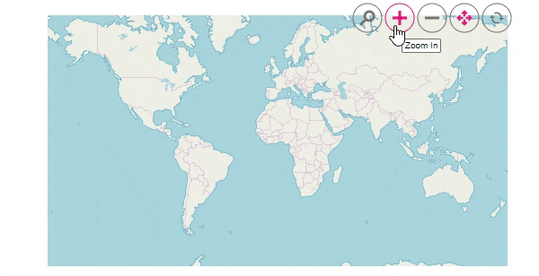

# Bing Maps in Blazor Maps Component

Bing maps is a online map provider, owned by Microsoft, for accessing the external geospatial imagery services for deep-zoom satellite view which is supported in the Blazor Maps component. This provides the ability to visualize satellite, aerial, and street maps without using any external shape files. As like OSM, it provides map tile images based on our requests and combines those images into a single one to display the map area.

## Adding Bing Maps

The Bing Maps can be rendered by setting the [LayerType](https://help.syncfusion.com/cr/blazor/Syncfusion.Blazor.Maps.MapsLayer-1.html#Syncfusion_Blazor_Maps_MapsLayer_1_LayerType) as "**Bing**" and the key for the Bing Maps must be set in the [Key](https://help.syncfusion.com/cr/blazor/Syncfusion.Blazor.Maps.MapsLayer-1.html#Syncfusion_Blazor_Maps_MapsLayer_1_Key) property. The Bing Maps key can be obtained from [here](https://www.microsoft.com/en-us/maps/create-a-bing-maps-key).

```cshtml
@using Syncfusion.Blazor.Maps

<SfMaps>
    <MapsLayers>
        <MapsLayer LayerType="ShapeLayerType.Bing" TValue="string" Key=""></MapsLayer>
    </MapsLayers>
</SfMaps>
```

> Specify Bing map key in the `Key` property.


## Types of Bing maps

Bing Maps provides different types of maps and it is supported in the Maps component.

* **Aerial** - Displays satellite images to highlight roads and major landmarks for easy identification.
* **AerialWithLabel** - Displays aerial map with labels for the continent, country, ocean, etc.
* **Road** - Displays the default map view of roads, buildings, and geography.
* **CanvasDark** - Displays dark version of the road maps.
* **CanvasLight** - Displays light version of the road maps.
* **CanvasGray** - Displays grayscale version of the road maps.

To render the light version of the road maps, set the [BingMapType](https://help.syncfusion.com/cr/blazor/Syncfusion.Blazor.Maps.MapsLayer-1.html#Syncfusion_Blazor_Maps_MapsLayer_1_BingMapType) to [CanvasLight](https://help.syncfusion.com/cr/aspnetcore-blazor/Syncfusion.Blazor.Maps.BingMapType.html) as demonstrated in the following code sample.

```cshtml
@using Syncfusion.Blazor.Maps

<SfMaps>
    <MapsLayers>
        <MapsLayer LayerType="ShapeLayerType.Bing" BingMapType="BingMapType.CanvasLight" Key="" TValue="string">
        </MapsLayer>
    </MapsLayers>
    @* Additionally map has been zoomed based on the center position *@
    <MapsZoomSettings ZoomFactor="12"></MapsZoomSettings>
    <MapsCenterPosition Latitude="38.8951" Longitude="-77.0364"></MapsCenterPosition>
</SfMaps>
```

> Specify Bing maps key in the `Key` property.


## Zooming and panning

Bing maps layer can be zoomed and panned. Zooming helps to get a closer look at a particular area on a map for in-depth analysis. Panning helps to move a map around to focus the targeted area.

```cshtml
@using Syncfusion.Blazor.Maps

<SfMaps>
    @* To zoom and pan using toolbar *@
    <MapsZoomSettings Enable="true"
                      Toolbars='new string[]{"Zoom", "ZoomIn", "ZoomOut", "Pan", "Reset" }'>
    </MapsZoomSettings>
    <MapsLayers>
        <MapsLayer LayerType="ShapeLayerType.Bing" Key="" TValue="string"></MapsLayer>
    </MapsLayers>
</SfMaps>
```

> Specify Bing map key in the `Key` property.



## Adding markers and navigation line

Markers can be added to the layers of Bing maps by setting the corresponding location's coordinates of latitude and longitude using [MapsMarker](https://help.syncfusion.com/cr/blazor/Syncfusion.Blazor.Maps.MapsMarker-1.html) class. Navigation lines can be added on top of an Bing maps layer for highlighting a path among various places by setting the corresponding location's coordinates of latitude and longitude in the [MapsNavigationLine](https://help.syncfusion.com/cr/blazor/Syncfusion.Blazor.Maps.MapsNavigationLine.html) class.

```cshtml
@using Syncfusion.Blazor.Maps

<SfMaps>
    <MapsZoomSettings ZoomFactor="4"></MapsZoomSettings>
    <MapsCenterPosition Latitude="29.394708" Longitude="-94.954653"></MapsCenterPosition>
    <MapsLayers>
        <MapsLayer LayerType="ShapeLayerType.Bing" BingMapType="BingMapType.CanvasLight" Key="" TValue="string">
            @* Add markers *@
            <MapsMarkerSettings>
                <MapsMarker Visible="true" Height="25" Width="15" DataSource="Cities" TValue="City">
                </MapsMarker>
            </MapsMarkerSettings>
            @* Add navigation line *@
            <MapsNavigationLines>
                <MapsNavigationLine Visible="true" Color="blue" Angle="0.1" Latitude="new double[]{34.060620, 40.724546}"
                                    Longitude="new double[]{-118.330491,-73.850344}">
                </MapsNavigationLine>
            </MapsNavigationLines>
        </MapsLayer>
    </MapsLayers>
</SfMaps>

@code{
    public class City
    {
        public double Latitude { get; set; }
        public double Longitude { get; set; }
        public string Name { get; set; }
    }
    private List<City> Cities = new List<City> {
        new City { Latitude = 34.060620, Longitude = -118.330491,  Name="California" },
        new City{ Latitude = 40.724546, Longitude = -73.850344,  Name="New York"}
    };
}
```

> Specify Bing map key in the `Key` property.


## Sublayer

Any GeoJSON shape can be rendered as a sublayer on top of the Bing maps layer for highlighting a particular continent or country in Bing maps by adding another layer and specifying the [Type](https://help.syncfusion.com/cr/blazor/Syncfusion.Blazor.Maps.MapsLayer-1.html#Syncfusion_Blazor_Maps_MapsLayer_1_Type) of [MapsLayer](https://help.syncfusion.com/cr/blazor/Syncfusion.Blazor.Maps.MapsLayer-1.html) class to "**SubLayer**".

> [Refer to section](../how-to/display-geometry-shapes-in-bing-maps) to learn how to add a sublayer in Bing maps
