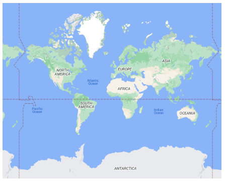
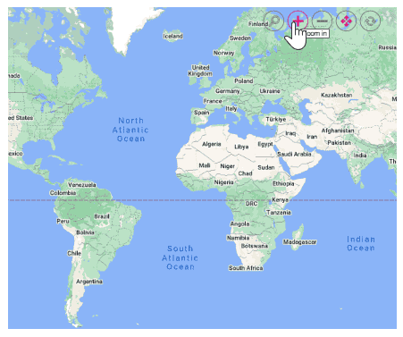
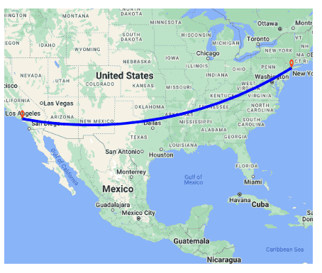
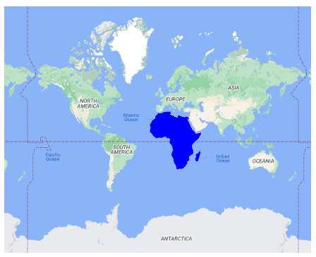
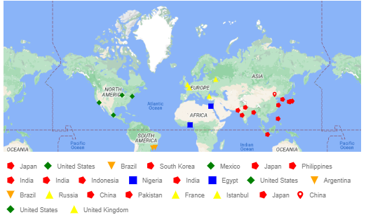

# Google Maps in Blazor Maps component

Google Maps is an online maps provider owned by Google. It provides map tile images based on user requests. The Syncfusion<sup style="font-size:70%">&reg;</sup> Blazor Maps component combines these images into a single view to display the map. You can display Google Maps by specifying their tile service URL in the [UrlTemplate](https://help.syncfusion.com/cr/blazor/Syncfusion.Blazor.Maps.MapsLayer-1.html#Syncfusion_Blazor_Maps_MapsLayer_1_UrlTemplate) property.

## Displaying Google Maps

The Google Map tile service can be accessed using the following URL:
https://tile.googleapis.com/v1/2dtiles/z/x/y?session=YOUR_SESSION_TOKEN&key=YOUR_API_KEY

In the above URL template,

* {z} - It represents the zoom level of the map. 
* {x} - It represents the horizontal position of the tile.
* {y} - It represents the vertical position of the tile. 

These placeholders are replaced by **level**, **tileX**, and **tileY**, respectively, to retrieve the correct map tile.

N>You can refer this documentation [link](https://developers.google.com/maps/documentation/tile/roadmap) for the latest URL template for Google Maps.

Below are the outlined steps to integrate Google Maps tiles into the Syncfusion<sup style="font-size:70%">&reg;</sup> Maps component.

1. Generate an API key from the Google Cloud Platform.
2. Generate a session token to retrieve Google Map tiles.
3. Initialize the Syncfusion<sup style="font-size:70%">&reg;</sup> Maps component using the Google Maps tile service URL, including the generated session token and API key.

Here's a step-by-step explanation of how to integrate Google Maps tiles into the Syncfusion<sup style="font-size:70%">&reg;</sup> Maps component using the provided code:

**STEP 1**: Generate an API key from the Google Cloud Platform by enabling the necessary APIs, such as the Google Maps Tile API and Google Maps API. This key is crucial for authentication and must be included in every API call. Follow the steps in [this link](https://developers.google.com/maps/documentation/tile/get-api-key) to generate an API key.

```cshtml

protected override async Task OnInitializedAsync()
{
    try
    {
        // Replace 'Your_Key' with your actual API key
        string apiKey = "Your_Key";
        string sessionToken = await FetchSessionToken(apiKey);

        // Update the UrlTemplate with the session token
        UrlTemplate = $"https://tile.googleapis.com/v1/2dtiles/level/tileX/tileY?session={sessionToken}&key={apiKey}";
    }
    catch (Exception ex)
    {
        Console.Error.WriteLine($"Failed to initialize the map: {ex.Message}");
    }
}

```

**STEP 2**: The **FetchSessionToken** function generates a session token, which is needed to retrieve Google Map tiles, by sending a POST request to the **createSession** endpoint of the Google Maps Tile API.

```cshtml

private async Task<string> FetchSessionToken(string apiKey)
{
    try
    {
        // Define the API endpoint
        var apiUrl = $"https://tile.googleapis.com/v1/createSession?key={apiKey}";

        // Create the request body as an object
        var requestBody = new
        {
            mapType = "roadmap",
            language = "en-US",
            region = "US"
        };

        // Serialize the request body to JSON
        var jsonContent = new StringContent(
            JsonSerializer.Serialize(requestBody),
            Encoding.UTF8,
            "application/json"
        );

        // Send the POST request using HttpClient
        var response = await Http.PostAsync(apiUrl, jsonContent);

        // Check if the response is successful
        if (!response.IsSuccessStatusCode)
        {
            var errorData = JsonSerializer.Deserialize<ErrorResponse>(
                await response.Content.ReadAsStringAsync()
            );
            throw new Exception($"Error generating session token: {errorData?.Error?.Message}");
        }

        var responseData = await response.Content.ReadFromJsonAsync<SessionResponse>();
        // Return the session token
        return responseData?.Session;
    }
    catch (Exception ex)
    {
        throw new Exception($"Error fetching session token: {ex.Message}");
    }
}

// Classes to deserialize the API response
private class SessionResponse
{
    public string Session { get; set; }
}

private class ErrorResponse
{
    public ErrorDetails Error { get; set; }
}

private class ErrorDetails
{
    public string Message { get; set; }
}

```

**STEP 3**: To initialize the Syncfusion<sup style="font-size:70%">&reg;</sup> Maps component, the **FetchSessionToken** function is invoked in the **OnInitializedAsync** method. After retrieving the session token, both the session token and the API key are appended to the `UrlTemplate` property of the Maps component. This ensures secure authentication and proper access to the map tiles, allowing the Syncfusion<sup style="font-size:70%">&reg;</sup> Maps component to display the map with the appropriate data.

```cshtml

<SfMaps>
    <MapsLayers>
        <MapsLayer UrlTemplate="@UrlTemplate" TValue="string">
        </MapsLayer>
    </MapsLayers>
</SfMaps>

```

In the following example, the Google maps is displayed by setting the `UrlTemplate` property with its tile server URL.

```cshtml

@using Syncfusion.Blazor.Maps
@using System.Text.Json
@using System.Text
@inject HttpClient Http

<SfMaps>
    <MapsLayers>
        <MapsLayer UrlTemplate="@UrlTemplate" TValue="string">
        </MapsLayer>
    </MapsLayers>
</SfMaps>

@code {
    private string UrlTemplate = "";

    protected override async Task OnInitializedAsync()
    {
        try
        {
            // Replace 'Your_Key' with your actual API key
            string apiKey = "Your_Key";
            string sessionToken = await FetchSessionToken(apiKey);

            // Update the UrlTemplate with the session token
            UrlTemplate = $"https://tile.googleapis.com/v1/2dtiles/level/tileX/tileY?session={sessionToken}&key={apiKey}";
        }
        catch (Exception ex)
        {
            Console.Error.WriteLine($"Failed to initialize the map: {ex.Message}");
        }
    }

    private async Task<string> FetchSessionToken(string apiKey)
    {
        try
        {
            // Define the API endpoint
            var apiUrl = $"https://tile.googleapis.com/v1/createSession?key={apiKey}";

            // Create the request body as an object
            var requestBody = new
            {
                mapType = "roadmap",
                language = "en-US",
                region = "US"
            };

            // Serialize the request body to JSON
            var jsonContent = new StringContent(
                JsonSerializer.Serialize(requestBody),
                Encoding.UTF8,
                "application/json"
            );

            // Send the POST request using HttpClient
            var response = await Http.PostAsync(apiUrl, jsonContent);

            // Check if the response is successful
            if (!response.IsSuccessStatusCode)
            {
                var errorData = JsonSerializer.Deserialize<ErrorResponse>(
                    await response.Content.ReadAsStringAsync()
                );
                throw new Exception($"Error generating session token: {errorData?.Error?.Message}");
            }

            var responseData = await response.Content.ReadFromJsonAsync<SessionResponse>();
            // Return the session token
            return responseData?.Session;
        }
        catch (Exception ex)
        {
            throw new Exception($"Error fetching session token: {ex.Message}");
        }
    }

    // Classes to deserialize the API response
    private class SessionResponse
    {
        public string Session { get; set; }
    }

    private class ErrorResponse
    {
        public ErrorDetails Error { get; set; }
    }

    private class ErrorDetails
    {
        public string Message { get; set; }
    }

}
```



## Enable zooming and panning

The Google Maps layer supports both zooming and panning. Zooming allows you to closely examine a particular area on the map for in-depth analysis, while panning enables you to navigate around the map to focus on the desired area. To enable zooming and panning, set the `Enable` property to **true** in the [MapsZoomSettings](https://help.syncfusion.com/cr/blazor/Syncfusion.Blazor.Maps.MapsZoomSettings.html).

```cshtml
@using Syncfusion.Blazor.Maps

<SfMaps>
    @* To zoom and pan *@
    <MapsZoomSettings Enable="true">
        <MapsZoomToolbarSettings>
            <MapsZoomToolbarButton ToolbarItems="new List<ToolbarItem>() { ToolbarItem.Zoom, ToolbarItem.ZoomIn, ToolbarItem.ZoomOut,
            ToolbarItem.Pan, ToolbarItem.Reset }"></MapsZoomToolbarButton>
        </MapsZoomToolbarSettings>
    </MapsZoomSettings>
    <MapsLayers>
        <MapsLayer UrlTemplate="https://tile.googleapis.com/v1/2dtiles/level/tileX/tileY?session=Your_sessionToken&key=Your_apiKey" TValue="string">
        </MapsLayer>
    </MapsLayers>
</SfMaps>
```



N>You can refer to the method for obtaining the session token as explained in the above section [Displaying Google Maps](https://blazor.syncfusion.com/documentation/maps/providers/google-maps#displaying-google-maps).

## Adding markers and navigation line

Markers can be added to the Google Maps layer by setting the latitude and longitude coordinates of the desired location using [MapsMarker](https://help.syncfusion.com/cr/blazor/Syncfusion.Blazor.Maps.MapsMarker-1.html) class. Additionally, navigation lines can be added on top of the Google Maps layer to highlight paths between various places by specifying the corresponding latitude and longitude coordinates in the [MapsNavigationLine](https://help.syncfusion.com/cr/blazor/Syncfusion.Blazor.Maps.MapsNavigationLine.html).

```cshtml
@using Syncfusion.Blazor.Maps

<SfMaps>
    <MapsZoomSettings ZoomFactor="4"></MapsZoomSettings>
    <MapsCenterPosition Latitude="29.394708" Longitude="-94.954653"></MapsCenterPosition>
    <MapsLayers>
        <MapsLayer UrlTemplate="https://tile.googleapis.com/v1/2dtiles/level/tileX/tileY?session=Your_sessionToken&key=Your_apiKey" TValue="string">
            @* Add markers *@
            <MapsMarkerSettings>
                <MapsMarker Visible="true" Height="25" Width="15" DataSource="Cities" TValue="City">
                </MapsMarker>
            </MapsMarkerSettings>
            @* Add navigation line *@
            <MapsNavigationLines>
                <MapsNavigationLine Visible="true" Color="blue" Angle="0.1" Latitude="new double[]{34.060620, 40.724546}"
                                    Longitude="new double[]{-118.330491,-73.850344}">
                </MapsNavigationLine>
            </MapsNavigationLines>
        </MapsLayer>
    </MapsLayers>
</SfMaps>

@code{
    public class City
    {
        public double Latitude { get; set; }
        public double Longitude { get; set; }
        public string Name { get; set; }
    }
    private List<City> Cities = new List<City> {
        new City { Latitude = 34.060620, Longitude = -118.330491,  Name="California" },
        new City{ Latitude = 40.724546, Longitude = -73.850344,  Name="New York"}
    };
}
```



N>You can refer to the method for obtaining the session token as explained in the above section [Displaying Google Maps](https://blazor.syncfusion.com/documentation/maps/providers/google-maps#displaying-google-maps).

## Adding sublayer

A GeoJSON shape can be rendered as a sublayer on top of the Google Maps layer to highlight a specific continent or country. This is achieved by adding another layer using [MapsLayer](https://help.syncfusion.com/cr/blazor/Syncfusion.Blazor.Maps.MapsLayer-1.html) and setting its [Type](https://help.syncfusion.com/cr/blazor/Syncfusion.Blazor.Maps.MapsLayer-1.html#Syncfusion_Blazor_Maps_MapsLayer_1_Type) property to **SubLayer**.

```cshtml
@using Syncfusion.Blazor.Maps

<SfMaps>
    <MapsLayers>
        <MapsLayer UrlTemplate="https://tile.googleapis.com/v1/2dtiles/level/tileX/tileY?session=Your_sessionToken&key=Your_apiKey" TValue="string">
        </MapsLayer>
        @* To add geometry shape as sublayer *@
        <MapsLayer ShapeData='new {dataOptions = "https://cdn.syncfusion.com/maps/map-data/africa.json"}'
                   Type="Syncfusion.Blazor.Maps.Type.SubLayer" TValue="string">
            <MapsShapeSettings Fill="blue"></MapsShapeSettings>
        </MapsLayer>
    </MapsLayers>
</SfMaps>
```



N>You can refer to the method for obtaining the session token as explained in the above section [Displaying Google Maps](https://blazor.syncfusion.com/documentation/maps/providers/google-maps#displaying-google-maps).

## Enable legend

The legend can be added to the Google Maps layer by setting the [Visible](https://help.syncfusion.com/cr/blazor/Syncfusion.Blazor.Maps.MapsLegendSettings.html#Syncfusion_Blazor_Maps_MapsLegendSettings_Visible) property of [MapsLegendSettings](https://help.syncfusion.com/cr/blazor/Syncfusion.Blazor.Maps.MapsLegendSettings.html) to **true**.

In the example below, the legend is added to the markers on the Google Maps layer.

```cshtml
@using Syncfusion.Blazor.Maps

<SfMaps Format="N0" EnableGroupingSeparator="true">
    <MapsZoomSettings Enable="true">
        <MapsZoomToolbarSettings>
            <MapsZoomToolbarTooltipSettings FontFamily="inherit"></MapsZoomToolbarTooltipSettings>
        </MapsZoomToolbarSettings>
    </MapsZoomSettings>
    <MapsLegendSettings Visible="true" Position="LegendPosition.Float" Height="123px" Width="200px" Type="LegendType.Markers" X="10" Y="247" Background="#E6E6E6" ShapePadding="10">
        <MapsLegendTextStyle FontFamily="inherit" Color="#000000" />
    </MapsLegendSettings>
    <MapsTitleSettings Text="Top 10 populated cities in the World">
        <MapsTitleTextStyle Size="16px" FontFamily="inherit" />
    </MapsTitleSettings>
    <MapsLayers>
        <MapsLayer UrlTemplate="https://tile.googleapis.com/v1/2dtiles/level/tileX/tileY?session=Your_sessionToken&key=Your_apiKey" TValue="string">
        <MapsMarkerSettings>
                <MapsMarker Visible="true" TValue="PopulationCityDetails" DataSource="@PopulatedCities" Shape="MarkerType.Circle" Fill="#FFFFFF" ColorValuePath="Color" LegendText="Name" Height="15" Width="15">
                    <MapsMarkerTooltipSettings Visible="true" ValuePath="Population" Format="City Name: ${Name}</br>Population: ${Population} million">
                        <MapsMarkerTooltipTextStyle FontFamily="inherit"></MapsMarkerTooltipTextStyle>
                    </MapsMarkerTooltipSettings>
                </MapsMarker>
            </MapsMarkerSettings>
        </MapsLayer>
    </MapsLayers>
</SfMaps>

@code{
    public class PopulationCityDetails
    {        
        public string Name { get; set; }
        public double Latitude { get; set; }
        public double Longitude { get; set; }
        public double Population { get; set; }
        public string Color { get; set; }
    };
    public List<PopulationCityDetails> PopulatedCities = new List<PopulationCityDetails> {
        new PopulationCityDetails { Name ="Tokyo", Latitude= 35.6805245924747, Longitude= 139.76770396213337, Population= 37435191, Color="#2EB6C8"},
        new PopulationCityDetails { Name ="Delhi", Latitude= 28.644800, Longitude= 77.216721, Population= 29399141, Color="#4A97F4"},
        new PopulationCityDetails { Name ="Shanghai", Latitude= 31.224361, Longitude= 121.469170, Population= 26317104, Color="#498082"},
        new PopulationCityDetails { Name ="Sao Paulo", Latitude= -23.550424484747914, Longitude= -46.646471636488315, Population= 21846507, Color="#FB9E67"},
        new PopulationCityDetails { Name ="Mexico City", Latitude= 19.427402397418774, Longitude= -99.131123716666, Population= 21671908, Color="#8F9DE3"},
        new PopulationCityDetails { Name ="Cairo ", Latitude= 30.033333, Longitude= 31.233334, Population= 20484965, Color="#7B9FB0"},
        new PopulationCityDetails { Name ="Dhaka", Latitude= 23.777176, Longitude= 90.399452, Population= 20283552, Color="#4DB647"},
        new PopulationCityDetails { Name ="Mumbai", Latitude= 19.08492049646163, Longitude= 72.87449446319248, Population= 20185064, Color="#30BEFF"},
        new PopulationCityDetails { Name ="Beijing", Latitude= 39.90395970055848, Longitude= 116.38831272088059, Population= 20035455, Color="#Ac72AD"},
        new PopulationCityDetails { Name ="Osaka", Latitude= 34.69024500601642, Longitude= 135.50746225677142, Population= 19222665, Color="#EFE23E"}
    };
}

```



N>You can refer to the method for obtaining the session token as explained in the above section [Displaying Google Maps](https://blazor.syncfusion.com/documentation/maps/providers/google-maps#displaying-google-maps).