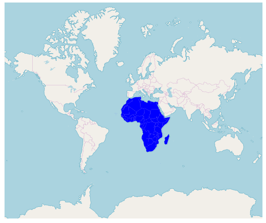

# OpenStreetMap in Blazor Maps Component

The OpenStreetMap (OSM) is the world map built by a community of developers. it is free to use under an open license. It allows you to view geographical data in a collaborative way from anywhere on the earth. The OSM map provides small tile images based on our requests and combines those images into a single image to display the map area in the Maps component.

## Add OpenStreetMap

One of the most important features in Blazor Maps component is the built-in online map provider support. By using this feature, you can render OpenStreetMaps in the maps component. This provides the ability to visualize street map tiles without using any external shape files.

You can enable this feature by setting the value of [`LayerType`](https://help.syncfusion.com/cr/aspnetcore-blazor/Syncfusion.Blazor.Maps.ShapeLayerType.html) property to “ShapeLayerType.OSM”.

```cshtml
@using Syncfusion.Blazor.Maps

<SfMaps>
    <MapsLayers>
        <MapsLayer LayerType="ShapeLayerType.OSM" TValue="string"></MapsLayer>
    </MapsLayers>
</SfMaps>
```


## Zooming and panning

You can zoom and pan the OSM maps layer. Zooming helps you get a closer look at a particular area on a map for in-depth analysis. Panning helps you to move a map around to focus the targeted area.

```cshtml
@using Syncfusion.Blazor.Maps

<SfMaps>
    @* To zoom and pan *@
    <MapsZoomSettings Enable="true"
                      Toolbars='new string[]{"Zoom", "ZoomIn", "ZoomOut", "Pan", "Reset" }'>
    </MapsZoomSettings>
    <MapsLayers>
        <MapsLayer LayerType="ShapeLayerType.OSM" TValue="string">
        </MapsLayer>
    </MapsLayers>
</SfMaps>
```


## Adding markers and navigation line

Markers can be added to the layers of OSM maps by setting the corresponding location's coordinates of latitude and longitude using `MapsMarker` property. You can add navigation lines on top of an OSM maps layer for highlighting a path among various places by setting the corresponding location's coordinates of latitude and longitude in the `MapsNavigationLine` property.

```cshtml
@using Syncfusion.Blazor.Maps

<SfMaps>
    <MapsZoomSettings ZoomFactor="4"></MapsZoomSettings>
    <MapsCenterPosition Latitude="29.394708" Longitude="-94.954653"></MapsCenterPosition>
    <MapsLayers>
        <MapsLayer LayerType="ShapeLayerType.OSM" TValue="string">
            @* Add marker *@
            <MapsMarkerSettings>
                <MapsMarker Visible="true"
                            Height="25"
                            Width="15"
                            DataSource="Cities" TValue="City">
                </MapsMarker>
            </MapsMarkerSettings>
            @* Add navigation line *@
            <MapsNavigationLines>
                <MapsNavigationLine Visible="true"
                                    Color="blue"
                                    Angle="0.1"
                                    Latitude="new double[]{34.060620, 40.724546}"
                                    Longitude="new double[]{-118.330491,-73.850344}">
                </MapsNavigationLine>
            </MapsNavigationLines>
        </MapsLayer>
    </MapsLayers>
</SfMaps>

@code{
    public class City
    {
        public double Latitude { get; set; }
        public double Longitude { get; set; }
        public string Name { get; set; }
    }
    private List<City> Cities = new List<City> {
        new City { Latitude = 34.060620, Longitude = -118.330491,  Name="California" },
        new City{ Latitude = 40.724546, Longitude = -73.850344,  Name="New York"}
    };
}
```


## Sublayer

You can render any GeoJSON shape as a sublayer on top of an OSM maps layer for highlighting a particular continent or country in OSM maps by adding another layer and specifying the type to SubLayer.

```cshtml
@using Syncfusion.Blazor.Maps

<SfMaps>
    <MapsLayers>
        <MapsLayer LayerType="ShapeLayerType.OSM" TValue="string">
        </MapsLayer>
        @* To add geometry shape as sublayer *@
        <MapsLayer ShapeData='new {dataOptions = "https://cdn.syncfusion.com/maps/map-data/africa.json"}'
                   Type="Syncfusion.Blazor.Maps.Type.SubLayer" TValue="string">
            <MapsShapeSettings Fill="blue"></MapsShapeSettings>
        </MapsLayer>
    </MapsLayers>
</SfMaps>
```

