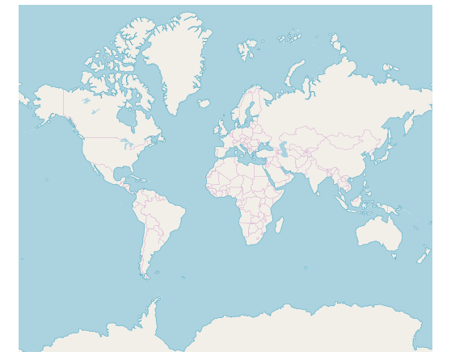
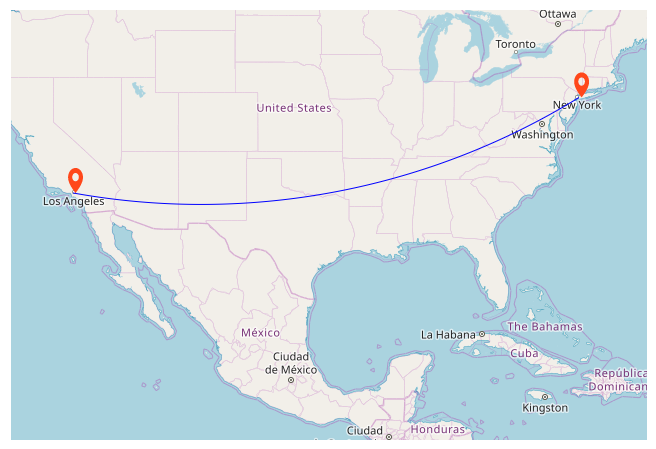

# OpenStreetMap in Blazor Maps Component

The OpenStreetMap (OSM) is the online Maps provider built by a community of developers. It is free to use under an open license. It allows to view geographical data in a collaborative way from anywhere on the earth. The OSM map provides small tile images based on the requests and combines those images into a single image to display the map area in the Maps component.

## Adding OpenStreetMap

The OSM Maps can be rendered by setting the [UrlTemplate](https://help.syncfusion.com/cr/blazor/Syncfusion.Blazor.Maps.MapsLayer-1.html#Syncfusion_Blazor_Maps_MapsLayer_1_UrlTemplate) property with the OSM tile server URL. For more details about the OSM tile server, refer [here](https://wiki.openstreetmap.org/wiki/Tiles).

```cshtml
@using Syncfusion.Blazor.Maps

<SfMaps>
    <MapsLayers>
        <MapsLayer UrlTemplate="https://tile.openstreetmap.org/level/tileX/tileY.png" TValue="string"></MapsLayer>
    </MapsLayers>
</SfMaps>
```



## Enable zooming and panning

The OSM Maps layer can be zoomed and panned. Zooming helps to get a closer look at a particular area on a Maps for in-depth analysis. Panning helps to move Maps around to focus the targeted area.

```cshtml
@using Syncfusion.Blazor.Maps

<SfMaps>
    @* To zoom and pan *@
    <MapsZoomSettings Enable="true">
        <MapsZoomToolbarSettings>
            <MapsZoomToolbarButton ToolbarItems="new List<ToolbarItem>() { ToolbarItem.Zoom, ToolbarItem.ZoomIn, ToolbarItem.ZoomOut,
            ToolbarItem.Pan, ToolbarItem.Reset }"></MapsZoomToolbarButton>
        </MapsZoomToolbarSettings>
    </MapsZoomSettings>
    <MapsLayers>
        <MapsLayer UrlTemplate="https://tile.openstreetmap.org/level/tileX/tileY.png" TValue="string"></MapsLayer>
    </MapsLayers>
</SfMaps>
```


## Adding markers and navigation line

Markers can be added to the layers of OSM Maps by setting the corresponding location's coordinates of latitude and longitude using [MapsMarker](https://help.syncfusion.com/cr/blazor/Syncfusion.Blazor.Maps.MapsMarker-1.html). Navigation lines can be added on top of an OSM Maps layer for highlighting a path among various places by setting the corresponding location's coordinates of latitude and longitude in the [MapsNavigationLine](https://help.syncfusion.com/cr/blazor/Syncfusion.Blazor.Maps.MapsNavigationLine.html).

```cshtml
@using Syncfusion.Blazor.Maps

<SfMaps>
    <MapsZoomSettings ZoomFactor="4"></MapsZoomSettings>
    <MapsCenterPosition Latitude="29.394708" Longitude="-94.954653"></MapsCenterPosition>
    <MapsLayers>
        <MapsLayer UrlTemplate="https://tile.openstreetmap.org/level/tileX/tileY.png" TValue="string">
            @* Add marker *@
            <MapsMarkerSettings>
                <MapsMarker Visible="true" Height="25" Width="15" DataSource="Cities" TValue="City">
                </MapsMarker>
            </MapsMarkerSettings>
            @* Add navigation line *@
            <MapsNavigationLines>
                <MapsNavigationLine Visible="true" Color="blue" Angle="0.1" Latitude="new double[]{34.060620, 40.724546}"
                                    Longitude="new double[]{-118.330491,-73.850344}">
                </MapsNavigationLine>
            </MapsNavigationLines>
        </MapsLayer>
    </MapsLayers>
</SfMaps>

@code{
    public class City
    {
        public double Latitude { get; set; }
        public double Longitude { get; set; }
        public string Name { get; set; }
    }
    private List<City> Cities = new List<City> {
        new City { Latitude = 34.060620, Longitude = -118.330491,  Name="California" },
        new City{ Latitude = 40.724546, Longitude = -73.850344,  Name="New York"}
    };
}
```



## Adding sublayer

Any GeoJSON shape can be rendered as a sublayer on top of the OSM Maps layer for highlighting a particular continent or country in the OSM map by adding another layer and specifying the [Type](https://help.syncfusion.com/cr/blazor/Syncfusion.Blazor.Maps.MapsLayer-1.html#Syncfusion_Blazor_Maps_MapsLayer_1_Type) of [MapsLayer](https://help.syncfusion.com/cr/blazor/Syncfusion.Blazor.Maps.MapsLayer-1.html) to **SubLayer**.

```cshtml
@using Syncfusion.Blazor.Maps

<SfMaps>
    <MapsLayers>
        <MapsLayer UrlTemplate="https://tile.openstreetmap.org/level/tileX/tileY.png" TValue="string">
        </MapsLayer>
        @* To add geometry shape as sublayer *@
        <MapsLayer ShapeData='new {dataOptions = "https://cdn.syncfusion.com/maps/map-data/africa.json"}'
                   Type="Syncfusion.Blazor.Maps.Type.SubLayer" TValue="string">
            <MapsShapeSettings Fill="blue"></MapsShapeSettings>
        </MapsLayer>
    </MapsLayers>
</SfMaps>
```

