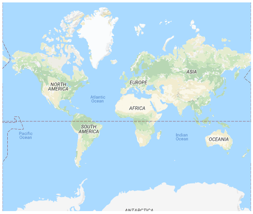
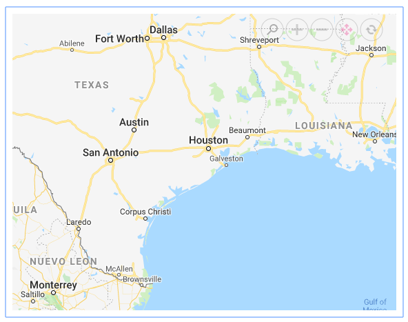
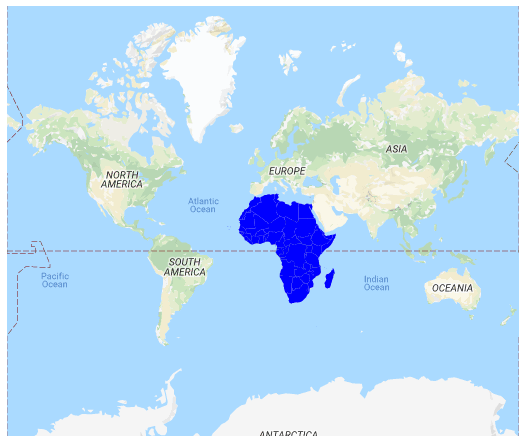

# Other map providers

Apart from the OpenStreetMap and Bing Maps, you can also render the maps from other map service providers by specifying [`LayerType`](https://help.syncfusion.com/cr/blazor/Syncfusion.Blazor.Maps.MapsLayer.html#Syncfusion_Blazor_Maps_MapsLayer_LayerType) as [`ShapeLayerType.OSM`](https://help.syncfusion.com/cr/aspnetcore-blazor/Syncfusion.Blazor.Maps.ShapeLayerType.html) and the URL generated by map provider in the [`UrlTemplate`](https://help.syncfusion.com/cr/blazor/Syncfusion.Blazor.Maps.MapsLayer.html#Syncfusion_Blazor_Maps_MapsLayer_UrlTemplate) property. Here, Google maps is rendered. This provides customizable maps with your own content and imagery.

Refer to [Google maps licensing](https://developers.google.com/maps/terms#10-license-restrictions).

```cshtml
@using Syncfusion.Blazor.Maps

<SfMaps>
    <MapsLayers>
        <MapsLayer LayerType="ShapeLayerType.OSM" UrlTemplate="http://mt1.google.com/vt/lyrs=m@129&hl=en&x=tileX&y=tileY&z=level" TValue="string">
        </MapsLayer>
    </MapsLayers>
</SfMaps>
```



## Zooming and panning

You can zoom and pan the Google maps layer. Zooming helps you get a closer look at a particular area on a map for in-depth analysis. Panning helps you to move a map around to focus the targeted area.

```cshtml
@using Syncfusion.Blazor.Maps

<SfMaps>
    @* To zoom and pan *@
    <MapsZoomSettings Enable="true"
                      Toolbars='new string[]{"Zoom", "ZoomIn", "ZoomOut", "Pan", "Reset" }'>
    </MapsZoomSettings>
    <MapsLayers>
        <MapsLayer LayerType="ShapeLayerType.OSM" UrlTemplate="http://mt1.google.com/vt/lyrs=m@129&hl=en&x=tileX&y=tileY&z=level" TValue="string">
        </MapsLayer>
    </MapsLayers>
</SfMaps>
```



## Adding markers and navigation line

Markers can be added to the layers of Google maps by setting the corresponding location's coordinates of latitude and longitude using `MapsMarker` property. You can add navigation lines on top of an Google maps layer for highlighting a path among various places by setting the corresponding location's coordinates of latitude and longitude in the `MapsNavigationLine` property.

```cshtml
@using Syncfusion.Blazor.Maps

<SfMaps>
    <MapsZoomSettings ZoomFactor="4"></MapsZoomSettings>
    <MapsCenterPosition Latitude="29.394708" Longitude="-94.954653"></MapsCenterPosition>
    <MapsLayers>
        <MapsLayer LayerType="ShapeLayerType.OSM" UrlTemplate="http://mt1.google.com/vt/lyrs=m@129&hl=en&x=tileX&y=tileY&z=level" TValue="string">
            @* Add markers *@
            <MapsMarkerSettings>
                <MapsMarker Visible="true"
                            Height="25"
                            Width="15"
                            DataSource="Cities" TValue="City">
                </MapsMarker>
            </MapsMarkerSettings>
            @* Add navigation line *@
            <MapsNavigationLines>
                <MapsNavigationLine Visible="true"
                                    Color="blue"
                                    Angle="0.1"
                                    Latitude="new double[]{34.060620, 40.724546}"
                                    Longitude="new double[]{-118.330491,-73.850344}">
                </MapsNavigationLine>
            </MapsNavigationLines>
        </MapsLayer>
    </MapsLayers>
</SfMaps>

@code{
    public class City
    {
        public double Latitude { get; set; }
        public double Longitude { get; set; }
        public string Name { get; set; }
    }
    private List<City> Cities = new List<City> {
        new City { Latitude = 34.060620, Longitude = -118.330491,  Name="California" },
        new City{ Latitude = 40.724546, Longitude = -73.850344,  Name="New York"}
    };
}
```


## Sublayer

You can render any GeoJSON shape as a sublayer on top of an Google maps layer for highlighting a particular continent or country in Google maps by adding another layer and specifying the type to SubLayer.

```cshtml
@using Syncfusion.Blazor.Maps

<SfMaps>
    <MapsLayers>
        <MapsLayer LayerType="ShapeLayerType.OSM" UrlTemplate="http://mt1.google.com/vt/lyrs=m@129&hl=en&x=tileX&y=tileY&z=level" TValue="string">
        </MapsLayer>
        @* To add geometry shape as sublayer *@
        <MapsLayer ShapeData='new {dataOptions = "https://cdn.syncfusion.com/maps/map-data/africa.json"}'
                   Type="Syncfusion.Blazor.Maps.Type.SubLayer" TValue="string">
            <MapsShapeSettings Fill="blue"></MapsShapeSettings>
        </MapsLayer>
    </MapsLayers>
</SfMaps>
```

