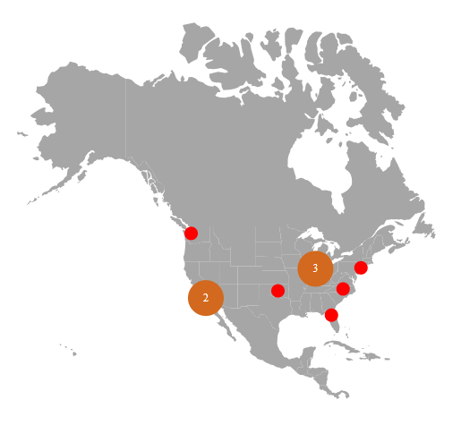
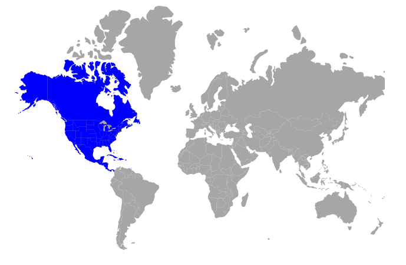

# Shapefile in Blazor Maps Component

Shapefile is a popular geospatial vector data format for storing location-based information such as shapes, spatial locations, and pertinent properties of geographic landmarks.

## Adding shapefile

Shapefile can be used to render vector shape maps in the Maps component by specifying the remotely hosted file path of the shapefile in the [MapsLayer](https://help.syncfusion.com/cr/blazor/Syncfusion.Blazor.Maps.MapsLayer-1.html)'s [ShapeData](https://help.syncfusion.com/cr/blazor/Syncfusion.Blazor.Maps.MapsLayer-1.html#Syncfusion_Blazor_Maps_MapsLayer_1_ShapeData) property.

> Only when the shapefile is hosted on a remote server it will be displayed in the Maps component.

```cshtml
@using Syncfusion.Blazor.Maps

<div class="control-section">
    <SfMaps>
        <MapsAreaSettings Background="transparent" />
        <MapsLayers>
            <MapsLayer ShapeData='new {dataOptions = "https://cdn.syncfusion.com/maps/map-data/usa-states.shp"}' TValue="string">
                <MapsMarkerClusterSettings AllowClustering="true" AllowClusterExpand="true" Shape="MarkerType.Circle" Height="40" Width="40">
                    <MapsLayerMarkerClusterLabelStyle Color="#FFFFFF" />
                    <MapsLayerMarkerClusterConnectorLineSettings Color="@ConnectorLineColor" />
                </MapsMarkerClusterSettings>
                <MapsMarkerSettings>
                    <MapsMarker Visible="true" TValue="TopUniversitiesDetails" Height=15 Width=15 DataSource="@TopUniversities" Shape="MarkerType.Circle" Fill="red" AnimationDuration="0">
                        <MapsMarkerTooltipSettings Visible="true" ValuePath="Name">
                            <MapsMarkerTooltipTextStyle FontFamily="inherit"></MapsMarkerTooltipTextStyle>
                        </MapsMarkerTooltipSettings>
                    </MapsMarker>
                </MapsMarkerSettings>
                <MapsShapeSettings Fill="#A6A6A6"></MapsShapeSettings>
            </MapsLayer>
        </MapsLayers>
        <MapsZoomSettings Enable="false" />
        <MapsLegendSettings Visible="false" />
        <MapsTitleSettings Text="Top 10 Affordable Universities in the United States">
            <MapsTitleTextStyle Size="16px" FontFamily="inherit" />
        </MapsTitleSettings>
    </SfMaps>
</div>
@code {
    public string ConnectorLineColor = "#000000";
    public class TopUniversitiesDetails
    {
        public double Latitude { get; set; }
        public double Longitude { get; set; }
        public string Name { get; set; }
        public string Color { get; set; }
    };
    public List<TopUniversitiesDetails> TopUniversities = new List<TopUniversitiesDetails> {
        new TopUniversitiesDetails { Name="University of Washington", Latitude=47.655548, Longitude=-122.303200 , Color = "#623e8c" },
        new TopUniversitiesDetails { Name="CUNY Brooklyn College", Latitude=40.631920, Longitude= -73.952904, Color="#45738a" },
        new TopUniversitiesDetails { Name="Purdue University", Latitude=40.425869, Longitude=-86.908066, Color="#5fb8ad" },
        new TopUniversitiesDetails { Name="University of Florida", Latitude=29.643946, Longitude=-82.355659, Color="#5fb87b" },
        new TopUniversitiesDetails { Name="Oklahoma State University", Latitude=35.471901, Longitude=-97.581794, Color="#99b85f" },
        new TopUniversitiesDetails { Name="University of North Carolina at Chapel Hill", Latitude=35.904613, Longitude=-79.046761, Color="#a1931a" },
        new TopUniversitiesDetails { Name="California State University-Long Beach", Latitude=33.783823, Longitude=-118.114090, Color="#a1501a" },
        new TopUniversitiesDetails { Name="California State University-Los Angeles", Latitude=34.022415, Longitude=-118.285530, Color="#db4040" },
        new TopUniversitiesDetails { Name="Indiana University-Bloomington", Latitude=39.168804, Longitude=-86.536659, Color="#e227e8" },
        new TopUniversitiesDetails { Name="University of Illinois at Chicago", Latitude=41.789722, Longitude=-87.599724, Color="#0dff00" }
    };
 
}
```



## Multilayer

The shapefile can also be rendered in multilayer structure as explained in [this section](https://blazor.syncfusion.com/documentation/maps/layers#multilayer) for GeoJSON map. Shapefiles can be added as multilayers in the ways listed below.

1. On top of the online map providers, the shapefile can be shown as a sublayer.
2. The shapefile can be shown as a sublayer above the GeoJSON map.
3. The GeoJSON map can be displayed as a sublayer over the shapefile map.
4. Shapefiles can be provided as both main and sublayer layers.

The following example demonstrates how to display the shapefile as a sublayer.

```cshtml
@using Syncfusion.Blazor.Maps;

<SfMaps>
    <MapsLayers>
        <MapsLayer ShapeData='new {dataOptions= "https://cdn.syncfusion.com/maps/map-data/world-map.json"}' TValue="string">
        </MapsLayer>
        <MapsLayer ShapeData='new {dataOptions = "https://cdn.syncfusion.com/maps/map-data/usa-states.shp"}'
                   Type="Syncfusion.Blazor.Maps.Type.SubLayer" TValue="string">
            <MapsShapeSettings Fill="blue"></MapsShapeSettings>
        </MapsLayer>
    </MapsLayers>
</SfMaps>

```


## Customizations

You learned about some customizations in GeoJSON maps in the previous sections. However, above customizations are also relevant to shapefile maps. Please see [this section](shape-file) for additional details on the shapefile.

## Color mapping

You learned about color mapping in GeoJSON maps in the previous sections. However, color mapping and all of its supported functionalities are also relevant to shapefile maps. Please see [this section](shape-file) for additional details on the shapefile.

## Data labels

You learned about data labels and their functions with GeoJSON maps in the previous sections. However, data labels and all of its supported functionalities are also relevant to shapefile maps. Please see [this section](shape-file) for additional details on the shapefile.

## Polygons

To add the polygon shape over the shapefile in the Maps, following a similar approach as with GEOJSON format data. Instead of binding the GEOJSON format data, you can bind the shapefile format. For more information about the Shapefile, please refer to the link [How to add shapefile format data in the Maps](shape-file).

## Markers

To add the markers over the shapefile in the Maps, following a similar approach as with GEOJSON format data. Instead of binding the GEOJSON format data, you can bind the shapefile format. For more information about the Shapefile, please refer to the link [How to add shapefile format data in the Maps](shape-file).

## Bubbles

You learned about bubbles and their functions with GeoJSON maps in the previous sections. However, bubbles and all of its supported functionalities are also relevant to shapefile maps. Please see [this section](shape-file) for additional details on the shapefile.

## Legends

To add the legends for the shapes in the Maps shapefile, following a similar approach as with GEOJSON format data. Instead of binding the GEOJSON format data, you can bind the shapefile format. For more information about the Shapefile, please refer to the link [How to add shapefile format data in the Maps](shape-file).

## Navigation lines

To add the navigation line over the shapefile in the Maps, following a similar approach as with GEOJSON format data. Instead of binding the GEOJSON format data, you can bind the shapefile format. For more information about the Shapefile, please refer to the link [How to add shapefile format data in the Maps](shape-file).

## Annotations

You learned about annotations and their functions with GeoJSON maps in the previous sections. However, annotations and all of its supported functionalities are also relevant to shapefile maps. Please see [this section](shape-file) for additional details on the shapefile.