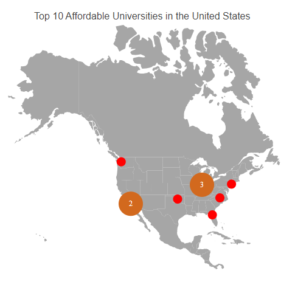
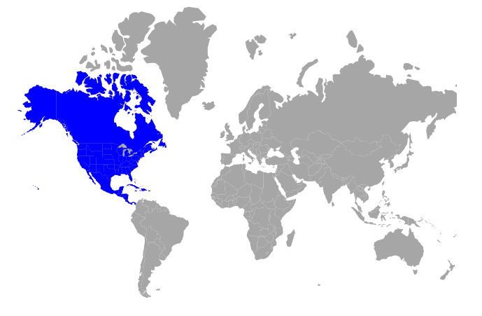

# Shapefile in Blazor Maps Component

A shapefile is a widely used geospatial vector data format for storing geographic features, their spatial locations, and associated attribute data.

## Importing and viewing shapefile

A shapefile can render a vector shape map in the Maps component by providing the remotely hosted file path in the [MapsLayer](https://help.syncfusion.com/cr/blazor/Syncfusion.Blazor.Maps.MapsLayer-1.html) [ShapeData](https://help.syncfusion.com/cr/blazor/Syncfusion.Blazor.Maps.MapsLayer-1.html#Syncfusion_Blazor_Maps_MapsLayer_1_ShapeData) property.

> Only shapefiles hosted on a remote server are currently supported by the Maps component.

```cshtml

@using Syncfusion.Blazor.Maps

<div class="control-section">
    <SfMaps>
        <MapsAreaSettings Background="transparent" />
        <MapsLayers>
            <MapsLayer ShapeData='new {dataOptions = "https://cdn.syncfusion.com/maps/map-data/usa-states.shp"}' TValue="string">
                <MapsMarkerClusterSettings AllowClustering="true" AllowClusterExpand="true" Shape="MarkerType.Circle" Height="40" Width="40">
                    <MapsLayerMarkerClusterLabelStyle Color="#FFFFFF" />
                    <MapsLayerMarkerClusterConnectorLineSettings Color="#000000" />
                </MapsMarkerClusterSettings>
                <MapsMarkerSettings>
                    <MapsMarker Visible="true" TValue="TopUniversitiesDetails" Height=15 Width=15 DataSource="@TopUniversities" Shape="MarkerType.Circle" Fill="red" AnimationDuration="0">
                        <MapsMarkerTooltipSettings Visible="true" ValuePath="Name">
                            <MapsMarkerTooltipTextStyle FontFamily="inherit"></MapsMarkerTooltipTextStyle>
                        </MapsMarkerTooltipSettings>
                    </MapsMarker>
                </MapsMarkerSettings>
                <MapsShapeSettings Fill="#A6A6A6"></MapsShapeSettings>
            </MapsLayer>
        </MapsLayers>
        <MapsZoomSettings Enable="false" />
        <MapsLegendSettings Visible="false" />
    </SfMaps>
</div>

@code {
    public class TopUniversitiesDetails
    {
        public double Latitude { get; set; }
        public double Longitude { get; set; }
        public string Name { get; set; }
        public string Color { get; set; }
    };

    public List<TopUniversitiesDetails> TopUniversities = new List<TopUniversitiesDetails> {
        new TopUniversitiesDetails { Name = "University of Washington", Latitude = 47.655548, Longitude = -122.303200 , Color = "#623e8c" },
        new TopUniversitiesDetails { Name = "CUNY Brooklyn College", Latitude = 40.631920, Longitude = -73.952904, Color = "#45738a" },
        new TopUniversitiesDetails { Name = "Purdue University", Latitude = 40.425869, Longitude = -86.908066, Color = "#5fb8ad" },
        new TopUniversitiesDetails { Name = "University of Florida", Latitude = 29.643946, Longitude = -82.355659, Color = "#5fb87b" },
        new TopUniversitiesDetails { Name = "Oklahoma State University", Latitude = 35.471901, Longitude = -97.581794, Color = "#99b85f" },
        new TopUniversitiesDetails { Name = "University of North Carolina at Chapel Hill", Latitude = 35.904613, Longitude = -79.046761, Color = "#a1931a" },
        new TopUniversitiesDetails { Name = "California State University-Long Beach", Latitude = 33.783823, Longitude = -118.114090, Color = "#a1501a" },
        new TopUniversitiesDetails { Name = "California State University-Los Angeles", Latitude = 34.022415, Longitude = -118.285530, Color = "#db4040" },
        new TopUniversitiesDetails { Name = "Indiana University-Bloomington", Latitude = 39.168804, Longitude = -86.536659, Color = "#e227e8" },
        new TopUniversitiesDetails { Name = "University of Illinois at Chicago", Latitude = 41.789722, Longitude = -87.599724, Color = "#0dff00" }
    };
}

```



## Multilayer

A shapefile map, like a GeoJSON map, can be rendered using a multilayer structure, as described in [this section](https://blazor.syncfusion.com/documentation/maps/layers#multilayer). A shapefile map can be added to different layers in the following ways:

1. Display the shapefile map as a sublayer over online map providers.
2. Display the shapefile map as a sublayer above the GeoJSON map.
3. Display the GeoJSON map as a sublayer over the shapefile map.
4. Use shapefiles as both main and sublayer.

The following example demonstrates a shapefile map as a sublayer above the GeoJSON map.

```cshtml

@using Syncfusion.Blazor.Maps;

<SfMaps>
    <MapsLayers>
        <MapsLayer ShapeData='new {dataOptions= "https://cdn.syncfusion.com/maps/map-data/world-map.json"}' TValue="string">
        </MapsLayer>
        <MapsLayer ShapeData='new {dataOptions = "https://cdn.syncfusion.com/maps/map-data/usa-states.shp"}'
                   Type="Syncfusion.Blazor.Maps.Type.SubLayer" TValue="string">
            <MapsShapeSettings Fill="blue"></MapsShapeSettings>
        </MapsLayer>
    </MapsLayers>
</SfMaps>

```


## Customization

Shape characteristics in a shapefile map—such as fill color, border, and projection—can be customized. For details, see the [Maps customization](https://blazor.syncfusion.com/documentation/maps/customization) documentation.

> The examples in the linked topic use a GeoJSON file. Replace the GeoJSON file path with the shapefile path to view the same behavior with shapefiles.

## Other supportive features

A shapefile map supports the following feature sets. Refer to the topics below to learn more.

1. [Color mapping](https://blazor.syncfusion.com/documentation/maps/color-mapping)
2. [Data labels](https://blazor.syncfusion.com/documentation/maps/data-labels)
3. [Polygons](https://blazor.syncfusion.com/documentation/maps/polygon)
4. [Markers](https://blazor.syncfusion.com/documentation/maps/markers)
5. [Bubbles](https://blazor.syncfusion.com/documentation/maps/bubble)
6. [Legend](https://blazor.syncfusion.com/documentation/maps/legend)
7. [Navigation lines](https://blazor.syncfusion.com/documentation/maps/navigation-line)
8. [Annotations](https://blazor.syncfusion.com/documentation/maps/annotations)
9. [User interactions](https://blazor.syncfusion.com/documentation/maps/user-interactions)
10. [Print and Export](https://blazor.syncfusion.com/documentation/maps/print-and-export)

> The examples in the linked topics use a GeoJSON file. Replace the GeoJSON file path with the shapefile path to demonstrate the same features with shapefiles.
