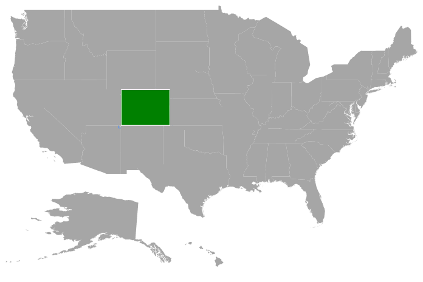
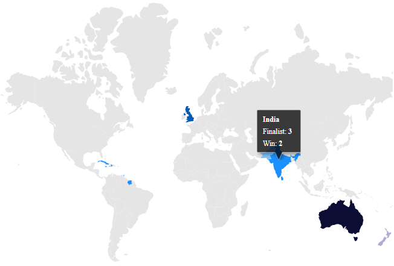
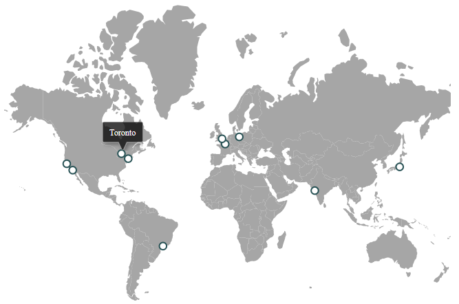

# User Interactions in Blazor Maps Component

The options such as zoom, pan, single-click, double-click, highlight, and map selection provide effective interaction on the maps elements.

## Zooming

The zooming feature enables you to zoom in and zoom out the maps to show the in-depth information. It is controlled using the [`ZoomFactor`](https://help.syncfusion.com/cr/blazor/Syncfusion.Blazor.Maps.MapsZoomSettings.html#Syncfusion_Blazor_Maps_MapsZoomSettings_ZoomFactor) property of the [`MapsZoomSettings`](https://help.syncfusion.com/cr/aspnetcore-blazor/Syncfusion.Blazor.Maps.MapsZoomSettings.html) in maps. When the `ZoomFactor` is increased, the map is zoomed in and when the `ZoomFactor` is decreased, the map is zoomed out.

<b>Enable zooming</b>

To enable the zooming feature, set the [`Enable`](https://help.syncfusion.com/cr/blazor/Syncfusion.Blazor.Maps.MapsZoomSettings.html#Syncfusion_Blazor_Maps_MapsZoomSettings_Enable) property to true in [`MapsZoomSettings`](https://help.syncfusion.com/cr/aspnetcore-blazor/Syncfusion.Blazor.Maps.MapsZoomSettings.html).

```cshtml
@using Syncfusion.Blazor.Maps

<SfMaps>
    <MapsZoomSettings Enable="true"></MapsZoomSettings>
    <MapsLayers>
        <MapsLayer ShapeData='new {dataOptions ="https://cdn.syncfusion.com/maps/map-data/usa.json"}' TValue="string">
        </MapsLayer>
    </MapsLayers>
</SfMaps>
```


<b>Enable panning</b>

We can enable or disable the panning feature, using the `EnablePanning` in [`MapsZoomSettings`](https://help.syncfusion.com/cr/blazor/Syncfusion.Blazor.Maps.MapsZoomSettings.html)

### Various types of zooming

Zooming can be performed in the following types:

<b>Zooming toolbar</b>

By default, the toolbar is rendered with `zoom-in`, `zoom-out`, and `reset` options when it is set to 'true' in the [`Enable`](https://help.syncfusion.com/cr/blazor/Syncfusion.Blazor.Maps.MapsZoomSettings.html#Syncfusion_Blazor_Maps_MapsZoomSettings_Enable) property of [`MapsZoomSettings`](https://help.syncfusion.com/cr/aspnetcore-blazor/Syncfusion.Blazor.Maps.MapsZoomSettings.html). You can also customize the toolbar items using the [`Toolbars`](https://help.syncfusion.com/cr/blazor/Syncfusion.Blazor.Maps.MapsZoomSettings.html#Syncfusion_Blazor_Maps_MapsZoomSettings_Toolbars) property in [`MapsZoomSettings`](https://help.syncfusion.com/cr/aspnetcore-blazor/Syncfusion.Blazor.Maps.MapsZoomSettings.html).

The following options are available in toolbar, and you can use the options as needed:

1. Zoom - Provides rectangular zoom support.
2. ZoomIn - Zooms in the maps.
3. ZoomOut - Zooms out the maps.
4. Pan - Switches to panning if rectangular zoom is activated.
5. Reset - Restores the maps to the default view.

```cshtml
@using Syncfusion.Blazor.Maps

<SfMaps>
    <MapsZoomSettings Enable="true"
                      ToolBarOrientation="Orientation.Vertical"
                      Toolbars='new string[]{"Zoom", "ZoomIn", "ZoomOut", "Pan", "Reset" }'>
    </MapsZoomSettings>
    <MapsLayers>
        <MapsLayer ShapeData='new {dataOptions ="https://cdn.syncfusion.com/maps/map-data/usa.json"}' TValue="string">
        </MapsLayer>
    </MapsLayers>
</SfMaps>
```

<b>Pinch zooming</b>

Use the [`PinchZooming`](https://help.syncfusion.com/cr/blazor/Syncfusion.Blazor.Maps.MapsZoomSettings.html#Syncfusion_Blazor_Maps_MapsZoomSettings_PinchZooming) property in [`MapsZoomSettings`](https://help.syncfusion.com/cr/aspnetcore-blazor/Syncfusion.Blazor.Maps.MapsZoomSettings.html) to enable or disable the pinch zooming.

```cshtml
@using Syncfusion.Blazor.Maps

<SfMaps>
    <MapsZoomSettings Enable="true" PinchZooming="true"></MapsZoomSettings>
    <MapsLayers>
        <MapsLayer ShapeData='new {dataOptions ="https://cdn.syncfusion.com/maps/map-data/usa.json"}' TValue="string">
        </MapsLayer>
    </MapsLayers>
</SfMaps>
```

<b>Single-click zooming</b>

Use the [`ZoomOnClick`](https://help.syncfusion.com/cr/blazor/Syncfusion.Blazor.Maps.MapsZoomSettings.html#Syncfusion_Blazor_Maps_MapsZoomSettings_ZoomOnClick) property in [`MapsZoomSettings`](https://help.syncfusion.com/cr/aspnetcore-blazor/Syncfusion.Blazor.Maps.MapsZoomSettings.html) to enable or disable the single-click zooming.

```cshtml
@using Syncfusion.Blazor.Maps

<SfMaps>
    <MapsZoomSettings Enable="true" ZoomOnClick="true"></MapsZoomSettings>
    <MapsLayers>
        <MapsLayer ShapeData='new {dataOptions ="https://cdn.syncfusion.com/maps/map-data/usa.json"}' TValue="string">
        </MapsLayer>
    </MapsLayers>
</SfMaps>
```

<b>Double-click zooming</b>

Use the [`DoubleClickZoom`](https://help.syncfusion.com/cr/blazor/Syncfusion.Blazor.Maps.MapsZoomSettings.html#Syncfusion_Blazor_Maps_MapsZoomSettings_DoubleClickZoom) property in [`MapsZoomSettings`](https://help.syncfusion.com/cr/aspnetcore-blazor/Syncfusion.Blazor.Maps.MapsZoomSettings.html) to enable or disable the double-click zooming.

```cshtml
@using Syncfusion.Blazor.Maps

<SfMaps>
    <MapsZoomSettings Enable="true" DoubleClickZoom="true"></MapsZoomSettings>
    <MapsLayers>
        <MapsLayer ShapeData='new {dataOptions ="https://cdn.syncfusion.com/maps/map-data/usa.json"}' TValue="string">
        </MapsLayer>
    </MapsLayers>
</SfMaps>
```

<b>Mouse wheel zooming</b>

Use the [`MouseWheelZoom`](https://help.syncfusion.com/cr/blazor/Syncfusion.Blazor.Maps.MapsZoomSettings.html#Syncfusion_Blazor_Maps_MapsZoomSettings_MouseWheelZoom) property in [`MapsZoomSettings`](https://help.syncfusion.com/cr/aspnetcore-blazor/Syncfusion.Blazor.Maps.MapsZoomSettings.html) to enable or disable mouse wheel zooming.

```cshtml
@using Syncfusion.Blazor.Maps

<SfMaps>
    <MapsZoomSettings Enable="true" MouseWheelZoom="true"></MapsZoomSettings>
    <MapsLayers>
        <MapsLayer ShapeData='new {dataOptions ="https://cdn.syncfusion.com/maps/map-data/usa.json"}' TValue="string">
        </MapsLayer>
    </MapsLayers>
</SfMaps>
```

### Zooming with animation

You can use the [`AnimationDuration`](https://help.syncfusion.com/cr/blazor/Syncfusion.Blazor.Maps.MapsLayer.html#Syncfusion_Blazor_Maps_MapsLayer_AnimationDuration) property in [`MapsLayer`](https://help.syncfusion.com/cr/aspnetcore-blazor/Syncfusion.Blazor.Maps.MapsLayer.html) to zoom in or zoom out the maps with animation.

```cshtml
@using Syncfusion.Blazor.Maps

<SfMaps>
    <MapsZoomSettings Enable="true">
    </MapsZoomSettings>
    <MapsLayers>
        <MapsLayer ShapeData='new {dataOptions ="https://cdn.syncfusion.com/maps/map-data/usa.json"}' TValue="string"
                   AnimationDuration="500">
        </MapsLayer>
    </MapsLayers>
</SfMaps>
```

## Selection

### Shape selection

Each shape in the maps can be selected and deselected when interacting with the shapes.

In [`MapsLayerSelectionSettings`](https://help.syncfusion.com/cr/blazor/Syncfusion.Blazor.Maps.MapsLayerSelectionSettings.html), the [`Fill`](https://help.syncfusion.com/cr/blazor/Syncfusion.Blazor.Charts.SfRangeNavigator.html#Syncfusion_Blazor_Charts_SfRangeNavigator_Maximum) property is used to change the selected layer shape color. The [`Color`](https://help.syncfusion.com/cr/blazor/Syncfusion.Blazor.Maps.MapsLayerSelectionSettings.html#Syncfusion_Blazor_Maps_MapsLayerSelectionSettings_Border) and [`Width`](https://help.syncfusion.com/cr/blazor/Syncfusion.Blazor.Maps.MapsLayerSelectionSettings.html#Syncfusion_Blazor_Maps_MapsLayerSelectionSettings_Border) properties are used to customize the selected shape border.

You can select a shape by tapping the shape. The single selection is enabled using the [`Enable`](https://help.syncfusion.com/cr/blazor/Syncfusion.Blazor.Charts.SfRangeNavigator.html#Syncfusion_Blazor_Charts_SfRangeNavigator_Interval) property of shape layer. When the [`Enable`](https://help.syncfusion.com/cr/blazor/Syncfusion.Blazor.Charts.SfRangeNavigator.html#Syncfusion_Blazor_Charts_SfRangeNavigator_Interval) property is set to false, the shapes cannot be selected.

```cshtml
@using Syncfusion.Blazor.Maps

<SfMaps>
    <MapsLayers>
        <MapsLayer ShapeData='new {dataOptions ="https://cdn.syncfusion.com/maps/map-data/usa.json"}' TValue="string">
            <MapsLayerSelectionSettings Enable="true" Fill="green">
                <MapsLayerSelectionBorder Color="White" Width="2"></MapsLayerSelectionBorder>
            </MapsLayerSelectionSettings>
        </MapsLayer>
    </MapsLayers>
</SfMaps>
```


### Legend selection

By tapping a specific legend, the shapes bound to the selected legends are selected and vice-versa.

The following code example demonstrates how to add interactive legend along with the configuration of [`MapsLayerSelectionSettings`](s://help.syncfusion.com/cr/aspnetcore-blazor/Syncfusion.Blazor~Syncfusion.Blazor.Maps.MapsLayerSelectionSettings_members.html) and `MapsLegendSettings` to render interactive shape selection.

```cshtml
@using Syncfusion.Blazor.Maps

<SfMaps>
    <MapsLegendSettings Visible="true" Mode="LegendMode.Interactive"></MapsLegendSettings>
    <MapsLayers>
        <MapsLayer ShapeData='new {dataOptions ="https://cdn.syncfusion.com/maps/map-data/world-map.json"}'
                   DataSource="CouncilMemberdetails"
                   ShapeDataPath="Country"
                   ShapePropertyPath='new string[] {"name"}' TValue="UNCouncil">
            <MapsShapeSettings Fill="#E5E5E5" ColorValuePath="Membership">
                <MapsShapeColorMappings>
                    <MapsShapeColorMapping Value="Permanent" Color='new string[] {"#D84444"}' />
                    <MapsShapeColorMapping Value="Non-Permanent" Color='new string[] {"#316DB5"}' />
                </MapsShapeColorMappings>
            </MapsShapeSettings>
            <MapsLayerSelectionSettings Enable="true" Fill="#a7f047">
                <MapsLayerSelectionBorder Color="White" Width="2"></MapsLayerSelectionBorder>
            </MapsLayerSelectionSettings>
        </MapsLayer>
    </MapsLayers>
</SfMaps>

@code{
    public class UNCouncil
    {
        public string Country { get; set; }
        public string Membership { get; set; }
    };
    private List<UNCouncil> CouncilMemberdetails = new List<UNCouncil>{
         new UNCouncil { Country= "China", Membership= "Permanent"},
         new UNCouncil { Country= "France",Membership= "Permanent" },
         new UNCouncil { Country= "Russia",Membership= "Permanent"},
         new UNCouncil { Country= "Kazakhstan",Membership= "Non-Permanent"},
         new UNCouncil { Country= "Poland",Membership= "Non-Permanent"},
         new UNCouncil { Country= "Sweden",Membership= "Non-Permanent"}
    };
}
```


## Public method for the shape selection

Each shape in the map can be selected by calling the `shapeSelection` method. Input parameters for this method are layerIndex, propertyName, country name and selected value as in boolean state(true / false).

```cshtml
@using Syncfusion.Blazor.Maps
        <div>
            <SfMaps @ref="mapsref">
                <MapsLayers>
                    <MapsLayer ShapeData='new {dataOptions= "https://cdn.syncfusion.com/maps/map-data/world-map.json"}' TValue="string">
                        <MapsLayerSelectionSettings Enable="true" Fill="green">
                            <MapsLayerSelectionBorder Color="white" Width="2"></MapsLayerSelectionBorder>
                        </MapsLayerSelectionSettings>
                    </MapsLayer>
                </MapsLayers>
            </SfMaps>
        </div>
        <button id="select" @onclick="Select">select</button>
        <button id="unselect" @onclick="Unselect">unselect</button>
@code{
    SfMaps mapsref;
    public void select() {
        mapsref.ShapeSelection(0, "continent", "Asia", true);
    }
    public void Unselect() {
        mapsref.ShapeSelection(0, "continent", "Asia", false);
    }
}
```


## Initial shape selection

Initially, the shape can be selected by using the property `initialShapeSelection` and the values are mapped to the `shapePath` and `shapeValue`.

**Note:** initialShapeSelection is an Array property.

```cshtml
<SfMaps>
    <MapsLayers>
        <MapsLayer ShapeData='new {dataOptions= "https://cdn.syncfusion.com/maps/map-data/world-map.json"}' TValue="string">
            <MapsLayerSelectionSettings Enable="true" Fill="green">
                <MapsLayerSelectionBorder Color="white" Width="2"></MapsLayerSelectionBorder>
            </MapsLayerSelectionSettings>
            <MapsInitialShapeSelectionSettings>
                <MapsInitialShapeSelection ShapePath="continent" ShapeValue="Africa"></MapsInitialShapeSelection>
                <MapsInitialShapeSelection ShapePath="name" ShapeValue="India"></MapsInitialShapeSelection>
            </MapsInitialShapeSelectionSettings>
        </MapsLayer>
    </MapsLayers>
</SfMaps>
```


## Highlight

### Shape highlight

Each shape in the maps can be highlighted by hovering the mouse over the shapes.

The [`Fill`](https://help.syncfusion.com/cr/blazor/Syncfusion.Blazor.Charts.SfRangeNavigator.html#Syncfusion_Blazor_Charts_SfRangeNavigator_LogBase) property is used to change the highlighted layer shape color. The [`Color`](https://help.syncfusion.com/cr/blazor/Syncfusion.Blazor.Charts.SfRangeNavigator.html#Syncfusion_Blazor_Charts_SfRangeNavigator_Interval) and [`Width`](https://help.syncfusion.com/cr/blazor/Syncfusion.Blazor.Charts.SfRangeNavigator.html#Syncfusion_Blazor_Charts_SfRangeNavigator_IntervalType) properties are used to customize the highlighted shape border.

You can highlight a shape by hovering the mouse over the shape. The highlight is enabled using the [`Enable`](https://help.syncfusion.com/cr/blazor/Syncfusion.Blazor.Charts.SfRangeNavigator.html#Syncfusion_Blazor_Charts_SfRangeNavigator_LabelFormat) property of [`MapsLayerHighlightSettings`](https://help.syncfusion.com/cr/blazor/Syncfusion.Blazor.Maps.MapsLayerHighlightSettings.html). When the [`Enable`](https://help.syncfusion.com/cr/blazor/Syncfusion.Blazor.Charts.SfRangeNavigator.html#Syncfusion_Blazor_Charts_SfRangeNavigator_LabelFormat) property is set to false, the shapes cannot be highlighted.

```cshtml
@using Syncfusion.Blazor.Maps

<SfMaps>
    <MapsLayers>
        <MapsLayer ShapeData='new {dataOptions ="https://cdn.syncfusion.com/maps/map-data/usa.json"}' TValue="string">
            <MapsLayerHighlightSettings Enable="true" Fill="green">
                <MapsLayerHighlightBorder Color="white" Width="2"></MapsLayerHighlightBorder>
            </MapsLayerHighlightSettings>
        </MapsLayer>
    </MapsLayers>
</SfMaps>
```



### Legend highlight

By hovering over a specific legend, the shapes bound to the selected legend are highlighted and vice-versa.

The following code example demonstrates how to add interactive legend along with the configuration of [`MapsLayerHighlightSettings`](tps://help.syncfusion.com/cr/aspnetcore-blazor/Syncfusion.Blazor~Syncfusion.Blazor.Maps.LayerHighlightSettings_members.html) and `MapsLegendSettings` to render interactive shape highlight with legend items.

```cshtml
@using Syncfusion.Blazor.Maps

<SfMaps>
    <MapsLegendSettings Visible="true" Mode="LegendMode.Interactive"></MapsLegendSettings>
    <MapsLayers>
        <MapsLayer ShapeData='new {dataOptions ="https://cdn.syncfusion.com/maps/map-data/world-map.json"}'
                   DataSource="CouncilMemberDetails"
                   ShapeDataPath="Country"
                   ShapePropertyPath='new string[] {"name"}' TValue="UNCouncil">
            <MapsShapeSettings Fill="#E5E5E5" ColorValuePath="Membership">
                <MapsShapeColorMappings>
                    <MapsShapeColorMapping Value="Permanent" Color='new string[] {"#D84444"}' />
                    <MapsShapeColorMapping Value="Non-Permanent" Color='new string[] {"#316DB5"}' />
                </MapsShapeColorMappings>
            </MapsShapeSettings>
            <MapsLayerHighlightSettings Enable="true" Fill="#a7f047">
                <MapsLayerHighlightBorder Color="White" Width="2"></MapsLayerHighlightBorder>
            </MapsLayerHighlightSettings>
        </MapsLayer>
    </MapsLayers>
</SfMaps>

@code{
    public class UNCouncil
    {
        public string Country { get; set; }
        public string Membership { get; set; }
    };
    private List<UNCouncil> CouncilMemberDetails = new List<UNCouncil>{
         new UNCouncil { Country= "China", Membership= "Permanent"},
         new UNCouncil { Country= "France",Membership= "Permanent" },
         new UNCouncil { Country= "Russia",Membership= "Permanent"},
         new UNCouncil { Country= "Kazakhstan",Membership= "Non-Permanent"},
         new UNCouncil { Country= "Poland",Membership= "Non-Permanent"},
         new UNCouncil { Country= "Sweden",Membership= "Non-Permanent"}
    };
}
```


## Tooltip

Tooltip is used to get more information about layer, bubble, and marker on mouse over or by performing touch-end event.

### Tooltip format

Tooltip can be enabled for layer by setting [`Visible`](https://help.syncfusion.com/cr/blazor/Syncfusion.Blazor.Charts.SfRangeNavigator.html#Syncfusion_Blazor_Charts_SfRangeNavigator_Value) to **true** in [`MapsLayerTooltipSettings`](https://help.syncfusion.com/cr/aspnetcore-blazor/Syncfusion.Blazor.Maps.MapsLayerTooltipSettings.html). The value of tooltip [`ValuePath`](https://help.syncfusion.com/cr/blazor/Syncfusion.Blazor.Charts.ChartAxis.html#Syncfusion_Blazor_Charts_ChartAxis_MajorGridLines) needs to be set to display data source whose field is set as tooltip text.

The following steps explain how to enable tooltip for layer to show shape data name field.

**Step 1:** Import the world map geo json data and assign to [`ShapeData`](https://help.syncfusion.com/cr/blazor/Syncfusion.Blazor.Maps.MapsLayer.html#Syncfusion_Blazor_Maps_MapsLayer_ShapeData).

**Step 2:** Enable tooltip for layer by setting [`Visible`](https://help.syncfusion.com/cr/blazor/Syncfusion.Blazor.Charts.SfRangeNavigator.html#Syncfusion_Blazor_Charts_SfRangeNavigator_Value) to true in [`MapsLayerTooltipSettings`](https://help.syncfusion.com/cr/aspnetcore-blazor/Syncfusion.Blazor.Maps.MapsLayerTooltipSettings.html) and binding [`ValuePath`](https://help.syncfusion.com/cr/blazor/Syncfusion.Blazor.Charts.ChartAxis.html#Syncfusion_Blazor_Charts_ChartAxis_MajorGridLines) value to 'name'.

The following code snippet demonstrates how to enable tooltip for layer to show shape data name field.

```cshtml
@using Syncfusion.Blazor.Maps

<SfMaps>
    <MapsLayers>
        <MapsLayer ShapeData='new {dataOptions= "https://cdn.syncfusion.com/maps/map-data/world-map.json"}'
                   ShapePropertyPath='new string[] {"name"}'
                   DataSource='PerformanceReport'
                   ShapeDataPath="Name" TValue="Country">
            <MapsLayerTooltipSettings Visible="true"
                                  ValuePath="CountryName"
                                  Format="<b>${CountryName}</b><br>Finalist: <b>${Winner}</b><br>Win: <b>${Finalist}">
            </MapsLayerTooltipSettings>
            <MapsShapeSettings Fill="#E5E5E5" ColorValuePath="Finalist">
                <MapsShapeColorMappings>
                    <MapsShapeColorMapping Value="1" Color='new string[] {"#acaed8"}'></MapsShapeColorMapping>
                    <MapsShapeColorMapping Value="2" Color='new string[] {"#80c1ff"}'></MapsShapeColorMapping>
                    <MapsShapeColorMapping Value="3" Color='new string[] {"#1a90ff"}'></MapsShapeColorMapping>
                    <MapsShapeColorMapping Value="4" Color='new string[] {"#005cb3"}'></MapsShapeColorMapping>
                    <MapsShapeColorMapping Value="7" Color='new string[] {"#0b0d35"}'></MapsShapeColorMapping>
                </MapsShapeColorMappings>
            </MapsShapeSettings>
        </MapsLayer>
    </MapsLayers>
</SfMaps>

@code {
    public List<Country> PerformanceReport = new List<Country> {
            new Country { CountryName="India", Name="India", Finalist="3", Winner="2" },
            new Country { CountryName="United Kingdom", Name="United Kingdom", Finalist="4", Winner="1" },
            new Country { CountryName="Australia", Name="Australia", Finalist="7", Winner="5" },
            new Country { CountryName="Sri Lanka", Name="Sri Lanka", Finalist="3", Winner="1"},
            new Country { CountryName="Pakistan", Name="Pakistan", Finalist="2", Winner="1"  },
            new Country { CountryName="New Zealand", Name="New Zealand", Finalist="1", Winner="0"},
            new Country { CountryName="West Indies", Name="Dominican Rep", Finalist="3", Winner="2"},
            new Country { CountryName="West Indies", Name="Cuba", Finalist="3", Winner="2"},
            new Country { CountryName="West Indies", Name="Jamaica", Finalist="3", Winner="2"},
            new Country { CountryName="West Indies", Name="Haiti", Finalist="3", Winner="2"},
            new Country { CountryName="West Indies",Name="Gayana", Finalist="3", Winner="2"},
            new Country { CountryName="West Indies", Name="Suriname", Finalist="3", Winner="2"},
            new Country { CountryName="West Indies", Name="Trinidad and Tobago", Finalist="3", Winner="2"}
        };
    public class Country
    {
        public string Name { get; set; }
        public string Winner { get; set; }
        public string Finalist { get; set; }
        public string CountryName { get; set; }
    }
}
```



### Tooltip for other elements

You can also provide tooltips for other elements such as markers and bubbles using [`MapsMarkerTooltipSettings`](https://help.syncfusion.com/cr/aspnetcore-blazor/Syncfusion.Blazor.Maps.MapsMarkerTooltipSettings.html) and [`MapsBubbleTooltipSettings`](https://help.syncfusion.com/cr/aspnetcore-blazor/Syncfusion.Blazor.Maps.MapsBubbleTooltipSettings.html).

```cshtml
@using Syncfusion.Blazor.Maps

<SfMaps>
    <MapsLayers>
        <MapsLayer ShapeData='new {dataOptions= "https://cdn.syncfusion.com/maps/map-data/world-map.json"}' TValue="string">
            <MapsMarkerSettings>
                <MapsMarker Visible="true"
                            DataSource="OfficeLocations"
                            Fill="white"
                            Width="20"
                            Shape="MarkerType.Circle" TValue="OfficeLocation">
                    <MapsMarkerBorder Color="#285255" Width="2"></MapsMarkerBorder>
                    <MapsMarkerTooltipSettings Visible="true" ValuePath="Name"></MapsMarkerTooltipSettings>
                </MapsMarker>
            </MapsMarkerSettings>
        </MapsLayer>
    </MapsLayers>
</SfMaps>

@code {
    public class OfficeLocation
    {
        public double Latitude { get; set; }
        public double Longitude { get; set; }
        public string Name { get; set; }
    }
    private List<OfficeLocation> OfficeLocations = new List<OfficeLocation> {
        new OfficeLocation{ Latitude= 37.6276571, Longitude= -122.4276688, Name= "San Bruno" },
        new OfficeLocation{ Latitude= 33.5302186, Longitude= -117.7418381, Name= "Laguna Niguel" },
        new OfficeLocation{ Latitude= 40.7424509, Longitude= -74.0081468, Name= "New York" },
        new OfficeLocation{ Latitude= -23.5268201, Longitude= -46.6489927, Name= "Bom Retiro" },
        new OfficeLocation{ Latitude= 43.6533855, Longitude= -79.3729994, Name= "Toronto" },
        new OfficeLocation{ Latitude= 48.8773406, Longitude= 2.3299627, Name= "Paris" },
        new OfficeLocation{ Latitude= 52.4643089, Longitude= 13.4107368, Name= "Berlin" },
        new OfficeLocation{ Latitude= 19.1555762, Longitude= 72.8849595, Name= "Mumbai" },
        new OfficeLocation{ Latitude= 35.6628744, Longitude= 139.7345469, Name= "Minato" },
        new OfficeLocation{ Latitude= 51.5326602, Longitude= -0.1262422, Name= "London" }
    };

}
```



## See also

* [Change center position on zooming](how-to/change-center-position-on-zooming)