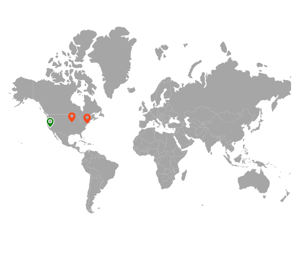
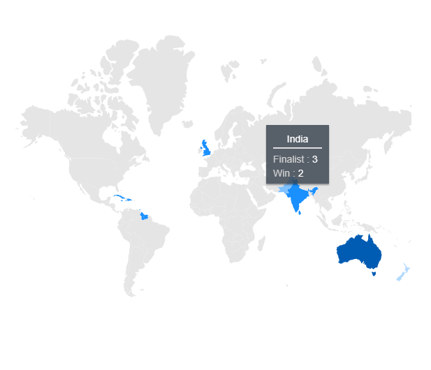

# User Interactions in Blazor Maps Component

## Zooming

The zooming feature is used to zoom in and out of Maps to show in-depth information. It is controlled by the [ZoomFactor](https://help.syncfusion.com/cr/blazor/Syncfusion.Blazor.Maps.MapsZoomSettings.html#Syncfusion_Blazor_Maps_MapsZoomSettings_ZoomFactor) property of the [MapsZoomSettings](https://help.syncfusion.com/cr/blazor/Syncfusion.Blazor.Maps.MapsZoomSettings.html) class. The [ZoomFactor](https://help.syncfusion.com/cr/blazor/Syncfusion.Blazor.Maps.MapsZoomSettings.html#Syncfusion_Blazor_Maps_MapsZoomSettings_ZoomFactor) is increased or decrease dynamically based on zoom in and out interaction.

<b>Enable zooming</b>

Zooming of Maps is enabled by setting the [Enable](https://help.syncfusion.com/cr/blazor/Syncfusion.Blazor.Maps.MapsZoomSettings.html#Syncfusion_Blazor_Maps_MapsZoomSettings_Enable) property of [MapsZoomSettings](https://help.syncfusion.com/cr/blazor/Syncfusion.Blazor.Maps.MapsZoomSettings.html) to **true**.

```cshtml
@using Syncfusion.Blazor.Maps

<SfMaps>
    <MapsZoomSettings Enable="true"></MapsZoomSettings>
    <MapsLayers>
        <MapsLayer ShapeData='new {dataOptions ="https://cdn.syncfusion.com/maps/map-data/usa.json"}' TValue="string">
        </MapsLayer>
    </MapsLayers>
</SfMaps>
```


<b>Enable panning</b>

To enable the panning feature, set the [EnablePanning](https://help.syncfusion.com/cr/blazor/Syncfusion.Blazor.Maps.MapsZoomSettings.html#Syncfusion_Blazor_Maps_MapsZoomSettings_EnablePanning) property of [MapsZoomSettings](https://help.syncfusion.com/cr/blazor/Syncfusion.Blazor.Maps.MapsZoomSettings.html) to **true**.

```cshtml
@using Syncfusion.Blazor.Maps

<SfMaps>
    <MapsZoomSettings Enable="true" EnablePanning="true"></MapsZoomSettings>
    <MapsLayers>
        <MapsLayer ShapeData='new {dataOptions ="https://cdn.syncfusion.com/maps/map-data/usa.json"}' TValue="string">
        </MapsLayer>
    </MapsLayers>
</SfMaps>
```

### Various types of zooming

Zooming can be performed in the following types:

#### Zooming toolbar

By default, the toolbar is rendered with **Zoom In**, **Zoom Out**, and **Reset** options when the [Enable](https://help.syncfusion.com/cr/blazor/Syncfusion.Blazor.Maps.MapsZoomSettings.html#Syncfusion_Blazor_Maps_MapsZoomSettings_Enable) property of [MapsZoomSettings](https://help.syncfusion.com/cr/blazor/Syncfusion.Blazor.Maps.MapsZoomSettings.html) is set to **true**.

The following options are available in toolbar.

1. Zoom - Provides selection zoom support.
2. ZoomIn - Zooms in the Maps.
3. ZoomOut - Zooms out the Maps.
4. Pan - Switches to panning if selection zoom is enabled.
5. Reset -  Restores the Maps to the default view.

The following properties are available in toolbars to customize the zooming toolbars.

* [Color](https://help.syncfusion.com/cr/blazor/Syncfusion.Blazor.Maps.MapsZoomSettings.html#Syncfusion_Blazor_Maps_MapsZoomSettings_Color) - To apply the color for toolbars in Maps.
* [HighlightColor](https://help.syncfusion.com/cr/blazor/Syncfusion.Blazor.Maps.MapsZoomSettings.html#Syncfusion_Blazor_Maps_MapsZoomSettings_HighlightColor) - To apply the color for the zooming toolbar when the mouse has hovered on the toolbar element in Maps.
* [HorizontalAlignment](https://help.syncfusion.com/cr/blazor/Syncfusion.Blazor.Maps.MapsZoomSettings.html#Syncfusion_Blazor_Maps_MapsZoomSettings_HorizontalAlignment) - To customize the position type of toolbar when it is placed horizontally.
* [SelectionColor](https://help.syncfusion.com/cr/blazor/Syncfusion.Blazor.Maps.MapsZoomSettings.html#Syncfusion_Blazor_Maps_MapsZoomSettings_SelectionColor) - To apply the color for the zooming toolbar when clicking the zooming toolbar in Maps.
* [ToolBarOrientation](https://help.syncfusion.com/cr/blazor/Syncfusion.Blazor.Maps.MapsZoomSettings.html#Syncfusion_Blazor_Maps_MapsZoomSettings_ToolBarOrientation) - To customize the orientation of the zooming toolbar.
* [Toolbars](https://help.syncfusion.com/cr/blazor/Syncfusion.Blazor.Maps.MapsZoomSettings.html#Syncfusion_Blazor_Maps_MapsZoomSettings_Toolbars) - To customize the items that are to be shown in the zooming toolbar in Maps.
* [VerticalAlignment](https://help.syncfusion.com/cr/blazor/Syncfusion.Blazor.Maps.MapsZoomSettings.html#Syncfusion_Blazor_Maps_MapsZoomSettings_VerticalAlignment) - To customize the position type of toolbar when it is placed vertically.

```cshtml
@using Syncfusion.Blazor.Maps

<SfMaps>
    <MapsZoomSettings Enable="true" Color="green" HighlightColor="blue" SelectionColor="orange" HorizontalAlignment="Alignment.Center"
                      ToolBarOrientation="Orientation.Vertical" Toolbars='new string[]{"Zoom", "ZoomIn", "ZoomOut", "Pan", "Reset" }'>
    </MapsZoomSettings>
    <MapsLayers>
        <MapsLayer ShapeData='new {dataOptions ="https://cdn.syncfusion.com/maps/map-data/usa.json"}' TValue="string">
        </MapsLayer>
    </MapsLayers>
</SfMaps>
```

#### Pinch zooming

To enable or disable the pinch zooming, use the [PinchZooming](https://help.syncfusion.com/cr/blazor/Syncfusion.Blazor.Maps.MapsZoomSettings.html#Syncfusion_Blazor_Maps_MapsZoomSettings_PinchZooming) property in [`MapsZoomSettings`](https://help.syncfusion.com/cr/blazor/Syncfusion.Blazor.Maps.MapsZoomSettings.html).

```cshtml
@using Syncfusion.Blazor.Maps

<SfMaps>
    <MapsZoomSettings Enable="true" PinchZooming="true"></MapsZoomSettings>
    <MapsLayers>
        <MapsLayer ShapeData='new {dataOptions ="https://cdn.syncfusion.com/maps/map-data/usa.json"}' TValue="string">
        </MapsLayer>
    </MapsLayers>
</SfMaps>
```

#### Single-click zooming

To enable or disable the single-click zooming using mouse, use the [ZoomOnClick](https://help.syncfusion.com/cr/blazor/Syncfusion.Blazor.Maps.MapsZoomSettings.html#Syncfusion_Blazor_Maps_MapsZoomSettings_ZoomOnClick) property in [`MapsZoomSettings`](https://help.syncfusion.com/cr/blazor/Syncfusion.Blazor.Maps.MapsZoomSettings.html).

```cshtml
@using Syncfusion.Blazor.Maps

<SfMaps>
    <MapsZoomSettings Enable="true" ZoomOnClick="true"></MapsZoomSettings>
    <MapsLayers>
        <MapsLayer ShapeData='new {dataOptions ="https://cdn.syncfusion.com/maps/map-data/usa.json"}' TValue="string">
        </MapsLayer>
    </MapsLayers>
</SfMaps>
```

#### Double-click zooming

To enable or disable the double-click zooming using mouse, use the [DoubleClickZoom](https://help.syncfusion.com/cr/blazor/Syncfusion.Blazor.Maps.MapsZoomSettings.html#Syncfusion_Blazor_Maps_MapsZoomSettings_DoubleClickZoom) property in [`MapsZoomSettings`](https://help.syncfusion.com/cr/blazor/Syncfusion.Blazor.Maps.MapsZoomSettings.html).

```cshtml
@using Syncfusion.Blazor.Maps

<SfMaps>
    <MapsZoomSettings Enable="true" DoubleClickZoom="true"></MapsZoomSettings>
    <MapsLayers>
        <MapsLayer ShapeData='new {dataOptions ="https://cdn.syncfusion.com/maps/map-data/usa.json"}' TValue="string">
        </MapsLayer>
    </MapsLayers>
</SfMaps>
```

#### Mouse wheel zooming

To enable or disable mouse wheel zooming, use the [MouseWheelZoom](https://help.syncfusion.com/cr/blazor/Syncfusion.Blazor.Maps.MapsZoomSettings.html#Syncfusion_Blazor_Maps_MapsZoomSettings_MouseWheelZoom) property in [`MapsZoomSettings`](https://help.syncfusion.com/cr/blazor/Syncfusion.Blazor.Maps.MapsZoomSettings.html).

```cshtml
@using Syncfusion.Blazor.Maps

<SfMaps>
    <MapsZoomSettings Enable="true" MouseWheelZoom="true"></MapsZoomSettings>
    <MapsLayers>
        <MapsLayer ShapeData='new {dataOptions ="https://cdn.syncfusion.com/maps/map-data/usa.json"}' TValue="string">
        </MapsLayer>
    </MapsLayers>
</SfMaps>
```

#### Selection zooming

To enable or disable selection zooming, use the [EnableSelectionZooming](https://help.syncfusion.com/cr/blazor/Syncfusion.Blazor.Maps.MapsZoomSettings.html#Syncfusion_Blazor_Maps_MapsZoomSettings_EnableSelectionZooming) property in [MapsZoomSettings](https://help.syncfusion.com/cr/blazor/Syncfusion.Blazor.Maps.MapsZoomSettings.html). The [EnablePanning](https://help.syncfusion.com/cr/blazor/Syncfusion.Blazor.Maps.MapsZoomSettings.html#Syncfusion_Blazor_Maps_MapsZoomSettings_EnablePanning) property must be set to **false** to enable the selection zooming in Maps.

```cshtml
@using Syncfusion.Blazor.Maps

<SfMaps>
    <MapsZoomSettings Enable="true" EnableSelectionZooming="true" EnablePanning="true" Toolbars='new string[]{"Zoom", "ZoomIn", "ZoomOut", "Pan", "Reset" }'></MapsZoomSettings>
    <MapsLayers>
        <MapsLayer ShapeData='new {dataOptions ="https://cdn.syncfusion.com/maps/map-data/usa.json"}' TValue="string">
        </MapsLayer>
    </MapsLayers>
</SfMaps>
```

### Setting minimum and maximum values for zoom factor

The zoom factor range can be adjusted using the [MinZoom](https://help.syncfusion.com/cr/blazor/Syncfusion.Blazor.Maps.MapsZoomSettings.html#Syncfusion_Blazor_Maps_MapsZoomSettings_MinZoom) and [MaxZoom](https://help.syncfusion.com/cr/blazor/Syncfusion.Blazor.Maps.MapsZoomSettings.html#Syncfusion_Blazor_Maps_MapsZoomSettings_MaxZoom) properties in [MapsZoomSettings](https://help.syncfusion.com/cr/blazor/Syncfusion.Blazor.Maps.MapsZoomSettings.html). The [MinZoom](https://help.syncfusion.com/cr/blazor/Syncfusion.Blazor.Maps.MapsZoomSettings.html#Syncfusion_Blazor_Maps_MapsZoomSettings_MinZoom) value is set to 1 by default, and the [MaxZoom](https://help.syncfusion.com/cr/blazor/Syncfusion.Blazor.Maps.MapsZoomSettings.html#Syncfusion_Blazor_Maps_MapsZoomSettings_MaxZoom) value is set to 10.

```cshtml
@using Syncfusion.Blazor.Maps

<SfMaps>
    <MapsZoomSettings Enable="true" MinZoom="2" MaxZoom="9"></MapsZoomSettings>
    <MapsLayers>
        <MapsLayer ShapeData='new {dataOptions ="https://cdn.syncfusion.com/maps/map-data/usa.json"}' TValue="string">
        </MapsLayer>
    </MapsLayers>
</SfMaps>
```

### Zooming with animation

To zoom in or zoom out the Maps with animation, use the [AnimationDuration](https://help.syncfusion.com/cr/blazor/Syncfusion.Blazor.Maps.MapsLayer-1.html#Syncfusion_Blazor_Maps_MapsLayer_1_AnimationDuration) property in [MapsLayer](https://help.syncfusion.com/cr/blazor/Syncfusion.Blazor.Maps.MapsLayer-1.html).

```cshtml
@using Syncfusion.Blazor.Maps

<SfMaps>
    <MapsZoomSettings Enable="true">
    </MapsZoomSettings>
    <MapsLayers>
        <MapsLayer ShapeData='new {dataOptions ="https://cdn.syncfusion.com/maps/map-data/usa.json"}' TValue="string"
                   AnimationDuration="500">
        </MapsLayer>
    </MapsLayers>
</SfMaps>
```

## Selection

Each shape in the Maps can be selected and deselected during interaction with the shapes. Selection is enabled by setting the [Enable](https://help.syncfusion.com/cr/blazor/Syncfusion.Blazor.Maps.MapsSelectionSettings.html#Syncfusion_Blazor_Maps_MapsSelectionSettings_Enable) property of [MapsSelectionSettings](https://help.syncfusion.com/cr/blazor/Syncfusion.Blazor.Maps.MapsSelectionSettings.html) to **true**.

The following properties and class are available to customize the selection of Maps elements such as shapes, bubbles and markers.

* [MapsLayerSelectionBorder](https://help.syncfusion.com/cr/blazor/Syncfusion.Blazor.Maps.MapsLayerSelectionBorder.html) - To customize the color and width of the border of which element is selected in Maps.
* [Fill](https://help.syncfusion.com/cr/blazor/Syncfusion.Blazor.Maps.MapsSelectionSettings.html#Syncfusion_Blazor_Maps_MapsSelectionSettings_Fill) - Applies the color for the element that is selected.
* [Opacity](https://help.syncfusion.com/cr/blazor/Syncfusion.Blazor.Maps.MapsSelectionSettings.html#Syncfusion_Blazor_Maps_MapsSelectionSettings_Opacity) - To customize the transparency for the element that is selected.
* [EnableMultiSelect](https://help.syncfusion.com/cr/blazor/Syncfusion.Blazor.Maps.MapsSelectionSettings.html#Syncfusion_Blazor_Maps_MapsSelectionSettings_EnableMultiSelect) - To enable or disable the selection for multiple shapes or markers or bubbles in the Maps.

```cshtml
@using Syncfusion.Blazor.Maps

<SfMaps>
    <MapsLayers>
        <MapsLayer ShapeData='new {dataOptions ="https://cdn.syncfusion.com/maps/map-data/usa.json"}' TValue="string">
            <MapsLayerSelectionSettings Enable="true" Fill="green">
                <MapsLayerSelectionBorder Color="White" Width="2"></MapsLayerSelectionBorder>
            </MapsLayerSelectionSettings>
        </MapsLayer>
    </MapsLayers>
</SfMaps>
```


By tapping on the specific legend, the shapes which are bounded to the selected legend is also selected and vice versa.

```cshtml
@using Syncfusion.Blazor.Maps

<SfMaps>
    <MapsLegendSettings Visible="true" Mode="LegendMode.Interactive"></MapsLegendSettings>
    <MapsLayers>
        <MapsLayer ShapeData='new {dataOptions ="https://cdn.syncfusion.com/maps/map-data/world-map.json"}' ShapeDataPath="Country"
                   DataSource="CouncilMemberdetails" ShapePropertyPath='new string[] {"name"}' TValue="UNCouncil">
            <MapsShapeSettings Fill="#E5E5E5" ColorValuePath="Membership">
                <MapsShapeColorMappings>
                    <MapsShapeColorMapping Value="Permanent" Color='new string[] {"#D84444"}' />
                    <MapsShapeColorMapping Value="Non-Permanent" Color='new string[] {"#316DB5"}' />
                </MapsShapeColorMappings>
            </MapsShapeSettings>
            <MapsLayerSelectionSettings Enable="true" Fill="#a7f047">
                <MapsLayerSelectionBorder Color="White" Width="2"></MapsLayerSelectionBorder>
            </MapsLayerSelectionSettings>
        </MapsLayer>
    </MapsLayers>
</SfMaps>

@code{
    public class UNCouncil
    {
        public string Country { get; set; }
        public string Membership { get; set; }
    };
    private List<UNCouncil> CouncilMemberdetails = new List<UNCouncil>{
        new UNCouncil { Country= "China", Membership= "Permanent" },
        new UNCouncil { Country= "France",Membership= "Permanent" },
        new UNCouncil { Country= "Russia",Membership= "Permanent" },
        new UNCouncil { Country= "Kazakhstan",Membership= "Non-Permanent" },
        new UNCouncil { Country= "Poland",Membership= "Non-Permanent" },
        new UNCouncil { Country= "Sweden",Membership= "Non-Permanent" }
    };
}
```


### Enable selection for bubbles

To enable the selection for bubbles in Maps, set the [MapsBubbleSelectionSettings](https://help.syncfusion.com/cr/blazor/Syncfusion.Blazor.Maps.MapsBubbleSelectionSettings.html) in [MapsBubble](https://help.syncfusion.com/cr/blazor/Syncfusion.Blazor.Maps.MapsBubble-1.html) and set the [Enable](https://help.syncfusion.com/cr/blazor/Syncfusion.Blazor.Maps.MapsSelectionSettings.html#Syncfusion_Blazor_Maps_MapsSelectionSettings_Enable) property of [MapsBubbleSelectionSettings](https://help.syncfusion.com/cr/blazor/Syncfusion.Blazor.Maps.MapsBubbleSelectionSettings.html) as **true**.

```cshtml
@using Syncfusion.Blazor.Maps

<SfMaps>
    <MapsLayers>
        <MapsLayer ShapeData='new {dataOptions ="https://cdn.syncfusion.com/maps/map-data/world-map.json"}' ShapeDataPath="Name"
                   ShapePropertyPath='new string[] {"name"}' TValue="Country">
            @* To add bubbles based on population count *@
            <MapsBubbleSettings>
                <MapsBubble Visible="true" ValuePath="Population" ColorValuePath="Color" MinRadius=20 MaxRadius=40 
                            DataSource="PopulationDetails" TValue="Country">
                <MapsBubbleSelectionSettings Enable="true" Fill="green"></MapsBubbleSelectionSettings>
                </MapsBubble>
            </MapsBubbleSettings>
        </MapsLayer>
    </MapsLayers>
</SfMaps>

@code{
    public class Country
    {
        public string Name { get; set; }
        public double Population { get; set; }
        public string Color { get; set; }
    };
    private List<Country> PopulationDetails = new List<Country> {
       new Country
       {
           Name ="United States", Population = 325020000, Color = "#b5e485"
       },
       new Country
       {
           Name = "Russia", Population = 142905208, Color = "#7bc1e8"
       },
       new Country
       {
           Name="India", Population=1198003000, Color = "#df819c"
       }
    };
}
```


### Enable selection for markers

To enable the selection for markers in Maps, set the [MapsMarkerSelectionSettings](https://help.syncfusion.com/cr/blazor/Syncfusion.Blazor.Maps.MapsMarkerSelectionSettings.html) in the [MapsMarkerSettings](https://help.syncfusion.com/cr/blazor/Syncfusion.Blazor.Maps.MapsMarkerSettings.html) and set the [Enable](https://help.syncfusion.com/cr/blazor/Syncfusion.Blazor.Maps.MapsLayerSelectionSettings.html#Syncfusion_Blazor_Maps_MapsLayerSelectionSettings_Enable) property of the [MapsLayerSelectionSettings](https://help.syncfusion.com/cr/blazor/Syncfusion.Blazor.Maps.MapsLayerSelectionSettings.html) as **true**.

```cshtml
@using Syncfusion.Blazor.Maps

<SfMaps>
    <MapsLayers>
        <MapsLayer ShapeData='new {dataOptions= "https://cdn.syncfusion.com/maps/map-data/usa.json"}' TValue="string">
            <MapsMarkerSettings>
                <MapsMarker Visible="true" DataSource="California" Height="25" Width="15" TValue="City">
                    <MapsMarkerSelectionSettings Fill="green" Enable="true"></MapsMarkerSelectionSettings>
                </MapsMarker>
                <MapsMarker Visible="true" DataSource="NewYork" Height="25" Width="15" TValue="City">
                    <MapsMarkerSelectionSettings Fill="green" Enable="true"></MapsMarkerSelectionSettings>
                </MapsMarker>
                <MapsMarker Visible="true" DataSource="Iowa" Height="25" Width="15" TValue="City">
                    <MapsMarkerSelectionSettings Fill="green" Enable="true"></MapsMarkerSelectionSettings>
                </MapsMarker>
            </MapsMarkerSettings>
            <MapsShapeSettings Fill="lightgray"></MapsShapeSettings>
        </MapsLayer>
    </MapsLayers>
</SfMaps>
@code {
    public class City
    {
        public double Latitude { get; set; }
        public double Longitude { get; set; }
    };
    public List<City> California = new List<City> {
        new City { Latitude=35.145083,Longitude=-117.960260 }
    };
    public List<City> NewYork = new List<City> {
        new City { Latitude=40.724546, Longitude=-73.850344 }
    };
    public List<City> Iowa = new List<City> {
        new City { Latitude= 41.657782, Longitude=-91.533857 }
    };
}
```



### Public method for the shape selection

The [ShapeSelection](https://help.syncfusion.com/cr/blazor/Syncfusion.Blazor.Maps.SfMaps.html#Syncfusion_Blazor_Maps_SfMaps_ShapeSelection_System_Int32_System_String_System_String_System_Boolean_) method can be used to select each shape in the Maps. **layerIndex**, **propertyName**, **shapeDataPath**, and **isSelect** boolean value to select or deselect the shape are the input parameters for this method.

```cshtml
@using Syncfusion.Blazor.Maps
        <div>
            <SfMaps @ref="mapsref">
                <MapsLayers>
                    <MapsLayer ShapeData='new {dataOptions= "https://cdn.syncfusion.com/maps/map-data/world-map.json"}' TValue="string">
                        <MapsLayerSelectionSettings Enable="true" Fill="green">
                            <MapsLayerSelectionBorder Color="white" Width="2"></MapsLayerSelectionBorder>
                        </MapsLayerSelectionSettings>
                    </MapsLayer>
                </MapsLayers>
            </SfMaps>
        </div>
        <button id="select" @onclick="Select">select</button>
        <button id="unselect" @onclick="Unselect">unselect</button>
@code{
    SfMaps mapsref;
    public void Select() {
        mapsref.ShapeSelection(0, "continent", "Asia", true);
    }
    public void Unselect() {
        mapsref.ShapeSelection(0, "continent", "Asia", false);
    }
}
```


### Initial shape selection

The shape is initially selected using the [MapsInitialShapeSelection](https://help.syncfusion.com/cr/blazor/Syncfusion.Blazor.Maps.MapsInitialShapeSelection.html), and the values are mapped to the [ShapePath](https://help.syncfusion.com/cr/blazor/Syncfusion.Blazor.Maps.MapsInitialShapeSelection.html#Syncfusion_Blazor_Maps_MapsInitialShapeSelection_ShapePath) and [ShapeValue](https://help.syncfusion.com/cr/blazor/Syncfusion.Blazor.Maps.MapsInitialShapeSelection.html#Syncfusion_Blazor_Maps_MapsInitialShapeSelection_ShapeValue).

```cshtml
<SfMaps>
    <MapsLayers>
        <MapsLayer ShapeData='new {dataOptions= "https://cdn.syncfusion.com/maps/map-data/world-map.json"}' TValue="string">
            <MapsLayerSelectionSettings Enable="true" Fill="green">
                <MapsLayerSelectionBorder Color="white" Width="2"></MapsLayerSelectionBorder>
            </MapsLayerSelectionSettings>
            <MapsInitialShapeSelectionSettings>
                <MapsInitialShapeSelection ShapePath="continent" ShapeValue="Africa"></MapsInitialShapeSelection>
                <MapsInitialShapeSelection ShapePath="name" ShapeValue="India"></MapsInitialShapeSelection>
            </MapsInitialShapeSelectionSettings>
        </MapsLayer>
    </MapsLayers>
</SfMaps>
```


### Initial marker selection

Using the [InitialMarkerSelection](https://help.syncfusion.com/cr/blazor/Syncfusion.Blazor.Maps.InitialMarkerSelection.html), the marker shape can be selected initially. Markers render based on the [Latitude](https://help.syncfusion.com/cr/blazor/Syncfusion.Blazor.Maps.InitialMarkerSelection.html#Syncfusion_Blazor_Maps_InitialMarkerSelection_Latitude) and [Longitude](https://help.syncfusion.com/cr/blazor/Syncfusion.Blazor.Maps.InitialMarkerSelection.html#Syncfusion_Blazor_Maps_InitialMarkerSelection_Longitude) values.

```cshtml
@using Syncfusion.Blazor.Maps

<SfMaps>
    <MapsLayers>
        <MapsLayer ShapeData='new {dataOptions= "https://cdn.syncfusion.com/maps/map-data/usa.json"}' TValue="string">
            <MapsMarkerSettings>
                <MapsMarker Visible="true" DataSource="Cities" Height="25" Width="15" TValue="City">
                    <MapsMarkerSelectionSettings Fill="green" Enable="true"></MapsMarkerSelectionSettings>
                    <InitialMarkerSelectionSettings>
                        <InitialMarkerSelection Latitude="35.145083" Longitude="-117.960260"></InitialMarkerSelection>
                    </InitialMarkerSelectionSettings>
                </MapsMarker>
            </MapsMarkerSettings>
            <MapsShapeSettings Fill="lightgray"></MapsShapeSettings>
        </MapsLayer>
    </MapsLayers>
</SfMaps>

@code {
    public class City
    {
        public double Latitude { get; set; }
        public double Longitude { get; set; }
        public string Name { get; set; }
    };
    private List<City> Cities = new List<City> {
        new City {Latitude=35.145083,Longitude=-117.960260, Name= "Californiya"},
        new City { Latitude=40.724546, Longitude=-73.850344, Name="New York"},
        new City {Latitude= 41.657782, Longitude=-91.533857, Name="Iowa"}
    };
}
```


## Highlight

Each shape in the Maps can be highlighted during mouse hover on the Maps elements such as shapes, bubbles, markers and legends. Highlight is enabled by setting the [Enable](https://help.syncfusion.com/cr/blazor/Syncfusion.Blazor.Maps.MapsHighlightSettings.html#Syncfusion_Blazor_Maps_MapsHighlightSettings_Enable) property of [MapsHighlightSettings](https://help.syncfusion.com/cr/blazor/Syncfusion.Blazor.Maps.MapsHighlightSettings.html) to **true**.

The following properties and classes are available to customize the highlight of Maps elements such as shapes, bubbles and markers.

* [Fill](https://help.syncfusion.com/cr/blazor/Syncfusion.Blazor.Maps.MapsHighlightSettings.html#Syncfusion_Blazor_Maps_MapsHighlightSettings_Fill) - Applies the color for the element that is highlighted.
* [Opacity](https://help.syncfusion.com/cr/blazor/Syncfusion.Blazor.Maps.MapsHighlightSettings.html#Syncfusion_Blazor_Maps_MapsHighlightSettings_Opacity) - To customize the transparency for the element that is highlighted.
* [MapsLayerHighlightBorder](https://help.syncfusion.com/cr/blazor/Syncfusion.Blazor.Maps.MapsLayerHighlightBorder.html) - To customize the color and width of the border of the layer when that is highlighted.
* [MapsBubbleHighlightBorder](https://help.syncfusion.com/cr/blazor/Syncfusion.Blazor.Maps.MapsBubbleHighlightBorder.html) - To customize the color and width of the border of the bubble when that is highlighted.
* [MapsMarkerHighlightBorder](https://help.syncfusion.com/cr/blazor/Syncfusion.Blazor.Maps.MapsMarkerHighlightBorder.html) - To customize the color and width of the border of the marker when that is highlighted.

```cshtml
@using Syncfusion.Blazor.Maps

<SfMaps>
    <MapsLayers>
        <MapsLayer ShapeData='new {dataOptions ="https://cdn.syncfusion.com/maps/map-data/usa.json"}' TValue="string">
            <MapsLayerHighlightSettings Enable="true" Fill="green">
                <MapsLayerHighlightBorder Color="white" Width="2"></MapsLayerHighlightBorder>
            </MapsLayerHighlightSettings>
        </MapsLayer>
    </MapsLayers>
</SfMaps>
```


Hovering on the specific legend, the shapes which are bounded to the selected legend is also highlighted and vice versa.

```cshtml
@using Syncfusion.Blazor.Maps

<SfMaps>
    <MapsLegendSettings Visible="true" Mode="LegendMode.Interactive"></MapsLegendSettings>
    <MapsLayers>
        <MapsLayer ShapeData='new {dataOptions ="https://cdn.syncfusion.com/maps/map-data/world-map.json"}' ShapeDataPath="Country"
                   DataSource="CouncilMemberDetails" ShapePropertyPath='new string[] {"name"}' TValue="UNCouncil">
            <MapsShapeSettings Fill="#E5E5E5" ColorValuePath="Membership">
                <MapsShapeColorMappings>
                    <MapsShapeColorMapping Value="Permanent" Color='new string[] {"#D84444"}' />
                    <MapsShapeColorMapping Value="Non-Permanent" Color='new string[] {"#316DB5"}' />
                </MapsShapeColorMappings>
            </MapsShapeSettings>
            <MapsLayerHighlightSettings Enable="true" Fill="#a7f047">
                <MapsLayerHighlightBorder Color="White" Width="2"></MapsLayerHighlightBorder>
            </MapsLayerHighlightSettings>
        </MapsLayer>
    </MapsLayers>
</SfMaps>

@code{
    public class UNCouncil
    {
        public string Country { get; set; }
        public string Membership { get; set; }
    };
    private List<UNCouncil> CouncilMemberDetails = new List<UNCouncil>{
         new UNCouncil { Country= "China", Membership= "Permanent"},
         new UNCouncil { Country= "France",Membership= "Permanent" },
         new UNCouncil { Country= "Russia",Membership= "Permanent"},
         new UNCouncil { Country= "Kazakhstan",Membership= "Non-Permanent"},
         new UNCouncil { Country= "Poland",Membership= "Non-Permanent"},
         new UNCouncil { Country= "Sweden",Membership= "Non-Permanent"}
    };
}
```


### Enable highlight for bubbles

To enable the highlight for bubbles in Maps, set the [MapsBubbleHighlightSettings](https://help.syncfusion.com/cr/blazor/Syncfusion.Blazor.Maps.MapsBubbleHighlightSettings.html) in [MapsBubble](https://help.syncfusion.com/cr/blazor/Syncfusion.Blazor.Maps.MapsBubble-1.html) and set the [Enable](https://help.syncfusion.com/cr/blazor/Syncfusion.Blazor.Maps.MapsSelectionSettings.html#Syncfusion_Blazor_Maps_MapsSelectionSettings_Enable) property of [MapsBubbleHighlightSettings](https://help.syncfusion.com/cr/blazor/Syncfusion.Blazor.Maps.MapsBubbleHighlightSettings.html) as **true**.

```cshtml
@using Syncfusion.Blazor.Maps

<SfMaps>
    <MapsLayers>
        <MapsLayer ShapeData='new {dataOptions ="https://cdn.syncfusion.com/maps/map-data/world-map.json"}'
                   ShapeDataPath="Name" ShapePropertyPath='new string[] {"name"}' TValue="Country">
            @* To add bubbles based on population count *@
            <MapsBubbleSettings>
                <MapsBubble Visible="true" ValuePath="Population" ColorValuePath="Color" MinRadius=20 MaxRadius=40
                            DataSource="PopulationDetails" TValue="Country">
                    <MapsBubbleHighlightSettings Enable="true" Fill="green">
                        <MapsBubbleHighlightBorder Width="2" Color="orange"></MapsBubbleHighlightBorder>
                    </MapsBubbleHighlightSettings>
                </MapsBubble>
            </MapsBubbleSettings>
        </MapsLayer>
    </MapsLayers>
</SfMaps>

@code{
    public class Country
    {
        public string Name { get; set; }
        public double Population { get; set; }
        public string Color { get; set; }
    };
    private List<Country> PopulationDetails = new List<Country> {
        new Country
       {
           Name ="United States", Population = 325020000, Color = "#b5e485"
       },
       new Country
       {
           Name = "Russia", Population = 142905208, Color = "#7bc1e8"
       },
       new Country
       {
           Name="India", Population=1198003000, Color = "#df819c"
       }
    };
}
```


### Enable highlight for markers

To enable the highlight for markers in Maps, set the [MapsMarkerHighlightSettings](https://help.syncfusion.com/cr/blazor/Syncfusion.Blazor.Maps.MapsMarkerHighlightSettings.html) in [MapsMarker](https://help.syncfusion.com/cr/blazor/Syncfusion.Blazor.Maps.MapsMarker-1.html) and set the [Enable](https://help.syncfusion.com/cr/blazor/Syncfusion.Blazor.Maps.MapsHighlightSettings.html#Syncfusion_Blazor_Maps_MapsHighlightSettings_Enable) property of [MapsMarkerHighlightSettings](https://help.syncfusion.com/cr/blazor/Syncfusion.Blazor.Maps.MapsMarkerHighlightSettings.html) as **true**.

```cshtml
@using Syncfusion.Blazor.Maps

<SfMaps>
    <MapsLayers>
        <MapsLayer ShapeData='new {dataOptions= "https://cdn.syncfusion.com/maps/map-data/usa.json"}' TValue="string">
            <MapsMarkerSettings>
                <MapsMarker Visible="true" DataSource="Cities" Height="25" Width="15" TValue="City">
                    <MapsMarkerSelectionSettings Fill="green" Enable="true"></MapsMarkerSelectionSettings>
                </MapsMarker>
            </MapsMarkerSettings>
            <MapsShapeSettings Fill="lightgray"></MapsShapeSettings>
        </MapsLayer>
    </MapsLayers>
</SfMaps>

@code {
    public class City
    {
        public double Latitude { get; set; }
        public double Longitude { get; set; }
        public string Name { get; set; }
    };
    private List<City> Cities = new List<City> {
        new City { Latitude=35.145083,Longitude=-117.960260, Name= "California" },
        new City { Latitude=40.724546, Longitude=-73.850344, Name="New York" },
        new City { Latitude= 41.657782, Longitude=-91.533857, Name="Iowa" }
    };
}
```


## Tooltip

On mouse over or touch end event, the tooltip is used to get more information about the layer, bubble, or marker. It can be enabled separately for layer or bubble or marker by using the [Visible](https://help.syncfusion.com/cr/blazor/Syncfusion.Blazor.Maps.MapsTooltipSettings.html#Syncfusion_Blazor_Maps_MapsTooltipSettings_Visible) property of [MapsLayerTooltipSettings](https://help.syncfusion.com/cr/blazor/Syncfusion.Blazor.Maps.MapsLayerTooltipSettings.html) or [MapsBubbleTooltipSettings](https://help.syncfusion.com/cr/blazor/Syncfusion.Blazor.Maps.MapsBubbleTooltipSettings.html) or [MapsMarkerTooltipSettings](https://help.syncfusion.com/cr/blazor/Syncfusion.Blazor.Maps.MapsMarkerTooltipSettings.html) respectively. The [TooltipDisplayMode](https://help.syncfusion.com/cr/blazor/Syncfusion.Blazor.Maps.SfMaps.html#Syncfusion_Blazor_Maps_SfMaps_TooltipDisplayMode) property is used to change the display mode of the tooltip in Maps. Following display modes of tooltip are available in the Maps component. By default, [TooltipDisplayMode](https://help.syncfusion.com/cr/blazor/Syncfusion.Blazor.Maps.SfMaps.html#Syncfusion_Blazor_Maps_SfMaps_TooltipDisplayMode) is set to **MouseMove**.

* MouseMove
* Click
* DoubleClick

```cshtml
@using Syncfusion.Blazor.Maps

<SfMaps>
    <MapsLayers>
        <MapsLayer ShapeData='new {dataOptions= "https://cdn.syncfusion.com/maps/map-data/world-map.json"}' TValue="string">
            <MapsLayerTooltipSettings Visible="true" ValuePath="name">
            </MapsLayerTooltipSettings>
        </MapsLayer>
    </MapsLayers>
</SfMaps>
```


### Customization

The following properties are available to customize the tooltip of the Maps component.

* [Fill](https://help.syncfusion.com/cr/blazor/Syncfusion.Blazor.Maps.MapsTooltipSettings.html#Syncfusion_Blazor_Maps_MapsTooltipSettings_Fill) - Applies the color of the tooltip in layers, markers, and bubbles of Maps.
* [Format](https://help.syncfusion.com/cr/blazor/Syncfusion.Blazor.Maps.MapsTooltipSettings.html#Syncfusion_Blazor_Maps_MapsTooltipSettings_Format) - To customize the format of the tooltip in layers, markers, and bubbles of Maps.

```cshtml
@using Syncfusion.Blazor.Maps

<SfMaps>
    <MapsLayers>
        <MapsLayer ShapeData='new {dataOptions= "https://cdn.syncfusion.com/maps/map-data/world-map.json"}' ShapeDataPath="Name"
                   ShapePropertyPath='new string[] {"name"}' DataSource='PerformanceReport' TValue="Country">
            <MapsLayerTooltipSettings Visible="true" ValuePath="CountryName"
                                  Format="<b>${CountryName}</b><br>Finalist: <b>${Winner}</b><br>Win: <b>${Finalist}">
            </MapsLayerTooltipSettings>
            <MapsShapeSettings Fill="#E5E5E5" ColorValuePath="Finalist">
                <MapsShapeColorMappings>
                    <MapsShapeColorMapping Value="1" Color='new string[] {"#acaed8"}'></MapsShapeColorMapping>
                    <MapsShapeColorMapping Value="2" Color='new string[] {"#80c1ff"}'></MapsShapeColorMapping>
                    <MapsShapeColorMapping Value="3" Color='new string[] {"#1a90ff"}'></MapsShapeColorMapping>
                    <MapsShapeColorMapping Value="4" Color='new string[] {"#005cb3"}'></MapsShapeColorMapping>
                    <MapsShapeColorMapping Value="7" Color='new string[] {"#0b0d35"}'></MapsShapeColorMapping>
                </MapsShapeColorMappings>
            </MapsShapeSettings>
        </MapsLayer>
    </MapsLayers>
</SfMaps>

@code {
    public List<Country> PerformanceReport = new List<Country> {
            new Country { CountryName="India", Name="India", Finalist="3", Winner="2" },
            new Country { CountryName="United Kingdom", Name="United Kingdom", Finalist="4", Winner="1" },
            new Country { CountryName="Australia", Name="Australia", Finalist="7", Winner="5" },
            new Country { CountryName="Sri Lanka", Name="Sri Lanka", Finalist="3", Winner="1"},
            new Country { CountryName="Pakistan", Name="Pakistan", Finalist="2", Winner="1"  },
            new Country { CountryName="New Zealand", Name="New Zealand", Finalist="1", Winner="0"},
            new Country { CountryName="West Indies", Name="Dominican Rep", Finalist="3", Winner="2"},
            new Country { CountryName="West Indies", Name="Cuba", Finalist="3", Winner="2"},
            new Country { CountryName="West Indies", Name="Jamaica", Finalist="3", Winner="2"},
            new Country { CountryName="West Indies", Name="Haiti", Finalist="3", Winner="2"},
            new Country { CountryName="West Indies",Name="Gayana", Finalist="3", Winner="2"},
            new Country { CountryName="West Indies", Name="Suriname", Finalist="3", Winner="2"},
            new Country { CountryName="West Indies", Name="Trinidad and Tobago", Finalist="3", Winner="2"}
        };
    public class Country
    {
        public string Name { get; set; }
        public string Winner { get; set; }
        public string Finalist { get; set; }
        public string CountryName { get; set; }
    }
}
```


### Tooltip template

The HTML element can be rendered in the tooltip of the Maps using the [TooltipTemplate](https://help.syncfusion.com/cr/blazor/Syncfusion.Blazor.Maps.MapsLayerTooltipSettings.html#Syncfusion_Blazor_Maps_MapsLayerTooltipSettings_TooltipTemplate) property of the [MapsLayerTooltipSettings](https://help.syncfusion.com/cr/blazor/Syncfusion.Blazor.Maps.MapsLayerTooltipSettings.html).

```cshtml
@using Syncfusion.Blazor.Maps

<SfMaps>
    <MapsTitleSettings Text="Finalist in Cricket World Cup">
        <MapsTitleTextStyle Size="16px" />
    </MapsTitleSettings>
    <MapsZoomSettings Enable="false" />
    <MapsLayers>
        <MapsLayer ShapeData='new {dataOptions= "https://cdn.syncfusion.com/maps/map-data/world-map.json"}' DataSource="@PerformanceReport" TValue="Country"
                   ShapePropertyPath="@ShapePropertyPath" ShapeDataPath="Name">
            <MapsLayerTooltipSettings Visible="true" ValuePath="name">
                <TooltipTemplate>
                    @{
                        var Data = context as Country;
                            <div id="template">
                                <div class="toolback">
                                    <div class="listing2">
                                        <center>
                                            @Data.Name
                                        </center>
                                    </div>
                                    <hr style="margin-top: 2px;margin-bottom:5px;border:0.5px solid #DDDDDD">
                                        <div>
                                            <span class="listing1">Finalist : </span><span class="listing2">@Data.Winner</span>
                                        </div>
                                        <div>
                                            <span class="listing1">Win : </span><span class="listing2">@Data.Runner</span>
                                        </div>
                                </div>
                            </div>
                    }
                </TooltipTemplate>
            </MapsLayerTooltipSettings>
            <MapsShapeSettings Fill="#E5E5E5" ColorValuePath="Winner">
                <MapsShapeColorMappings>
                    <MapsShapeColorMapping Value="1" Color="@ShapeColorOne" />
                    <MapsShapeColorMapping Value="2" Color="@ShapeColorTwo" />
                    <MapsShapeColorMapping Value="3" Color="@ShapeColorThree" />
                    <MapsShapeColorMapping Value="7" Color="@ShapeColorFour" />
                </MapsShapeColorMappings>
            </MapsShapeSettings>
        </MapsLayer>
    </MapsLayers>
</SfMaps>
@code {
    public string[] ShapePropertyPath = { "name" };
    public string[] ShapeColorOne = { "#b3daff" };
    public string[] ShapeColorTwo = { "#80c1ff" };
    public string[] ShapeColorThree = { "#1a90ff" };
    public string[] ShapeColorFour = { "#005cb3" };
    public List<Country> PerformanceReport = new List<Country> {
        new Country { Name="India", Winner="3", Runner="2", City="India" },
        new Country { Name="Dominican Rep.", Winner="3", Runner="2", City="West Indies" },
        new Country { Name="Cuba", Winner="3", Runner="2", City="West Indies" },
        new Country { Name="Jamaica", Winner="3", Runner="2", City="West Indies" },
        new Country { Name="Haiti", Winner="3", Runner="2", City="West Indies" },
        new Country { Name="Guyana", Winner="3", Runner="2", City="West Indies" },
        new Country { Name="Suriname", Winner="3", Runner="2", City="West Indies" },
        new Country { Name="Trinidad and Tobago", Winner="3", Runner="2", City="West Indies" },
        new Country { Name="Sri Lanka", Winner="3", Runner="1", City="Sri Lanka" },
        new Country { Name="United Kingdom", Winner="3", Runner="0", City="England" },
        new Country { Name="Pakistan", Winner="2", Runner="1", City="Pakistan" },
        new Country { Name="New Zealand", Winner="1", Runner="0", City="New Zealand" },
        new Country { Name="Australia", Winner="7", Runner="5", City="Australia" }
    };
    public class Country
    {
        public string Name { get; set; }
        public string Winner { get; set; }
        public string Runner { get; set; }
        public string City { get; set; }
    }
}
<style>
    .toolback {
        width: 100px;
        border-radius: 4px;
        border: 1px #abb9c6;
        background: rgba(53, 63, 76, 0.90);
        box-shadow: 0px 2px 2px rgba(0, 0, 0, 0.40);
        padding-bottom: 5px;
        padding-top: 10px;
        padding-left: 10px;
        padding-right: 10px
    }
    .listing1 {
        font-size: 13px;
        color: #cccccc
    }
    .listing2 {
        font-size: 13px;
        color: #ffffff;
        font-weight: 500;
    }
</style>
```



## See also

* [Change center position on zooming](how-to/change-center-position-on-zooming)