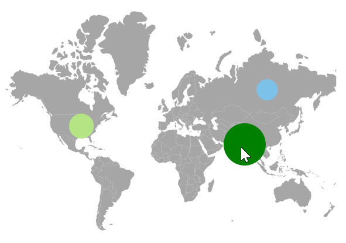

# User Interactions in Blazor Maps Component

## Zooming

Zooming provides in-depth visualization by scaling the map view. It is controlled by the [ZoomFactor](https://help.syncfusion.com/cr/blazor/Syncfusion.Blazor.Maps.MapsZoomSettings.html#Syncfusion_Blazor_Maps_MapsZoomSettings_ZoomFactor) property of the [MapsZoomSettings](https://help.syncfusion.com/cr/blazor/Syncfusion.Blazor.Maps.MapsZoomSettings.html) class. The zoom factor increases or decreases based on zoom-in and zoom-out interactions.

<b>Enable zooming</b>

Enable zooming by setting the [Enable](https://help.syncfusion.com/cr/blazor/Syncfusion.Blazor.Maps.MapsZoomSettings.html#Syncfusion_Blazor_Maps_MapsZoomSettings_Enable) property of [MapsZoomSettings](https://help.syncfusion.com/cr/blazor/Syncfusion.Blazor.Maps.MapsZoomSettings.html) to **true**.

```cshtml

@using Syncfusion.Blazor.Maps

<SfMaps>
    <MapsZoomSettings Enable="true"></MapsZoomSettings>
    <MapsLayers>
        <MapsLayer ShapeData='new {dataOptions ="https://cdn.syncfusion.com/maps/map-data/usa.json"}' TValue="string">
        </MapsLayer>
    </MapsLayers>
</SfMaps>

```


<b>Enable panning</b>

Enable panning by setting the [EnablePanning](https://help.syncfusion.com/cr/blazor/Syncfusion.Blazor.Maps.MapsZoomSettings.html#Syncfusion_Blazor_Maps_MapsZoomSettings_EnablePanning) property of [MapsZoomSettings](https://help.syncfusion.com/cr/blazor/Syncfusion.Blazor.Maps.MapsZoomSettings.html) to **true**.

```cshtml

@using Syncfusion.Blazor.Maps

<SfMaps>
    <MapsZoomSettings Enable="true" EnablePanning="true"></MapsZoomSettings>
    <MapsLayers>
        <MapsLayer ShapeData='new {dataOptions ="https://cdn.syncfusion.com/maps/map-data/usa.json"}' TValue="string">
        </MapsLayer>
    </MapsLayers>
</SfMaps>

```

### Various types of zooming

Zooming supports the following types:

#### Zooming toolbar

A built-in toolbar supports zooming and panning. It appears when the [Enable](https://help.syncfusion.com/cr/blazor/Syncfusion.Blazor.Maps.MapsZoomSettings.html#Syncfusion_Blazor_Maps_MapsZoomSettings_Enable) property is set to **true**.

The toolbar includes the following options:

1. Zoom - Performs selection zooming.
2. Zoom In - Zooms in the map.
3. Zoom Out - Zooms out the map.
4. Pan - Switches to panning if selection zoom is enabled.
5. Reset - Restores the default view.

By default, the toolbar renders with **Zoom In**, **Zoom Out**, and **Reset**.

```cshtml

@using Syncfusion.Blazor.Maps

<SfMaps>
    <MapsZoomSettings Enable="true">
    </MapsZoomSettings>
    <MapsLayers>
        <MapsLayer ShapeData='new {dataOptions ="https://cdn.syncfusion.com/maps/map-data/usa.json"}' TValue="string">
        </MapsLayer>
    </MapsLayers>
</SfMaps>

```

#### Pinch zooming

Enable or disable pinch zooming using the [PinchZooming](https://help.syncfusion.com/cr/blazor/Syncfusion.Blazor.Maps.MapsZoomSettings.html#Syncfusion_Blazor_Maps_MapsZoomSettings_PinchZooming) property in [MapsZoomSettings](https://help.syncfusion.com/cr/blazor/Syncfusion.Blazor.Maps.MapsZoomSettings.html).

```cshtml

@using Syncfusion.Blazor.Maps

<SfMaps>
    <MapsZoomSettings Enable="true" PinchZooming="true"></MapsZoomSettings>
    <MapsLayers>
        <MapsLayer ShapeData='new {dataOptions ="https://cdn.syncfusion.com/maps/map-data/usa.json"}' TValue="string">
        </MapsLayer>
    </MapsLayers>
</SfMaps>

```

#### Single-click zooming

Enable or disable single-click zooming using the [ZoomOnClick](https://help.syncfusion.com/cr/blazor/Syncfusion.Blazor.Maps.MapsZoomSettings.html#Syncfusion_Blazor_Maps_MapsZoomSettings_ZoomOnClick) property in [MapsZoomSettings](https://help.syncfusion.com/cr/blazor/Syncfusion.Blazor.Maps.MapsZoomSettings.html).

```cshtml

@using Syncfusion.Blazor.Maps

<SfMaps>
    <MapsZoomSettings Enable="true" ZoomOnClick="true"></MapsZoomSettings>
    <MapsLayers>
        <MapsLayer ShapeData='new {dataOptions ="https://cdn.syncfusion.com/maps/map-data/usa.json"}' TValue="string">
        </MapsLayer>
    </MapsLayers>
</SfMaps>

```

#### Double-click zooming

Enable or disable double-click zooming using the [DoubleClickZoom](https://help.syncfusion.com/cr/blazor/Syncfusion.Blazor.Maps.MapsZoomSettings.html#Syncfusion_Blazor_Maps_MapsZoomSettings_DoubleClickZoom) property in [MapsZoomSettings](https://help.syncfusion.com/cr/blazor/Syncfusion.Blazor.Maps.MapsZoomSettings.html).

```cshtml

@using Syncfusion.Blazor.Maps

<SfMaps>
    <MapsZoomSettings Enable="true" DoubleClickZoom="true"></MapsZoomSettings>
    <MapsLayers>
        <MapsLayer ShapeData='new {dataOptions ="https://cdn.syncfusion.com/maps/map-data/usa.json"}' TValue="string">
        </MapsLayer>
    </MapsLayers>
</SfMaps>

```

#### Mouse wheel zooming

Enable or disable mouse wheel zooming using the [MouseWheelZoom](https://help.syncfusion.com/cr/blazor/Syncfusion.Blazor.Maps.MapsZoomSettings.html#Syncfusion_Blazor_Maps_MapsZoomSettings_MouseWheelZoom) property in [MapsZoomSettings](https://help.syncfusion.com/cr/blazor/Syncfusion.Blazor.Maps.MapsZoomSettings.html).

```cshtml

@using Syncfusion.Blazor.Maps

<SfMaps>
    <MapsZoomSettings Enable="true" MouseWheelZoom="true"></MapsZoomSettings>
    <MapsLayers>
        <MapsLayer ShapeData='new {dataOptions ="https://cdn.syncfusion.com/maps/map-data/usa.json"}' TValue="string">
        </MapsLayer>
    </MapsLayers>
</SfMaps>

```

#### Selection zooming

Enable or disable selection zooming using the [EnableSelectionZooming](https://help.syncfusion.com/cr/blazor/Syncfusion.Blazor.Maps.MapsZoomSettings.html#Syncfusion_Blazor_Maps_MapsZoomSettings_EnableSelectionZooming) property in [MapsZoomSettings](https://help.syncfusion.com/cr/blazor/Syncfusion.Blazor.Maps.MapsZoomSettings.html). To enable selection zooming, set [EnablePanning](https://help.syncfusion.com/cr/blazor/Syncfusion.Blazor.Maps.MapsZoomSettings.html#Syncfusion_Blazor_Maps_MapsZoomSettings_EnablePanning) to **false**.

```cshtml

@using Syncfusion.Blazor.Maps

<SfMaps>
    <MapsZoomSettings Enable="true" EnableSelectionZooming="true" EnablePanning="true">
        <MapsZoomToolbarSettings>
            <MapsZoomToolbarButton ToolbarItems="new List<ToolbarItem>() { ToolbarItem.Zoom, ToolbarItem.ZoomIn, ToolbarItem.ZoomOut,
            ToolbarItem.Pan, ToolbarItem.Reset }"></MapsZoomToolbarButton>
        </MapsZoomToolbarSettings>
    </MapsZoomSettings>
    <MapsLayers>
        <MapsLayer ShapeData='new {dataOptions ="https://cdn.syncfusion.com/maps/map-data/usa.json"}' TValue="string">
        </MapsLayer>
    </MapsLayers>
</SfMaps>

```

### Setting minimum and maximum values for zoom factor

Adjust the zoom range using [MinZoom](https://help.syncfusion.com/cr/blazor/Syncfusion.Blazor.Maps.MapsZoomSettings.html#Syncfusion_Blazor_Maps_MapsZoomSettings_MinZoom) and [MaxZoom](https://help.syncfusion.com/cr/blazor/Syncfusion.Blazor.Maps.MapsZoomSettings.html#Syncfusion_Blazor_Maps_MapsZoomSettings_MaxZoom) in [MapsZoomSettings](https://help.syncfusion.com/cr/blazor/Syncfusion.Blazor.Maps.MapsZoomSettings.html). The default values are 1 for MinZoom and 10 for MaxZoom.

```cshtml

@using Syncfusion.Blazor.Maps

<SfMaps>
    <MapsZoomSettings Enable="true" MinZoom="2" MaxZoom="9"></MapsZoomSettings>
    <MapsLayers>
        <MapsLayer ShapeData='new {dataOptions ="https://cdn.syncfusion.com/maps/map-data/usa.json"}' TValue="string">
        </MapsLayer>
    </MapsLayers>
</SfMaps>

```

### Zooming with layer animation

Apply animated zooming for shape layers using the [AnimationDuration](https://help.syncfusion.com/cr/blazor/Syncfusion.Blazor.Maps.MapsLayer-1.html#Syncfusion_Blazor_Maps_MapsLayer_1_AnimationDuration) property in [MapsLayer](https://help.syncfusion.com/cr/blazor/Syncfusion.Blazor.Maps.MapsLayer-1.html). The animation applies to the base layer when the duration is set on that layer.

```cshtml

@using Syncfusion.Blazor.Maps

<SfMaps>
    <MapsZoomSettings Enable="true">
    </MapsZoomSettings>
    <MapsLayers>
        <MapsLayer ShapeData='new {dataOptions ="https://cdn.syncfusion.com/maps/map-data/usa.json"}' TValue="string"
                   AnimationDuration="500">
        </MapsLayer>
    </MapsLayers>
</SfMaps>

```

### Customizing the zoom toolbar

Use [MapsZoomToolbarSettings](https://help.syncfusion.com/cr/blazor/Syncfusion.Blazor.Maps.MapsZoomToolbarSettings.html) to customize the zoom toolbar. The following properties are available:

* [Orientation](https://help.syncfusion.com/cr/blazor/Syncfusion.Blazor.Maps.MapsZoomToolbarSettings.html#Syncfusion_Blazor_Maps_MapsZoomToolbarSettings_Orientation) - Sets the toolbar orientation (horizontal or vertical).
* [HorizontalAlignment](https://help.syncfusion.com/cr/blazor/Syncfusion.Blazor.Maps.MapsZoomToolbarSettings.html#Syncfusion_Blazor_Maps_MapsZoomToolbarSettings_HorizontalAlignment) - Positions the toolbar for horizontal orientation (near, center, far).
* [VerticalAlignment](https://help.syncfusion.com/cr/blazor/Syncfusion.Blazor.Maps.MapsZoomToolbarSettings.html#Syncfusion_Blazor_Maps_MapsZoomToolbarSettings_VerticalAlignment) - Positions the toolbar for vertical orientation (near, center, far).
* [BackgroundColor](https://help.syncfusion.com/cr/blazor/Syncfusion.Blazor.Maps.MapsZoomToolbarSettings.html#Syncfusion_Blazor_Maps_MapsZoomToolbarSettings_BackgroundColor) - Sets the toolbar background color.
* [BorderColor](https://help.syncfusion.com/cr/blazor/Syncfusion.Blazor.Maps.MapsZoomToolbarSettings.html#Syncfusion_Blazor_Maps_MapsZoomToolbarSettings_BorderColor) - Sets the toolbar border color.
* [BorderWidth](https://help.syncfusion.com/cr/blazor/Syncfusion.Blazor.Maps.MapsZoomToolbarSettings.html#Syncfusion_Blazor_Maps_MapsZoomToolbarSettings_BorderWidth) - Sets the toolbar border width.
* [BorderOpacity](https://help.syncfusion.com/cr/blazor/Syncfusion.Blazor.Maps.MapsZoomToolbarSettings.html#Syncfusion_Blazor_Maps_MapsZoomToolbarSettings_BorderOpacity) - Sets the toolbar border opacity.

```cshtml

@using Syncfusion.Blazor.Maps

<SfMaps>
    <MapsZoomSettings Enable="true">
        <MapsZoomToolbarSettings BackgroundColor="pink" BorderColor="green" BorderOpacity="1" BorderWidth="3" Orientation="Orientation.Vertical" VerticalAlignment="Alignment.Near">
            <MapsZoomToolbarButton ToolbarItems="new List<ToolbarItem>() { ToolbarItem.Zoom,
                                       ToolbarItem.ZoomIn, ToolbarItem.ZoomOut, ToolbarItem.Pan, ToolbarItem.Reset }"></MapsZoomToolbarButton>
        </MapsZoomToolbarSettings>
    </MapsZoomSettings>
    <MapsLayers>
        <MapsLayer ShapeData='new {dataOptions ="https://cdn.syncfusion.com/maps/map-data/usa.json"}' TValue="string">
            <MapsShapeSettings Fill="#C1DFF5"></MapsShapeSettings>
        </MapsLayer>
    </MapsLayers>
</SfMaps>

```


**Customizing the buttons in the zoom toolbar**

Use [MapsZoomToolbarButton](https://help.syncfusion.com/cr/blazor/Syncfusion.Blazor.Maps.MapsZoomToolbarButton.html) to customize the toolbar buttons. The following properties are available:

* [ToolbarItems](https://help.syncfusion.com/cr/blazor/Syncfusion.Blazor.Maps.MapsZoomToolbarButton.html#Syncfusion_Blazor_Maps_MapsZoomToolbarButton_ToolbarItems) - Configures the items displayed in the toolbar.
* [Color](https://help.syncfusion.com/cr/blazor/Syncfusion.Blazor.Maps.MapsZoomToolbarButton.html#Syncfusion_Blazor_Maps_MapsZoomToolbarButton_Color) - Sets the icon color.
* [Fill](https://help.syncfusion.com/cr/blazor/Syncfusion.Blazor.Maps.MapsZoomToolbarButton.html#Syncfusion_Blazor_Maps_MapsZoomToolbarButton_Fill) - Sets the button fill color.
* [Opacity](https://help.syncfusion.com/cr/blazor/Syncfusion.Blazor.Maps.MapsZoomToolbarButton.html#Syncfusion_Blazor_Maps_MapsZoomToolbarButton_Opacity) - Sets the button opacity.
* [HighlightColor](https://help.syncfusion.com/cr/blazor/Syncfusion.Blazor.Maps.MapsZoomToolbarButton.html#Syncfusion_Blazor_Maps_MapsZoomToolbarButton_HighlightColor) - Sets the hover color.
* [SelectionColor](https://help.syncfusion.com/cr/blazor/Syncfusion.Blazor.Maps.MapsZoomToolbarButton.html#Syncfusion_Blazor_Maps_MapsZoomToolbarButton_SelectionColor) - Sets the active state color.
* [Radius](https://help.syncfusion.com/cr/blazor/Syncfusion.Blazor.Maps.MapsZoomToolbarButton.html#Syncfusion_Blazor_Maps_MapsZoomToolbarButton_Radius) - Sets the button corner radius.
* [Padding](https://help.syncfusion.com/cr/blazor/Syncfusion.Blazor.Maps.MapsZoomToolbarButton.html#Syncfusion_Blazor_Maps_MapsZoomToolbarButton_Padding) - Sets the spacing between buttons.
* [BorderColor](https://help.syncfusion.com/cr/blazor/Syncfusion.Blazor.Maps.MapsZoomToolbarButton.html#Syncfusion_Blazor_Maps_MapsZoomToolbarButton_BorderColor) - Sets the border color.
* [BorderOpacity](https://help.syncfusion.com/cr/blazor/Syncfusion.Blazor.Maps.MapsZoomToolbarButton.html#Syncfusion_Blazor_Maps_MapsZoomToolbarButton_BorderOpacity) - Sets the border opacity.
* [BorderWidth](https://help.syncfusion.com/cr/blazor/Syncfusion.Blazor.Maps.MapsZoomToolbarButton.html#Syncfusion_Blazor_Maps_MapsZoomToolbarButton_BorderWidth) - Sets the border width.

```cshtml

@using Syncfusion.Blazor.Maps

<SfMaps>
    <MapsZoomSettings Enable="true">
         <MapsZoomToolbarSettings>
            <MapsZoomToolbarButton BorderColor="green" BorderOpacity="1" BorderWidth="2" Color="red" Fill="pink" HighlightColor="#5ed59a" SelectionColor="#d55e5e" Opacity="0.6"
                                   Padding="10" Radius="35"  ToolbarItems="new List<ToolbarItem>() { ToolbarItem.Zoom,
                                       ToolbarItem.ZoomIn, ToolbarItem.ZoomOut, ToolbarItem.Pan, ToolbarItem.Reset }"></MapsZoomToolbarButton>
        </MapsZoomToolbarSettings>
    </MapsZoomSettings>
    <MapsLayers>
        <MapsLayer ShapeData='new {dataOptions ="https://cdn.syncfusion.com/maps/map-data/usa.json"}' TValue="string">
        <MapsShapeSettings Fill="#C1DFF5"></MapsShapeSettings>
        </MapsLayer>
    </MapsLayers>
</SfMaps>

```


**Customizing the tooltip of the zoom toolbar**

Use [MapsZoomToolbarTooltipSettings](https://help.syncfusion.com/cr/blazor/Syncfusion.Blazor.Maps.MapsZoomToolbarTooltipSettings.html) to customize the toolbar tooltip. The following properties are available:

* [Visible](https://help.syncfusion.com/cr/blazor/Syncfusion.Blazor.Maps.MapsZoomToolbarTooltipSettings.html#Syncfusion_Blazor_Maps_MapsZoomToolbarTooltipSettings_Visible) - Enables or disables the tooltip.
* [Fill](https://help.syncfusion.com/cr/blazor/Syncfusion.Blazor.Maps.MapsZoomToolbarTooltipSettings.html#Syncfusion_Blazor_Maps_MapsZoomToolbarTooltipSettings_Fill) - Sets the tooltip background color.
* [BorderColor](https://help.syncfusion.com/cr/blazor/Syncfusion.Blazor.Maps.MapsZoomToolbarTooltipSettings.html#Syncfusion_Blazor_Maps_MapsZoomToolbarTooltipSettings_BorderColor) - Sets the tooltip border color.
* [BorderOpacity](https://help.syncfusion.com/cr/blazor/Syncfusion.Blazor.Maps.MapsZoomToolbarTooltipSettings.html#Syncfusion_Blazor_Maps_MapsZoomToolbarTooltipSettings_BorderOpacity) - Sets the tooltip border opacity.
* [BorderWidth](https://help.syncfusion.com/cr/blazor/Syncfusion.Blazor.Maps.MapsZoomToolbarTooltipSettings.html#Syncfusion_Blazor_Maps_MapsZoomToolbarTooltipSettings_BorderWidth) - Sets the tooltip border width.
* [FontColor](https://help.syncfusion.com/cr/blazor/Syncfusion.Blazor.Maps.MapsZoomToolbarTooltipSettings.html#Syncfusion_Blazor_Maps_MapsZoomToolbarTooltipSettings_FontColor) - Sets the tooltip text color.
* [FontFamily](https://help.syncfusion.com/cr/blazor/Syncfusion.Blazor.Maps.MapsZoomToolbarTooltipSettings.html#Syncfusion_Blazor_Maps_MapsZoomToolbarTooltipSettings_FontFamily) - Sets the tooltip font family.
* [FontStyle](https://help.syncfusion.com/cr/blazor/Syncfusion.Blazor.Maps.MapsZoomToolbarTooltipSettings.html#Syncfusion_Blazor_Maps_MapsZoomToolbarTooltipSettings_FontStyle) - Sets the tooltip font style.
* [FontWeight](https://help.syncfusion.com/cr/blazor/Syncfusion.Blazor.Maps.MapsZoomToolbarTooltipSettings.html#Syncfusion_Blazor_Maps_MapsZoomToolbarTooltipSettings_FontWeight) - Sets the tooltip font weight.
* [FontSize](https://help.syncfusion.com/cr/blazor/Syncfusion.Blazor.Maps.MapsZoomToolbarTooltipSettings.html#Syncfusion_Blazor_Maps_MapsZoomToolbarTooltipSettings_FontSize) - Sets the tooltip font size.
* [FontOpacity](https://help.syncfusion.com/cr/blazor/Syncfusion.Blazor.Maps.MapsZoomToolbarTooltipSettings.html#Syncfusion_Blazor_Maps_MapsZoomToolbarTooltipSettings_FontOpacity) - Sets the tooltip font opacity.

```cshtml

@using Syncfusion.Blazor.Maps

<SfMaps Width="700px" Height="500px">
    <MapsZoomSettings Enable="true">
         <MapsZoomToolbarSettings>
            <MapsZoomToolbarButton ToolbarItems="new List<ToolbarItem>() { ToolbarItem.Zoom,
                                       ToolbarItem.ZoomIn, ToolbarItem.ZoomOut, ToolbarItem.Pan, ToolbarItem.Reset }"></MapsZoomToolbarButton>
            <MapsZoomToolbarTooltipSettings Visible="true" BorderColor="green" BorderOpacity="1" BorderWidth="2" Fill="violet" FontColor="black" FontFamily="Times New Roman"
                                            FontOpacity="1" FontSize="22px" FontStyle="normal" FontWeight="200"></MapsZoomToolbarTooltipSettings>
        </MapsZoomToolbarSettings>
    </MapsZoomSettings>
    <MapsLayers>
        <MapsLayer ShapeData='new {dataOptions ="https://cdn.syncfusion.com/maps/map-data/usa.json"}' TValue="string">
        <MapsShapeSettings Fill="#C1DFF5"></MapsShapeSettings>
        </MapsLayer>
    </MapsLayers>
</SfMaps>

```


## Selection

Shapes can be selected and deselected during interaction. Enable selection by setting the [Enable](https://help.syncfusion.com/cr/blazor/Syncfusion.Blazor.Maps.MapsSelectionSettings.html#Syncfusion_Blazor_Maps_MapsSelectionSettings_Enable) property of [MapsSelectionSettings](https://help.syncfusion.com/cr/blazor/Syncfusion.Blazor.Maps.MapsSelectionSettings.html) to **true**.

The following properties and class customize selection for shapes, bubbles, and markers:

* [MapsLayerSelectionBorder](https://help.syncfusion.com/cr/blazor/Syncfusion.Blazor.Maps.MapsLayerSelectionBorder.html) - Configures the selected element border color and width.
* [Fill](https://help.syncfusion.com/cr/blazor/Syncfusion.Blazor.Maps.MapsSelectionSettings.html#Syncfusion_Blazor_Maps_MapsSelectionSettings_Fill) - Sets the selected element color.
* [Opacity](https://help.syncfusion.com/cr/blazor/Syncfusion.Blazor.Maps.MapsSelectionSettings.html#Syncfusion_Blazor_Maps_MapsSelectionSettings_Opacity) - Sets the selected element opacity.
* [EnableMultiSelect](https://help.syncfusion.com/cr/blazor/Syncfusion.Blazor.Maps.MapsSelectionSettings.html#Syncfusion_Blazor_Maps_MapsSelectionSettings_EnableMultiSelect) - Enables selection of multiple shapes, markers, or bubbles.

```cshtml

@using Syncfusion.Blazor.Maps

<SfMaps>
    <MapsLayers>
        <MapsLayer ShapeData='new {dataOptions ="https://cdn.syncfusion.com/maps/map-data/usa.json"}' TValue="string">
            <MapsLayerSelectionSettings Enable="true" Fill="green">
                <MapsLayerSelectionBorder Color="White" Width="2"></MapsLayerSelectionBorder>
            </MapsLayerSelectionSettings>
        </MapsLayer>
    </MapsLayers>
</SfMaps>

```


Selecting a legend item selects the shapes bound to that legend, and selecting a shape highlights the corresponding legend.

```cshtml

@using Syncfusion.Blazor.Maps

<SfMaps>
    <MapsLegendSettings Visible="true" Mode="LegendMode.Interactive"></MapsLegendSettings>
    <MapsLayers>
        <MapsLayer ShapeData='new {dataOptions ="https://cdn.syncfusion.com/maps/map-data/world-map.json"}' ShapeDataPath="Country"
                   DataSource="CouncilMemberdetails" ShapePropertyPath='new string[] {"name"}' TValue="UNCouncil">
            <MapsShapeSettings Fill="#E5E5E5" ColorValuePath="Membership">
                <MapsShapeColorMappings>
                    <MapsShapeColorMapping Value="Permanent" Color='new string[] {"#D84444"}' />
                    <MapsShapeColorMapping Value="Non-Permanent" Color='new string[] {"#316DB5"}' />
                </MapsShapeColorMappings>
            </MapsShapeSettings>
            <MapsLayerSelectionSettings Enable="true" Fill="#a7f047">
                <MapsLayerSelectionBorder Color="White" Width="2"></MapsLayerSelectionBorder>
            </MapsLayerSelectionSettings>
        </MapsLayer>
    </MapsLayers>
</SfMaps>

@code {
    public class UNCouncil
    {
        public string Country { get; set; }
        public string Membership { get; set; }
    }

    private List<UNCouncil> CouncilMemberdetails = new List<UNCouncil>{
        new UNCouncil { Country= "China", Membership= "Permanent" },
        new UNCouncil { Country= "France",Membership= "Permanent" },
        new UNCouncil { Country= "Russia",Membership= "Permanent" },
        new UNCouncil { Country= "Kazakhstan",Membership= "Non-Permanent" },
        new UNCouncil { Country= "Poland",Membership= "Non-Permanent" },
        new UNCouncil { Country= "Sweden",Membership= "Non-Permanent" }
    };
}

```


### Enable selection for bubbles

Enable bubble selection by configuring [MapsBubbleSelectionSettings](https://help.syncfusion.com/cr/blazor/Syncfusion.Blazor.Maps.MapsBubbleSelectionSettings.html) in [MapsBubble](https://help.syncfusion.com/cr/blazor/Syncfusion.Blazor.Maps.MapsBubble-1.html) and setting [Enable](https://help.syncfusion.com/cr/blazor/Syncfusion.Blazor.Maps.MapsSelectionSettings.html#Syncfusion_Blazor_Maps_MapsSelectionSettings_Enable) to **true**.

```cshtml

@using Syncfusion.Blazor.Maps

<SfMaps>
    <MapsLayers>
        <MapsLayer ShapeData='new {dataOptions ="https://cdn.syncfusion.com/maps/map-data/world-map.json"}' ShapeDataPath="Name"
                   ShapePropertyPath='new string[] {"name"}' TValue="Country">
            @* To add bubbles based on population count *@
            <MapsBubbleSettings>
                <MapsBubble Visible="true" ValuePath="Population" ColorValuePath="Color" MinRadius=20 MaxRadius=40 
                            DataSource="PopulationDetails" TValue="Country">
                <MapsBubbleSelectionSettings Enable="true" Fill="green"></MapsBubbleSelectionSettings>
                </MapsBubble>
            </MapsBubbleSettings>
        </MapsLayer>
    </MapsLayers>
</SfMaps>

@code {
    public class Country
    {
        public string Name { get; set; }
        public double Population { get; set; }
        public string Color { get; set; }
    }

    private List<Country> PopulationDetails = new List<Country> {
       new Country
       {
           Name ="United States", Population = 325020000, Color = "#b5e485"
       },
       new Country
       {
           Name = "Russia", Population = 142905208, Color = "#7bc1e8"
       },
       new Country
       {
           Name="India", Population=1198003000, Color = "#df819c"
       }
    };
}

```



### Enable selection for markers

Enable marker selection by configuring [MapsMarkerSelectionSettings](https://help.syncfusion.com/cr/blazor/Syncfusion.Blazor.Maps.MapsMarkerSelectionSettings.html) in [MapsMarkerSettings](https://help.syncfusion.com/cr/blazor/Syncfusion.Blazor.Maps.MapsMarkerSettings.html) and setting [Enable](https://help.syncfusion.com/cr/blazor/Syncfusion.Blazor.Maps.MapsLayerSelectionSettings.html#Syncfusion_Blazor_Maps_MapsLayerSelectionSettings_Enable) to **true**.

```cshtml

@using Syncfusion.Blazor.Maps

<SfMaps>
    <MapsLayers>
        <MapsLayer ShapeData='new {dataOptions= "https://cdn.syncfusion.com/maps/map-data/usa.json"}' TValue="string">
            <MapsMarkerSettings>
                <MapsMarker Visible="true" DataSource="California" Height="25" Width="15" TValue="City">
                    <MapsMarkerSelectionSettings Fill="green" Enable="true"></MapsMarkerSelectionSettings>
                </MapsMarker>
                <MapsMarker Visible="true" DataSource="NewYork" Height="25" Width="15" TValue="City">
                    <MapsMarkerSelectionSettings Fill="green" Enable="true"></MapsMarkerSelectionSettings>
                </MapsMarker>
                <MapsMarker Visible="true" DataSource="Iowa" Height="25" Width="15" TValue="City">
                    <MapsMarkerSelectionSettings Fill="green" Enable="true"></MapsMarkerSelectionSettings>
                </MapsMarker>
            </MapsMarkerSettings>
            <MapsShapeSettings Fill="lightgray"></MapsShapeSettings>
        </MapsLayer>
    </MapsLayers>
</SfMaps>

@code {
    public class City
    {
        public double Latitude { get; set; }
        public double Longitude { get; set; }
    };

    public List<City> California = new List<City> {
        new City { Latitude = 35.145083, Longitude = -117.960260 }
    };

    public List<City> NewYork = new List<City> {
        new City { Latitude = 40.724546, Longitude = -73.850344 }
    };

    public List<City> Iowa = new List<City> {
        new City { Latitude = 41.657782, Longitude = -91.533857 }
    };
}

```


### Enable selection for polygons

Enable polygon selection by setting the [Enable](https://help.syncfusion.com/cr/blazor/Syncfusion.Blazor.Maps.MapsPolygonSelectionSettings.html#Syncfusion_Blazor_Maps_MapsPolygonSelectionSettings_Enable) property of [MapsPolygonSelectionSettings](https://help.syncfusion.com/cr/blazor/Syncfusion.Blazor.Maps.MapsPolygonSelectionSettings.html) to **true**. The following properties and class customize selected polygon shapes:

* [EnableMultiSelect](https://help.syncfusion.com/cr/blazor/Syncfusion.Blazor.Maps.MapsPolygonSelectionSettings.html#Syncfusion_Blazor_Maps_MapsPolygonSelectionSettings_EnableMultiSelect) - Enables selection of multiple polygons.
* [Fill](https://help.syncfusion.com/cr/blazor/Syncfusion.Blazor.Maps.MapsPolygonSelectionSettings.html#Syncfusion_Blazor_Maps_MapsPolygonSelectionSettings_Fill) - Sets the selected polygon color.
* [Opacity](https://help.syncfusion.com/cr/blazor/Syncfusion.Blazor.Maps.MapsPolygonSelectionSettings.html#Syncfusion_Blazor_Maps_MapsPolygonSelectionSettings_Opacity) - Sets the selected polygon opacity.
* [MapsPolygonSelectionBorder](https://help.syncfusion.com/cr/blazor/Syncfusion.Blazor.Maps.MapsPolygonSelectionBorder.html) - Configures the border color, width, and opacity.

The following example demonstrates selecting a polygon in a geometry map.

```cshtml

@using Syncfusion.Blazor.Maps

<SfMaps>
    <MapsLayers>
        <MapsLayer ShapeData='new {dataOptions= "https://cdn.syncfusion.com/maps/map-data/world-map.json"}' TValue="string">
            <MapsPolygons>
                <MapsPolygonSelectionSettings Enable=true EnableMultiSelect=false Fill="violet" Opacity="0.8">
                    <MapsPolygonSelectionBorder Color="cyan" Opacity="1" Width="7"></MapsPolygonSelectionBorder>
                </MapsPolygonSelectionSettings>
                <MapsPolygon Points="@Brazil" Fill="blue" Opacity="0.7" BorderColor="green" BorderWidth="2" BorderOpacity="0.7"></MapsPolygon>
            </MapsPolygons>
        </MapsLayer>
    </MapsLayers>
</SfMaps>

@code {
    List<Coordinate> Brazil = new List<Coordinate>();

    protected override async Task OnInitializedAsync()
    {
        await base.OnInitializedAsync();
        Brazil.Add(new Coordinate() { Longitude = -1.8920678947185365, Latitude = 35.06195799239681 });
        Brazil.Add(new Coordinate() { Longitude = -1.6479633699113947, Latitude = 33.58989612266137 });
        Brazil.Add(new Coordinate() { Longitude = -1.4201220366858252, Latitude = 32.819439646045254 });
        Brazil.Add(new Coordinate() { Longitude = -1.197974596225663, Latitude = 32.26940895444655 });
        Brazil.Add(new Coordinate() { Longitude = -2.891112397949655, Latitude = 32.10303058820031 });
        Brazil.Add(new Coordinate() { Longitude = -3.8246984550501963, Latitude = 31.34551662687602 });
        Brazil.Add(new Coordinate() { Longitude = -3.720166273688733, Latitude = 30.758086682848685 });
        Brazil.Add(new Coordinate() { Longitude = -5.6571886081189575, Latitude = 29.613582597203006 });
        Brazil.Add(new Coordinate() { Longitude = -7.423353242214745, Latitude = 29.44328441403087 });
        Brazil.Add(new Coordinate() { Longitude = -8.6048931685323, Latitude = 28.761444633616776 });
        Brazil.Add(new Coordinate() { Longitude = -8.695726975465703, Latitude = 27.353491085576195 });
        Brazil.Add(new Coordinate() { Longitude = 3.837867279970908, Latitude = 19.15916564839422 });
        Brazil.Add(new Coordinate() { Longitude = 6.0705408799045415, Latitude = 19.48749097192868 });
        Brazil.Add(new Coordinate() { Longitude = 12.055736352807713, Latitude = 23.694596786078293 });
        Brazil.Add(new Coordinate() { Longitude = 11.272522332402986, Latitude = 24.289329186946034 });
        Brazil.Add(new Coordinate() { Longitude = 10.30872578261932, Latitude = 24.65419958524693 });
        Brazil.Add(new Coordinate() { Longitude = 9.910236690050027, Latitude = 25.48943950947175 });
        Brazil.Add(new Coordinate() { Longitude = 9.432639882414293, Latitude = 26.398372489836902 });
        Brazil.Add(new Coordinate() { Longitude = 9.898266456582292, Latitude = 26.73489453809293 });
        Brazil.Add(new Coordinate() { Longitude = 9.560243026853641, Latitude = 30.31040379467153 });
        Brazil.Add(new Coordinate() { Longitude = 8.943853847283322, Latitude = 32.350324876652195 });
        Brazil.Add(new Coordinate() { Longitude = 7.57004059025715, Latitude = 33.75071049019398 });
        Brazil.Add(new Coordinate() { Longitude = 8.0906322609153, Latitude = 34.69043151009983 });
        Brazil.Add(new Coordinate() { Longitude = 8.363285449347273, Latitude = 35.38654406371319 });
        Brazil.Add(new Coordinate() { Longitude = 8.26139549449448, Latitude = 36.44751078733985 });
        Brazil.Add(new Coordinate() { Longitude = 8.61100824823302, Latitude = 36.881913362940196 });
        Brazil.Add(new Coordinate() { Longitude = 7.4216488925819135, Latitude = 37.021408008916254 });
        Brazil.Add(new Coordinate() { Longitude = 6.461182254165351, Latitude = 36.99092409199429 });
        Brazil.Add(new Coordinate() { Longitude = 5.297178918070159, Latitude = 36.69985479014656 });
        Brazil.Add(new Coordinate() { Longitude = 3.6718056161224695, Latitude = 36.86470546831693 });
        Brazil.Add(new Coordinate() { Longitude = 1.2050052555659931, Latitude = 36.57658056301722 });
        Brazil.Add(new Coordinate() { Longitude = -0.26968570003779746, Latitude = 35.806903541813625 });
        Brazil.Add(new Coordinate() { Longitude = -0.995191786435754, Latitude = 35.58466127904214 });
        Brazil.Add(new Coordinate() { Longitude = -1.8920678947185365, Latitude = 35.06195799239681 });
    }
}

```


### Public method for the shape selection

Use the [ShapeSelection](https://help.syncfusion.com/cr/blazor/Syncfusion.Blazor.Maps.SfMaps.html#Syncfusion_Blazor_Maps_SfMaps_ShapeSelection_System_Int32_System_String_System_String_System_Boolean_) method to select a shape programmatically. Input parameters are the **layerIndex**, **propertyName**, **shapeDataPath**, and the **isSelect** boolean to select or deselect the shape.

```cshtml

@using Syncfusion.Blazor.Maps

<div>
    <SfMaps @ref="mapsref">
        <MapsLayers>
            <MapsLayer ShapeData='new {dataOptions= "https://cdn.syncfusion.com/maps/map-data/world-map.json"}' TValue="string">
                <MapsLayerSelectionSettings Enable="true" Fill="green">
                    <MapsLayerSelectionBorder Color="white" Width="2"></MapsLayerSelectionBorder>
                </MapsLayerSelectionSettings>
            </MapsLayer>
        </MapsLayers>
    </SfMaps>
</div>
<button id="select" @onclick="Select">select</button>
<button id="unselect" @onclick="Unselect">unselect</button>

@code {
    SfMaps mapsref;

    public void Select() {
        mapsref.ShapeSelectionAsync(0, "continent", "Asia", true);
    }

    public void Unselect() {
        mapsref.ShapeSelectionAsync(0, "continent", "Asia", false);
    }
}

```


### Initial shape selection

Initialize selection using [MapsInitialShapeSelection](https://help.syncfusion.com/cr/blazor/Syncfusion.Blazor.Maps.MapsInitialShapeSelection.html) by mapping values to [ShapePath](https://help.syncfusion.com/cr/blazor/Syncfusion.Blazor.Maps.MapsInitialShapeSelection.html#Syncfusion_Blazor_Maps_MapsInitialShapeSelection_ShapePath) and [ShapeValue](https://help.syncfusion.com/cr/blazor/Syncfusion.Blazor.Maps.MapsInitialShapeSelection.html#Syncfusion_Blazor_Maps_MapsInitialShapeSelection_ShapeValue).

```cshtml

<SfMaps>
    <MapsLayers>
        <MapsLayer ShapeData='new {dataOptions= "https://cdn.syncfusion.com/maps/map-data/world-map.json"}' TValue="string">
            <MapsLayerSelectionSettings Enable="true" Fill="green" EnableMultiSelect="true">
                <MapsLayerSelectionBorder Color="white" Width="2"></MapsLayerSelectionBorder>
            </MapsLayerSelectionSettings>
            <MapsInitialShapeSelectionSettings>
                <MapsInitialShapeSelection ShapePath="continent" ShapeValue="Africa"></MapsInitialShapeSelection>
                <MapsInitialShapeSelection ShapePath="name" ShapeValue="India"></MapsInitialShapeSelection>
            </MapsInitialShapeSelectionSettings>
        </MapsLayer>
    </MapsLayers>
</SfMaps>

```


### Initial marker selection

Select markers initially using [InitialMarkerSelection](https://help.syncfusion.com/cr/blazor/Syncfusion.Blazor.Maps.InitialMarkerSelection.html). Markers render based on [Latitude](https://help.syncfusion.com/cr/blazor/Syncfusion.Blazor.Maps.InitialMarkerSelection.html#Syncfusion_Blazor_Maps_InitialMarkerSelection_Latitude) and [Longitude](https://help.syncfusion.com/cr/blazor/Syncfusion.Blazor.Maps.InitialMarkerSelection.html#Syncfusion_Blazor_Maps_InitialMarkerSelection_Longitude).

```cshtml

@using Syncfusion.Blazor.Maps

<SfMaps>
    <MapsLayers>
        <MapsLayer ShapeData='new {dataOptions= "https://cdn.syncfusion.com/maps/map-data/usa.json"}' TValue="string">
            <MapsMarkerSettings>
                <MapsMarker Visible="true" DataSource="Cities" Height="25" Width="15" TValue="City">
                    <MapsMarkerSelectionSettings Fill="green" Enable="true"></MapsMarkerSelectionSettings>
                    <InitialMarkerSelectionSettings>
                        <InitialMarkerSelection Latitude="35.145083" Longitude="-117.960260"></InitialMarkerSelection>
                    </InitialMarkerSelectionSettings>
                </MapsMarker>
            </MapsMarkerSettings>
            <MapsShapeSettings Fill="lightgray"></MapsShapeSettings>
        </MapsLayer>
    </MapsLayers>
</SfMaps>

@code {
    public class City
    {
        public double Latitude { get; set; }
        public double Longitude { get; set; }
        public string Name { get; set; }
    }

    private List<City> Cities = new List<City> {
        new City { Latitude = 35.145083, Longitude = -117.960260, Name = "Californiya" },
        new City { Latitude = 40.724546, Longitude = -73.850344, Name = "New York" },
        new City { Latitude = 41.657782, Longitude = -91.533857, Name = "Iowa" }
    };
}

```


## Highlight

Shapes can be highlighted on mouse hover, including shapes, bubbles, markers, and legends. Enable highlight by setting the [Enable](https://help.syncfusion.com/cr/blazor/Syncfusion.Blazor.Maps.MapsHighlightSettings.html#Syncfusion_Blazor_Maps_MapsHighlightSettings_Enable) property of [MapsHighlightSettings](https://help.syncfusion.com/cr/blazor/Syncfusion.Blazor.Maps.MapsHighlightSettings.html) to **true**.

The following properties and classes customize highlight behavior for shapes, bubbles, and markers:

* [Fill](https://help.syncfusion.com/cr/blazor/Syncfusion.Blazor.Maps.MapsHighlightSettings.html#Syncfusion_Blazor_Maps_MapsHighlightSettings_Fill) - Sets the highlight color.
* [Opacity](https://help.syncfusion.com/cr/blazor/Syncfusion.Blazor.Maps.MapsHighlightSettings.html#Syncfusion_Blazor_Maps_MapsHighlightSettings_Opacity) - Sets the highlight opacity.
* [MapsLayerHighlightBorder](https://help.syncfusion.com/cr/blazor/Syncfusion.Blazor.Maps.MapsLayerHighlightBorder.html) - Configures the layer border during highlight.
* [MapsBubbleHighlightBorder](https://help.syncfusion.com/cr/blazor/Syncfusion.Blazor.Maps.MapsBubbleHighlightBorder.html) - Configures the bubble border during highlight.
* [MapsMarkerHighlightBorder](https://help.syncfusion.com/cr/blazor/Syncfusion.Blazor.Maps.MapsMarkerHighlightBorder.html) - Configures the marker border during highlight.

```cshtml

@using Syncfusion.Blazor.Maps

<SfMaps>
    <MapsLayers>
        <MapsLayer ShapeData='new {dataOptions ="https://cdn.syncfusion.com/maps/map-data/usa.json"}' TValue="string">
            <MapsLayerHighlightSettings Enable="true" Fill="green">
                <MapsLayerHighlightBorder Color="white" Width="2"></MapsLayerHighlightBorder>
            </MapsLayerHighlightSettings>
        </MapsLayer>
    </MapsLayers>
</SfMaps>

```


Hovering over a legend highlights the shapes bound to that legend, and hovering over a shape highlights the corresponding legend.

```cshtml

@using Syncfusion.Blazor.Maps

<SfMaps>
    <MapsLegendSettings Visible="true" Mode="LegendMode.Interactive"></MapsLegendSettings>
    <MapsLayers>
        <MapsLayer ShapeData='new {dataOptions ="https://cdn.syncfusion.com/maps/map-data/world-map.json"}' ShapeDataPath="Country"
                   DataSource="CouncilMemberDetails" ShapePropertyPath='new string[] {"name"}' TValue="UNCouncil">
            <MapsShapeSettings Fill="#E5E5E5" ColorValuePath="Membership">
                <MapsShapeColorMappings>
                    <MapsShapeColorMapping Value="Permanent" Color='new string[] {"#D84444"}' />
                    <MapsShapeColorMapping Value="Non-Permanent" Color='new string[] {"#316DB5"}' />
                </MapsShapeColorMappings>
            </MapsShapeSettings>
            <MapsLayerHighlightSettings Enable="true" Fill="#a7f047">
                <MapsLayerHighlightBorder Color="White" Width="2"></MapsLayerHighlightBorder>
            </MapsLayerHighlightSettings>
        </MapsLayer>
    </MapsLayers>
</SfMaps>

@code {
    public class UNCouncil
    {
        public string Country { get; set; }
        public string Membership { get; set; }
    }

    private List<UNCouncil> CouncilMemberDetails = new List<UNCouncil>{
        new UNCouncil { Country = "China", Membership = "Permanent" },
        new UNCouncil { Country = "France", Membership = "Permanent" },
        new UNCouncil { Country = "Russia", Membership = "Permanent" },
        new UNCouncil { Country = "Kazakhstan", Membership = "Non-Permanent" },
        new UNCouncil { Country = "Poland", Membership = "Non-Permanent" }
    };
}

```


### Enable highlight for bubbles

Enable bubble highlight by configuring [MapsBubbleHighlightSettings](https://help.syncfusion.com/cr/blazor/Syncfusion.Blazor.Maps.MapsBubbleHighlightSettings.html) in [MapsBubble](https://help.syncfusion.com/cr/blazor/Syncfusion.Blazor.Maps.MapsBubble-1.html) and setting [Enable](https://help.syncfusion.com/cr/blazor/Syncfusion.Blazor.Maps.MapsSelectionSettings.html#Syncfusion_Blazor_Maps_MapsSelectionSettings_Enable) to **true**.

```cshtml

@using Syncfusion.Blazor.Maps

<SfMaps>
    <MapsLayers>
        <MapsLayer ShapeData='new {dataOptions ="https://cdn.syncfusion.com/maps/map-data/world-map.json"}'
                   ShapeDataPath="Name" ShapePropertyPath='new string[] {"name"}' TValue="Country">
            @* To add bubbles based on population count *@
            <MapsBubbleSettings>
                <MapsBubble Visible="true" ValuePath="Population" ColorValuePath="Color" MinRadius=20 MaxRadius=40
                            DataSource="PopulationDetails" TValue="Country">
                    <MapsBubbleHighlightSettings Enable="true" Fill="green">
                        <MapsBubbleHighlightBorder Width="2" Color="orange"></MapsBubbleHighlightBorder>
                    </MapsBubbleHighlightSettings>
                </MapsBubble>
            </MapsBubbleSettings>
        </MapsLayer>
    </MapsLayers>
</SfMaps>

@code {
    public class Country
    {
        public string Name { get; set; }
        public double Population { get; set; }
        public string Color { get; set; }
    }

    private List<Country> PopulationDetails = new List<Country> {
        new Country
       {
           Name = "United States", Population = 325020000, Color = "#b5e485"
       },
       new Country
       {
           Name = "Russia", Population = 142905208, Color = "#7bc1e8"
       },
       new Country
       {
           Name = "India", Population = 1198003000, Color = "#df819c"
       }
    };
}

```


### Enable highlight for markers

Enable marker highlight by configuring [MapsMarkerHighlightSettings](https://help.syncfusion.com/cr/blazor/Syncfusion.Blazor.Maps.MapsMarkerHighlightSettings.html) in [MapsMarker](https://help.syncfusion.com/cr/blazor/Syncfusion.Blazor.Maps.MapsMarker-1.html) and setting [Enable](https://help.syncfusion.com/cr/blazor/Syncfusion.Blazor.Maps.MapsHighlightSettings.html#Syncfusion_Blazor_Maps_MapsHighlightSettings_Enable) to **true**.

```cshtml

@using Syncfusion.Blazor.Maps

<SfMaps>
    <MapsLayers>
        <MapsLayer ShapeData='new {dataOptions= "https://cdn.syncfusion.com/maps/map-data/usa.json"}' TValue="string">
            <MapsMarkerSettings>
                <MapsMarker Visible="true" DataSource="Cities" Height="25" Width="15" TValue="City">
                    <MapsMarkerHighlightSettings Fill="green" Enable="true"></MapsMarkerHighlightSettings>
                </MapsMarker>
            </MapsMarkerSettings>
            <MapsShapeSettings Fill="lightgray"></MapsShapeSettings>
        </MapsLayer>
    </MapsLayers>
</SfMaps>

@code {
    public class City
    {
        public double Latitude { get; set; }
        public double Longitude { get; set; }
        public string Name { get; set; }
    }

    private List<City> Cities = new List<City> {
        new City { Latitude = 35.145083, Longitude = -117.960260, Name = "California" },
        new City { Latitude = 40.724546, Longitude = -73.850344, Name = "New York" },
        new City { Latitude = 41.657782, Longitude = -91.533857, Name = "Iowa" }
    };
}

```


### Enable highlight for polygons

Enable polygon highlight by setting the [Enable](https://help.syncfusion.com/cr/blazor/Syncfusion.Blazor.Maps.MapsPolygonHighlightSettings.html#Syncfusion_Blazor_Maps_MapsPolygonHighlightSettings_Enable) property of [MapsPolygonHighlightSettings](https://help.syncfusion.com/cr/blazor/Syncfusion.Blazor.Maps.MapsPolygonHighlightSettings.html) to **true**. The following properties and class customize the highlighted polygon:

* [Fill](https://help.syncfusion.com/cr/blazor/Syncfusion.Blazor.Maps.MapsPolygonHighlightSettings.html#Syncfusion_Blazor_Maps_MapsPolygonHighlightSettings_Fill) - Sets the highlight color.
* [Opacity](https://help.syncfusion.com/cr/blazor/Syncfusion.Blazor.Maps.MapsPolygonHighlightSettings.html#Syncfusion_Blazor_Maps_MapsPolygonHighlightSettings_Opacity) - Sets the highlight opacity.
* [MapsPolygonHighlightBorder](https://help.syncfusion.com/cr/blazor/Syncfusion.Blazor.Maps.MapsPolygonHighlightBorder.html) - Configures the border color, width, and opacity.

The following example illustrates highlighting a polygon on a geometry map.

```cshtml

@using Syncfusion.Blazor.Maps

<SfMaps>
    <MapsLayers>
        <MapsLayer ShapeData='new {dataOptions= "https://cdn.syncfusion.com/maps/map-data/world-map.json"}' TValue="string">
            <MapsPolygons>
                <MapsPolygonHighlightSettings Enable=true Fill="yellow" Opacity="0.4" >
                    <MapsPolygonHighlightBorder Color="blue" Opacity="0.6" Width="4"></MapsPolygonHighlightBorder>
                </MapsPolygonHighlightSettings>
                <MapsPolygon Points="Brazil" Fill="red" Opacity="0.7" BorderColor="green" BorderWidth="2" BorderOpacity="0.7"></MapsPolygon>
            </MapsPolygons>
        </MapsLayer>
    </MapsLayers>
</SfMaps>

@code {
    List<Coordinate> Brazil = new List<Coordinate>();

    protected override async Task OnInitializedAsync()
    {
        await base.OnInitializedAsync();
        Brazil.Add(new Coordinate() { Longitude = -1.8920678947185365, Latitude = 35.06195799239681 });
        Brazil.Add(new Coordinate() { Longitude = -1.6479633699113947, Latitude = 33.58989612266137 });
        Brazil.Add(new Coordinate() { Longitude = -1.4201220366858252, Latitude = 32.819439646045254 });
        Brazil.Add(new Coordinate() { Longitude = -1.197974596225663, Latitude = 32.26940895444655 });
        Brazil.Add(new Coordinate() { Longitude = -2.891112397949655, Latitude = 32.10303058820031 });
        Brazil.Add(new Coordinate() { Longitude = -3.8246984550501963, Latitude = 31.34551662687602 });
        Brazil.Add(new Coordinate() { Longitude = -3.720166273688733, Latitude = 30.758086682848685 });
        Brazil.Add(new Coordinate() { Longitude = -5.6571886081189575, Latitude = 29.613582597203006 });
        Brazil.Add(new Coordinate() { Longitude = -7.423353242214745, Latitude = 29.44328441403087 });
        Brazil.Add(new Coordinate() { Longitude = -8.6048931685323, Latitude = 28.761444633616776 });
        Brazil.Add(new Coordinate() { Longitude = -8.695726975465703, Latitude = 27.353491085576195 });
        Brazil.Add(new Coordinate() { Longitude = 3.837867279970908, Latitude = 19.15916564839422 });
        Brazil.Add(new Coordinate() { Longitude = 6.0705408799045415, Latitude = 19.48749097192868 });
        Brazil.Add(new Coordinate() { Longitude = 12.055736352807713, Latitude = 23.694596786078293 });
        Brazil.Add(new Coordinate() { Longitude = 11.272522332402986, Latitude = 24.289329186946034 });
        Brazil.Add(new Coordinate() { Longitude = 10.30872578261932, Latitude = 24.65419958524693 });
        Brazil.Add(new Coordinate() { Longitude = 9.910236690050027, Latitude = 25.48943950947175 });
        Brazil.Add(new Coordinate() { Longitude = 9.432639882414293, Latitude = 26.398372489836902 });
        Brazil.Add(new Coordinate() { Longitude = 9.898266456582292, Latitude = 26.73489453809293 });
        Brazil.Add(new Coordinate() { Longitude = 9.560243026853641, Latitude = 30.31040379467153 });
        Brazil.Add(new Coordinate() { Longitude = 8.943853847283322, Latitude = 32.350324876652195 });
        Brazil.Add(new Coordinate() { Longitude = 7.57004059025715, Latitude = 33.75071049019398 });
        Brazil.Add(new Coordinate() { Longitude = 8.0906322609153, Latitude = 34.69043151009983 });
        Brazil.Add(new Coordinate() { Longitude = 8.363285449347273, Latitude = 35.38654406371319 });
        Brazil.Add(new Coordinate() { Longitude = 8.26139549449448, Latitude = 36.44751078733985 });
        Brazil.Add(new Coordinate() { Longitude = 8.61100824823302, Latitude = 36.881913362940196 });
        Brazil.Add(new Coordinate() { Longitude = 7.4216488925819135, Latitude = 37.021408008916254 });
        Brazil.Add(new Coordinate() { Longitude = 6.461182254165351, Latitude = 36.99092409199429 });
        Brazil.Add(new Coordinate() { Longitude = 5.297178918070159, Latitude = 36.69985479014656 });
        Brazil.Add(new Coordinate() { Longitude = 3.6718056161224695, Latitude = 36.86470546831693 });
        Brazil.Add(new Coordinate() { Longitude = 1.2050052555659931, Latitude = 36.57658056301722 });
        Brazil.Add(new Coordinate() { Longitude = -0.26968570003779746, Latitude = 35.806903541813625 });
        Brazil.Add(new Coordinate() { Longitude = -0.995191786435754, Latitude = 35.58466127904214 });
        Brazil.Add(new Coordinate() { Longitude = -1.8920678947185365, Latitude = 35.06195799239681 });
    }
}

```


## Tooltip

Tooltips display additional information for layers, bubbles, or markers on mouse over or touch end. Enable tooltips using the [Visible](https://help.syncfusion.com/cr/blazor/Syncfusion.Blazor.Maps.MapsTooltipSettings.html#Syncfusion_Blazor_Maps_MapsTooltipSettings_Visible) property in [MapsLayerTooltipSettings](https://help.syncfusion.com/cr/blazor/Syncfusion.Blazor.Maps.MapsLayerTooltipSettings.html), [MapsBubbleTooltipSettings](https://help.syncfusion.com/cr/blazor/Syncfusion.Blazor.Maps.MapsBubbleTooltipSettings.html), or [MapsMarkerTooltipSettings](https://help.syncfusion.com/cr/blazor/Syncfusion.Blazor.Maps.MapsMarkerTooltipSettings.html). Use [TooltipDisplayMode](https://help.syncfusion.com/cr/blazor/Syncfusion.Blazor.Maps.SfMaps.html#Syncfusion_Blazor_Maps_SfMaps_TooltipDisplayMode) to change when the tooltip is shown. The available modes are:

* MouseMove
* Click
* DoubleClick

```cshtml

@using Syncfusion.Blazor.Maps

<SfMaps>
    <MapsLayers>
        <MapsLayer ShapeData='new {dataOptions= "https://cdn.syncfusion.com/maps/map-data/world-map.json"}' TValue="string">
            <MapsLayerTooltipSettings Visible="true" ValuePath="name">
            </MapsLayerTooltipSettings>
        </MapsLayer>
    </MapsLayers>
</SfMaps>

```


### Customization

Use the following properties to customize tooltips:

* [Fill](https://help.syncfusion.com/cr/blazor/Syncfusion.Blazor.Maps.MapsTooltipSettings.html#Syncfusion_Blazor_Maps_MapsTooltipSettings_Fill) - Sets the tooltip background color for layers, markers, and bubbles.
* [Format](https://help.syncfusion.com/cr/blazor/Syncfusion.Blazor.Maps.MapsTooltipSettings.html#Syncfusion_Blazor_Maps_MapsTooltipSettings_Format) - Configures the tooltip format for layers, markers, and bubbles.

```cshtml

@using Syncfusion.Blazor.Maps

<SfMaps>
    <MapsLayers>
        <MapsLayer ShapeData='new {dataOptions= "https://cdn.syncfusion.com/maps/map-data/world-map.json"}' ShapeDataPath="Name"
                   ShapePropertyPath='new string[] {"name"}' DataSource='PerformanceReport' TValue="Country">
            <MapsLayerTooltipSettings Visible="true" ValuePath="CountryName"
                                  Format="<b>${CountryName}</b><br>Finalist: <b>${Winner}</b><br>Win: <b>${Finalist}">
            </MapsLayerTooltipSettings>
            <MapsShapeSettings Fill="#E5E5E5" ColorValuePath="Finalist">
                <MapsShapeColorMappings>
                    <MapsShapeColorMapping Value="1" Color='new string[] {"#acaed8"}'></MapsShapeColorMapping>
                    <MapsShapeColorMapping Value="2" Color='new string[] {"#80c1ff"}'></MapsShapeColorMapping>
                    <MapsShapeColorMapping Value="3" Color='new string[] {"#1a90ff"}'></MapsShapeColorMapping>
                    <MapsShapeColorMapping Value="4" Color='new string[] {"#005cb3"}'></MapsShapeColorMapping>
                    <MapsShapeColorMapping Value="7" Color='new string[] {"#0b0d35"}'></MapsShapeColorMapping>
                </MapsShapeColorMappings>
            </MapsShapeSettings>
        </MapsLayer>
    </MapsLayers>
</SfMaps>

@code {
    public class Country
    {
        public string Name { get; set; }
        public string Winner { get; set; }
        public string Finalist { get; set; }
        public string CountryName { get; set; }
    }

    public List<Country> PerformanceReport = new List<Country> {
        new Country { CountryName = "India", Name = "India", Finalist = "3", Winner = "2" },
        new Country { CountryName = "United Kingdom", Name = "United Kingdom", Finalist = "4", Winner = "1" },
        new Country { CountryName = "Australia", Name = "Australia", Finalist = "7", Winner = "5" },
        new Country { CountryName = "Sri Lanka", Name = "Sri Lanka", Finalist = "3", Winner = "1" },
        new Country { CountryName = "Pakistan", Name = "Pakistan", Finalist = "2", Winner = "1" },
        new Country { CountryName = "New Zealand", Name = "New Zealand", Finalist = "1", Winner = "0" },
        new Country { CountryName = "West Indies", Name = "Dominican Rep", Finalist = "3", Winner = "2" },
        new Country { CountryName = "West Indies", Name = "Cuba", Finalist = "3", Winner = "2" },
        new Country { CountryName = "West Indies", Name = "Jamaica", Finalist = "3", Winner = "2" },
        new Country { CountryName = "West Indies", Name = "Haiti", Finalist = "3", Winner = "2" },
        new Country { CountryName = "West Indies", Name = "Gayana", Finalist = "3", Winner = "2" },
        new Country { CountryName = "West Indies", Name = "Suriname", Finalist = "3", Winner = "2" },
        new Country { CountryName = "West Indies", Name = "Trinidad and Tobago", Finalist = "3", Winner = "2" }
    };
}

```


### Tooltip template

Render HTML in tooltips using the [TooltipTemplate](https://help.syncfusion.com/cr/blazor/Syncfusion.Blazor.Maps.MapsLayerTooltipSettings.html#Syncfusion_Blazor_Maps_MapsLayerTooltipSettings_TooltipTemplate) property of [MapsLayerTooltipSettings](https://help.syncfusion.com/cr/blazor/Syncfusion.Blazor.Maps.MapsLayerTooltipSettings.html).

```cshtml

@using Syncfusion.Blazor.Maps

<SfMaps>
    <MapsTitleSettings Text="Finalist in Cricket World Cup">
        <MapsTitleTextStyle Size="16px" />
    </MapsTitleSettings>
    <MapsZoomSettings Enable="false" />
    <MapsLayers>
        <MapsLayer ShapeData='new {dataOptions= "https://cdn.syncfusion.com/maps/map-data/world-map.json"}' DataSource="@PerformanceReport" TValue="Country"
                   ShapePropertyPath="@ShapePropertyPath" ShapeDataPath="Name">
            <MapsLayerTooltipSettings Visible="true" ValuePath="name">
                <TooltipTemplate>
                    @{
                        var Data = context as Country;
                            <div id="template">
                                <div class="toolback">
                                    <div class="listing2">
                                        <center>
                                            @Data.Name
                                        </center>
                                    </div>
                                    <hr style="margin-top: 2px;margin-bottom:5px;border:0.5px solid #DDDDDD">
                                        <div>
                                            <span class="listing1">Finalist : </span><span class="listing2">@Data.Winner</span>
                                        </div>
                                        <div>
                                            <span class="listing1">Win : </span><span class="listing2">@Data.Runner</span>
                                        </div>
                                </div>
                            </div>
                    }
                </TooltipTemplate>
            </MapsLayerTooltipSettings>
            <MapsShapeSettings Fill="#E5E5E5" ColorValuePath="Winner">
                <MapsShapeColorMappings>
                    <MapsShapeColorMapping Value="1" Color="@ShapeColorOne" />
                    <MapsShapeColorMapping Value="2" Color="@ShapeColorTwo" />
                    <MapsShapeColorMapping Value="3" Color="@ShapeColorThree" />
                    <MapsShapeColorMapping Value="7" Color="@ShapeColorFour" />
                </MapsShapeColorMappings>
            </MapsShapeSettings>
        </MapsLayer>
    </MapsLayers>
</SfMaps>

@code {
    public string[] ShapePropertyPath = { "name" };
    public string[] ShapeColorOne = { "#b3daff" };
    public string[] ShapeColorTwo = { "#80c1ff" };
    public string[] ShapeColorThree = { "#1a90ff" };
    public string[] ShapeColorFour = { "#005cb3" };

    public class Country
    {
        public string Name { get; set; }
        public string Winner { get; set; }
        public string Runner { get; set; }
        public string City { get; set; }
    }

    public List<Country> PerformanceReport = new List<Country> {
        new Country { Name = "India", Winner = "3", Runner = "2", City = "India" },
        new Country { Name = "Dominican Rep.", Winner = "3", Runner = "2", City = "West Indies" },
        new Country { Name = "Cuba", Winner = "3", Runner = "2", City = "West Indies" },
        new Country { Name = "Jamaica", Winner = "3", Runner = "2", City = "West Indies" },
        new Country { Name = "Haiti", Winner = "3", Runner = "2", City = "West Indies" },
        new Country { Name = "Guyana", Winner = "3", Runner = "2", City = "West Indies" },
        new Country { Name = "Suriname", Winner = "3", Runner = "2", City = "West Indies" },
        new Country { Name = "Trinidad and Tobago", Winner = "3", Runner = "2", City = "West Indies" },
        new Country { Name = "Sri Lanka", Winner = "3", Runner = "1", City = "Sri Lanka" },
        new Country { Name = "United Kingdom", Winner = "3", Runner = "0", City = "England" },
        new Country { Name = "Pakistan", Winner = "2", Runner = "1", City = "Pakistan" },
        new Country { Name = "New Zealand", Winner = "1", Runner = "0", City = "New Zealand" },
        new Country { Name = "Australia", Winner = "7", Runner = "5", City = "Australia" }
    };
}

<style>
    .toolback {
        width: 100px;
        border-radius: 4px;
        border: 1px #abb9c6;
        background: rgba(53, 63, 76, 0.90);
        box-shadow: 0px 2px 2px rgba(0, 0, 0, 0.40);
        padding-bottom: 5px;
        padding-top: 10px;
        padding-left: 10px;
        padding-right: 10px
    }
    .listing1 {
        font-size: 13px;
        color: #cccccc
    }
    .listing2 {
        font-size: 13px;
        color: #ffffff;
        font-weight: 500;
    }
</style>

```


### Changing duration in mobile devices

Control tooltip lifetime on mobile devices using [Duration](https://help.syncfusion.com/cr/blazor/Syncfusion.Blazor.Maps.MapsTooltipSettings.html#Syncfusion_Blazor_Maps_MapsTooltipSettings_Duration) in the tooltip settings for layers, markers, bubbles, polygons, and more. The default is **2000** milliseconds. A value of **0** keeps the tooltip visible until the next interaction; values greater than **0** remove the tooltip after the specified time.

The following example changes tooltip duration for layer tooltips in the Maps component.

```cshtml

@using Syncfusion.Blazor.Maps

<SfMaps>
    <MapsLayers>
        <MapsLayer ShapeData='new {dataOptions= "https://cdn.syncfusion.com/maps/map-data/world-map.json"}' TValue="string">
            <MapsLayerTooltipSettings Visible="true" ValuePath="name" Fill="#D0D0D0" Duration="3000">
                <MapsLayerTooltipTextStyle Color="green" FontFamily="Times New Roman" FontStyle="Normal"></MapsLayerTooltipTextStyle>
            </MapsLayerTooltipSettings>
        </MapsLayer>
    </MapsLayers>
</SfMaps>

```


## See also

* [Change center position on zooming](how-to/change-center-position-on-zooming)
