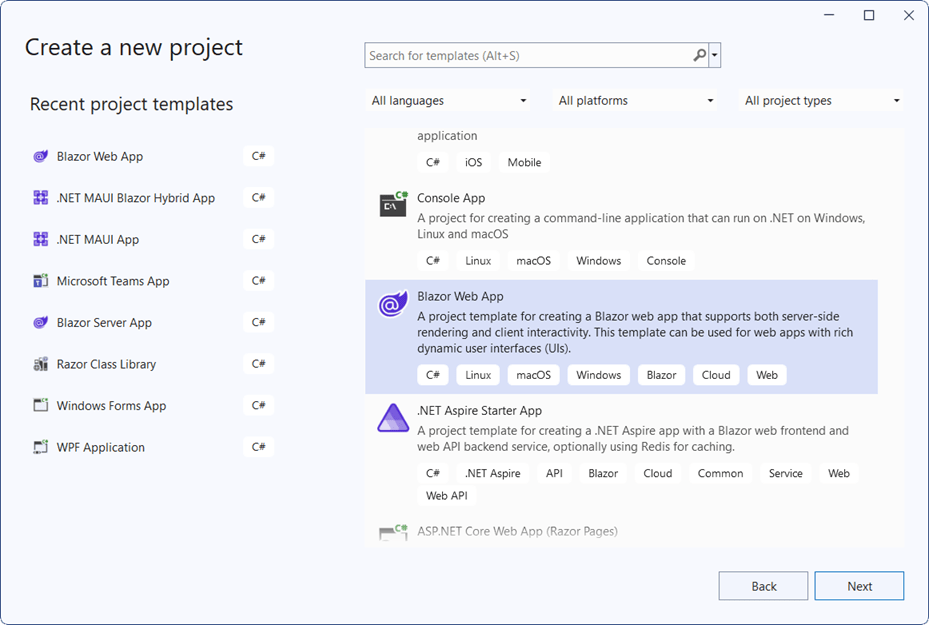

# Getting Started with Blazor MarkdownConverter in Blazor Server App

This section briefly explains about how to include `Blazor MarkdownConverter` component in a Blazor Server App using [Visual Studio](https://visualstudio.microsoft.com/vs/), [Visual Studio Code](https://code.visualstudio.com/), and the [.NET CLI](https://learn.microsoft.com/en-us/dotnet/core/tools/).





## Prerequisites

* [System requirements for Blazor components](https://blazor.syncfusion.com/documentation/system-requirements)

## Create a new Blazor App in Visual Studio

Create a **Blazor Server App** by using the **Blazor Web App** template in Visual Studio via [Microsoft Templates](https://learn.microsoft.com/en-us/aspnet/core/blazor/tooling?view=aspnetcore-10.0&pivots=vs) or the [Syncfusion<sup style="font-size:70%">&reg;</sup> Blazor Extension](https://blazor.syncfusion.com/documentation/visual-studio-integration/template-studio). For detailed instructions, refer to the [Blazor Server App Getting Started](https://blazor.syncfusion.com/documentation/getting-started/blazor-server-side-visual-studio) documentation.



Configure the appropriate [Interactive render mode](https://learn.microsoft.com/en-us/aspnet/core/blazor/components/render-modes?view=aspnetcore-10.0#render-modes) and [Interactivity location](https://learn.microsoft.com/en-us/aspnet/core/blazor/tooling?view=aspnetcore-10.0&pivots=vs) when creating a Blazor Server App.


## Install Syncfusion<sup style="font-size:70%">&reg;</sup> Blazor MarkdownConverter NuGet in the App

To add the **Blazor MarkdownConverter** component in the app, open the NuGet package manager in Visual Studio (*Tools → NuGet Package Manager → Manage NuGet Packages for Solution*), then search and install [Syncfusion.Blazor.MarkdownConverter](https://www.nuget.org/packages/Syncfusion.Blazor.MarkdownConverter/). Alternatively, run the following command in the Package Manager Console to achieve the same.




Install-Package Syncfusion.Blazor.MarkdownConverter -Version {{ site.releaseversion }}




N> Syncfusion<sup style="font-size:70%">&reg;</sup> Blazor components are available in [nuget.org](https://www.nuget.org/packages?q=syncfusion.blazor). Refer to the [NuGet packages](https://blazor.syncfusion.com/documentation/nuget-packages) topic for the available NuGet packages list with component details.





## Prerequisites

* [System requirements for Blazor components](https://blazor.syncfusion.com/documentation/system-requirements)

## Create a new Blazor App in Visual Studio Code

Create a **Blazor Server App** using Visual Studio Code via [Microsoft Templates](https://learn.microsoft.com/en-us/aspnet/core/blazor/tooling?view=aspnetcore-10.0&pivots=vsc) or the [Syncfusion<sup style="font-size:70%">&reg;</sup> Blazor Extension](https://blazor.syncfusion.com/documentation/visual-studio-code-integration/create-project). For detailed instructions, refer to the [Blazor Server App Getting Started](https://blazor.syncfusion.com/documentation/getting-started/blazor-server-side-visual-studio?tabcontent=visual-studio-code) documentation.

Alternatively, create a Server application by using the following command in the integrated terminal(<kbd>Ctrl</kbd>+<kbd>`</kbd>).





dotnet new blazor -o BlazorApp -int Server
cd BlazorApp





## Install Syncfusion<sup style="font-size:70%">&reg;</sup> Blazor MarkdownConverter NuGet in the App

* Press <kbd>Ctrl</kbd>+<kbd>`</kbd> to open the integrated terminal in Visual Studio Code.
* Ensure in the project root directory where the `.csproj` file is located.
* Run the following command to install [Syncfusion.Blazor.MarkdownConverter](https://www.nuget.org/packages/Syncfusion.Blazor.MarkdownConverter/) NuGet package and ensure all dependencies are installed.





dotnet add package Syncfusion.Blazor.MarkdownConverter -v {{ site.releaseversion }}
dotnet restore





N> Syncfusion<sup style="font-size:70%">&reg;</sup> Blazor components are available in [nuget.org](https://www.nuget.org/packages?q=syncfusion.blazor). Refer to the [NuGet packages](https://blazor.syncfusion.com/documentation/nuget-packages) topic for the available NuGet packages list with component details.





## Prerequisites

Install the latest version of [.NET SDK](https://dotnet.microsoft.com/en-us/download). If the .NET SDK is already installed, determine the installed version by running the following command in a command prompt (Windows), terminal (macOS), or command shell (Linux).




dotnet --version




## Create a Blazor Server App using .NET CLI

Run the following command to create a new Blazor Server App in a command prompt (Windows) or terminal (macOS) or command shell (Linux). For detailed instructions, refer to [this Blazor Server App Getting Started](https://blazor.syncfusion.com/documentation/getting-started/blazor-server-side-visual-studio?tabcontent=.net-cli) documentation.




dotnet new blazor -o BlazorApp -int Server
cd BlazorApp




## Install Syncfusion<sup style="font-size:70%">&reg;</sup> Blazor MarkdownConverter NuGet in the App

To add the **Blazor MarkdownConverter** component to the application, run the following command in a command prompt (Windows), command shell (Linux), or terminal (macOS) to install the [Syncfusion.Blazor.MarkdownConverter](https://www.nuget.org/packages/Syncfusion.Blazor.MarkdownConverter/) NuGet package. See [Install and manage packages using the dotnet CLI](https://learn.microsoft.com/en-us/nuget/consume-packages/install-use-packages-dotnet-cli) for more details.




dotnet add package Syncfusion.Blazor.MarkdownConverter -Version {{ site.releaseversion }}
dotnet restore




N> Syncfusion<sup style="font-size:70%">&reg;</sup> Blazor components are available in [nuget.org](https://www.nuget.org/packages?q=syncfusion.blazor). Refer to the [NuGet packages](https://blazor.syncfusion.com/documentation/nuget-packages) topic for the available NuGet packages list with component details.





## Add Import Namespaces

Open the **~/_Imports.razor** file and import the `Syncfusion.Blazor.MarkdownConverter` namespace.




@using Syncfusion.Blazor.MarkdownConverter




## Use Syncfusion<sup style="font-size:70%">&reg;</sup> Blazor MarkdownConverter

The Syncfusion<sup style="font-size:70%">&reg;</sup> Blazor MarkdownConverter provides static utility methods to convert Markdown text to HTML. You can use it from any Blazor component without registering services.

### Use MarkdownConverter in a Blazor Component

In the following example, Markdown content is converted to HTML using the [SfMarkdownConverter.ToHtml](https://help.syncfusion.com/cr/blazor/Syncfusion.Blazor.MarkdownConverter.SfMarkdownConverter.html#Syncfusion_Blazor_MarkdownConverter_SfMarkdownConverter_ToHtml_System_String_Syncfusion_Blazor_MarkdownConverter_MarkdownConverterOptions_) method for synchronous conversion or [SfMarkdownConverter.ToHtmlAsync](https://help.syncfusion.com/cr/blazor/Syncfusion.Blazor.MarkdownConverter.SfMarkdownConverter.html#Syncfusion_Blazor_MarkdownConverter_SfMarkdownConverter_ToHtmlAsync_System_String_Syncfusion_Blazor_MarkdownConverter_MarkdownConverterOptions_) for asynchronous conversion. If the interactivity location is set to `Per page/component`, define a render mode at the top of the `Home.razor` page.

N> If an Interactivity Location is set to `Global` and the **Render Mode** is set to `Server`, the render mode is configured in the `App.razor` file by default.

```
@* desired render mode define here *@
@rendermode InteractiveServer
```




@page "/markdown-converter"
@using Syncfusion.Blazor.RichTextEditor
@using Syncfusion.Blazor.MarkdownConverter

<h2>Markdown Converter Example</h2>

<SfRichTextEditor @bind-Value="markdownText" Height="300px" EditorMode="EditorMode.Markdown">
</SfRichTextEditor>

<button @onclick="ConvertMarkdown">Convert to HTML</button>

<div>
    <h3>HTML Output:</h3>
    @if (!string.IsNullOrEmpty(htmlOutput))
    {
        <div>@((MarkupString)htmlOutput)</div>
    }
</div>

@code {
    private string markdownText = "# Hello Blazor\n\nThis is **bold** and *italic* text.";
    private string htmlOutput = "";

    private void ConvertMarkdown()
    {
        // Use ToHtml for synchronous conversion
        htmlOutput = SfMarkdownConverter.ToHtml(markdownText);
    }
}




### Use MarkdownConverter with Options

You can customize the conversion behavior using [MarkdownConverterOptions](https://help.syncfusion.com/cr/blazor/Syncfusion.Blazor.MarkdownConverter.MarkdownConverterOptions.html).




@page "/markdown-converter-options"
@using Syncfusion.Blazor.RichTextEditor
@using Syncfusion.Blazor.MarkdownConverter

<h2>Markdown Converter with Options</h2>

<SfRichTextEditor @bind-Value="markdownText" Height="300px" EditorMode="EditorMode.Markdown">
</SfRichTextEditor>

<div>
    <label>
        <input type="checkbox" @bind="enableGfm" />
        Enable GitHub Flavored Markdown (GFM)
    </label>
    <label>
        <input type="checkbox" @bind="enableLineBreak" />
        Convert single line breaks to &lt;br /&gt;
    </label>
</div>

<button @onclick="ConvertWithOptions">Convert</button>

<div>
    <h3>HTML Output:</h3>
    @if (!string.IsNullOrEmpty(htmlOutput))
    {
        <div>@((MarkupString)htmlOutput)</div>
    }
</div>

@code {
    private string markdownText = "# Heading\n\nText with single\nline break";
    private string htmlOutput = "";
    private bool enableGfm = true;
    private bool enableLineBreak = false;

    private void ConvertWithOptions()
    {
        var options = new MarkdownConverterOptions
        {
            Gfm = enableGfm,
            LineBreak = enableLineBreak,
            Silent = false
        };
        htmlOutput = SfMarkdownConverter.ToHtml(markdownText, options);
    }
}




### Asynchronous Conversion

For large Markdown documents, use the asynchronous method to prevent UI thread blocking.




@page "/markdown-converter-async"
@using Syncfusion.Blazor.RichTextEditor
@using Syncfusion.Blazor.MarkdownConverter

<h2>Asynchronous Markdown Converter</h2>

<SfRichTextEditor @bind-Value="markdownText" Height="300px" EditorMode="EditorMode.Markdown">
</SfRichTextEditor>

<button @onclick="ConvertAsync">Convert Asynchronously</button>

<div>
    <h3>HTML Output:</h3>
    @if (!string.IsNullOrEmpty(htmlOutput))
    {
        <div>@((MarkupString)htmlOutput)</div>
    }
</div>

@code {
    private string markdownText = "# Large Document\n\nContent here...";
    private string htmlOutput = "";

    private async Task ConvertAsync()
    {
        var options = new MarkdownConverterOptions { Gfm = true };
        htmlOutput = await SfMarkdownConverter.ToHtmlAsync(markdownText, options);
    }
}




## Features

The Blazor MarkdownConverter component supports the following features:

* **CommonMark Syntax**: Full support for standard Markdown syntax including headings, paragraphs, lists, code blocks, and more.
* **GitHub Flavored Markdown (GFM)**: Optional support for tables, task lists, strikethrough, and enhanced auto links.
* **Line Break Handling**: Convert single line breaks to `<br />` tags.
* **Error Handling**: Graceful error handling with silent mode option to return partial output instead of throwing exceptions.
* **Performance**: Optimized for small to medium-sized documents with synchronous conversion and supports asynchronous conversion for large documents.
* **No External Dependencies**: Implemented entirely in C# with no JavaScript dependencies, ensuring full compatibility with Blazor Server and Blazor WebAssembly environments.

## Notes

N> The MarkdownConverter component does not require any external stylesheet or script resources. All conversion is performed server-side using C# with no client-side dependencies.
