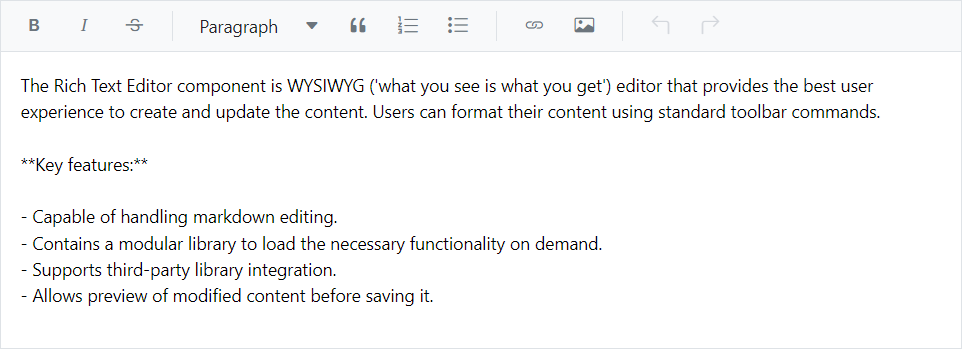

# Accessibility in Blazor Markdown Editor Component

The Blazor Markdown Editor inside [Rich Text Editor](https://www.syncfusion.com/blazor-components/blazor-wysiwyg-rich-text-editor) component has been designed, keeping in mind the [WAI-ARIA](https://www.w3.org/WAI/ARIA/apg/patterns/) specifications, and applies the WAI-ARIA roles, states, and properties. This component is characterized by complete ARIA accessibility support that makes it easy for people who use assistive technologies (AT) or those who completely rely on keyboard navigation.

The Blazor Markdown Editor inside Rich Text Editor component followed the accessibility guidelines and standards, including [ADA](https://www.ada.gov/), [Section 508](https://www.section508.gov/), [WCAG 2.2](https://www.w3.org/TR/WCAG22/) standards, and [WCAG roles](https://www.w3.org/TR/wai-aria/#roles) that are commonly used to evaluate accessibility.

The accessibility compliance for the Blazor Rich Text Editor component is outlined below.

| Accessibility Criteria | Compatibility |
| -- | -- |
| [WCAG 2.2](https://www.w3.org/TR/WCAG22/) Support |  |
| [Section 508 Support](../common/accessibility#section-508) |  |
| Screen Reader Support |  |
| Right-To-Left Support |  |
| Color Contrast |  |
| Mobile Device Support |  |
| [Keyboard Navigation](../common/accessibility#keyboard-navigation) |  |
| [Axe-core](https://www.nuget.org/packages/Deque.AxeCore.Playwright) Accessibility Validation |  |

 - All features of the component meet the requirement.

 - Some features of the component do not meet the requirement.

 - The component does not meet the requirement.

## WAI-ARIA attributes

* The toolbar of Blazor Markdown Editor inside the Rich Text Editor, assigned the role of `Toolbar` and has the following list of [WAI-ARIA](https://www.w3.org/WAI/ARIA/apg/patterns/) attribute.

| **Property** | **Functionalities** |
| --- | --- |
| role="toolbar" | This attribute added to the ToolBar element describes the actual role of the element. |
| aria-orientation     | Indicates the ToolBar orientation. Default value is `horizontal`. |
| aria-haspopup       | Indicates the popup mode of the Toolbar. Default value is false. When popup mode is enabled,  attribute value has to be changed to `true`. | |
| aria-disabled       | Indicates the disabled state of the ToolBar. |
| aria-owns | Identifies an element to define a visual, functional, or contextual parent/child relationship between DOM elements when the DOM hierarchy cannot represent the relationship. In the Rich Text Editor, the attribute contains the ID of the Rich Text Editor to indicate the popup as a child element. |

For further details of Toolbar ARIA attributes, refer the  [`accessibility of Toolbar`](../../toolbar/accessibility) documentation.

The Blazor Markdown Editor inside Rich Text Editor element is assigned the role of `application`.

| **Property** | **Functionalities** |
| --- | --- |
| role="application" | This attribute added to the Rich Text Editor element describes the actual role of the element. |
| aria-disabled       | Indicates the disabled state of the ToolBar. |

## Keyboard interaction

The Blazor Markdown Editor inside Rich Text Editor component followed the [keyboard interaction](https://www.w3.org/WAI/ARIA/apg/patterns/alert/#keyboardinteraction) guideline, making it easy for people who use assistive technologies (AT) and those who completely rely on keyboard navigation. 

You can use the following key shortcuts when the Blazor Rich Text Editor renders with Markdown edit mode.

| Actions | Keyboard shortcuts |
|----------------|---------|
| Toolbar focus| <kbd>Alt</kbd> + <kbd>f10</kbd> |
| Insert link| <kbd>Ctrl</kbd> + <kbd>k</kbd> |
| Insert image| <kbd>Ctrl</kbd> + <kbd>Shift</kbd> + <kbd>i</kbd> |
| Insert table| <kbd>Ctrl</kbd> + <kbd>Shift</kbd> + <kbd>e</kbd> |
| Undo| <kbd>Ctrl</kbd> + <kbd>z</kbd> |
| Redo| <kbd>Ctrl</kbd> + <kbd>y</kbd> |
| Copy| <kbd>Ctrl</kbd> + <kbd>c</kbd> |
| Cut| <kbd>Ctrl</kbd> + <kbd>x</kbd> |
| Paste| <kbd>Ctrl</kbd> + <kbd>v</kbd> |
| Bold| <kbd>Ctrl</kbd> + <kbd>b</kbd> |
| Italic| <kbd>Ctrl</kbd> + <kbd>i</kbd> |
| Strikethrough| <kbd>Ctrl</kbd> + <kbd>Shift</kbd> + <kbd>s</kbd> |
| Uppercase| <kbd>Ctrl</kbd> + <kbd>Shift</kbd> + <kbd>u</kbd> |
| Lowercase| <kbd>Ctrl</kbd> + <kbd>Shift</kbd> + <kbd>l</kbd> |
| Superscript| <kbd>Ctrl</kbd> + <kbd>Shift</kbd> + <kbd>=</kbd> |
| Subscript| <kbd>Ctrl</kbd> + <kbd>=</kbd> |
| Full screen| <kbd>Ctrl</kbd> + <kbd>Shift</kbd> + <kbd>f</kbd> |
| Ordered list| <kbd>Ctrl</kbd> + <kbd>Shift</kbd> + <kbd>o</kbd> |
| Unordered list| <kbd>Ctrl</kbd> + <kbd>Alt</kbd> + <kbd>o</kbd> |




@using Syncfusion.Blazor.RichTextEditor

<SfRichTextEditor EditorMode="EditorMode.Markdown">

The Rich Text Editor component is WYSIWYG ('what you see is what you get') editor that provides the best user experience to create and update the content. Users can format their content using standard toolbar commands.

**Key features:**

- Capable of handling markdown editing.
- Contains a modular library to load the necessary functionality on demand.
- Supports third-party library integration.
- Allows preview of modified content before saving it.
    
</SfRichTextEditor>




## Ensuring accessibility

The Blazor Markdown Editor inside Rich Text Editor component's accessibility levels are ensured through an [axe-core](https://www.npmjs.com/package/axe-core) software tool during automated testing.

The accessibility compliance of Markdown Editor inside the Rich Text Editor component is shown in the following sample. Open the [sample](https://blazor.syncfusion.com/accessibility/rich-text-editor) in a new window to evaluate the accessibility of Markdown Editor inside the Rich Text Editor component with accessibility tools.

### Custom key configuration

Customize the key configuration for the keyboard interaction of the Rich Text Editor using the [KeyConfigure](https://help.syncfusion.com/cr/blazor/Syncfusion.Blazor.RichTextEditor.SfRichTextEditor.html#Syncfusion_Blazor_RichTextEditor_SfRichTextEditor_KeyConfigure) property.

In the following code block, customize the bold and italic, toolbar actions with **ctrl+1**, **ctrl+2** respectively.




@using Syncfusion.Blazor.RichTextEditor

<SfRichTextEditor EditorMode="EditorMode.Markdown" KeyConfigure="@KeyConfig">

The Rich Text Editor component is WYSIWYG ('what you see is what you get') editor that provides the best user experience to create and update the content. Users can format their content using standard toolbar commands.

**Key features:**

- Capable of handling markdown editing.
- Contains a modular library to load the necessary functionality on demand.
- Supports third-party library integration.
- Allows preview of modified content before saving it.
    
</SfRichTextEditor>

@code {
    private ShortcutKeys KeyConfig = new ShortcutKeys()
    {
        Bold = "ctrl+1",
        Italic = "ctrl+2"
    };
}




<!-- 
N> You can refer to our [Blazor Rich Text Editor](https://www.syncfusion.com/blazor-components/blazor-wysiwyg-rich-text-editor) feature tour page for its groundbreaking feature representations. You can also explore our [Blazor Rich Text Editor](https://blazor.syncfusion.com/demos/rich-text-editor/overview?theme=bootstrap4) example to knows how to render and configure the rich text editor tools. -->

## See also

* [Accessibility in Syncfusion Blazor components](../common/accessibility)