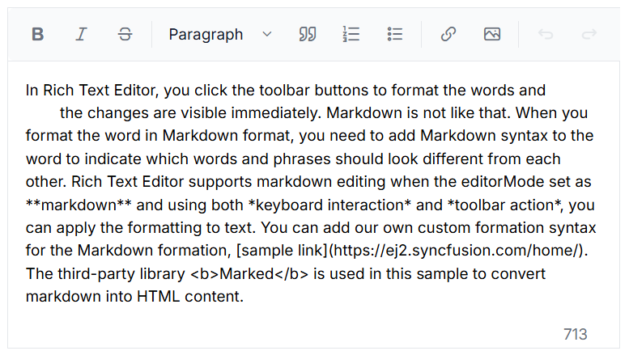

# Accessibility in Blazor Markdown Editor Component

The [Blazor Markdown Editor](https://blazor.syncfusion.com/demos/markdown-editor/overview?theme=fluent2) component has been designed, keeping in mind the [WAI-ARIA](https://www.w3.org/WAI/ARIA/apg/patterns/) specifications, and applies the WAI-ARIA roles, states, and properties. This component is characterized by complete ARIA accessibility support that makes it easy for people who use assistive technologies (AT) or those who completely rely on keyboard navigation.

The Blazor Markdown Editor component followed the accessibility guidelines and standards, including [ADA](https://www.ada.gov/), [Section 508](https://www.section508.gov/), [WCAG 2.2](https://www.w3.org/TR/WCAG22/) standards, and [WCAG roles](https://www.w3.org/TR/wai-aria/#roles) that are commonly used to evaluate accessibility.

The accessibility compliance for the Blazor Markdown Editor component is outlined below.

| Accessibility Criteria | Compatibility |
| -- | -- |
| [WCAG 2.2](https://www.w3.org/TR/WCAG22/) Support | AAA |
| [Section 508 Support](../common/accessibility#accessibility-standards) |  |
| Screen Reader Support |  |
| Right-To-Left Support |  |
| Color Contrast |  |
| Mobile Device Support |  |
| [Keyboard Navigation](../common/accessibility#keyboard-navigation) |  |
| [Axe-core](https://www.nuget.org/packages/Deque.AxeCore.Playwright) Accessibility Validation |  |

 - All features of the component meet the requirement.

 - Some features of the component do not meet the requirement.

 - The component does not meet the requirement.

## WAI-ARIA attributes

The toolbar in the Blazor Markdown Editor is assigned the role of `toolbar` and includes the following [WAI-ARIA](https://www.w3.org/WAI/ARIA/apg/patterns/) attribute.

| **Property** | **Functionalities** |
| --- | --- |
| `role="toolbar"` | Describes the actual role of the toolbar element. |
| `aria-orientation` | Indicates the toolbar orientation. Default is `horizontal`. |
| `aria-haspopup` | Indicates whether the toolbar has a popup. Default is `false`. Set to `true` wwhen popup mode is enabled. |
| `aria-disabled` | Indicates the disabled state of the toolbar. |
| `aria-owns` | Identifies an element to define a visual, functional, or contextual parent/child relationship between DOM elements when the DOM hierarchy cannot represent the relationship. In the Markdown Editor, the attribute contains the ID of the Markdown Editor to indicate the popup as a child element. |

For more information about toolbar ARIA attributes, refer to the  [accessibility of Toolbar](https://blazor.syncfusion.com/documentation/toolbar/accessibility) documentation.

The Blazor Markdown Editor element is assigned the role of `application`:

| **Property** | **Functionalities** |
| --- | --- |
| `role="application"`| Describes the actual role of the Markdown Editor element. |
| `aria-disabled` | Indicates the disabled state of the toolbar. |









## Keyboard interaction

The Blazor Markdown Editor component follows the [keyboard interaction](https://www.w3.org/WAI/ARIA/apg/patterns/alert/#keyboardinteraction) guidelines, making it easy for people who use assistive technologies (AT) and those who completely rely on keyboard navigation. The following keyboard shortcuts are supported by the Markdown Editor component. 

For more details on keyboard navigation, refer to the [Keyboard support](https://blazor.syncfusion.com/documentation/rich-text-editor/keyboard-support) documentation.

## Ensuring accessibility

Accessibility levels are validated using the [axe-core](https://www.npmjs.com/package/axe-core) software tool during automated testing.

The accessibility compliance of the Markdown Editor component is shown in the following sample. Open the [sample](https://blazor.syncfusion.com/accessibility/rich-text-editor) in a new window to evaluate the accessibility of the Markdown Editor component with accessibility tools.

### Custom key configuration

Customize the key configuration for the keyboard interaction of the Markdown Editor using the [KeyConfigure](https://help.syncfusion.com/cr/blazor/Syncfusion.Blazor.RichTextEditor.SfRichTextEditor.html#Syncfusion_Blazor_RichTextEditor_SfRichTextEditor_KeyConfigure) property.

In the following code block, customize the bold and italic, toolbar actions with **ctrl+1**, **ctrl+2** respectively.









N> You can refer to our [Blazor Rich Text Editor](https://www.syncfusion.com/blazor-components/blazor-wysiwyg-rich-text-editor) feature tour page for its groundbreaking feature representations. You can also explore our [Blazor Markdown Editor](https://blazor.syncfusion.com/demos/rich-text-editor/overview?theme=bootstrap5) example to knows how to render and configure the Markdown Editor tools.

## See also

* [Accessibility in Syncfusion&reg; Blazor components](../common/accessibility)
