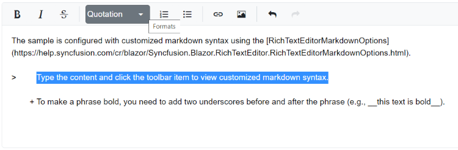

# Customizing Markdown Syntax in Blazor Markdown Editor Component

The Rich Text Editor allows you to customize the markdown syntax by overriding its default syntax. Configure the customized markdown syntax using [RichTextEditorMarkdownOptions.ListSyntax](https://help.syncfusion.com/cr/blazor/Syncfusion.Blazor.RichTextEditor.RichTextEditorMarkdownOptions.html#Syncfusion_Blazor_RichTextEditor_RichTextEditorMarkdownOptions_ListSyntax), [RichTextEditorMarkdownOptions.FormatSyntax](https://help.syncfusion.com/cr/blazor/Syncfusion.Blazor.RichTextEditor.RichTextEditorMarkdownOptions.html#Syncfusion_Blazor_RichTextEditor_RichTextEditorMarkdownOptions_FormatSyntax), [RichTextEditorMarkdownOptions.SelectionSyntax](https://help.syncfusion.com/cr/blazor/Syncfusion.Blazor.RichTextEditor.RichTextEditorMarkdownOptions.html#Syncfusion_Blazor_RichTextEditor_RichTextEditorMarkdownOptions_SelectionSyntax) properties.

## Defining Custom Markdown Formatting  

You can define custom symbols for different Markdown formatting options:

* Use `+` for unordered lists instead of `-`.
* Use `__text__` for bold text instead of `**text**`.
* Use `_text_` for italic text instead of `*text*`.

The following example demonstrates how to customize Markdown tags in the editor:









