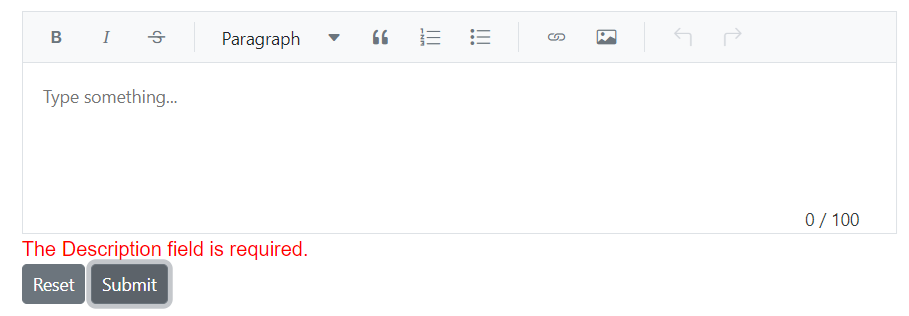
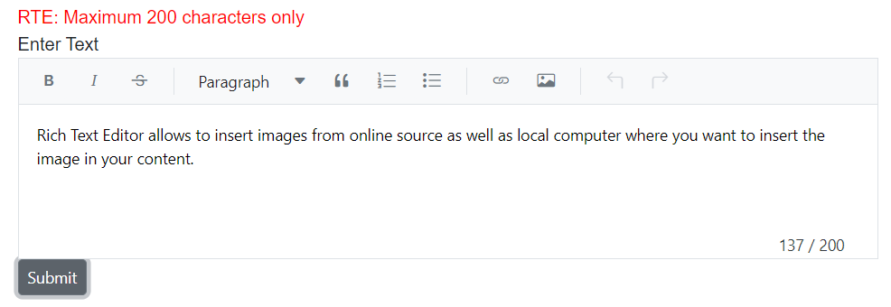

# Edit-Form Validation

The Markdown Editor inside the Rich Text Editor supports validation using the [EditForm](https://learn.microsoft.com/en-us/aspnet/core/blazor/forms-and-input-components?view=aspnetcore-6.0). The user-typed text content inside the editor is validated with [data annotations](https://learn.microsoft.com/en-us/aspnet/core/mvc/models/validation?view=aspnetcore-5.0) attributes. In the following example, the `FormModel` class has the `Description` property marked required with the `RequiredAttribute` and `MinLengthAttribute` for minimum string length validation and an error message. The `Description` property is bound to the editor via the `@bind-Value` property, and validation works based on user input.

N> [View Sample in GitHub.](https://github.com/SyncfusionExamples/blazor-richtexteditor-editform-validation)









## Validation attributes

The Markdown Editor inside the Rich Text Editor provides the functionality of character counting and its validation. So, you can validate the editor's value on form submission by applying validation attributes and validation messages to the editor.

| Rules | Description |
|----------------|---------|
| [Required](https://learn.microsoft.com/en-us/dotnet/api/system.componentmodel.dataannotations.requiredattribute?view=net-7.0) | Requires a value for the Rich Text Editor control.|
| [MinLength](https://learn.microsoft.com/en-us/dotnet/api/system.componentmodel.dataannotations.minlengthattribute?view=net-7.0) | Requires the value to be of a given minimum character count.|
| [MaxLength](https://learn.microsoft.com/en-us/dotnet/api/system.componentmodel.dataannotations.maxlengthattribute?view=net-7.0) | Requires the value to be of the given maximum character count.|









## Custom placement of validation message

The form validation error message can be moved from its default location to a desired custom location.









<!-- N> You can refer to our [Blazor Rich Text Editor](https://www.syncfusion.com/blazor-components/blazor-wysiwyg-rich-text-editor) feature tour page for its groundbreaking feature representations. You can also explore our [Blazor Rich Text Editor](https://blazor.syncfusion.com/demos/rich-text-editor/overview?theme=bootstrap4) example to know how to render and configure the rich text editor tools. -->