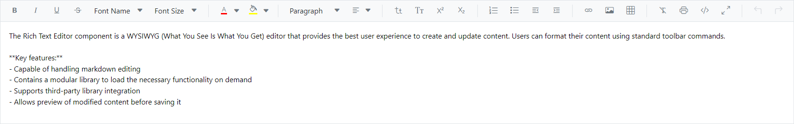
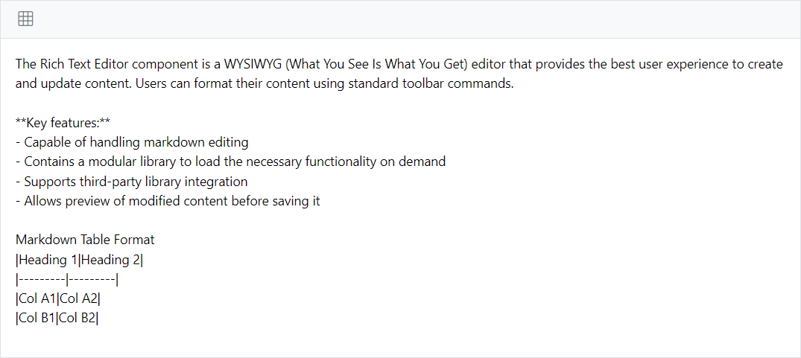

# Getting Started with Blazor Markdown Editor

This section briefly explains about how to include Blazor Markdown Editor inside the Rich Text Editor component in your Blazor Server App and Blazor WebAssembly App using Visual Studio.

To get start quickly with Blazor Markdown Editor inside the Rich Text Editor components, you can check on this `GitHub` sample.

## Prerequisites

* [System requirements for Blazor components](https://blazor.syncfusion.com/documentation/system-requirements)

## Create a new Blazor App in Visual Studio

You can create a **Blazor Server App** or **Blazor WebAssembly App** using Visual Studio via [Microsoft Templates](https://learn.microsoft.com/en-us/aspnet/core/blazor/tooling?view=aspnetcore-7.0) or the [Syncfusion Blazor Extension](https://blazor.syncfusion.com/documentation/visual-studio-integration/template-studio).

## Install Syncfusion Blazor Rich Text Editor and Themes NuGet in the App

To add **Markdown Editor** inside the **Blazor Rich Text Editor** component in the app, open the NuGet package manager in Visual Studio (*Tools → NuGet Package Manager → Manage NuGet Packages for Solution*), search and install [Syncfusion.Blazor.RichTextEditor](https://www.nuget.org/packages/Syncfusion.Blazor.RichTextEditor) and [Syncfusion.Blazor.Themes](https://www.nuget.org/packages/Syncfusion.Blazor.Themes/). Alternatively, you can utilize the following package manager command to achieve the same.




Install-Package Syncfusion.Blazor.RichTextEditor -Version {{ site.releaseversion }}
Install-Package Syncfusion.Blazor.Themes -Version {{ site.releaseversion }}




N> Syncfusion Blazor components are available in [nuget.org](https://www.nuget.org/packages?q=syncfusion.blazor). Refer to [NuGet packages](https://blazor.syncfusion.com/documentation/nuget-packages) topic for available NuGet packages list with component details.

## Register Syncfusion Blazor Service

Open **~/_Imports.razor** file and import the `Syncfusion.Blazor` and `Syncfusion.Blazor.RichTextEditor` namespace.




@using Syncfusion.Blazor
@using Syncfusion.Blazor.RichTextEditor




Now, register the Syncfusion Blazor Service in the **~/Program.cs** file of your Blazor Server App or Blazor WebAssembly App.




using Microsoft.AspNetCore.Components;
using Microsoft.AspNetCore.Components.Web;
using Syncfusion.Blazor;

var builder = WebApplication.CreateBuilder(args);

// Add services to the container.
builder.Services.AddRazorPages();
builder.Services.AddServerSideBlazor();
builder.Services.AddSyncfusionBlazor();

var app = builder.Build();
....




using Microsoft.AspNetCore.Components.Web;
using Microsoft.AspNetCore.Components.WebAssembly.Hosting;
using Syncfusion.Blazor;

var builder = WebAssemblyHostBuilder.CreateDefault(args);
builder.RootComponents.Add<App>("#app");
builder.RootComponents.Add<HeadOutlet>("head::after");

builder.Services.AddScoped(sp => new HttpClient { BaseAddress = new Uri(builder.HostEnvironment.BaseAddress) });

builder.Services.AddSyncfusionBlazor();
await builder.Build().RunAsync();
....




## Add stylesheet and script resources

The theme stylesheet and script can be accessed from NuGet through [Static Web Assets](https://blazor.syncfusion.com/documentation/appearance/themes#static-web-assets). Reference the stylesheet and script in the `<head>` of the main page as follows:

* For **.NET 6** Blazor Server app, include it in **~/Pages/_Layout.cshtml** file.

* For **.NET 7** Blazor Server app, include it in the **~/Pages/_Host.cshtml** file.

* For Blazor WebAssembly app, include it in the **~/index.html** file.

```html
<head>
    ....
    <link href="_content/Syncfusion.Blazor.Themes/bootstrap5.css" rel="stylesheet" />
    <script src="_content/Syncfusion.Blazor.Core/scripts/syncfusion-blazor.min.js" type="text/javascript"></script>
</head>
```
N> Check out the [Blazor Themes](https://blazor.syncfusion.com/documentation/appearance/themes) topic to discover various methods ([Static Web Assets](https://blazor.syncfusion.com/documentation/appearance/themes#static-web-assets), [CDN](https://blazor.syncfusion.com/documentation/appearance/themes#cdn-reference), and [CRG](https://blazor.syncfusion.com/documentation/common/custom-resource-generator)) for referencing themes in your Blazor application. Also, check out the [Adding Script Reference](https://blazor.syncfusion.com/documentation/common/adding-script-references) topic to learn different approaches for adding script references in your Blazor application.

## Add Blazor Markdown Editor inside the Rich Text Editor component

Add the Syncfusion Blazor Markdown Editor inside the Rich Text Editor component in the **~/Pages/Index.razor** file. The Rich Text Editor supports to editing the markdown content by using the [EditorMode.Markdown](https://help.syncfusion.com/cr/blazor/Syncfusion.Blazor.RichTextEditor.EditorMode.html#Syncfusion_Blazor_RichTextEditor_EditorMode_Markdown) property.




<SfRichTextEditor EditorMode="EditorMode.Markdown">

Rich Text Editor allows you to insert images from both online sources and your local computer into your content.

**Get started Quick Toolbar to click on the image**
    
It is possible to add custom styles to the selected image inside the Rich Text Editor through the quick toolbar.

</SfRichTextEditor>




* Press <kbd>Ctrl</kbd>+<kbd>F5</kbd> (Windows) or <kbd>⌘</kbd>+<kbd>F5</kbd> (macOS) to launch the application. This will render the Syncfusion Blazor Markdown Editor inside the Rich Text Editor component in your default web browser.


## Configure the Toolbar

Configure the toolbar with the tools using [RichTextEditorToolbarSettings.Items](https://help.syncfusion.com/cr/blazor/Syncfusion.Blazor.RichTextEditor.RichTextEditorToolbarSettings.html#Syncfusion_Blazor_RichTextEditor_RichTextEditorToolbarSettings_Items) property as your application requires.




<SfRichTextEditor EditorMode="EditorMode.Markdown">

The Rich Text Editor component is a WYSIWYG (What You See Is What You Get) editor that provides the best user experience to create and update content. Users can format their content using standard toolbar commands.

**Key features:**
- Capable of handling markdown editing
- Contains a modular library to load the necessary functionality on demand
- Supports third-party library integration
- Allows preview of modified content before saving it

    <RichTextEditorToolbarSettings Items="@Tools"></RichTextEditorToolbarSettings>
</SfRichTextEditor>

@code
{
    private List<ToolbarItemModel> Tools = new List<ToolbarItemModel>()
    {
        new ToolbarItemModel() { Command = ToolbarCommand.Bold },
        new ToolbarItemModel() { Command = ToolbarCommand.Italic },
        new ToolbarItemModel() { Command = ToolbarCommand.Underline },
        new ToolbarItemModel() { Command = ToolbarCommand.StrikeThrough },
        new ToolbarItemModel() { Command = ToolbarCommand.FontName },
        new ToolbarItemModel() { Command = ToolbarCommand.FontSize },
        new ToolbarItemModel() { Command = ToolbarCommand.Separator },
        new ToolbarItemModel() { Command = ToolbarCommand.FontColor },
        new ToolbarItemModel() { Command = ToolbarCommand.BackgroundColor },
        new ToolbarItemModel() { Command = ToolbarCommand.Separator },
        new ToolbarItemModel() { Command = ToolbarCommand.Formats },
        new ToolbarItemModel() { Command = ToolbarCommand.Alignments },
        new ToolbarItemModel() { Command = ToolbarCommand.Separator },
        new ToolbarItemModel() { Command = ToolbarCommand.LowerCase },
        new ToolbarItemModel() { Command = ToolbarCommand.UpperCase },
        new ToolbarItemModel() { Command = ToolbarCommand.SuperScript },
        new ToolbarItemModel() { Command = ToolbarCommand.SubScript },
        new ToolbarItemModel() { Command = ToolbarCommand.Separator },
        new ToolbarItemModel() { Command = ToolbarCommand.OrderedList },
        new ToolbarItemModel() { Command = ToolbarCommand.UnorderedList },
        new ToolbarItemModel() { Command = ToolbarCommand.Outdent },
        new ToolbarItemModel() { Command = ToolbarCommand.Indent },
        new ToolbarItemModel() { Command = ToolbarCommand.Separator },
        new ToolbarItemModel() { Command = ToolbarCommand.CreateLink },
        new ToolbarItemModel() { Command = ToolbarCommand.Image },
        new ToolbarItemModel() { Command = ToolbarCommand.CreateTable },
        new ToolbarItemModel() { Command = ToolbarCommand.Separator },
        new ToolbarItemModel() { Command = ToolbarCommand.ClearFormat },
        new ToolbarItemModel() { Command = ToolbarCommand.Print },
        new ToolbarItemModel() { Command = ToolbarCommand.SourceCode },
        new ToolbarItemModel() { Command = ToolbarCommand.FullScreen },
        new ToolbarItemModel() { Command = ToolbarCommand.Separator },
        new ToolbarItemModel() { Command = ToolbarCommand.Undo },
        new ToolbarItemModel() { Command = ToolbarCommand.Redo }
    };
}






## Insert Tables

To insert the table in the markdown editor, click the **Table** icon in the toolbar to insert the table into the editor area. By default, The markdown table insert with 2 X 2 rows and columns along with the heading.




<SfRichTextEditor EditorMode="EditorMode.Markdown">

The Rich Text Editor component is a WYSIWYG (What You See Is What You Get) editor that provides the best user experience to create and update content. Users can format their content using standard toolbar commands.

**Key features:**
- Capable of handling markdown editing
- Contains a modular library to load the necessary functionality on demand
- Supports third-party library integration
- Allows preview of modified content before saving it

Markdown Table Format
|Heading 1|Heading 2|
|---------|---------|
|Col A1|Col A2|
|Col B1|Col B2|
    <RichTextEditorToolbarSettings Items="@Tools"></RichTextEditorToolbarSettings>
</SfRichTextEditor>

@code
{
    private List<ToolbarItemModel> Tools = new List<ToolbarItemModel>()
    {
        new ToolbarItemModel() { Command = ToolbarCommand.Bold },
        new ToolbarItemModel() { Command = ToolbarCommand.Italic },
        new ToolbarItemModel() { Command = ToolbarCommand.Underline },
        new ToolbarItemModel() { Command = ToolbarCommand.Separator },
        new ToolbarItemModel() { Command = ToolbarCommand.Formats },
        new ToolbarItemModel() { Command = ToolbarCommand.Alignments },
        new ToolbarItemModel() { Command = ToolbarCommand.Separator },
        new ToolbarItemModel() { Command = ToolbarCommand.CreateLink },
        new ToolbarItemModel() { Command = ToolbarCommand.Image },
        new ToolbarItemModel() { Command = ToolbarCommand.Separator },
        new ToolbarItemModel() { Command = ToolbarCommand.SourceCode },
        new ToolbarItemModel() { Command = ToolbarCommand.Separator },
        new ToolbarItemModel() { Command = ToolbarCommand.Undo },
        new ToolbarItemModel() { Command = ToolbarCommand.Redo },
        new ToolbarItemModel() { Command = ToolbarCommand.CreateTable }
    };
}






## Insert images and links

The `Image` inserts an image into markdown editor area, and the `Link` links an external resources such as website URLs to the selected text in the Markdown Editor content respectively.

Specifies the items to be rendered in quick toolbar based on the target elements such as image, link and table element. The quick toolbar opens to customize the element by clicking the target element.




<SfRichTextEditor EditorMode="EditorMode.Markdown">

The Rich Text Editor component is a WYSIWYG (What You See Is What You Get) editor that provides the best user experience to create and update content. Users can format their content using standard toolbar commands.

**Key features:**
- Capable of handling markdown editing
- Contains a modular library to load the necessary functionality on demand
- Supports third-party library integration
- Allows preview of modified content before saving it

<RichTextEditorToolbarSettings Items="@Tools" />
<RichTextEditorQuickToolbarSettings Image="@Image" Link="@Link" />
</SfRichTextEditor>

@code
{
    private List<ToolbarItemModel> Tools = new List<ToolbarItemModel>()
    {
        new ToolbarItemModel() { Command = ToolbarCommand.Bold },
        new ToolbarItemModel() { Command = ToolbarCommand.Italic },
        new ToolbarItemModel() { Command = ToolbarCommand.Underline },
        new ToolbarItemModel() { Command = ToolbarCommand.Separator },
        new ToolbarItemModel() { Command = ToolbarCommand.Formats },
        new ToolbarItemModel() { Command = ToolbarCommand.Alignments },
        new ToolbarItemModel() { Command = ToolbarCommand.Separator },
        new ToolbarItemModel() { Command = ToolbarCommand.CreateLink },
        new ToolbarItemModel() { Command = ToolbarCommand.Image },
        new ToolbarItemModel() { Command = ToolbarCommand.Separator },
        new ToolbarItemModel() { Command = ToolbarCommand.SourceCode },
        new ToolbarItemModel() { Command = ToolbarCommand.Separator },
        new ToolbarItemModel() { Command = ToolbarCommand.Undo },
        new ToolbarItemModel() { Command = ToolbarCommand.Redo }
    };
    private List<ImageToolbarItemModel> Image = new List<ImageToolbarItemModel>()
    {
        new ImageToolbarItemModel() { Command = ImageToolbarCommand.Replace },
        new ImageToolbarItemModel() { Command = ImageToolbarCommand.Align },
        new ImageToolbarItemModel() { Command = ImageToolbarCommand.Caption },
        new ImageToolbarItemModel() { Command = ImageToolbarCommand.Remove },
        new ImageToolbarItemModel() { Command = ImageToolbarCommand.OpenImageLink },
        new ImageToolbarItemModel() { Command = ImageToolbarCommand.HorizontalSeparator },
        new ImageToolbarItemModel() { Command = ImageToolbarCommand.EditImageLink },
        new ImageToolbarItemModel() { Command = ImageToolbarCommand.RemoveImageLink },
        new ImageToolbarItemModel() { Command = ImageToolbarCommand.Display },
        new ImageToolbarItemModel() { Command = ImageToolbarCommand.AltText },
        new ImageToolbarItemModel() { Command = ImageToolbarCommand.Dimension }
    };
    private List<LinkToolbarItemModel> Link = new List<LinkToolbarItemModel>()
    {
        new LinkToolbarItemModel() { Command = LinkToolbarCommand.Open },
        new LinkToolbarItemModel() { Command = LinkToolbarCommand.Edit },
        new LinkToolbarItemModel() { Command = LinkToolbarCommand.UnLink }
    };
}




