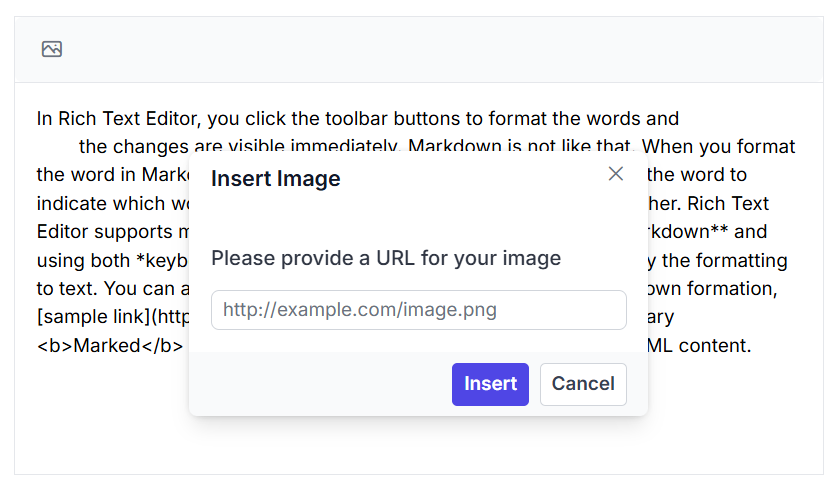

# Insert Images in Blazor Markdown Editor Component

The Syncfusion&reg; Blazor Markdown Editor allows users to insert images using the toolbar. This feature enables embedding images from online sources into the editor content.

## Steps to Insert an Image  

Follow these steps to add an image in the Markdown editor:

1. Click the [Image](https://help.syncfusion.com/cr/blazor/Syncfusion.Blazor.RichTextEditor.RichTextEditorImageSettings.html) icon in the toolbar.
2. Enter the **URL** of the image from an online source.
3. Click the **Insert** button in the image dialog.

The image will be added to the editor content at the cursor position.

The following example demonstrates how to enable image insertion in the Syncfusion&reg; Blazor Markdown Editor.









