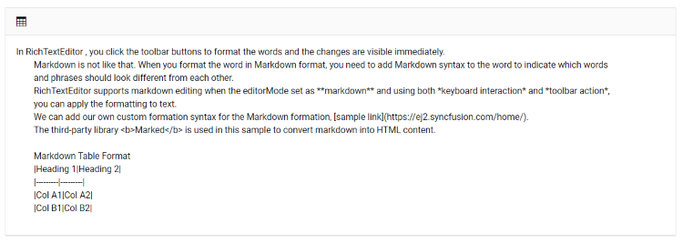

# Insert Table in Blazor Markdown Editor Component

The Syncfusion&reg; Blazor Markdown Editor provides built-in support for inserting tables, allowing users to create and customize tables effortlessly within the editor.

## Enable Table Insertion in Blazor Markdown Editor  

To enable the table insertion feature, add the `CreateTable` option to the toolbar items. Once added, users can click the [Table](https://help.syncfusion.com/cr/blazor/Syncfusion.Blazor.RichTextEditor.RichTextEditorTableSettings.html#properties) icon in the toolbar to insert a table into the editor.

By default, when a table is inserted, it consists of:

* 2 rows and 2 columns
* A table header row

This ensures that users can start formatting and adding content immediately.









