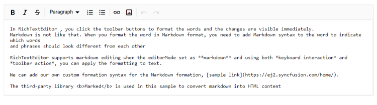

# Keyboard support in Blazor Markdown Editor Component

You can use the following keyboard shortcuts when the Rich Text Editor is set to [EditorMode](https://help.syncfusion.com/cr/blazor/Syncfusion.Blazor.RichTextEditor.SfRichTextEditor.html#Syncfusion_Blazor_RichTextEditor_SfRichTextEditor_EditorMode) as `Markdown`.

## Overview

The Syncfusion Blazor Markdown Editor supports a wide range of keyboard shortcuts to enhance productivity and streamline text editing. These shortcuts cover toolbar access, content formatting, insertion of elements, clipboard operations, and more. This guide provides a comprehensive list of available shortcuts for both Windows and Mac platforms.

## Toolbar

These shortcuts provide quick access to toolbar functions for managing menus and dialogs.

| Actions | Windows | Mac | 
|----------------|---------| ---------|
| Focus on toolbar | <kbd>Alt</kbd> + <kbd>F10</kbd> | <kbd>⌥</kbd> + <kbd>F10</kbd> |
| Close dropdowns/menu and dialogs | <kbd>Esc</kbd> | <kbd>Esc</kbd> |

## Content editing and formatting

These shortcuts help in efficiently editing and formatting text content.

| Actions | Windows | Mac | 
|----------------|---------| ---------|
| Select all content | <kbd>Ctrl</kbd> + <kbd>A</kbd> | <kbd>⌘</kbd> + <kbd>A</kbd> |
| Insert a hard line break (a new paragraph) | <kbd>Enter</kbd> | <kbd>Enter</kbd> |
| Make text bold | <kbd>Ctrl</kbd> + <kbd>B</kbd> | <kbd>⌘</kbd> + <kbd>B</kbd> |
| Italicize text | <kbd>Ctrl</kbd> + <kbd>I</kbd> | <kbd>⌘</kbd> + <kbd>I</kbd> |
| Apply strikethrough | <kbd>Ctrl</kbd> + <kbd>Shift</kbd> + <kbd>S</kbd> | <kbd>⌘</kbd> + <kbd>⇧</kbd> + <kbd>S</kbd> |

## Inserting

These shortcuts allow for the quick insertion of tables, links, and images.

| Actions | Windows | Mac | 
|----------------|---------| ---------|
| Open the insert table dialog | <kbd>Ctrl</kbd> + <kbd>Shift</kbd> + <kbd>E</kbd> | <kbd>⌘</kbd> + <kbd>⇧</kbd> + <kbd>E</kbd> |
| Create link | <kbd>Ctrl</kbd> + <kbd>K</kbd> | <kbd>⌘</kbd> + <kbd>K</kbd> |
| Open the insert image dialog | <kbd>Ctrl</kbd> + <kbd>Shift</kbd> + <kbd>I</kbd> | <kbd>⌘</kbd> + <kbd>⇧</kbd> + <kbd>I</kbd> |

## Text manipulation

These shortcuts help in modifying text case and applying superscript or subscript.

| Actions | Windows | Mac | 
|----------------|---------| --------- |
| Convert text to uppercase | <kbd>Ctrl</kbd> + <kbd>Shift</kbd> + <kbd>U</kbd> | <kbd>⌘</kbd> + <kbd>⇧</kbd> + <kbd>U</kbd> |
| Convert text to lowercase | <kbd>Ctrl</kbd> + <kbd>Shift</kbd> + <kbd>L</kbd> | <kbd>⌘</kbd> + <kbd>⇧</kbd> + <kbd>L</kbd> |
| Apply superscript | <kbd>Ctrl</kbd> + <kbd>Shift</kbd> + <kbd>=</kbd> | <kbd>⌘</kbd> + <kbd>⇧</kbd> + <kbd>=</kbd> |
| Apply subscript | <kbd>Ctrl</kbd> + <kbd>=</kbd> | <kbd>⌘</kbd> + <kbd>=</kbd> |

## Lists

These shortcuts enable the creation of ordered and unordered lists.

| Actions | Windows | Mac | 
|----------------|---------| --------- |
| Create an ordered list | <kbd>Ctrl</kbd> + <kbd>Shift</kbd> + <kbd>O</kbd> | <kbd>⌘</kbd> + <kbd>⇧</kbd> + <kbd>O</kbd> |
| Create an unordered list | <kbd>Ctrl</kbd> + <kbd>Alt</kbd> + <kbd>O</kbd> | <kbd>⌘</kbd> + <kbd>⌥</kbd> + <kbd>O</kbd> |

## Clipboard operations

These shortcuts facilitate copying, cutting, and pasting content.

| Actions | Windows | Mac | 
|----------------|---------| --------- |
| Copy the selected content  | <kbd>Ctrl</kbd> + <kbd>C</kbd> | <kbd>⌘</kbd> + <kbd>C</kbd> |
| Cut the selected content | <kbd>Ctrl</kbd> + <kbd>X</kbd> | <kbd>⌘</kbd> + <kbd>X</kbd> |
| Paste the copied or cut content | <kbd>Ctrl</kbd> + <kbd>V</kbd> | <kbd>⌘</kbd> + <kbd>V</kbd> |

## Undo & redo

These shortcuts allow for undoing and redoing recent changes.

| Actions | Windows | Mac | 
|----------------|---------| ---------|
| Undo | <kbd>Ctrl</kbd> + <kbd>Z</kbd> | <kbd>⌘</kbd> + <kbd>Z</kbd> |
| Redo | <kbd>Ctrl</kbd> + <kbd>Y</kbd> | <kbd>⌘</kbd> + <kbd>Y</kbd> |

## Other actions

These shortcuts provide additional functionalities like fullscreen mode.

| Actions | Windows | Mac | 
|----------------|---------| --------- |
| Toggle full screen mode | <kbd>Ctrl</kbd> + <kbd>Shift</kbd> + <kbd>F</kbd> | <kbd>⌘</kbd> + <kbd>⇧</kbd> + <kbd>F</kbd> |

```cshtml

@using Syncfusion.Blazor.RichTextEditor

<SfRichTextEditor EditorMode="EditorMode.Markdown" Value="@MarkdownValue"></SfRichTextEditor>

@code{

    private string MarkdownValue { get; set; } = @"In Rich Text Editor, you click the toolbar buttons to format the words and 
        the changes are visible immediately. Markdown is not like that. When you format the word in Markdown format, you need to add Markdown syntax to the word to indicate which words and phrases should look different from each other. Rich Text Editor supports markdown editing when the editorMode set as **markdown** and using both *keyboard interaction* and *toolbar action*, you can apply the formatting to text. You can add our own custom formation syntax for the Markdown formation, [sample link](https://blazor.syncfusion.com/demos/markdown-editor/overview?theme=fluent2). The third-party library <b>Marked</b> is used in this sample to convert markdown into HTML content.";

}
```


