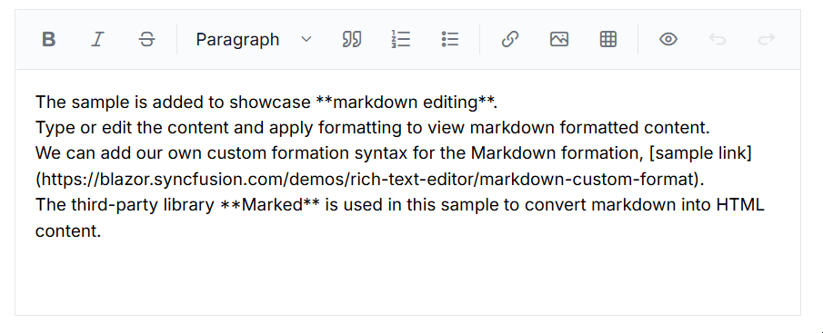

# Markdown to HTML preview in Blazor Markdown Editor Component

The Syncfusion&reg; Blazor Markdown Editor provides an instant Markdown to HTML preview, allowing users to visualize formatted content in real time as they type or edit Markdown text. This feature enhances the editing experience by making formatting changes immediately visible. 

## Enable Markdown Preview in Blazor Markdown Editor  

To enable the Markdown preview feature, the `Markdig` package is used to convert Markdown content into HTML. The following example demonstrates how to enable Markdown-to-HTML preview in the Syncfusion&reg; Blazor Markdown Editor.









## See also

* [How to convert Markdown string to HTML](https://support.syncfusion.com/kb/article/10983/how-to-convert-markdown-string-to-html-using-blazor-rich-text-editor)