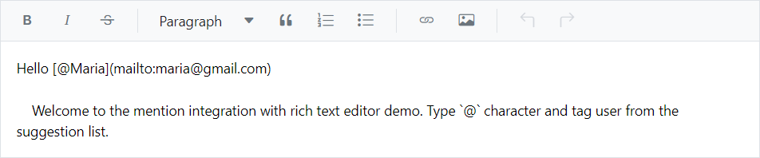

# Mention Integration in Blazor Markdown Editor

By integrating the [Mention](https://blazor.syncfusion.com/documentation/mention/getting-started) component with a Markdown Editor inside the Rich Text Editor, users can easily mention or tag other users or objects from the suggested list without having to manually type out their names or other identifying information.

The [Target](https://help.syncfusion.com/cr/blazor/Syncfusion.Blazor.DropDowns.SfMention-1.html#Syncfusion_Blazor_DropDowns_SfMention_1_Target) property of the Mention component allows you to specify the `ID` of the content editable div element within the Rich Text Editor that you want to bind the Mention component to. This allows you to enable the Mention functionality within the Markdown Editor inside the Rich Text Editor, so that users can mention or tag other users or objects from the suggested list while editing the text.

When the user types the `@` symbol followed by a character, the Rich Text Editor will display a list of suggestions for items that the user can select from. The user can then select an item from the list by clicking on it, or by typing the name of the item they want to tag.

In the following sample, configured the following properties with popup dimensions.

* [AllowSpaces](https://help.syncfusion.com/cr/blazor/Syncfusion.Blazor.DropDowns.SfMention-1.html#Syncfusion_Blazor_DropDowns_SfMention_1_AllowSpaces) - Allow to continue search action if user enter space after mention character while searching.
* [SuggestionCount](https://help.syncfusion.com/cr/blazor/Syncfusion.Blazor.DropDowns.SfMention-1.html#Syncfusion_Blazor_DropDowns_SfMention_1_SuggestionCount) - The maximum number of items that will be displayed in the suggestion list.
* [ItemTemplate](https://help.syncfusion.com/cr/blazor/Syncfusion.Blazor.DropDowns.SfDropDownBase-1.html#Syncfusion_Blazor_DropDowns_SfDropDownBase_1_ItemTemplate) - Used to display the customized appearance in suggestion list.







## See also

* [Mention](https://blazor.syncfusion.com/documentation/mention/getting-started)