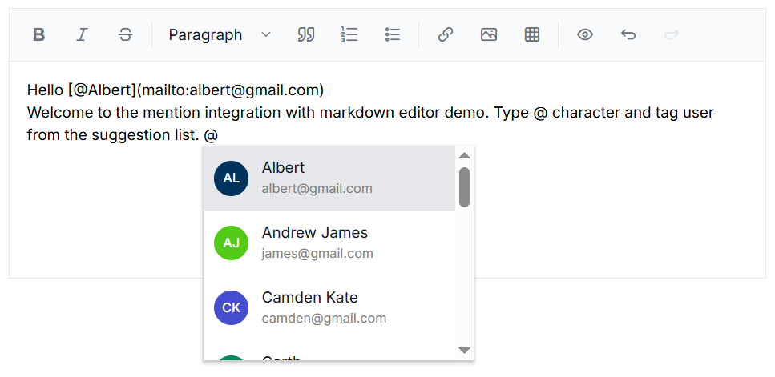

# Mention Support in Blazor Markdown Editor Component

By integrating the [Mention](https://blazor.syncfusion.com/documentation/mention/getting-started) component with the Markdown Editor, users can effortlessly mention or tag other users or objects from a suggested list. This eliminates the need to manually type out names or identifying information, improving both efficiency and accuracy.

## How to Enable Mention in Blazor Markdown Editor

To enable the Mention functionality within the Markdown Editor, set the [Target](https://help.syncfusion.com/cr/blazor/Syncfusion.Blazor.DropDowns.SfMention-1.html#Syncfusion_Blazor_DropDowns_SfMention_1_Target)  property of the Mention component to the ID of the textarea element inside the editor. When specifying the target, ensure that you append the suffix `_editable-content` to the ID. This configuration allows users to mention or tag others from the suggested list while editing text.

When a user types the `@` symbol followed by a character, the Markdown Editor displays a list of suggestions. Users can select an item from the list by either clicking on it or typing the desired name.

## Configuring Mention Properties

The Syncfusion&reg; Mention component provides several customizable properties to enhance the tagging experience:

* [AllowSpaces](https://help.syncfusion.com/cr/blazor/Syncfusion.Blazor.DropDowns.SfMention-1.html#Syncfusion_Blazor_DropDowns_SfMention_1_AllowSpaces) - Allow to continue search action if user enter space after mention character while searching.
* [SuggestionCount](https://help.syncfusion.com/cr/blazor/Syncfusion.Blazor.DropDowns.SfMention-1.html#Syncfusion_Blazor_DropDowns_SfMention_1_SuggestionCount) - The maximum number of items that will be displayed in the suggestion list.
* [ItemTemplate](https://help.syncfusion.com/cr/blazor/Syncfusion.Blazor.DropDowns.SfDropDownBase-1.html#Syncfusion_Blazor_DropDowns_SfDropDownBase_1_ItemTemplate) - Used to display the customized appearance in suggestion list.

## Example: How to Implement Mention Support in Markdown Editor

The following example demonstrates how to enable Mention support in the Blazor Markdown Editor.









