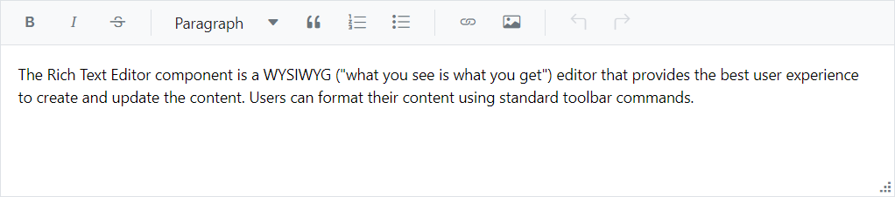
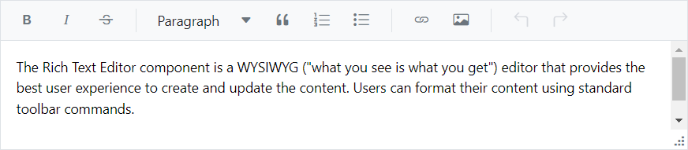

# Resizable in Markdown Editor

The Markdown Editor inside the Rich Text Editor can be dynamically resized, allowing users to change the size of the editor based on their needs. You can enable or disable this feature using the [EnableResize](https://help.syncfusion.com/cr/blazor/Syncfusion.Blazor.RichTextEditor.SfRichTextEditor.html#Syncfusion_Blazor_RichTextEditor_SfRichTextEditor_EnableResize) property. If `EnableResize` is set to true, the editor component creates a grip at the bottom right corner, which allows resizing the component in the diagonal direction.











## Restrict resize

To have a restricted resizable area for the Rich Text Editor, you need to specify the `min-width`, `max-width`, `min-height`, and `max-height` CSS properties for the component’s container element. By default, the editor is capable of resizing up to the current viewport. The `e-richtexteditor` CSS class will be available in the component's container and can be used for applying the bellow mentioned styles.

```css
<style>
  .e-richtexteditor {
      min-width: 200px;
      max-width: 800px;
      min-height: 100px;
      max-height: 300px;
  }
</style>

```




@using Syncfusion.Blazor.RichTextEditor

<SfRichTextEditor EnableResize="true" CssClass='.e-richtexteditor'>
    <p>The Rich Text Editor component is a WYSIWYG ("what you see is what you get") editor that provides the best user experience to create and update the content. Users can format their content using standard toolbar commands.</p>
</SfRichTextEditor>
<style>
    .e-richtexteditor {
        min-width: 200px;
        max-width: 800px;
        min-height: 100px;
        max-height: 300px;
    }
</style>






<!-- N> You can refer to our [Blazor Rich Text Editor](https://www.syncfusion.com/blazor-components/blazor-wysiwyg-rich-text-editor) feature tour page for its groundbreaking feature representations. You can also explore our [Blazor Rich Text Editor](https://blazor.syncfusion.com/demos/rich-text-editor/overview?theme=bootstrap4) example to know how to render and configure the rich text editor tools. -->